# Unified Identity & Access Platform

## Architecture Specification — `ARCHITECTURE.md`

| Field | Value |
|---|---|
| Document ID | ARCH-UIAP-001 |
| Version | **1.0.1** (final, consolidated) |
| Date | 2026-09-14 |
| Status | **Approved — Frozen.** Normative for all implementation teams. Changes only via the §57 ADR process and the §61.2 change protocol. |
| Supersedes | 1.0.0 (2026-09-14), which resolved the six findings of the independent Architecture Review as validated by the second-pass analysis. v1.0.1 **consolidates the companion review artifacts into this document** as historical Appendices H and I and deletes the standalone files; no normative content changed. |
| Classification | Internal — Confidential |
| Owner | Principal Architect (Identity Platform Program) |
| Required Approvals | Security Architecture, Backend, Data/DBA, Privacy/Legal, DevOps/SRE — **all recorded as granted** (sign-off trail: Appendix H verdict + Appendix G dispositions) |
| Source of Truth | This document. All implementation must conform. Contradictions found during implementation must be resolved by updating this document through an ADR (see §57), never by silent deviation. |

**Scope of this document.** This is an architecture specification. It contains **no implementation code**: no Python, no Django models, no SQL, no Dockerfiles, no migrations, no frontend code. Table definitions, claim sets, JSON shapes, and protocol examples in this document are *contract specifications*, not implementations. Implementation teams own everything not decided here (see §61.2 Implementation Boundary).

**Normative language.** `MUST`, `MUST NOT`, `SHOULD`, `SHOULD NOT`, `MAY` are used with the meanings of RFC 2119 / RFC 8174. Additional labels used throughout this document:

| Label | Meaning |
|---|---|
| **Decision:** | A closed architectural decision. Deviation requires a new ADR. |
| **Rationale:** | The justification for a decision. |
| **Alternative considered:** | Rejected option(s) and why. |
| **Initial Target / Recommended Default / Initial Policy** | A number or policy proposed by the architect, not yet validated by load testing or business sign-off. Treat as a starting value, not truth. |
| **To be validated:** | A claim that requires measurement, a load test, or a business decision before GA. |
| **Open Question:** | A decision not yet made. Listed with a recommended default in §59. |

---

## Table of Contents

1. Executive Summary
2. Vision
3. Goals
4. Non-Goals
5. Requirements
6. Architectural Principles
7. System Context
8. High-Level Architecture
9. Bounded Contexts and Domain Boundaries
10. Domain Model
11. Identity Architecture
12. Credential Architecture
13. Authentication Architecture
14. Authorization Architecture
15. OAuth 2.0 / OpenID Connect
16. Token Architecture
17. Application Architecture (Multi-Application Model)
18. Profile Architecture
19. Professional Identity
20. Address Architecture (incl. Smart Address and History)
21. Social Identity
22. Device Architecture
23. Session Architecture
24. Security Architecture (Step-Up, Security Center, Rate Limiting, Anti-Abuse)
25. Risk Engine
26. Consent
27. Recovery Architecture
28. Audit Platform (Tamper-Evident)
29. Event Architecture
30. Notification Architecture
31. Organization Architecture
32. Service Identity
33. API Architecture
34. Database Architecture
35. Caching
36. Async Processing
37. Privacy
38. Data Classification
39. Data Retention
40. Encryption
41. Key Management (incl. JWKS / Signing Key Rotation, Secrets)
42. Threat Model
43. Trust and Security Boundaries
44. Admin Architecture
45. Observability
46. Reliability and Failure Modes
47. High Availability
48. Disaster Recovery
49. Scalability
50. Performance
51. Testing Strategy
52. Compliance Readiness
53. Internationalization and Time Architecture
54. Deployment Architecture
55. Security Review and Secure SDLC
56. Architecture Quality Gates
57. ADRs
58. Assumptions
59. Open Questions
60. Roadmap
61. Final Architecture Decision

Appendix A — Recommended Initial Stack
Appendix B — Normative References
Appendix C — Requirements Traceability Matrix
Appendix D — Architect's Critical Review (Documented Departures from the Brief)
Appendix E — Document Governance
Appendix F — rc2 Normative Correction Log
Appendix G — Finalization Log (v1.0.0): Review-Finding Dispositions
Appendix H — Historical Source: Independent Architecture Review (2026-09-13)
Appendix I — Historical Source: Second-Pass P0 Validation (2026-09-13)

---

## 1. Executive Summary

We will build a **Unified Identity & Access Platform (UIAP)**: the single, central Identity Provider (IdP) for all current and future products (Product A, Product B, Product C, EMP, Kheradsara, and successors). UIAP is not a login service. It is the platform of record for: identity, credentials, authentication, authorization (scopes/consent), profiles (basic, professional, address, social), devices and sessions, step-up security, risk evaluation, account recovery, notifications, tamper-evident audit, consent, organizations, and service identities.

No product may implement its own authentication. No product may read or write UIAP's database. Every product integrates through two stable contracts: **OpenID Connect / OAuth 2.0** for authentication and tokens, and **versioned REST APIs + signed domain events** for identity data. The central domain object is `Identity` — an opaque, immutable identifier that is *not* an email address and *not* a phone number. Email and phone are mutable, multi-instance *credentials*.

The V1 delivery model is a **modular monolith** (one deployable, strictly bounded internal modules, PostgreSQL-backed, Redis-accelerated) chosen deliberately over microservices, with module boundaries clean enough that high-load contexts (audit, notification, risk) can be extracted later without redesign. Cryptographic design targets phishing resistance (WebAuthn passkeys, RFC 9700 OAuth Security BCP, refresh-token rotation with reuse detection) while keeping the V1 feature cut realistic (see §60).

**Summary of the key decisions taken in this document:**

| Area | Decision | Ref |
|---|---|---|
| Architecture style | Modular monolith (V1), extractable bounded contexts | §8, ADR-0004 |
| Core entity | `Identity` (root), opaque immutable id, type discriminator HUMAN/ORGANIZATION/SERVICE | §11, ADR-0001 |
| Identifier | UUIDv7 (RFC 9562), time-sortable | §11.1, ADR-0016 |
| Email/phone | Credentials (factors), never keys; encrypted at rest with blind index for lookup | §12, §40 |
| Protocols | OAuth 2.0 + OIDC, Authorization Code + PKCE(S256), no custom SSO, aligned to RFC 9700 BCP and OAuth 2.1 direction | §15, ADR-0002/0003 |
| Access token | Signed JWT (RS256, key-agile), 10 min, minimal claims, no PII beyond `sub` | §16, ADR-0006 |
| Refresh token | Opaque, rotated, reuse-detected, session+client bound, hash at rest | §16.3, ADR-0007 |
| Sessions | Server-side in PostgreSQL (source of truth), Redis acceleration, revocation budget < 60 s | §23, ADR-0012 |
| OTP challenges | PostgreSQL is source of truth; Redis for counters/locks only ("Redis is never the source of truth" honored literally) | §12.4, ADR-0021 |
| Passwords | Argon2id (OWASP parameters), NIST SP 800-63B rules, breach screening, no expiry | §12.2, ADR-0017 |
| Second factors | TOTP, passkeys/WebAuthn (L3), recovery codes; SMS demoted (SIM-swap), never sole recovery path | §12, §27 |
| Step-up | First-class `step-up token` mechanism + `acr`/`amr`/`auth_time` binding to sensitive operations | §24.2, ADR-0019 |
| Audit | Append-only, per-partition hash-chain checkpointing; V2+ optional external WORM anchoring (§28.4) | §28, ADR-0008 |
| Events | Transactional outbox → Redis Streams (V1) with contract upgrade path to Kafka/NATS; CloudEvents-style envelope, per-type semver | §29, ADR-0022 |
| Database | PostgreSQL 17, one instance, schema-per-context, no cross-module joins | §34, ADR-0005 |
| Encryption | TLS 1.3 everywhere; field-level envelope encryption (AES-256-GCM, KMS) for the small set of values where it is justified | §40 |
| Keys | KMS (or Vault) for encryption keys; signing keys cached in-process, kid-based dual-active rotation without downtime | §41, §15.8 |
| Deployment | Kubernetes, multi-zone, blue/green, stateless app, Patroni HA PostgreSQL | §54, §47 |
| Compliance posture | GDPR-grade privacy and retention by default; SOC 2 / ISO 27001 controls mapping; no certification claims in V1 | §52 |
| Error model | RFC 9457 Problem Details with machine-readable codes | §33.4, ADR-0018 |
| Client compatibility | Versioned API/events/tokens; additive evolution policy; 5-year product lifetime assumption | §33.8, §61 |

**What makes this document executable:** every domain lists its entities with ownership, lifecycle, PII class, retention, and audit requirements; every protocol flow has an actor-by-actor sequence; every risk has a threat-model entry with mitigation and residual risk; and every unresolved item is an explicit Open Question with a recommended default (§59), never an implicit assumption.

---

## 2. Vision

UIAP is the **identity spine** of the product portfolio. Five sentences:

1. A person becomes a customer of any product by federating to one platform that knows who they are, what they proved, and what they consented to.
2. An account created today must keep working in ten years (see §33.8 Backward Compatibility), surviving app rebuilds, brand changes, and product deprecation.
3. Security is not a feature of UIAP; it *is* UIAP — credentials, sessions, step-up, risk, recovery, and audit are one system with one threat model.
4. Profile, professional, address, and social data are platform-owned services so that products stop duplicating and re-collecting user data (data minimization at portfolio scale).
5. Every privileged action — by a user, an admin, or a service — leaves a durable, tamper-evident, privacy-safe record.

The platform therefore spans ten **capability planes** (Identity, Authentication, Authorization, Profile, Security, Device & Session, Audit, Verification, Consent, Risk). These are *capability* groupings, not deployables. They **do not** map 1:1 to bounded contexts: §9 partitions by *write coupling and extraction cost* into seven business contexts + two supporting subsystems. Authentication, Verification, and Consent live inside `identity`/`access`; Device & Session split across `security` (Device) and `access` (Session); Risk lives in `security`. Vision planes answer “what the portfolio sees.” Contexts answer “what a module may own.”

---

## 3. Goals

| ID | Goal (measurable) |
|---|---|
| G-01 | Become the sole authentication authority for all listed products; zero products run a login system in production after onboarding. |
| G-02 | Standards compliance, not custom protocols: OIDC Provider conformance (OpenID Foundation test suite) and RFC 9700 OAuth Security BCP checklist pass are release gates. |
| G-03 | One immutable **identity id** for the natural person; first-party products in V1 receive that id as OIDC `sub`. User data (email, phone, address, professional profile) changes once and propagates through events. Third-party pairwise `sub` is a V2 privacy control, not a V1 protocol requirement (§11.1). |
| G-04 | Phishing-resistance roadmap: passkeys are a first-class credential from day one; SMS-only flows are deprecated paths (G-04.1: password + SMS must never be the only recovery path for accounts with MFA history). |
| G-05 | Full session sovereignty for users: view/terminate sessions, devices, and granted consents without contacting support. |
| G-06 | Tamper-evident audit for 100% of identity- and security-relevant state changes (definition of the set: §28.3). |
| G-07 | Account takeover containment: any credential change triggers out-of-band notification on both endpoints and a configurable sensitive-change cooldown (§24.3). |
| G-08 | Scale from 10K to 10M identities without architectural change; re-sharding is an operational task, not a redesign (initial targets: §49, to be validated). |
| G-09 | Privacy: right to export, rectify, delete (anonymize) a user's data through automated pipelines within policy SLAs (§37, §39). |
| G-10 | Zero-downtime key rotation, config change, and deploy for token verification paths (§47, §41, §15.8). |
| G-11 | The Identity Platform must not be a hard single point of failure: already-authenticated product sessions tolerate a full UIAP outage of ≥ 10 minutes by design (self-contained access tokens; §46.4 contract). |
| G-12 | A senior 10-person team can start implementation from this document alone. Every section states Decision / Alternative / Open Question explicitly. |

---

## 4. Non-Goals

Explicitly out of scope for V1 (and where noted, for the platform entirely). Anything not listed here and not contradicted by this document is in scope.

| ID | Non-Goal | Notes |
|---|---|---|
| NG-01 | UIAP does **not** implement product business logic, product-level authorization beyond scopes/roles it issues, product billing, or entitlements. Products own app-internal authorization (§14.4). |
| NG-02 | **No card payment data**, no PCI scope. Billing addresses are stored as addresses; no PANs, no tokens for payment instruments. |
| NG-03 | **No general-purpose workflow engine, CMS, chat, or notification center UI**; only the data/contract layer for each. |
| NG-04 | **No SAML 2.0 / SCIM in V1.** Schema/registry hooks exist from day 1 (§12.8). **SAML 2.0 SP** (UIAP as Relying Party to enterprise IdPs) is **V2**. **SAML IdP bridge** (UIAP as IdP to SAML SPs) and **SCIM** are **V4**. Rationale: first-party V1 is OIDC-only; enterprise inbound SSO is an adapter, not a new identity model. |
| NG-05 | **No microservice decomposition in V1** (ADR-0004); no per-team repos, no independent deployability claims. |
| NG-06 | **No custom SSO protocol, no proprietary token format** (forbidden list, §6.6). |
| NG-07 | **No ABAC policy DSL** in V1; deterministic rule tables only (§14.3, §25.4). |
| NG-08 | **No full SIEM/SOAR**; UIAP exports to SIEM, it is not one (§45.5). |
| NG-09 | **No multi-region active-active** in V1. Region-aware schema, single active region (§37.6, §48.4). |
| NG-10 | **No on-device / offline authentication** (VAPID-style offline verification). Out of trust model. |
| NG-11 | **No children's age-verification system**; policy question deferred (§59 OQ-07). UIAP does not market to under-13s by default policy field, product enforces. |
| NG-12 | **No HR/org-chart features.** Organizations are membership + roles containers only (§31). |
| NG-13 | **No ML risk models in V1** — rule-based scoring with ML-ready feature capture (§25.6). |
| NG-14 | **No mobile SDK delivery in V1** (documented integrations + reference snippets are implementation work; SDK program is V2+). |
| NG-15 | **No certification claims** (SOC 2 Type II, ISO 27001) in this document; only control-readiness (§52). |

---

## 5. Requirements

Requirements are the contract between the business brief (master prompt sections 1–98, traceability in Appendix C) and this architecture. Priorities follow MoSCoW (`M` must, `S` should, `C` could). Each requirement names its authoritative section.

### 5.1 Functional Requirements

| ID | Requirement | P | § |
|---|---|---|---|
| FR-001 | Each subject is an `Identity` with an opaque, immutable, non-reusable identifier. Email/phone MUST NOT be identity keys. | M | §11 |
| FR-002 | `Identity` supports types `HUMAN`, `ORGANIZATION`, `SERVICE` without core schema change; per-type extension tables. | M | §11.2, §31, §32 |
| FR-003 | An identity may have 0..n email credentials and 0..n phone credentials; each with states `unverified, verified, primary, secondary, revoked, pending`. | M | §12.3 |
| FR-004 | Password credential: Argon2id storage, NIST SP 800-63B rules (min length 12 recommended / 8 floor, no composition rules, no expiry, breach-corpus rejection). | M | §12.2 |
| FR-005 | Second factors: TOTP (RFC 6238), WebAuthn passkeys (W3C L3), one-time recovery codes. Enrollment, rotation, revocation flows for each. | S | §12.5–12.7 |
| FR-006 | Email OTP and SMS OTP for verification and login, with per-challenge attempt limits, TTL, and single use. | M | §12.4 |
| FR-007 | Email change and phone change require challenge-based flow on both endpoints, rate limits, audit, and security notifications. No plain CRUD. | M | §13.5, §13.6 |
| FR-008 | Step-up authentication enforced for the sensitive-operation set in §24.1 (change password/email/phone, disable MFA, delete passkey, remove trusted device, recovery, deletion, security settings). | M | §24.2 |
| FR-009 | OIDC Provider endpoints: discovery, JWKS, authorize, token, userinfo, revocation, introspection, end-session; Back-Channel Logout (V1). | M | §15 |
| FR-010 | Authorization Code flow with PKCE (S256) is the default for all clients; implicit and ROPC are not offered. | M | §15.2, ADR-0003 |
| FR-011 | Refresh tokens rotate on every use with reuse detection that revokes the lineage. | M | §16.3 |
| FR-012 | Access tokens: short-lived signed JWT with `aud`/`iss`/`exp`/`scope`/`sid`/`amr`/`acr`; verifiable offline by products. | M | §16.2 |
| FR-013 | Users manage sessions: list, view metadata, revoke one, revoke all, see login history with IP/geo/device. | M | §23.5 |
| FR-014 | Devices separate from sessions; user can trust, untrust, block, rename, and remotely sign out a device; lost-device flow triggers global session revocation for that device. | M | §22, §23.6 |
| FR-015 | Application registry: each product is an OAuth client with redirect URIs, grant/scope policy, token policy, branding, security policy, lifecycle state. | M | §17 |
| FR-016 | Consent: scope-level grants per client with policy text versioning; users view granted scopes per app and revoke access (revoking tokens and marking consent). | M | §26 |
| FR-017 | Profiles separated from identity: basic/public/private/professional views, per-field visibility, extensible attribute registry. | M | §18 |
| FR-018 | Professional profile: headline, occupation, job title, company, industry, website, biography, skills, education, experience, certifications, languages, portfolio; usable by multiple products. | S | §19 |
| FR-019 | Address as independent domain: multi-purpose (home/work/billing/shipping/legal/emergency/office/custom), temporal (valid_from/valid_until), never overwrite; point-in-time queries; current vs historical vs verified distinguished. | M | §20 |
| FR-020 | Smart Address: raw text normalized into structured fields (country→unit, lat/long, accuracy, formatted) behind a provider abstraction (no hard dependency on any single provider). | S | §20.4 |
| FR-021 | Social identities via extensible platform registry (Instagram, LinkedIn, X, Telegram, GitHub, YouTube, Facebook, TikTok, Website, custom), no hard-coded fields. | S | §21 |
| FR-022 | Risk engine: pluggable signals (new device/country/ASN, impossible travel, credential-stuffing velocity, repeated failures, bot pattern, known device, MFA strength), LOW/MEDIUM/HIGH/CRITICAL scores, policy verdicts ALLOW / REQUIRE_MFA / REQUIRE_STEP_UP / SOFT_BLOCK / HARD_BLOCK. | S | §25 |
| FR-023 | Security Center APIs for user-facing security overview (§24.4 surface: password, MFA, passkeys, devices, sessions, login history, security events, recovery methods, connected apps, trusted devices). | M | §24.4 |
| FR-024 | Account recovery: password reset, MFA-code loss, email loss, phone loss, passkey loss, full account recovery; risk-integrated; supervised manual path for locked-out users. | M | §27 |
| FR-025 | Audit platform records Who/What/When/Where/Which app/device/session/Before/After/Why/RequestID/CorrelationID/AuthContext for every in-scope action. | M | §28 |
| FR-026 | Audit is tamper-evident (per-partition hash-chain checkpoints; V2+ optional WORM anchoring) and deletion-safe (erasure is an audited transformation, not an un-audited edit). | M | §28.4 |
| FR-027 | Domain events for the catalog in §29.3, versioned per type, delivered at-least-once with idempotency keys and per-aggregate ordering. | M | §29 |
| FR-028 | Notifications: email/SMS/push(V2)/in-app, classes security/verification/transactional/marketing with separate policies; security notifications are non-suppressible and fail-visible. | M | §30 |
| FR-029 | Admin capabilities: search/view identity, security state, sessions, devices, audit; suspend, unlock, revoke sessions, revoke credentials — each behind RBAC + step-up + mandatory reason + full audit. Admin cannot read secrets or alter audit. Impersonation explicit, consented/justified, time-boxed, visible, audited. | M | §44 |
| FR-030 | Service identities authenticate machine-to-machine with `private_key_jwt` (V1) / mTLS (V3), get short-TTL tokens, never interactive sessions. | S | §32 |
| FR-031 | External IdP federation (Google/Apple/Microsoft/GitHub/OIDC in V1; SAML SP in V2; SAML IdP + SCIM in V4) behind an internal connection model; core identity provider-independent. | S | §12.8, §60 |
| FR-032 | Self-service: export my data (JSON+CSV), rectify, request deletion with grace period and anonymization; consent withdrawal per purpose. | M | §37 |
| FR-033 | Retention enforcement: automated jobs honoring §39 defaults, per-region configurable, legal-hold aware. | M | §39 |
| FR-034 | Rate limiting keyed on IP, identity, device, application, and endpoint; distributed (Redis), with local fallback. | M | §24.6, §35 |
| FR-035 | Anti-enumeration: response-identical semantics for login, password reset, verification, and recovery (uniform bodies, timing-equalized). | M | §24.7 |
| FR-036 | Idempotency-Key honored on all state-changing sensitive POSTs (§33.6). | S | §33 |
| FR-037 | All timestamps stored UTC (`timestamptz`), rendered in user timezone; locale-aware calendars (incl. Jalali) at presentation only. | M | §53.4 |
| FR-038 | i18n: RTL/LTR, Unicode NFC, E.164 phone storage, bidirectional-isolation for display names; error catalog localized by code. | M | §53 |
| FR-039 | JWKS/algorithm agility: dual-active signing keys, `kid`-based rotation with zero client downtime; emergency revocation runbook. | M | §41 |
| FR-040 | Public, internal, admin, and service API planes are separately guarded (§43.3). | M | §43 |
| FR-041 | Observability: logs/metrics/traces/audit/security-events as four distinct systems with shared request_id/correlation_id/trace_id propagation. | M | §45 |
| FR-042 | Products integrate exclusively via OIDC/OAuth + documented REST + events; no direct DB access; schema is single-issuer, per-client audiences (`aud`). | M | §17.4 |

### 5.2 Non-Functional Requirements

| ID | NFR | Value (all Initial Target unless marked policy) | § |
|---|---|---|---|
| NFR-001 | Availability (public authn endpoints) | 99.9% monthly (V1); 99.95% (V2 target). Planned maintenance windows published. | §47 |
| NFR-002 | Login completion latency (server-side, password) | p50 ≤ 150 ms, p95 ≤ 300 ms, p99 ≤ 600 ms — includes Argon2id verification; to be validated. | §50 |
| NFR-003 | Token exchange latency | p95 ≤ 120 ms; userinfo p95 ≤ 80 ms; authorization decision (internal) p95 ≤ 10 ms. | §50 |
| NFR-004 | Revocation propagation | session/token revocation effective platform-wide < 60 s; self-verifiable AT window is the residual bound (§16.4). | §23, §46 |
| NFR-005 | Scale (V1 design point) | 1M identities, 10K RPS peak token validation, 200 RPS login — Initial Target, to be validated by load test (NFR-005 gate at §51.5). | §49 |
| NFR-006 | Security baseline | OWASP ASVS 5.0 Level 2 (target for auth-critical modules Level 3), OAuth/OIDC BCP checklist 100% pass, annual external pentest before GA and yearly. | §55 |
| NFR-007 | Privacy | GDPR-grade rights automation: export ≤ 30 days (SLA: generate ≤ 72 h), erasure executed ≤ 30 days of request, breach notification process ≤ 72 h (regulatory readiness, not claim). | §37 |
| NFR-008 | Audit durability | Zero audit-event loss for committed transactions (same-transaction append). V1 checkpoint lag: a hash-chain root MUST be written within 15 min or 5,000 rows (whichever first, §28.4). External WORM/TSA anchoring is V2+ and is **not** a V1 SLO. | §28 |
| NFR-009 | RPO / RTO | RPO ≤ 60 s (in-region, synchronous commit to zone-2 replica), RTO ≤ 15 min in-region; region-loss: RTO ≤ 4 h (§48.4, Initial Targets). | §47–48 |
| NFR-010 | Cryptography | TLS ≥ 1.2 (1.3 preferred), HSTS; AES-256-GCM envelope field encryption; Argon2id; RS256 (EdDSA when library parity confirmed, ADR-0006). | §40–41 |
| NFR-011 | i18n/a11y | Hosted login pages WCAG 2.2 AA (policy: AA is a release gate); full RTL parity. | §53, §51 |
| NFR-012 | Compatibility | API v1 contract stable 5 years; breaking changes per §33.8 deprecation policy; clients from V1 must work unmodified through V4 minor releases. | §33.8 |
| NFR-013 | Backup | Daily full + continuous WAL; quarterly restore drill (policy: a backup without a passing restore test is not a backup). | §48.2 |
| NFR-014 | Observability | All API responses carry `X-Request-ID`; 100% sampled traces for authn flows in prod optional-sampled elsewhere; SLO error budget alerts defined. | §45 |

### 5.3 Constraints

| ID | Constraint |
|---|---|
| C-01 | Primary datastore is PostgreSQL (relational). No document DB for core state. |
| C-02 | Implementation stack expectation: Python 3.12+ / Django / DRF. **Recommended: Python 3.13** (Appendix A). This document evaluates, not assumes, that stack. |
| C-03 | All SSO/authn protocols must be public standards (RFC/W3C/OpenID); no proprietary SSO. |
| C-04 | No vendor lock-in in the core: KMS, providers (email/SMS/address), and infra behind adapters; platform must be self-hostable. |
| C-05 | Data residency decision pending (OQ-02); schema and runtime carry a `region` tag from day 1. |
| C-06 | Products are internal-but-separate-business trust domains: UIAP treats each product backend as a distinct logical tenant with its own audience and secret. |
| C-07 | Iranian-user reality: SMS deliverability is degraded, number recycling by operators is a real SIM-swap class risk, international card rails absent — design assumes SMS/email-only out-of-band initially, hardened passkey adoption path. |

---

## 6. Architectural Principles

These principles decide disputes. When two requirements conflict, resolve in this order: security → privacy → standards → simplicity → performance → features.

**P-01 API-first.** Every capability is an API; the hosted login/consent pages are clients of the same APIs. No capability exists only in the UI. Rationale: products integrate once; automation and admin tooling ride the same contract; OpenAPI is the design artifact (§33).

**P-02 Standards-first.** OAuth 2.0 (RFC 6749) + OIDC Core 1.0 + PKCE (RFC 7636) + JWT/JWS (RFC 7519/7515) + WebAuthn L3 (W3C) are the protocols. RFC 9700 (OAuth 2.0 Security BCP, January 2025) is the security baseline; OAuth 2.1 draft direction is tracked (Appendix B). SAML 2.0 SP is a V2 adapter; SAML IdP bridge and SCIM are V4 (§60). **Decision:** nothing in V1 invents a wire protocol for authentication.

**P-03 Identity-first.** `Identity` is the root aggregate; `User` is a profile *view* of a human identity. Identity, organization, and service identities share the root so the core never redesigns (ADR-0001).

**P-04 Security by design.** Security lives in the domain model (step-up, re-authentication freshness, token binding), the data layer (field encryption, blind index), the protocol layer (PKCE, rotation, reuse detection), and the operational layer (audit, key management) — not in bolt-on features.

**P-05 Privacy by design.** Data minimization (products get claims only via consented scopes; UIAP stores less than products would), purpose limitation (purpose attached to scopes/consents, §26), storage limitation (§39), integrity (hash-chained audit, §28), and erasure by construction (tombstone + anonymization, §37.4).

**P-06 Separation of three concerns that are always confused:** Identity (who) ≠ Authentication (proof) ≠ Authorization (permission). Each has its own context, tables, and contract (§9).

**P-07 Fail-safe and fail-informed.** Security controls fail closed (token validation, step-up, consent), availability controls fail open with degraded posture (rate limiting degrades to static local ceilings, risk enrichment defers) — per-endpoint declared in the failure matrix §46.2.

**P-08 Opaque everywhere.** Public identifiers are opaque (UUIDv7); no sequential ids for identities, sessions, tokens, or challenges. Sequential integers only inside private PK of immutable log tables where the value carries no meaning.

**P-09 Everything bounded, with measured ceilings.** Token lifetimes, challenge TTLs, list page sizes, per-identity object counts (e.g., ≤ 10 emails, ≤ 5 phones, ≤ 20 passkeys, ≤ 50 devices per identity — Initial Policy), query cost, payload size (≤ 64 KB per request body). Unbounded things are forbidden by §6.6.

**P-10 Explicit over inferred.** Consent is explicit, trust is explicit (user marks a device trusted), step-up is explicit (challenge, not "recently logged in" vibes), risk verdicts are logged with the signal set that produced them, and unverifiable claims are never silently upgraded to verified.

**P-11 Durable audit, transient secrets.** Anything that proves who did what is immutable and hash-chained in V1, with optional external anchoring in V2+ (§28); anything that can be re-issued (tokens, OTPs, challenges) is short-lived, hashed at rest, and never written to logs (§41.4).

**P-12 Complexity must pay rent.** Every abstraction, cache, event, table, and encryption must name its justification in this document. Abstractions without a second use are rejected (see Appendix D for the three simplifications the brief asked for that were refused).

### 6.6 Forbidden Patterns (Hard Rules)

The following are prohibited outright; any design review finding them blocks the release. The list is exhaustive for auth/authz design and extends to equivalents in any technology:

1. Custom/proprietary OAuth or SSO protocols, custom token formats, "temporary" hand-rolled session ciphers for cross-product SSO.
2. Plaintext or reversibly-encrypted passwords anywhere (storage, logs, backups, admin views). Only one-way KDF (Argon2id) hashes are stored.
3. Long-lived access tokens (> 60 min), refresh tokens without rotation, or bearer refresh tokens without reuse detection.
4. Email or phone as an immutable primary identity key, join key, or unique security identifier across systems.
5. Direct product-to-database access (read replicas included); shared DB writes across products.
6. Un-audited admin or support actions; unlogged impersonation; silent privilege changes.
7. Unbounded retention: audit logs, event payloads, or request bodies kept without a retention rule (§39).
8. `alg=none`, dynamic algorithm selection from untrusted headers, or accepting `kid` not in JWKS.
9. Wildcard or prefix-matched redirect URIs; `postmessage`/`localhost` fallback listeners in production clients.
10. Password composition rules combined with forced rotation (per NIST SP 800-63B this pattern measurably weakens security); breach-unchecked passwords.
11. Storing secrets in Git, images, DB rows in plaintext, logs, or audit payloads.
12. Using device fingerprinting as authoritative identity or sole authorization factor (§22.5).
13. "Security through obscurity" endpoints: features present but undocumented; internal endpoints that only accidentally face the public ingress (§43.3 network reachability tests are CI-gated).
---

## 7. System Context

### 7.1 Actors and external systems

| Element | Type | Interaction with UIAP |
|---|---|---|
| End users | Human | Authenticate (hosted login), grant consent, manage profile/addresses/sessions/security center via APIs consumed by product frontends or directly against UIAP |
| Product frontends (Web/Mobile of A, B, C, EMP, Kheradsara) | Clients | OIDC redirect flows (public clients), API calls with access tokens |
| Product backends | Confidential clients / resource servers | Token exchange, introspection (legacy paths), API resource-server validation, event consumers, admin provisioning |
| Support & security operators (UIAP staff) | Admins | Admin console / admin API, guarded per §44 |
| Platform service accounts | Service identities | Client credentials / `private_key_jwt` for automation (retention jobs, exports, product backends acting as themselves) |
| Email provider(s), SMS gateway(s) | Dependency | Outbound delivery adapters (§30.4) |
| Address/Geo providers | Dependency | Normalization/geocoding/GeoIP adapters (§20.4, §25.3) |
| External identity providers (Google/Apple/Microsoft/GitHub; SAML later) | Upstream federation | Social sign-in links (§12.8); core remains provider-independent |
| KMS / Secrets manager | Dependency | Envelope encryption, signing-key custody, secret distribution (§41) |
| Object storage | Dependency | Avatars, export bundles, backup vault; V2+ optional WORM audit anchors (§28.4, §48.2) |
| SIEM/monitoring | Consumer | Security event stream + logs mirror (never the audit store) (§45) |

### 7.2 Context diagram

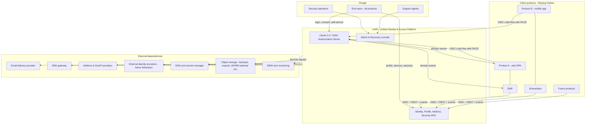

**Decision:** UIAP **hosts** the login/consent/security-center challenge experiences (branded via application metadata). Rationale: the authentication UX is part of the phishing-resistance boundary — a per-product login form defeats WebAuthn origins, re-introduces credential phishing per product, and multiplies the audit surface. Products theme the hosted pages (logo, colors, RTL strings) but never render credential inputs. **Alternative considered:** pure-API login (product-built forms) — rejected for the reasons above; **retained as an option only for the native mobile SDK path in V2** where the embedded flow talks directly to UIAP APIs and never to product servers (§60).

---

## 8. High-Level Architecture

### 8.1 Style decision: Modular Monolith for V1

**Decision:** UIAP V1 is a single deployable **modular monolith** with strict internal module boundaries (bounded contexts of §9), one PostgreSQL cluster, one Redis (Valkey) cluster, and one Celery fleet. It is *not* microservices.

Comparison that drove the decision (full text in ADR-0004):

| Criterion | Modular monolith | Microservices (per-domain services) | Verdict for V1 |
|---|---|---|---|
| Consistency | Local ACID transactions across identity + token + audit — required for §34.5 invariants | Outbox/Saga complexity on day one; authn *demands* strong consistency | Monolith |
| Security | Single hardened attack surface, one protocol layer to certify | N× internal API authz, mTLS fabric, secret sprawl | Monolith |
| Complexity / team | ~10 senior engineers; one pipeline | Operational tax on 5+ services exceeds team capacity | Monolith |
| Latency | In-process calls on login hot path | Network hops inside p95 budget | Monolith |
| Failure isolation | Weakest point | Strong | Microservices better — mitigated by §46 bulkheads and by *pre-cutting extraction seams* |
| Scaling | Scale whole app; hot reads offloaded via replicas + cache | Per-service | Acceptable at V1 scale (§49); extract audit/notifications/risk when §49 thresholds hit |
| Deployment | One release, blue/green; DB expand/contract discipline required | Independent releases | Monolith, with §54.4 migration rules |

**Extraction guarantee:** module boundaries are enforced so extraction never needs a data model change: (1) no cross-module table joins in application code (enforced by per-module data-access layers + CI lint of query ownership); (2) all cross-module calls go through named *module interfaces* (in-process today, network tomorrow — the interface list in §9.4 *is* the future service contract); (3) each module owns its tables and only reads others via interfaces or events; (4) every module ships its OpenAPI surface, and the outbox (§29) already provides the async seam. Audit, Notification, and Risk are designated *first extraction candidates* because they are consumers of events and not on the synchronous login path.

**Also decided here (build vs buy):** we **build the platform on Django** rather than adopting an OSS IdP (Keycloak/Ory/Authentik). **Rationale:** UIAP is not only an IdP — profile, address, social, professional data, security center, and recovery are *our product domain* and must evolve with the portfolio; a stock IdP gives us 60% of the value and fights us on the 40% that is differentiated, on its schema and release cadence. **Alternatives considered:** Keycloak (mature OIDC, but its user model cannot host addresses/social/professional domains and customization lands in a plugin ecosystem we would have to staff anyway), Ory (composable but headless: we would build everything around it anyway). **Mitigation for the real risk of building** (protocol correctness bugs): protocol behavior is delegated to maintained libraries (Appendix A), the OpenID Foundation conformance suite is a release gate, and the RFC 9700 security checklist is enforced in CI (§51.4, ADR-0026).

### 8.2 Container diagram (V1)

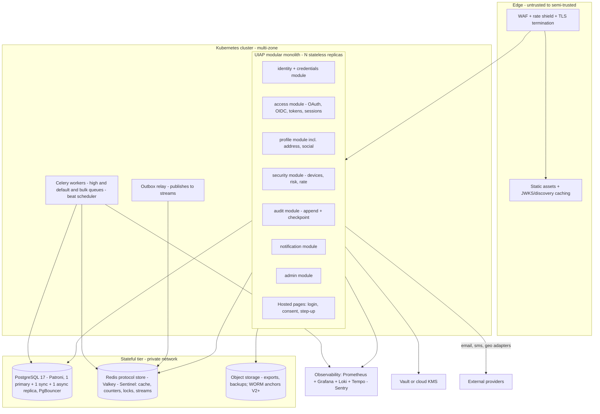

Notes on load-bearing choices:

- **Stateless app replicas.** All durable state is in PostgreSQL; Redis holds only cache, counters, locks, and session acceleration. OTP and WebAuthn ceremonies are PostgreSQL (§12.4, §12.5). No instance-local authority (§35, §47).
- **PgBouncer (transaction pooling)** between app and PostgreSQL; the app MUST NOT assume session-level GUCs across pooled statements (documented consequence of pooling — implementation detail note for teams, not architecture).
- **Outbox relay is a separate process** so DB-to-stream publishing survives app deploys and has its own backpressure/alerts (§29.5).
- **Hosted pages live in the monolith** but are served by a dedicated deployment class (same image, separate pool) with the strictest CSP, because browser-facing surfaces have different scaling and risk profiles than the API plane (§54.2).

### 8.3 Request taxonomy (who calls what)

| Plane | Surfaces | Auth model | Rate class |
|---|---|---|---|
| Public protocol | `/.well-known/*`, `/oauth2/authorize|token|introspect|revoke|end-session`, `/userinfo`, `/jwks` | Per OAuth/OIDC specs | Protocol-class limits (§24.6) |
| Public user API | `/v1/me/**`, `/v1/auth/**` | Access token (or cookie session for hosted flows) | User-class limits |
| Public product API | `/v1/**` with access tokens, webhooks delivery | Bearer JWT / webhook HMAC | Client-class limits |
| Admin API | `/v1/admin/**` on `admin.idp.internal` | Admin-scoped tokens + step-up + network allowlist | Admin-class limits + anomaly alarms |
| Internal/service | `/internal/**` (service tokens), event subscription mgmt | Service identity (§32), mTLS V3 | Service-class limits |

### 8.4 Recommended initial stack

Summary — full evaluation, versions, and alternatives: **Appendix A**. Core: Python 3.13, Django 5.2 LTS, DRF + `drf-spectacular` (OpenAPI 3.1), PostgreSQL 17, Valkey (Redis-compatible), Celery 5, `cryptography`/`authlib`/`python-fido2`/`argon2-cffi`, Prometheus/Grafana/Loki/Tempo (OTel), Sentry, Kubernetes, pgBackRest/WAL-G, Vault/KMS, k6 + Playwright. Every entry there carries a rationale; nothing was inherited from the brief unexamined.

---

## 9. Bounded Contexts and Domain Boundaries

### 9.1 Final partition

The brief proposed seven example contexts; after consolidating data ownership against the actual coupling in the flows (a login transaction touches identity + credentials + sessions + tokens + audit *synchronously* — see §13.1), we choose **seven business contexts + two supporting subsystems**:

| # | Context | Contents (modules) | Why grouped this way |
|---|---|---|---|
| 1 | **identity** | Identity, credentials (password, factors, email/phone, TOTP, passkeys, recovery codes), external connections, verification challenges, recovery | Everything that answers "who is this and how did they prove it, at which assurance level." These tables change together (a credential change is an identity lifecycle event); splitting them creates distributed transactions on the login path for no benefit. |
| 2 | **access** | OAuth/OIDC protocol layer, clients/applications, scopes catalog, tokens, grants/consents, sessions, authorization policies, service identity credentials | The protocol + permission surface. It owns token issuance and session state; it consumes identity verdicts via interface, never by sharing the credential tables' internals. |
| 3 | **profile** | Basic/public profiles, professional profile (experience, education, skills, certifications, portfolio, languages), extension attribute registry | Presentation data, per-field visibility, eventual consistency tolerance (§34.5). Product-facing reads are hot; profile must cache and scale independently — it is *the* candidate to become the first extracted read-service. |
| 4 | **address** | Address records, purposes, history, verification, geocoding provider layer, admin geography reference | Independent domain per brief §17; its own provider contracts and quality models keep geocoding churn away from profile semantics. |
| 5 | **security** | Devices, fingerprints, security events, step-up policy, rate-limit policy, risk signals/assessments, security notification triggers | Risk/abuse logic is the fastest-changing part of the platform (it reacts to attackers); isolating it behind stable interfaces lets it evolve (and later be extracted or replaced by ML) without touching authn core. |
| 6 | **audit** | Audit event store, hash/merkle checkpointing, anchoring, verification, retention | Different write pattern (append-only), different retention, different reader set, different failure semantics (commit-coupled but read-isolated). First extraction candidate with notifications. |
| 7 | **notification** | Notification orchestration, templates, channel adapters, preferences, delivery receipts | Pure async domain, provider-coupled; never on a synchronous request path (§36.3). |
| S1 | **org** | Organizations, memberships, roles, permissions, org policies | Provisioned schema, minimal V1 API (§31). Kept separate so enterprise work does not accrete into identity core. |
| S2 | **platform-admin** | Admin use cases, impersonation broker, approval workflows | Application layer, not a domain: composes interfaces of other contexts; cannot reach their tables directly (§44.5). |

Context map:

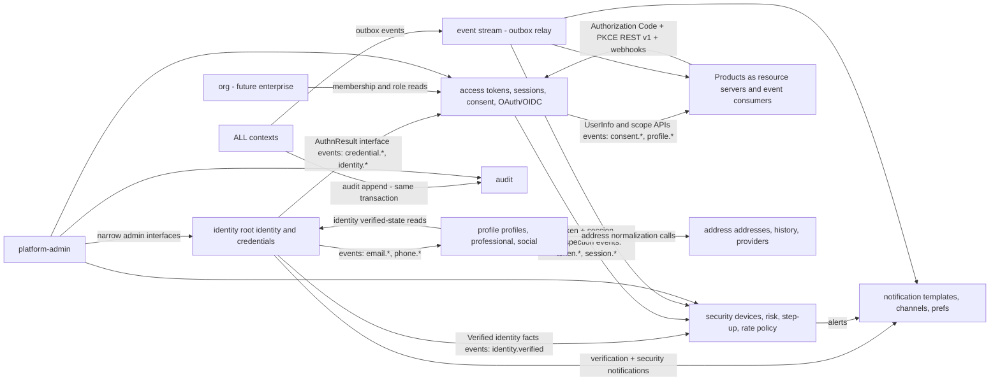

### 9.2 Ownership matrix (owns / reads / writes / publishes / consumes)

| Context | Owns (tables of record) | Reads from others (via) | Writes only in | Publishes (events) | Consumes |
|---|---|---|---|---|---|
| identity | identities, identity_status_hist, email_credentials, phone_credentials, password_secrets, totp_secrets, passkey_credentials, recovery_code_sets, external_connections, verification_challenges, identity_merges, recovery_requests | access (active-session count for "send session revoke"), security (risk verdict at enrollment time) | identity schemas | identity.\*, credential.\*, email.\*, phone.\*, recovery.\* | access.session.revoked (for step-up invalidation), security.verdict (pre-enrollment hard blocks) |
| access | applications, redirect_uris, scope_definitions, consents, consent_grant_items, sessions, devices-bindings ref, refresh_tokens, token_lineages, authorization_codes, jwks_keys, service_credentials | identity (verify factors/levels), security (risk gate at login), org (roles for admin scopes) | access schemas | token.\*, session.\*, consent.\*, application.\* | identity.credential.\* (revoke lineages), security.verdict |
| profile | profiles, profile_field_values, profile_extensions, skills + registries, education, experience, certifications, portfolio, languages, social_platforms, social_identities | identity (verification flags for `profile.write` gating) | profile schemas | profile.\*, professional.\*, social.\* | identity.email.verified (refresh caches), consent.revoked (stop serving app-scoped fields) |
| address | addresses, address_purposes, address_events (temporal), address_verifications, geo_reference (admin divisions), provider cache | — | address schemas | address.\* | consent.revoked |
| security | devices, device_signals, fingerprints(hash), authn_events, security_events, risk_signals_registry, risk_assessments, policies, rate_policies, step_up_grants | all (enrichment reads) | security schemas | device.\*, security.event.\*, risk.assessed | authn events (internal bus), identity.\* |
| audit | audit_events (append), audit_partitions, audit_roots | actor metadata from access (session/client) | audit schema only | audit.export.\* | all audit intents (its input is the commit-coupled append, §28.2) |
| notification | notification_templates, notifications, delivery_attempts, preferences | consent/preferences + events | notification schemas | notification.delivered/failed | all functional events (allow-listed) |
| org | organizations, org_memberships, org_roles, org_permissions, org_policies | identity | org schemas | org.\* | — |

**Rules:** (1) A context never reads another's tables via SQL; "reads via" means the module interface (in-process now, RPC later). (2) Cross-context *table writes from foreign modules* are forbidden. A credential change that must revoke sessions is *identity writes its rows + audit + outbox intent; access consumes the intent and revokes* **except** the same-transaction **orchestration** flows in §34.5 (login/token mint, credential-change cascade, email/phone promotion, consent revoke, step-up consume). Those flows call other contexts **only through §9.4 interfaces inside one PostgreSQL transaction** — never via SQL joins. (3) The audit append is the one universal write, and it is *into audit's partition* via audit's module interface in the same DB transaction (same instance, no distributed write — deliberate, see ADR-0008 §consequences).

### 9.3 Cross-cutting subsystems (not contexts)

Key custody (§41), event outbox+relay (§29), i18n/l10n (§53), retention engine (§39), feature flags, and config registry. These are infrastructure services of the monolith with their own ADRs where needed.

### 9.4 Module interfaces (the extraction seams)

Each context exposes only these named operations to others (complete list is implementation's job; the *existence and shape* of the seam is architecture):

| Context | Interface (future HTTP surface) |
|---|---|
| identity | `verifyCredential(identityId, type, proof, ctx) -> AuthnResult{amr[], verifiedFactors, assuranceLevel}` · `getFactors(identityId)` · `createChallenge(identityId, kind, purpose)` · `applyChangeTicket(ticket)` · `getLifecycle(id)` |
| access | `issueTokenSet(session, client, scopes)` · `revokeSession(sid, reason)` · `revokeByCredential(change)` · `introspect(token)` · `getConsent(id, client)` |
| security | `evaluateRisk(eventCtx) -> Verdict{decision, score, signals[], policyId, assessmentId}` · `registerAuthnEvent(e)` · `getDeviceState(id, dev)` |
| audit | `append(event)` (transactional) · `query(filter)` · `verify(range)` |
| profile | `getProfile(id, scopes, viewer)` · `patchProfile(id, diff, sourceClient)` |
| address | `listAddresses(id, purpose?, at?)` · `propose(input, ctx) -> Normalized` · `add/verify/revoke` |
| notification | `notify(identityId, templateKey, channelPolicy, payload, dedupKey)` |
---

## 10. Domain Model

### 10.1 Conventions used in the entity tables

- **Ownership** is by bounded context (§9); "Private" exposure = only via internal module interface or admin; "Public" = appears in a product-facing or user-facing API.
- **Mutability:** `IMMUT` (insert-only), `APPEND` (new rows supersede old), `MUT` (updates allowed), `HYBRID` (key fields frozen, mutable fields marked).
- **PII class** per §38: `PUB / INT / PRV / SEN / HS / SEC` (Public, Internal, Private, Sensitive, Highly Sensitive, Security Sensitive).
- **Audit:** `Y` = state change MUST produce an audit event in the same transaction (catalog §28.3); `E` = event is itself an audit-like record; `N` = derived/transient.
- **Retention:** reference to §39 table rows (R-xx). Retention applies to the row *and* its backups.

### 10.2 Entity catalog — Identity & Credentials (context: identity)

| Entity | Responsibility / Purpose | Key relationships | Lifecycle | Mutability | PII | Audit | Retention | Exposure |
|---|---|---|---|---|---|---|---|---|
| **Identity** | Root of all subject references; stable `sub` for every product | 1↔n Credential, Profile, Session, Consent, Membership | PROVISIONAL→ACTIVE→(SUSPENDED\|LOCKED)→PENDING_DELETION→DELETED, merged paths (§11.4) | HYBRID: id/type/created_at frozen; status, verification_level mutable | PRV (the row itself carries no PII; linkage is sensitive) | Y (every status/level change) | R-01 (tombstone forever after anonymization) | Public as opaque id only |
| **IdentityType** (HUMAN/ORGANIZATION/SERVICE) | Discriminator + per-type extension table routing | on Identity | enum | IMMUT after creation (changing type is not allowed; delete+create) | INT | Y | n/a | Private |
| **Credential** (header row; one table, class table below) | Uniform lifecycle, status, labels, last-used across all factor kinds | n↔1 Identity; 1↔1 typed secret table | PENDING→ACTIVE→STALE→REVOKED/EXPIRED | HYBRID (status, label, last_used_at mutable; type, created frozen) | SEN (metadata), secret material HS/SEC in typed tables | Y | R-02 | Private (id + safe metadata public to Security Center) |
| **EmailAddress (email credential)** | Deliverable address as factor + contact channel; verified/primary flags; change history via supersession | n↔1 Credential/Identity | UNVERIFIED→PENDING_VERIF→VERIFIED→PRIMARY / REVOKED | APPEND: address value immutable per row; change = new row + `email_changed` link | SEN (PII); encrypted at rest + blind index | Y | R-03 | Private; masked form public to consented apps |
| **PhoneNumber (phone credential)** | E.164 number as factor + SMS channel; carrier-recycling awareness (recycled_at heuristic) | n↔1 Credential/Identity | same as EmailAddress | APPEND, same | SEN; encrypted + blind index | Y | R-03 | Private; masked public |
| **PasswordSecret** | Argon2id hash + parameters + breached-corpus check timestamp + version | 1↔0..1 Credential (human identities; policy allows zero-password accounts) | ACTIVE→SUPERSEDED (rotation) / DISABLED | APPEND (new row per set; old rows kept for 1 credential-change of history, then hashed out per §39) | SEC (hash) | Y | R-04 | Private; never readable by anyone including admin |
| **PasskeyCredential (WebAuthn)** | credential_id, public key (COSE), sign count, aaguid, backed-up flag, UV/UP policy, label, transports | 1↔n Credential | ACTIVE→INACTIVE (authenticator removed externally)→REVOKED | HYBRID (label/last_used mutable; key material frozen; sign_count monotonic) | SEC | Y | R-05 | Private; metadata (label, created, last used) public to owner |
| **TOTPSecret** | Encrypted shared secret, period/digits, enrollment state, replay window counter | 0..1 per identity (+ n pending enrollments) | PENDING→ACTIVE→REVOKED | HYBRID; rotation = new row | SEC (encrypted) | Y | R-05 | Private |
| **RecoveryCodeSet** | 10 single-use 160-bit codes (hashes), generation, consumption records | 1↔0..1 per identity, superseded sets retained | ACTIVE→EXHAUSTED→SUPERSEDED | APPEND | SEC | Y | R-05 | Private |
| **ExternalConnection** | Link to external IdP subject (`iss`+`sub` pairs), provider registry id, token vault refs, claimed/verified | 1↔n Identity (multi-provider), unique (provider, provider_user_id) with takeover controls §12.8 | ACTIVE→UNLINKED | HYBRID (tokens rotated in vault ref) | PRV/SEN | Y | R-06 | Private |
| **VerificationChallenge** | OTP/verification intent object: purpose (verify_email, verify_phone, login_otp, reset_password, change_email…), channel, code hash, attempts, TTL, bound session/context | 1↔1 Credential or flow target; n↔1 Identity | OPEN→VERIFIED / EXPIRED / CONSUMED / ABANDONED / BLOCKED | HYBRID (state + attempts mutable; purpose/target frozen) | SEC (code hash) | Y | R-07 (24 h after terminal) | Private |
| **RecoveryRequest** | Supervised/automated recovery case: evidence, checks passed, risk verdicts, approver(s), outcome, cooldown clock | n↔1 Identity | OPEN→EVIDENCE→APPROVED/DENIED→EXECUTED/EXPIRED | MUT until terminal (append-only evidence log inside) | SEN | Y | R-08 | Private |
| **IdentityMerge** | Merge audit: winner, loser, evidence, grace, reversibility window | links Identities | PENDING→APPLIED→ROLLED_BACK/FINAL | APPEND | SEN | Y | R-09 | Private |

### 10.3 Entity catalog — Access (context: access)

| Entity | Responsibility / Purpose | Relationships | Lifecycle | Mutability | PII | Audit | Retention | Exposure |
|---|---|---|---|---|---|---|---|---|
| **Application** | A product or partner app = OAuth client + branding + policies + owner metadata | 1↔n RedirectURI, GrantType, ScopeGrant, Consent, TokenFamily | DRAFT→ACTIVE→SUSPENDED→RETIRED | HYBRID (metadata mutable; identity of client_id frozen; policy changes produce `application.updated`) | INT | Y | R-10 | Public (client_id, discovery metadata), Internal (policies) |
| **OAuthClientConfig** | client_id, client type (PUBLIC/CONFIDENTIAL), auth methods (`private_key_jwt`/`client_secret_basic`(legacy)/`none`+PKCE), token policy, logout URIs, app_type (web/native/svc) | 1↔1 Application | same | HYBRID | SEC (secrets hashed, never plaintext) | Y | R-10 | Private |
| **RedirectURI** | Exact-match allow-list entries (loopback special rules for native per RFC 8252) | n↔1 Application | ACTIVE/RETIRED | APPEND (add immediate, removal audited) | PRV | Y | R-10 | Private |
| **ScopeDefinition** | Platform scope catalog: name, description (i18n), claim mapping, data purpose key, risk tier, requiring_consent flag, default_visibility | catalog | ACTIVE/DEPRECATED (deprecation windows §60) | MUT (text changes = consent re-prompt trigger) | INT | Y | R-11 (all versions kept) | Public via discovery |
| **ScopeClaimMap** | Maps scope → claims returned (userinfo/id_token) — prevents accidental scope creep | n↔1 ScopeDefinition | ACTIVE/DEPRECATED | MUT (change = audited + re-consent for widening) | INT | Y | R-11 | Private |
| **Consent** | (identity, client, consent-set version) grant record with exact scope list, purpose text hash, timestamp, source interaction id, revocation | n↔1 Identity, Application | GRANTED→SUPERSEDED (re-consent)→REVOKED | APPEND | PRV | Y | R-12 (proof-of-consent outlives revocation) | Owner + Admin view |
| **AuthorizationCode** | Short-lived code: client, identity, scopes, nonce, PKCE challenge/method, redirect used, code_challenge binding, single-use, session id | transient | ISSUED→CONSUMED/EXPIRED/REVOKED | IMMUT payload + state field | SEC | Y (issuance+consumption; reuse = security event) | R-13 (≤ 15 min lifetime, store 24 h for forensics) | Private |
| **Session** | First-party login session at UIAP: sid, identity, device, amr chain, acr, created/ip/geo, expiry policy, status | n↔1 Identity, Device; 1↔n TokenFamily, RefreshToken | ACTIVE→IDLE→EXPIRING→ENDED (EXPIRED\|REVOKED\|TERMINATED_ALL\|REPLACED) | HYBRID (activity touches mutable; principal binding frozen) | PRV (+ SEN for IP/geo) | Y on creation and termination; last_seen is not audited (noise) | R-14 | Owner (Security Center), Admin |
| **RefreshToken / TokenLineage** | Rotatable token families: lineage_id, parent_id, session, client, hashes, use state, reuse-detection flags | n↔1 Session; 1↔n tokens | ISSUED→USED (successor created)→EXPIRED / REVOKED / COMPROMISED | APPEND | SEC (hash only, raw never stored) | Y on revocation/compromise events; per-token audit would flood — see Rationale §16.3 | R-15 | Private |
| **SigningKeyRecord (JWKS)** | kid, alg, status (NEXT/CURRENT/PREV/RETIRED), public JWK, private handle (KMS ref, never key material), rotation dates, emergency revoke reason | global | QUEUED→NEXT→CURRENT→PREVIOUS→RETIRED | HYBRID (status dates) | SEC (public JWK is PUB) | Y | R-16 | Public JWK via JWKS endpoint; everything else private |
| **ServiceCredential** | Service-identity authn material: JWK set for `private_key_jwt`, mTLS cert bindings (V3), expiry, rotation state | n↔1 Identity (type=SERVICE) | ACTIVE→ROTATING→REVOKED | APPEND | SEC (public keys stored, never private) | Y | R-17 | Private |
| **ClientAssertionJti / IdempotencyRecord** | Anti-replay stores for `private_key_jwt` jti, and API `Idempotency-Key` ledger | per client | TTL entries | IMMUT+TTL | INT | N (bulk) | R-18 (24 h) | Private |
| **DeviceBinding (access-side view)** | Refers to security.Device; access keeps only the trust *verdict* used at authn time | 1↔1 Device | copy | APPEND snapshot | PRV | N (source audited in security) | with session | Private |

### 10.4 Entity catalog — Profile, Professional, Social (context: profile)

| Entity | Responsibility / Purpose | Relationships | Lifecycle | Mutability | PII | Audit | Retention | Exposure |
|---|---|---|---|---|---|---|---|---|
| **Profile** | 1↔1 human identity aggregate: given/family name, display name, avatar ref, bio, headline, birthdate, locale, timezone, pronouns, website | n↔1 Identity | follows identity lifecycle | MUT + field-level versions (§18.3) | PRV (birthdate SEN) | Y for value-changing writes | R-19 (dies with anonymization) | Per-field visibility |
| **ProfileField** (typed columns + registry) | Field metadata: type, validation rule ref, visibility default, sensitive flag, consent scope required for app writes | catalog on Profile | ACTIVE/DEPRECATED | MUT (registry), values MUT | per field | Y | R-19 | Public schema / private values |
| **ProfileExtension (namespaced attributes)** | Extensible schema without migrations: (namespace, key) → typed value w/ validation from registry | n↔1 Profile | ACTIVE/SUPERSEDED | APPEND versions | per field | Y for changes | R-19 | Per-field |
| **VisibilityRule** | Per-field audience: PUBLIC / LINKED (any authed app with profile scope? NO — see §18.4: default LINKED means "identity itself" unless scope granted) / APP:\<client\> / ORG / SELF | n↔1 ProfileField | MUT | MUT | INT | Y (rule changes are consent-adjacent) | R-19 | Private |
| **ProfessionalProfile** | 0..1 per human identity (future: per organization identity too): headline, occupation, job_title, company, industry, portfolio URL, languages, summary | n↔1 Profile (or Org) | ACTIVE / UNLISTED | MUT | PRV | Y | R-19 | Owner-controlled; shareable per scope `professional_profile.read` |
| **Experience** | employer, role, period, description, verified?, org link (V2) | n↔1 ProfessionalProfile | APPEND/EDIT/DELETE | MUT | PRV | Y (bulk-edit = 1 audit event with diff) | R-19 | Owner |
| **Education** | institution, field, degree, period | n↔1 | same | MUT | PRV | Y | R-19 | Owner |
| **Certification** | issuer, name, id, issued/expires, verification URL | n↔1 | same | MUT | PRV | Y | R-19 | Owner |
| **Skill + SkillDefinition** | User skill rows with endorsements refs; platform-curated skill dictionary (aliases) | n↔1, n↔ catalog | ACTIVE/ARCHIVED | MUT (links), catalog MUT | PRV | Y (user side) | R-19 | Owner/Public per visibility |
| **LanguageProficiency** | locale code + CEFR/ILR level | n↔1 | same | MUT | PRV | Y | R-19 | Owner |
| **PortfolioItem** | title, url (SSRF-guarded §42.21), description, media refs (V2) | n↔1 | same | MUT | PUB/PRV | Y | R-19 | Owner |
| **SocialPlatform (registry)** | slug, display name, profile URL template, validation pattern, icon, enabled, verification support level (NONE/OAUTH/CLAIM) | catalog | ACTIVE/DISABLED | MUT (template change = re-render only; validation change audited) | INT | Y | R-11 | Public catalog |
| **SocialIdentity** | (identity, platform, username, profile_url (derived from template unless manually overridden + flagged), verified flag, visibility, metadata JSONB — user-declared only, follower counts and other scraped platform data are prohibited (§21.3)) | n↔1 Profile; n↔1 SocialPlatform | ADD→VERIFIED?→REMOVED | MUT + APPEND history of URL changes | PRV (linkage is PRV) | Y | R-19 | Owner + `social_profiles.read` scope |

### 10.5 Entity catalog — Address, Security, Session-intel, Audit, Notification, Organization

| Entity | Responsibility / Purpose | Relationships | Lifecycle | Mutability | PII | Audit | Retention | Exposure |
|---|---|---|---|---|---|---|---|---|
| **Address** | Structured address aggregate (fields per §20.2), provider-normalized or raw, quality/accuracy, lat/long, timezone, locale | n↔1 Identity; n↔ Purpose | versioned: valid_from→valid_until; CURRENT / HISTORICAL / VERIFIED flags | APPEND (new version on change; never overwrite — brief §19 honored) | SEN (street/person PII; encrypted at rest) | Y | R-20 (owner data lives until deletion) | Owner; `address.read/write` scopes |
| **AddressPurpose** | HOME/WORK/BILLING/SHIPPING/LEGAL/EMERGENCY/OFFICE/CUSTOM (dictionary, extensible) | catalog | ACTIVE | MUT | INT | Y | — | Public |
| **AddressHistory** | The temporal chain itself: same table + `valid_until` + change reason + source client | — | — | IMMUT once closed | SEN | Y | R-20 | Owner (point-in-time API) |
| **AddressVerification** | Method (geocode, admin-db, manual), result, confidence, provider, at, by | n↔1 Address | PENDING→VERIFIED/FAILED/STALE | APPEND | PRV | Y | R-20 | Private |
| **Device** | Physical device/browser-profile concept: name, type, OS/browser(+version) parsed server-side, manufacturer/model (best-effort), app + version, first/last seen, push token refs | 1↔n Session, n↔1 Identity | NEW→RECOGNIZED→TRUSTED / UNTRUSTED / BLOCKED / REVOKED / FORGOTTEN | HYBRID (labels mutable, fingerprints append) | PRV (UA), risk fields SEN | Y on trust-state transitions; not on last_seen | R-21 | Owner (Security Center); risk-internal views private |
| **DeviceFingerprint** | Hashed coarse attributes (UA hash, tz, screen bucket, TLS-frontend hash if edge provides it) with bucketing + rotation; **explicitly advisory-only** | n↔1 Device | APPEND + TTL | IMMUT + expiry | SEN (derived) | N (signal record, not user state) | R-22 (rolling 90 d, hashed, salted) | Private |
| **DeviceIdentity** | Optional strong binding: WebAuthn device-attestation credential or push-install token binding making "this exact device" verifiable | 0..1↔1 Device | BINDING/BOUND/REVOKED | APPEND | SEC | Y | R-21 | Private |
| **AuthenticationEvent** | Append-only log of authn attempts (§23.7 schema) incl. failures with reason codes; feeds risk engine + user Login History + SIEM | n↔1 Identity (nullable → unknown target for failed unknown users), Session?, Device?, Application | IMMUT | IMMUT | SEN (IP/geo/UA) | E (it *is* the record; audit references its id) | R-23 | Owner via Security Center; SIEM stream |
| **SecurityEvent** | Curated user-visible security-relevant facts (new login type, password change, consent grant, MFA change, risk block…) | n↔1 Identity | IMMUT | IMMUT | PRV/SEN | E | R-24 | Owner via Security Center |
| **RiskAssessment** | One evaluation: inputs snapshot (ids/hashes), signals fired, score, band, policy applied, verdict, latency | n↔ Identity?, Session?, AuthenticationEvent | IMMUT | IMMUT | SEN | N (referenced by audit when it drove a decision) | R-25 (rolling 400 d to be validated) | Private (admin); owner sees only opaque "security check" |
| **RiskSignal (registry + instances)** | Registered signal evaluators; instances store key/params/version | catalog + instances | registry ACTIVE/RETIRED; instances IMMUT | registry MUT | SEN | N | R-25 | Private |
| **SecurityPolicy** | Ordered, versioned rules: match-context → verdict (+ required step-up factors); tenant-scope (app/operation); effective windows | evaluated by access/security | DRAFT→ACTIVE→SUPERSEDED | APPEND versions | INT | Y | R-26 (all versions, forever — policies are proof) | Private |
| **StepUpGrant** | Consumed-once proof-of-fresh-authn: jti, identity, ops binding hash, amr set achieved, 5-min TTL, PG-first consume (authoritative) + Redis cache (best-effort cleanup) | n↔1 Identity, Session | ISSUED→CONSUMED/EXPIRED/REVOKED | state-only | SEC | Y | R-27 | Private |
| **RatePolicy / RateCounter (definition here, storage in Redis)** | Distributed limit defs per dimension (§24.6) | policy registry | ACTIVE | MUT versioned | INT | Y | R-26 | Private |
| **Notification** | Orchestrated message: class (security/verification/transactional/marketing), template + version, channel + fallback, dedup key, status per attempt, receipts | n↔1 Identity (or broadcast cohort V2) | QUEUED→SENT→DELIVERED/BOUNCED/FAILED/THROTTLED | HYBRID (state machine) | content=PRV/SEN (PII in notification payloads minimized: use "action was taken" wording, no secrets) | Y for security-class sends (audited implicitly by event) | R-28 | Owner (inbox view), private receipts |
| **NotificationPreference** | Per identity × class × channel toggles; security class has hard floor (2 channels, not opt-outable) | 1↔n | MUT | MUT | PRV | Y | with profile | Owner |
| **NotificationTemplate** | Localized (fa/en), versioned, channel variants, RTL metadata; template + version hash on send record | catalog | DRAFT→ACTIVE→RETIRED | APPEND versions | INT | Y | R-26 | Private |
| **Organization** | Org as Identity (type=ORG) + profile + org-specific attributes; ownership boundary for future enterprise | n↔1 Identity | PENDING→ACTIVE→SUSPENDED→DISSOLVED | HYBRID | PRV (org info may be PUB) | Y | R-29 | Per-visibility |
| **Membership** | (identity, org, role set, status, joined/left) — temporal | n↔1 Identity, Organization | ACTIVE/SUSPENDED/LEFT | HYBRID (valid_from/until) | PRV | Y | R-29 | Org admins (V2) |
| **Role / Permission** | Platform roles (admin) and org roles (schema V1, UI V2+); permission = (resource, action) tuples | many↔many | ACTIVE/RETIRED | MUT catalog | INT | Y | R-26 | Private |
| **OutboxEvent** | Durable domain-event staging per aggregate (§29.4): id, aggregate, type, version, payload hash + pointer, publish state | all contexts | PENDING→PUBLISHED→ACKED/FAILED (DLQ) | state-only | per event payload rules | N (audit intent rows separately) | R-30 | Private |
| **AuditEvent** | §28 full record | actor/subject refs | IMMUT + anchored | IMMUT | per-field (see §28.6 redaction) | E | R-31 | Admin/Auditor read-only |

### 10.6 Domain diagram (core)

```mermaid
erDiagram
    IDENTITY ||--o{ CREDENTIAL : "has"
    CREDENTIAL ||--o| PASSWORD_SECRET : "is"
    CREDENTIAL ||--o| TOTP_SECRET : "is"
    CREDENTIAL ||--o{ PASSKEY_CREDENTIAL : "is"
    CREDENTIAL ||--o| EMAIL_ADDRESS : "is"
    CREDENTIAL ||--o| PHONE_NUMBER : "is"
    CREDENTIAL ||--o| RECOVERY_CODE_SET : "is"
    IDENTITY ||--o| PROFILE : "human profile"
    IDENTITY ||--o{ EXTERNAL_CONNECTION : "federated via"
    IDENTITY ||--o{ ADDRESS : "owns"
    ADDRESS ||--o{ ADDRESS_VERIFICATION : "verified by"
    IDENTITY ||--o{ SOCIAL_IDENTITY : "has"
    SOCIAL_PLATFORM ||--o{ SOCIAL_IDENTITY : "defines"
    PROFILE ||--o| PROFESSIONAL_PROFILE : "extends"
    PROFESSIONAL_PROFILE ||--o{ EXPERIENCE : "lists"
    PROFESSIONAL_PROFILE ||--o{ EDUCATION : "lists"
    PROFESSIONAL_PROFILE ||--o{ CERTIFICATION : "lists"
    PROFESSIONAL_PROFILE ||--o{ SKILL : "has"
    PROFESSIONAL_PROFILE ||--o{ PORTFOLIO_ITEM : "shows"
    IDENTITY ||--o{ SESSION : "signs into"
    DEVICE ||--o{ SESSION : "hosts"
    SESSION ||--o{ REFRESH_TOKEN : "in family"
    TOKEN_LINEAGE ||--o{ REFRESH_TOKEN : "rotates"
    IDENTITY ||--o{ CONSENT : "grants"
    APPLICATION ||--o{ CONSENT : "receives"
    APPLICATION ||--o{ REDIRECT_URI : "declares"
    APPLICATION ||--o{ SCOPE_GRANT : "allowed"
    SCOPE_DEFINITION ||--o{ SCOPE_GRANT : "from catalog"
    SCOPE_DEFINITION ||--o{ SCOPE_CLAIM_MAP : "maps"
    IDENTITY ||--o{ AUTHENTICATION_EVENT : "attempts"
    IDENTITY ||--o{ SECURITY_EVENT : "records"
    AUTHENTICATION_EVENT ||--o| RISK_ASSESSMENT : "scored by"
    RISK_SIGNAL ||--o{ RISK_ASSESSMENT : "feeds"
    SECURITY_POLICY ||--o{ RISK_ASSESSMENT : "applies"
    IDENTITY ||--o{ VERIFICATION_CHALLENGE : "answers"
    IDENTITY ||--o{ RECOVERY_REQUEST : "initiates"
    IDENTITY ||--o{ NOTIFICATION : "receives"
    NOTIFICATION_TEMPLATE ||--o{ NOTIFICATION : "renders"
    IDENTITY ||--o{ AUDIT_EVENT : "as actor or subject"
    ORGANIZATION ||--o{ MEMBERSHIP : "includes"
    IDENTITY ||--o{ MEMBERSHIP : "as member"
    ORG_ROLE ||--o{ MEMBERSHIP : "assigns"
    SERVICE_CREDENTIAL ||--o| IDENTITY : "authenticates service identity"
    SIGNING_KEY ||--o{ REFRESH_TOKEN : "unused - signing only for JWTs"
```

(Refresh tokens are hashes, not JWTs — the `SIGNING_KEY` edge exists solely for `id_token`/`access_token`/`logout_token` minting; shown to keep the key custody visible in the model.)

### 10.7 Invariants (global, testable)

Architectural invariants are the properties every implementation phase must preserve and every test suite must cover (they seed the property-based tests, §51.3).

| ID | Invariant |
|---|---|
| INV-01 | Identity ids, once minted, are never reused, reassigned, or deleted from the id namespace — including after merge/anonymization (tombstones keep the id). |
| INV-02 | For a given (identity, client), the `sub` value is stable. First-party V1 clients receive the identity id. Pairwise `sub` (V2 third-party) changes only through *explicit, audited* re-link/rotation. Identity merge/transfer is a separate, audited event (products observe events; §11.6). |
| INV-03 | A credential row never stores reusable secret material in plaintext or reversible encryption (passwords/TOTP/recovery codes/OTP = hashes or KMS envelope; passkeys = public keys). |
| INV-04 | **At most** one email credential and **at most** one phone credential may be simultaneously `PRIMARY` and `VERIFIED` per identity (partial unique indexes). Zero phones is allowed. Zero verified emails is allowed only in PROVISIONAL or LOCKED-for-support states (factor-floor §12.10). |
| INV-05 | Verification of a challenge requires a matching, unexpired, unconsumed, within-limit challenge for that purpose and that factor; replay MUST be impossible (single-use enforced by atomic state transition, §12.4). |
| INV-06 | Issuance of a token set requires a live Session whose identity is `ACTIVE` (not SUSPENDED/LOCKED/PENDING_DELETION); suspended identity ⇒ no new tokens; existing RTs revoked at suspension. |
| INV-07 | An access token MUST NOT contain: password hashes, secret material, raw phone/email values beyond consented `email`/`phone` scopes (and even then UIAP prefers userinfo over claim-in-token for volatile values), unapproved claims, or anything a 6-month log leak would harm. |
| INV-08 | Any state change to identity status, credentials, consents, sessions, security policies, applications, roles MUST produce an audit event *in the same transaction* (INV-08 breach = release blocker, enforced by §56 gate test). |
| INV-09 | Revocation (session, device, credential, consent) is monotonic: a revoked principal/scope never becomes valid again without new enrollment + explicit user action. |
| INV-10 | Retention jobs may only *reduce* data through the anonymization/erasure pipeline that itself emits audit events (no silent deletes; §37.4). |
| INV-11 | No cross-context SQL: a module's queries reference only its own schemas; CI enforces (see §9.2 rule 1, §34.2). |
| INV-12 | Every endpoint that mutates an identity-scoped resource has a rate policy and an idempotency story, or is in the documented exempt list. |
| INV-13 | Clocks: all ordering-critical logic uses DB-sourced `now()`; app nodes must have NTP; TOTP replay windows tolerate ≤ 90 s drift by design (§53.4). |
| INV-14 | PII MUST NOT enter logs, metrics labels, trace names, Sentry breadcrumbs (auto-redaction filter + CI scanner, §45.3). |
| INV-15 | A product's access token audience MUST NOT validate at another product's resource server (`aud` binding + `azp`/client checks; tests per §51.4 "confused deputy" suite). |
| INV-16 | Device trust and fingerprinting can *add* friction but can never *reduce* required authentication factors (no "known device ⇒ skip mandatory step-up" below policy floor; §22.4). |
| INV-17 | All list endpoints are paginated and bounded (default 50, max 200 rows); no unbounded export in API plane (exports are async jobs). |
---

## 11. Identity Architecture

### 11.1 Identifier strategy

**Decision:** All public-facing entity ids are **UUIDv7** (RFC 9562), stored in PostgreSQL `uuid` columns, generated application-side (monotonic within a node, sub-ms resolution + counter). Comparison considered:

| Option | Verdict |
|---|---|
| BIGSERIAL | Rejected: enumerable (IDOR/oracle), leaks volume, sharding-hostile. Used nowhere externally. |
| UUIDv4 | Rejected: random → index bloat and fragmentation in secondary indexes on `created`-adjacent access patterns; no time order. |
| ULID | Rejected (V1): equivalent properties, but Crockford-base32 26-char ids are off-spec for Postgres `uuid` storage (requires `char(26)`/bytea mapping) and less native support in Django/DRF/PostgreSQL tooling. Kept as an accepted format for *externally supplied* opaque ids in V4 federation. |
| **UUIDv7** | **Chosen:** 128-bit, stored in native PostgreSQL `uuid`, time-ordered locality for B-tree inserts (write amplification ↓), index-friendly, standardized (RFC 9562). **Generation is application-side in V1** (Python `uuid` / `uuid6`). PostgreSQL 17 stores v7 values but does **not** provide `uuidv7()`; that built-in is PostgreSQL 18+. Do not claim DB-native generation on PG 17. Entropy (74 random bits) + node clock makes enumeration infeasible (§42 T-23). |

Specific rules:
- Identity `sub` claim: **V1** uses the raw identity id as `sub` for all clients (first-party only in V1). **V2** introduces pairwise `sub` for third-party clients: `HMAC-SHA256(secret_kp, identity_id)` truncated to 128 bits and base64url — sector-identifier style, one `secret_kp` per client. First-party products receive a config flag `shared_subject=true` to get the raw identity id (portfolio-wide SSO data joins). Third-party products get pairwise `sub` by default (cross-product correlation prevention).
- Immutable identifiers: identity id, `sub`, credential row ids, audit event ids. Mutable *handles* (preferred username, org slug) are separate namespace objects with their own reservation/retirement policy (§11.7).
- Ids never embed type, tenant, region, or timestamp-of-PII beyond the inherent v7 prefix; the 48-bit timestamp inside UUIDv7 is acceptable (it is a creation time, not a leak — noted for auditors).

### 11.2 Identity root object

```
Identity
  id: uuid (v7)                    # immutable; the `sub`
  type: HUMAN | ORGANIZATION | SERVICE
  status: PROVISIONAL | ACTIVE | SUSPENDED | LOCKED | PENDING_DELETION | DELETED | MERGED
  verification_level: UNVERIFIED | IAL1 | IAL2   # NIST SP 800-63-3 mapping (§11.8)
  created_at, activated_at, closed_at: timestamptz
  region_tag: text                # residency partition key from day 1 (C-05)
  row_version: bigint             # optimistic concurrency; every MUT change bumps it
```
Type-specific extension tables: `identity_human_ext` (locale, timezone, birthdate_ref?, minor-flag), `identity_org_ext` (legal name ref, country, tax-id state), `identity_service_ext` (owner team, credential rotation cadence, allowed scopes). **Decision:** extensions, not JSONB-blob, for anything with query or constraint requirements; a `metadata JSONB` free field exists for non-constrained annotations only (never for claims a product depends on — that's a scope contract, §15.6).

### 11.3 Why email/phone are NOT the identity key (brief §5 requirement, answered normatively)

1. **Mutability:** addresses change (job changes, plan changes), numbers are recycled by carriers (C-07: operator recycling cycles are months, not years). A recycled number that is a key silently transfers *account linkage* (password resets! lookups!) to a stranger — the classic SIM-recycling takeover. As *factors* with verification + staleness signals, the blast radius of recycling is one factor, not the account.
2. **Non-uniqueness & sharing:** family phones, corporate catch-all emails, aliases (`+`, dots) — uniqueness constraints on email would block legitimate users and create support debt.
3. **Ownership ≠ identity:** email proves control of an inbox at a point in time; identity must outlive that.
4. **PII amplification:** every FK table would carry PII (index bloat, encryption burden, breach blast radius, GDPR scope). An opaque id keeps PII in two tables (§40).
5. **Enumeration & correlation oracle:** a stable email-keyed system turns any lookup endpoint into a people-search engine (brief §39).
6. **Cascade cost:** an email change would rewrite every join in a ten-product ecosystem; with an opaque id it is one row swap in one table.
7. **Deletion/anonymization:** tombstones with opaque ids satisfy erasure cleanly (no PII residue in join tables).
8. **Federation:** when a user joins via Google/Apple/SAML, "identity key" has no natural email (private-relay emails, missing emails) — provider-independent core (§12.8) *requires* an internal id.

**Decision:** login by email/phone is accepted as an *input alias* (looked up via blind index, §40.3), never stored as a key.

### 11.4 Lifecycle

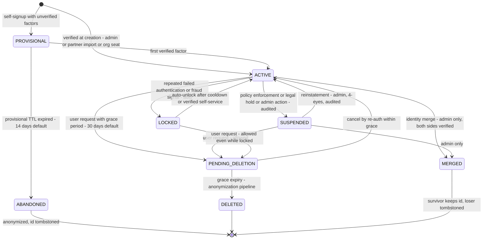

Rules:
- **SUSPENDED** (policy/legal) vs **LOCKED** (security cooldown) are distinct: lock is temporary and self-healable; suspension blocks everything except support/recovery and requires admin reinstatement.
- No new token issuance in any non-ACTIVE state (INV-06); existing ATs die naturally (≤10 min), all RTs revoked at SUSPENDED/LOCKED-with-fraud-verdict.
- **Soft delete** is the *only* delete primitive: `DELETED` sets status, moves PII columns to the anonymization work queue (batched, ≤ 30 days), and writes a tombstone row `{id, status, created_at, closed_at}` that is never purged (referential integrity of audit + product history depends on it). **Hard delete of the tombstone is prohibited** (INV-01). GDPR compatibility: tombstone contains no personal data (§37.4).

### 11.5 Anonymization pipeline (on DELETED)

Order: (1) credentials → secrets destroyed (hashes zeroed, TOTP/passkey rows REVOKED+anonymized), (2) profile/address/social/org memberships content scrubbed to nulls with `scrubbed_at`, (3) notification templates with PII payload → archived as class+template-id only, (4) AuthenticationEvents keep `identity_id` but geo/IP granularity truncated to country + /24 v4 (/32→/24) or /48 v6, (5) AuditEvents *do not change shape* — subject name fields were never stored (§28.6), the id reference remains, (6) consent records keep (client, scope set, timestamps) — proof of consent, personal data scrubbed (GDPR Art. 7(1) accountability vs Art. 17 tension resolved in favor of *minimized* proof). (7) `sub` re-link suppression: external connections unlinked and provider tokens destroyed.
Outputs: `identity.deleted` event; DSAR completion receipt. **To be validated:** scrubbing batch size and SLA (≤ 30 days, §39).

### 11.6 Merge policy (brief: "identity merge")

**Decision:** merges are **not** a general feature of V1. Policy:
- Automatic dedup: only *unverified* factor collisions are auto-refused (an email that already belongs to an ACTIVE identity cannot attach to another identity — it is redirected to "recover access" flow instead, §12.3.5).
- Manual merge (V2, admin + 4-eyes, both identities must present verified email *or* verified phone *or* a passkey within 24 h): loser id tombstoned with `MERGED_INTO` forward pointer valid for claim-resolution grace (30 days) so product lookups resolve to survivor and are flagged `merged=true`; tokens for loser revoked; consents must be re-granted (survivor consent copy is **not** auto-created — consent is personal to the consenting principal); audit rows of both sides stay under their original ids, with a join via the merge record.
- Split/rollback only within grace and only by 4-eyes.
**Rationale:** merges rewrite history and are the #1 way identity systems lose audit fidelity; making them slow, rare, and reversible is the feature.

### 11.7 Handles (optional username)

`handle` namespace: lowercase, IDN-aware (NFC + casefold + TR46 for punycode), reserved-word list, per-region uniqueness, retirement hold (90 d) + premium policy; handles are **not authentication factors by default** (they enable enumeration); login-by-handle is opt-in per identity (§42 T-14).

### 11.8 Identity verification state

Per NIST SP 800-63: `IAL` (identity assurance) and `AAL` (authenticator assurance) concepts adopted as platform vocabulary; stored per identity (`verification_level` IAL1 = self-attested, IAL2 = evidence-verified via verified email + verified phone + documented/manual step). Products request claim `ial`; `acr` values per §15.7. Verification evidence is its own append-only record (`identity_verification_evidence`: method, subject hash, outcome, reviewed_by, expires) — it is PII-adjacent, so evidence artifacts live in the object storage vault with per-file access grants and 3-year retention (to be validated with counsel, OQ-09).

### 11.9 Recovery of identity ≠ recovery of credentials

Two distinct planes: credential recovery (self-service, §27) and identity recovery (state restoration: unlock from bad LOCKED verdicts, reinstatement from wrongful suspension) — the latter is admin-only with 4-eyes. Products must not conflate them; API surfaces are separate (`/v1/auth/recover/*` vs `/v1/admin/identities/{id}/reinstate`).

---

## 12. Credential Architecture

### 12.0 Model: separated from identity, polymorphic with discipline

**Decision:** single header table `credential` (id, identity_id, kind, label, status, created/updated/last_used_at, verified_at, revoked_at, risk_flags JSONB, created_by, mfa_strength_rank) + typed secret tables 1↔1/1↔n (§10.2). The header is where lifecycle, audit hooks, and Security Center views operate; the typed tables are touched only by their kind's module. Rationale: avoids 8 near-duplicate lifecycle state machines (bug farms) and avoids a single-table-polymorphism nightmare (nullable-everywhere).
`mfa_strength_rank` order (policy-relevant, used by step-up/risk "factor quality"): passkey (phishing-resistant) > security-key > TOTP > email-OTP ≈ SMS-OTP (single-factor out-of-band) — per NIST SP 800-63B's guidance against PSTN-based authenticators as the *sole* second factor; SMS is "acceptable for UX, disallowed as the only upgrade" (§12.9).

Common lifecycle: `PENDING (created, not proven) → ACTIVE → STALE (e.g., passkey count regression, provider says invalid) → REVOKED (terminal) | EXPIRED (policy, e.g., org lease)`. Every transition audited (INV-08).

### 12.1 Method matrix (brief §6 requirement, complete)

| Method | Enrollment | Verification | Authentication use | Revocation | Rotation | Recovery | Audit | Principal risks |
|---|---|---|---|---|---|---|---|---|
| **Password** | Set during signup / Security Center; strength meter = breach-corpus + zxcvbn-style entropy estimate (no composition rules, NIST); ≤ 256 chars; paste allowed; k-anon HIBP check (Appendix A lib choice) at set-time, offline bloom acceptable (OQ-03) | n/a | Alias (email/handle) + password at login, then risk/step-up layers | Set new password or admin revoke (revoking the credential, not just password — "credential revoke" also kills "remember this device") | On user change only (no expiry — NIST); forced rotation ONLY on compromise evidence | Reset via challenge (§27.1) | password.set/changed/revoked + login outcomes | stuffing, spraying, breach reuse, timing oracles, capslock UX, shoulder-surfing on public devices |
| **Email OTP** | Verify existing address (challenge to inbox, ≤ 6 digits numeric + alpha variants per locale policy); also login-with-OTP for passwordless accounts (V2 flag per client) | 1 code per challenge, TTL 10 min (policy), ≤ 5 attempts, single-use atomic; resend throttle 30 s / ≤ 5 per h per address | Login: challenge issued after alias entry; step-up: 6-digit; verification: change flows (§13.5) | Deleting the email credential revokes the factor | Code auto-rotates (new challenge); factor itself replaced via change flow | reset via… (email *is* the recovery channel for most flows → dual-channel rule §27.0) | challenge.created/verified/failed/expired | Inbox compromise = factor compromise (mitigate: AAL policy combos §24.2), deliverability, spam-folder for IR |
| **SMS OTP** | Same as email; SIM-recycling guard: carrier-port heuristic + phone age + "old code stop working" on number change | Same, TTL 2 min (policy — SMS latency p95 assumption < 45 s, to be validated), ≤ 5 attempts | Same; only where email unavailable and user opted in; never for recovery of MFA-protected accounts | Same | Same | Same | Same | **SIM swap/port-out**, SS7 intercept, number recycling — hence rank below TOTP and banned as sole 2FA for AAL2 (§12.9) |
| **TOTP** | QR + secret; confirm-by-verify (must present valid code to activate — prevents enrollment injection); secret envelope-encrypted, shown once | ± 1 step (30 s), single-use counter window stored (replay prevention), clock-drift tolerated ≤ 90 s | MFA step; step-up factor; never first-factor for new accounts (UX-only V2) | Remove credential → sessions not revoked (password still stands) but trust reset: step-up becomes MFA-required on sensitive ops (policy) | Re-enroll (rotate) = new secret; keep old for 24 h grace overlap (UX) | recovery codes (below) — loss path: 2-channel reset §27.3 | totp.enrolled/rotated/revoked, per-use is authn_event not audit | Phishable in real time (no origin binding). Posture: TOTP is treated as the *fallback* factor — policy warns users and AAL2-class operations require phishing-resistant factors; TOTP-only accounts are capped at AAL1-equivalent for sensitive operations (§12.9). |
| **Passkeys (WebAuthn)** | Platform or roaming authenticator; RP ID = UIAP domain exact; user verification preferred required for high-risk; attestation optional (none = privacy default, OQ-04); backed-up passkeys accepted but flagged (`isBackedUp` → risk signal "cloud-synced") | Assertion: challenge from our ephemeral WebAuthn request store (Redis, 5 min TTL), sign-count monotonic (regression → STALE flag + security event), UV flag honored | Primary phishing-resistant factor for login and for step-up (recommended default for all sensitive ops) | Delete passkey (step-up enforced — you cannot remove the key you're holding without proving the other one or the password+OTP), admin-forced for compromised | N/A (key is per-device/roaming; "rotation" = add/remove) | recovery codes + TOTP + supervised flow | passkey.created/revoked/stale | Lost cloud-synced key = factor shared; AVD (passkey in iCloud/Google/MS accounts) → policy requires account-level 2FA for AVD users as recommendation banner (cannot enforce — residual risk documented, T-06 note) |
| **Recovery codes** | Auto-generated when first MFA factor enrolled: 10 × 160-bit, shown once, printable; hashes stored (SHA-256 of raw — high entropy → fast hash acceptable, decision + rationale) | Single-use consume with race-safe UPDATE-RETURNING | MFA step only (never password) | Regenerating invalidates the old set (documented to user) | On use of last code → nag flow (§27.3) | This *is* the MFA recovery path | recovery_codes.generated/consumed (which one: index only, never the code) | Phishing ("paste these codes" scam) — mitigated by never asking for the set, only one code at a time, and security banner |
| **External OAuth identity (Google/Apple/MS/GitHub)** | Connect after primary authn (link) or via social login (auto-provision with `provisional` + email-verify) — both allowed, different code paths (§12.8) | Protocol-level (provider tokens verified server-side at callback, never in browser) | Social login = first factor; linked account also usable as second factor where provider supports (rare; not depended upon) | Unlink (step-up + warning if it's the last usable factor → enforce factor-floor rule §12.10) | Provider token refresh in vault; re-consent on scope change | Recovery: social provider is *one evidence channel*, never sole | connection.linked/unlinked/authcode events | Provider outage (degrades: local password still works), account-recycling by provider, Apple relay emails (unverifiable ownership → never auto-promote relay emails, §12.3.4) |

### 12.2 Password rules (Decision set)

min 12 (registration default) with 8 as absolute floor for legacy import; max 256; Unicode NFC + no normalization-forced case-lowering *or* -raising at verify (store raw bytes after max length; lower-case the *lookup alias*, never the secret); composition rules forbidden; common-password/breach deny (k-anonymity, §59 OQ-03 decides online vs offline corpus); no expiry; no hints; history block = previous 1 (only to block "revoke = re-set same password" loops); Argon2id params Initial Target `m=19MiB, t=2, p=1` → raise toward `m=64MiB, t=3, p=4` (OWASP Password Storage Cheat Sheet, 2024 rev) subject to §50 login-budget calibration (target: verification p95 ≤ 250 ms, to be validated); params stored per-hash for transparent upgrade on next successful login (rehash-on-login). Legacy import from product DBs: supported hash types list + forced step-up "upgrade your password" banner — import contract documented per product (V1 onboarding includes this; it is the only place where "imported hashes may be non-standard" is tolerated, wrapped in a migration plan).

### 12.3 Email/Phone factor model (brief §7)

State flags (orthogonal, real constraints in DB): `verified ∈ {unverified, pending, verified}` × `role ∈ {primary, secondary}` × `revoked` terminal. Storage columns: email = `value_enc, value_blind_index (unique WHERE status != REVOKED), verified_at, is_primary (partial unique per identity), bounce_count, last_bounce_at, disposable_domain_flag`; phone = `e164_enc, blind_index, line_type_hint (via the carrier-metadata adapter), recycled_at_estimate (from port-date heuristics)`.

**Change flows are transactions over two credentials, never a PATCH** (full flows §13.5/13.6): adding an address that exists as *someone else's verified* address MUST NOT error "already taken" to an unauthenticated or non-owner caller; policy: authenticated owner receives `verification_conflict` (with the "contact support via recovery" path if they legitimately own both), and the request is logged as a security event. This is a deliberate enumeration-vs-UX tradeoff, decided per §24.7 (authed-context generic errors).

Primary-email deletion rules: blocked if it's the only verified email → user must promote another first; blocked during open recovery cases; deletion of primary email revokes password-reset capability to it and sends 2-of-3 notification (§27.0).

### 12.4 OTP challenges — mechanism (shared by email/sms/change flows)

#### Invariant

For a given `(identity_id, purpose)`, there MUST NOT be more than one `OPEN`, non-expired challenge that is authoritative for verification. A new challenge creation MUST atomically supersede any existing OPEN challenge for the same `(identity_id, purpose)`.

#### Concurrency strategy

Two-layer serialization:

1. **Application layer (primary):** Redis distributed lock `otp:{purpose}:{target_blind_index}` acquired before `create_challenge` executes. This serializes concurrent requests from the same user for the same purpose. Lock TTL 10 s, release on completion or timeout.
2. **Database layer (safety net):** Partial unique index `verification_challenges_identity_purpose_open` on `(identity_id, purpose) WHERE status = 'OPEN'`. If the Redis lock fails (outage), the database constraint catches concurrent inserts.

#### Transaction boundary

`create_challenge` MUST NOT hold a Redis lock *inside* an open PostgreSQL transaction (distributed lock + DB txn = deadlock and pool stall). Order:

```text
1. Acquire Redis lock: otp:{purpose}:{target_blind_index}  (TTL 10 s)
   → If lock held: return 429 (§24.6)
   → If Redis unavailable: proceed without lock (degraded; unique index is safety net)

2. BEGIN
   SELECT existing OPEN challenge for (identity_id, purpose) FOR UPDATE
   → If found: UPDATE SET status = 'SUPERSEDED', superseded_at = now()
   INSERT new challenge row with status = 'OPEN'
   COMMIT
   → On unique constraint violation (race when lock was skipped):
     retry ONCE: re-read OPEN row, supersede, insert
     If retry fails: return 409 (client backoff)

3. Release Redis lock (always, including on error)

4. Enqueue delivery on critical queue (after COMMIT; never in the same txn as the INSERT)
```

#### Database constraint

Partial unique index (already in §34.4):

```sql
CREATE UNIQUE INDEX verification_challenges_identity_purpose_open
  ON verification_challenges (identity_id, purpose)
  WHERE status = 'OPEN';
```

This ensures at most one OPEN challenge per `(identity_id, purpose)` at the database level. The application-level lock reduces contention; the index is the safety net.

#### Retry behavior

On unique constraint violation during `create_challenge`:
- Retry the transaction once
- The concurrent request's challenge is now COMMITTED with status OPEN
- The retry reads that challenge, supersedes it, inserts new one
- If the retry also fails: return 409 conflict (client should retry after backoff)

#### Redis's role

Redis provides distributed locking for concurrency serialization. Redis is **never** the source of truth for challenge state. Redis failure degrades to database-only mode: the partial unique index prevents duplicates, but with higher contention under concurrent requests.

#### Failure behavior

| Component down | Behavior |
|---|---|
| Redis unavailable | Challenge creation proceeds without lock; database constraint enforces single-OPEN invariant; higher contention under concurrent requests but correctness preserved |
| PostgreSQL unavailable | Challenge creation fails (R1 — fail closed on factor verification) |
| Both available | Redis lock serializes; database constraint is safety net |

#### Security properties

- **Single-OPEN invariant:** Enforced by both application lock and database constraint; database constraint is authoritative
- **Atomic supersede:** Existing OPEN challenge is superseded in the same transaction as new challenge creation
- **No double-active:** Partial unique index prevents two OPEN challenges for same `(identity_id, purpose)`
- **Source of truth:** PostgreSQL `verification_challenges` table; Redis is lock/cache only

#### OTP consumption (atomic verify)

Successful verify MUST be a single atomic PostgreSQL statement:

```sql
UPDATE verification_challenges
SET status = 'CONSUMED',
    consumed_at = now()
WHERE id = $challenge_id
  AND status = 'OPEN'
  AND attempts < 5
  AND now() < expires_at
  AND code_mac = hmac_sha256($code, $k_otp)
RETURNING id, purpose, target, identity_id;
```

Failed verify (wrong code, still OPEN and unexpired) MUST be a **separate** atomic increment that cannot consume:

```sql
UPDATE verification_challenges
SET attempts = attempts + 1,
    status = CASE WHEN attempts + 1 >= 5 THEN 'BLOCKED' ELSE status END
WHERE id = $challenge_id
  AND status = 'OPEN'
  AND now() < expires_at;
```

The success UPDATE MUST NOT increment `attempts`. Mixing increment-on-success with a MAC match in one statement makes failed-attempt accounting underspecified and races with BLOCKED transitions.

**State transitions (mutually exclusive):**

```text
OPEN → CONSUMED   (successful verify: exactly one UPDATE returns 1 row)
OPEN → BLOCKED    (attempts >= 5 after failed verify: UPDATE increments attempts, if attempts reaches 5 → set status = BLOCKED)
OPEN → SUPERSEDED (new challenge created for same identity+purpose: see create_challenge above)
OPEN → EXPIRED    (sweep job: now() > expires_at → UPDATE SET status = 'EXPIRED')
```

**No concurrent consumption:** The `WHERE status = 'OPEN'` guard ensures exactly one concurrent request can successfully consume the challenge. A second concurrent request finds `status != OPEN` (either CONSUMED or BLOCKED) and returns 400 (invalid code).

**Expired challenges:** Evaluated by DB clock (`now()` in the WHERE clause), never application time (INV-13). A challenge with `now() >= expires_at` cannot be consumed even if the row status is still OPEN (the WHERE clause rejects it). Background sweep job cleans expired rows per retention R-07.

Limits (Initial Policy): 5 attempts/challenge then BLOCKED (must re-request); ≤ 10 challenge requests/h/identity+purpose; resend cooldown 30 s.

### 12.5 Passkeys (WebAuthn L3) integration architecture

RP ID: the UIAP host domain (single origin, hosted pages ⇒ origin matches everywhere, including from product-embedded redirect flows because the *browser is at UIAP* during ceremony). Ceremony endpoints: `POST /v1/me/passkeys/registrations/begin|finish` and authn `POST /v1/auth/passkey/begin|finish`. **Decision (rc2):** WebAuthn `request` challenges live in PostgreSQL (`webauthn_ceremonies`, TTL 5 min, session-bound, consume via `UPDATE … WHERE status='OPEN' RETURNING` analogous to §12.4), **not** Redis. Rationale: passkeys are the phishing-resistant primary factor; Redis loss MUST NOT disable the AAL2 path (ADR-0012). Redis MAY cache a pointer; PG is authoritative. Options: `userVerification: preferred→required for step-up`, resident-key/username-less = **V2 feature** (needs discoverable-credential indexing at UIAP scale; table exists), `attestation: none` default. Sign-count regression handling: flag STALE, notify user via Security Center (do not hard-block — Android synced passkeys' count semantics vary; residual risk accepted, documented). **DeviceIdentity cryptographic binding is V1-mandatory for `POLICY_ADMIN`+ admin identities**; optional for ordinary users until V2.

### 12.6 TOTP specifics: per above; provisioning URI `otpauth://totp/UIAP:alias?secret&issuer&algorithm=SHA1` — **decision:** SHA1 is the interop baseline (authenticator ecosystem reality); documented deviation from ideal; period 30; digits 6. Secrets envelope-encrypted (KMS DEK, §40.3); enrollment secret delivered once, never again readable (admin included).

### 12.7 Recovery codes specifics: consume by exact hash match (no rate-exempt path); using one downgrades the session (`amr` loses phishing-resistant mark) and schedules a re-enrollment nag + security event; last-code consumption → "you have no recovery method" security escalation (§27.3).

### 12.8 External identity providers (brief §55)

`external_idp_registry` (slug, OIDC metadata or SAML descriptor ref, client creds (KMS), scopes, email-claim trust policy, JIT-provision flag, `link_only` mode). Flow = standard OIDC code flow *as RP* (`state`, `nonce`, PKCE for public providers — note: UIAP-as-RP uses its own client registrations). **Provider-independent core:** external connections are *login routes to identities*, not identities. Auto-link policy: only when provider asserts verified email (standard `email_verified`) **and** no other identity holds it **and** policy `auto_link_verified` is on (org-level in V4) — else "link to existing" flow required. Apple relay emails: attachable but never counted toward `verified_email` floor for passwordless security settings without a bounce/deliverability test (challenge delivered and answered) because relay ownership can lag.
**Deferred relative to V1:** SAML **SP** (UIAP as RP) = **V2**; SAML IdP bridge and SCIM = **V4**. Schema hooks exist (`external_idp_registry.protocol` enum contains SAML2 with metadata columns; no SAML behavior in V1).

#### V1 scope

V1 supports OAuth 2.0 + OpenID Connect as the sole federation protocol. External identity providers are connected via standard OIDC code flow with PKCE (§12.8). SAML and SCIM are deferred.

#### Future federation path (V2 SP / V4 IdP+SCIM)

The architecture is designed so that adding SAML/SCIM does NOT require redesigning:

- **Identity model** (§11): External connections are "login routes to identities, not identities." SAML assertions would map to the same `external_connections` table via `provider = 'saml'` + `provider_user_id` = NameID. No change to identity model.
- **Organization model** (§31): SAML IdP connections would be stored in a new `org_idp_connections` table (org-scoped, with metadata columns for entityID, SSO URL, signing certs). Organization membership and role model unchanged.
- **Application model** (§17): SAML SP configuration (entityID, ACS URL, signing certs) would be stored as a new `saml_sp_config` JSONB column on `oauth_client_configs` (or a new `saml_client_configs` table). Application identity and scope model unchanged.
- **External IdP registry** (§12.8): `protocol` enum already contains `SAML2` with metadata columns (`metadata_url`, `metadata_xml`). Adding SAML behavior = new protocol handler module, not schema change.
- **Provisioning** (SCIM, V4): SCIM would be a new protocol adapter writing to the same identity/credential/profile tables via existing module interfaces. No change to core domain model.

**Stable abstractions for future federation:**
1. External connections are login routes (not identities)
2. Authentication produces an `AuthenticationEvent` regardless of protocol (OIDC or SAML)
3. Risk evaluation operates on the same signal set regardless of authentication protocol
4. Session creation and token issuance are protocol-independent after authentication

### 12.9 Factor policy (enforceable)

`factor_policy` per application × operation class (and per-identity override for staff): e.g. EMP admins: `AAL2 phishing-resistant required`; Kheradsara checkout: `step-up any-2`; default user: password + optional MFA with **encourage** (not force) flow. Rule of record: **SMS-OTP never satisfies an AAL2 requirement** (NIST SP 800-63B, §5.1.8.1 PSTN restriction — decision aligns platform to the standard rather than to current product UX preferences). Enforcement point = session upgrade logic (§13.2), not client-side.

### 12.10 Factor floor (Decision)

An identity cannot be left with zero verified factors that can re-establish an authenticated session: operations that would empty the floor (delete last passkey + no password + no TOTP…) MUST route through recovery (§27), and admin-forced credential revocation MUST notify + preserve at least one channel or mark the identity LOCKED-for-support (never silently strand a customer).
---

## 13. Authentication Architecture

### 13.0 Actors used in all diagrams

| Actor | Role |
|---|---|
| User | Human principal at browser/client |
| RP | Relying Party: product frontend (SPA/mobile) and/or product backend (confidential client, BFF) |
| Browser | User agent executing redirects/JS |
| UIAP/AS | Authorization Server + hosted authn pages (the platform) |
| AuthN module | Verifies factors, upgrades sessions |
| Risk | security module verdict endpoint |
| Token Endpoint | `/oauth2/token` |
| DB | PostgreSQL (source of truth for sessions, tokens lineages, challenges, audit) |
| Redis | accelerators, throttle counters, ephemeral ceremony state |
| Notif | notification module / channel adapters |

### 13.1 First principles of the authn design

1. **UIAP owns browser sessions; products own nothing but tokens.** A UIAP session (cookie, `sid`) is the SSO substrate. Products never see the IdP cookie.
2. **Two token planes:** (a) *protocol tokens* (ID/AT/RT per §16) minted by access module; (b) *first-party API access* uses the same AT plane (UIAP's own `/v1/me/**` APIs accept an AT minted for the `uiap-api` audience OR the product's own — dual-audience allowed only for `uiap` self-scope, never for admin scopes).
3. **Authentication is an event before it is a redirect:** every factor verification writes an AuthenticationEvent + risk evaluation synchronously (blocking), but notifications/enrichment are async (§36).
4. **Step-up rides the session, not the client:** `session.amr` + `session.acr` + `auth_time` are the single source of freshness for sensitive operations (§24.2).
5. **No silent fallbacks:** if WebAuthn is unsupported we *offer* password+TOTP; we never downgrade an AAL2 policy because a factor failed (lockout handled by recovery).

### 13.2 Primary flows

#### F-01 Password login with optional MFA (hosted login at UIAP)

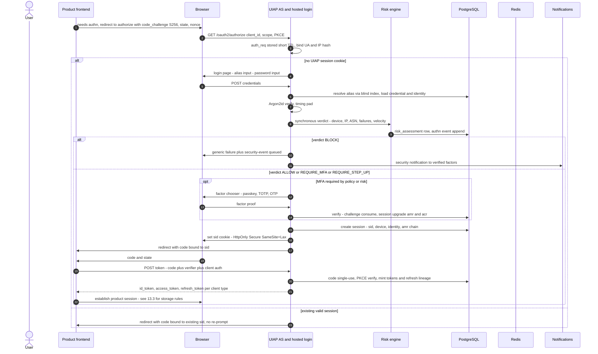

Notes: timing equalization on the alias step (always run a dummy Argon2id verify when alias unknown → uniform latency, anti-enumeration §24.7); account-lookup abuse limited by IP+device+alias blind index composite throttle; failure reasons are server-side-only vocabulary (`bad_password`, `unknown_alias`, `identity_locked`, `factor_required`).

#### F-02 SSO across products (silent)

```mermaid
sequenceDiagram
    autonumber
    participant B as Browser at Product B
    participant PB as Product B backend
    participant AS as UIAP AS
    B->>PB: visit Product B, no product session
    PB->>B: redirect to UIAP authorize with prompt none, id_token_hint optional
    B->>AS: GET authorize, sid cookie travels
    AS->>AS: session valid, acr sufficient, silent consent exists for all requested scopes
    AS-->>PB: redirect with code
    PB->>AS: POST token, client secret or private_key_jwt
    PB-->>B: Product B session established
    Note over B,AS: If prompt=none fails (no session or re-consent needed), AS returns login_required or consent_required; Product B then starts full flow - never auto-loops
```

Cross-domain cookie policy: the `sid` cookie is scoped to the UIAP host only. Products on different registrable domains rely on this browser-session-at-IdP mechanism (standard web SSO). ITP/STP (Safari) resilience: refresh-token-in-cookie pattern for first-party SPAs plus RP-initiated silent re-auth with `prompt=none` kept as the documented fallback; **decision:** we do NOT use third-party tracking pixels or front-channel iframes for SSO (privacy + ITP hostility).

#### F-03 Authorization Code + PKCE (third-party confidential client)

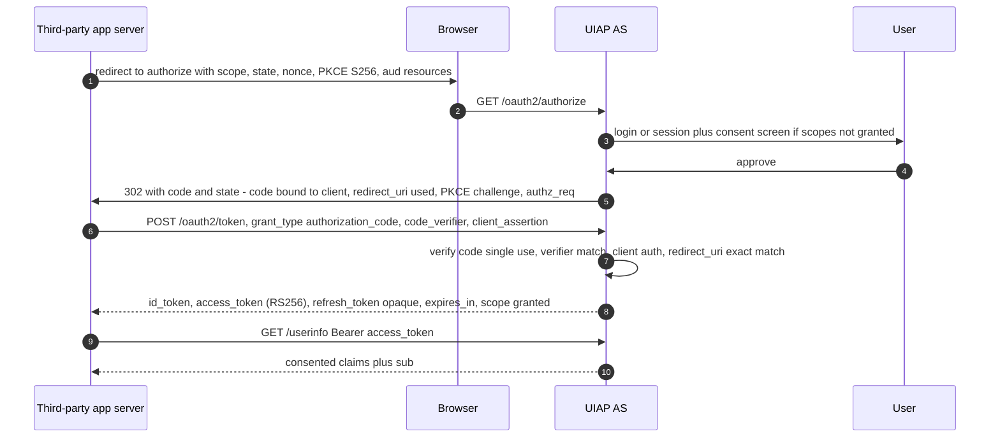

**Security invariants enforced by the AS** (each has a dedicated conformance test, §51.4): state/nonce round-trip; `iss` binding of authorization response (RFC 9207); redirect URI exact match, no prefix, no wildcards; code TTL ≤ 60 s; single-use code via `authorization_code` row lock (double-spend = revoke the whole authz + security event, mix-up defense: code is also bound to the *client_id* that requested it); PKCE mandatory for public clients, recommended-required for all (policy default: all); `nonce` required for id_token flow; token responses carry `Cache-Control: no-store`; `at_hash` in id_token per OIDC Core §3.3.2.1.

#### F-04 Refresh Token Rotation + reuse detection

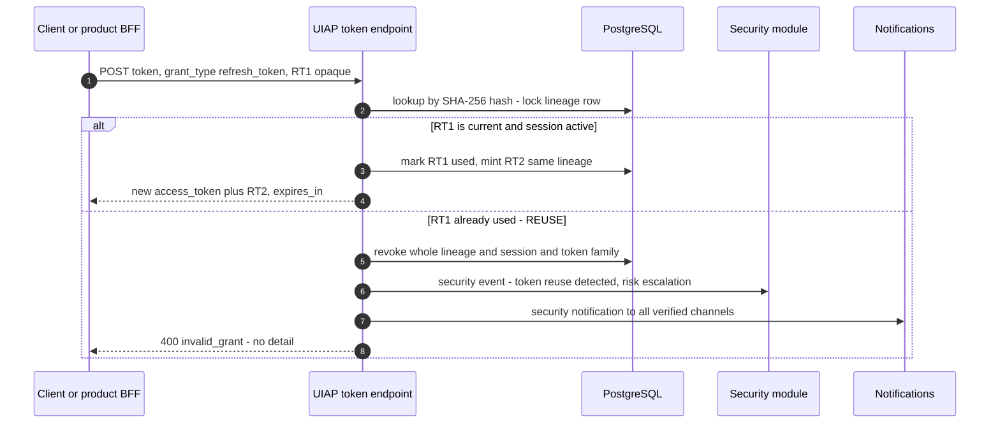

Details (normative): rotation is **always** on for `offline_access` grants. **Decision: no grace window in V1** (Keycloak-style overlap hides the exact reuse race reuse-detection exists to catch; mobile offline queueing is handled by client-specified retry with the *latest persisted* token; ADR-0007; revisit in V2 with telemetry). Reuse of an already-used current token → revoke **all** lineages for the session, session end, device flagged STALE, user notification + forced re-login; if reuse hits an *inactive* (expired) lineage → risk signal only.

#### F-05 MFA login flow with factor selection (detail of F-01 REQUIRE_MFA branch)

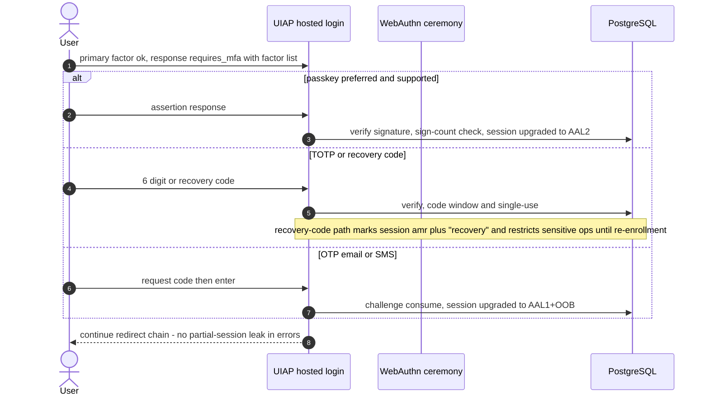

Step-up re-uses the same ceremony machinery with `operation` context bound into the challenge (audience-confusion prevention: challenge row stores `operation_hash`, verification consumes only with matching operation).

### 13.3 Token storage contract for clients (normative to prevent downstream footguns)

| Client | access_token | refresh_token | session/cookie |
|---|---|---|---|
| First-party SPA (same registrable domain) | memory only | httpOnly Secure cookie, path-scoped to `/oauth2/token` + client-bound via `__Host-` prefix — SPA never touches JS | `__Secure-idp_sid` from AS (SameSite=Lax) |
| Mobile native | memory + platform secure storage for offline use window | Keychain / Keystore only; no file fallback; encrypted at rest via OS | no cookies for token refresh; silent renew on app foreground (policy §16.3) |
| Confidential web backend (BFF) | server-side, per-user store with 60 s early-refresh | server-side, rotated in place | product session cookie bound to `sid` claim; **products MUST store `sid`** so they can offer per-session sign-out mirroring |
| Service-to-service | per-execution memory, 5-min TTL | none issued | n/a |

**Decision:** first-party web products SHOULD use the BFF pattern (product backend is the confidential client; the SPA talks only to its own origin). Pure public SPA + cookie-refresh is *supported* (above) but documented as **not recommended for new products** — rationale: token custody, CSRF surface, and CORS complexity stay in one hardened place. This choice is per-application config with `token_delivery: bff|spa_cookie|mobile` recorded in the app registry (§17) and enforced in the authorize endpoint (a `spa_cookie` client MUST NOT request `client_secret`).

### 13.4 Logout

- **Product-local logout:** product drops its session; UIAP session untouched (expected SSO semantics).
- **RP-initiated logout (OIDC RP-Initiated Logout 1.0):** `GET /oauth2/end-session?id_token_hint&post_logout_redirect_uri&state` — exact-match redirect validation, `logout_token` not sent to RP (that's back-channel), client MUST `iss/sub/sid/events` verify when received.
- **Single-device logout:** end that session: revokes sessions' lineages (RTs), sets `sid` status, publishes `session.revoked`, fires Back-Channel Logout to all RPs registered with `backchannel_logout_uri` for that session's clients (logout_token with `sid`), users' other sessions unaffected.
- **Logout-all / "sign out everywhere" (Security Center action, step-up required):** all sessions for identity revoked, all RTs revoked, `session.all_revoked` event, security notification; ATs expire naturally (≤10 min — documented as the **revocation ceiling**, §16.4; admins may force introspection-enforced revocation *for a specific identity* for incident response via kill-switch flag that the platform honors on sensitive endpoints, §44.6).
- **Front-channel logout:** not offered (deprecated direction; cookie deletion timing races). Documented in references.

### 13.5 Email change flow (brief §7 — transactional, diagram-normative)

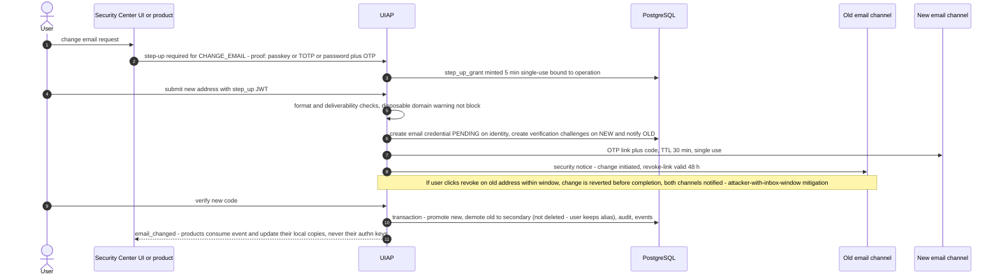

Normative details: attempt limits per challenge (§12.4); cooldown after change: password reset target is the *new* address only after a 24 h settling window for accounts that had no MFA (compromise-window policy — Initial Policy, to be reviewed with product analytics); notifications: new (welcome-verify), old (change notice with recovery instructions); audit: full challenge lifecycle digest + before/after; **the identity id and every `sub` in every product remain unchanged** (that is the point of §11.3).

### 13.6 Phone change flow

Same skeleton with phone-specific deltas (diagram omitted for brevity — differences are normative below):
1. Extra risk inputs: carrier-port/reuse heuristics, higher step-up floor (passkey or TOTP **or** password+email-OTP; SMS-only is *not* sufficient to *change* SMS), and number gets `recycled_at_estimate` on new enrollment.
2. No "revert link" via SMS (reply-to-SMS revert = premium abuse vector): revert window offered through **old email** (if verified) and Security Center; both notified.
3. On completion, sessions bound to the old phone factor are marked `STALE` requiring step-up for next sensitive op (they do not die — availability tradeoff documented).
4. Disposable/VoIP detection is advisory signal to risk (never a hard block — legitimate users in IR often use specific VoIP; Appendix D-5).

### 13.7 Session expiration & renewal

- Idle: `last_activity` updated in Redis (write-behind to PG ≤ 60 s batch; source of truth PG), idle timeout Initial Policy 30 min for password-only sessions, 30 days for passkey/trusted-device sessions (device-trust multiplier), absolute cap 90 days (policy per client type override table in §17.3).
- Renewal = post-authentication risk re-evaluation per **§25.7** on: step-up ops, geo/device discontinuity, policy change affecting session, RT reuse in family. That evaluation uses an immutable snapshot; it MAY silently continue, require re-auth (`prompt=login` equivalent internal), or hard-end the **session** (RTs die). It MUST NOT retroactively invalidate already-issued access tokens inside their TTL (§16.4). User-facing reason appears in Security Center after the fact.
- Session → token coupling: RT issuance requires live session; ending session revokes all its lineages (same transaction); ATs keep running to expiry (INV/§16.4).

### 13.8 Account recovery (diagram) — full flow §27.1, protocol view here

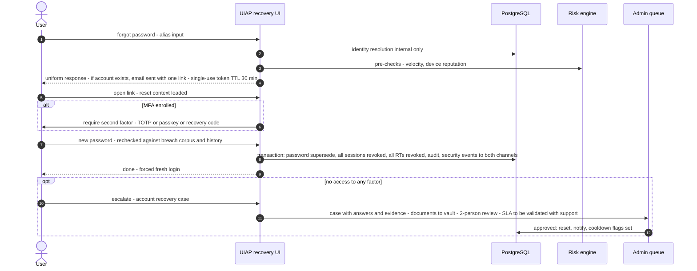

### 13.9 Failure/edge matrix for the critical path (see §46.2 for the full platform matrix)

| Failure | Authn behavior (Decision) |
|---|---|
| Redis unavailable | Sessions still verifiable (DB path), OTP unaffected (PG is truth), throttling falls back to static local ceilings; JWKS unaffected (in-memory); **login must keep working** |
| PG unavailable | Authn endpoints 503 (`Retry-After`); no fake-success; existing short ATs still validate offline at products (they don't call us) → §46.4 contract |
| Email provider down | OTP flows degrade per §30.6 matrix: verification retries with fallback SMS only if both factors verified, security-critical notices queued with escalation alert, never silently dropped |
| SMS gateway down | Same with reverse priority; user-facing copy never reveals provider outages beyond generic "delivery problems" |
| Argon2 pool saturation | Bounded worker queue + shed non-critical verifications (risk enrichment) first; login queue with max-wait then 503 — never skip verification to "keep availability" (§46.5 Decision) |
| Clock skew | NTP watchdog alerts; TOTP tolerance window (§12.6); absolute expiry never shorter than drift allowance; KMS token expiry margin 60 s |
---

## 14. Authorization Architecture

### 14.1 Separation principle

Authentication answers *who + how well proven* (identity module). Authorization answers *may this principal do X to Y* (access module + resource servers). **Decision:** UIAP is the Authorization *Issuer* and *Policy Owner for platform resources*; products are the Authorization *Decision+Enforcement Point for product resources*, consuming scopes/roles that UIAP grants. UIAP never makes business-permission decisions about product content (NG-01); products never re-implement authentication (FR-001/G-01).

### 14.2 The model we ship in V1

**Decision:** three cooperating mechanisms, deliberately chosen and bounded:

| Mechanism | Owner | What it answers | V1 status |
|---|---|---|---|
| **Scope-based access (OAuth2)** | UIAP | "Does this token (client + user consent) entitle this API call?" — coarse, contract-level. Enforced at API boundary by scope-claim check per endpoint. | Core |
| **RBAC (roles → permissions)** | UIAP for platform/admin surface; org for enterprise (V2+) | "May this *identity* perform this *platform action*?" (admin roles §44, service scopes §32). Org-scoped roles: tables provisioned, enforcement only for admin. | Admin plane; org schema-only |
| **Resource-level checks** | Products (and `/v1/me` self-checks) | "Is this specific object this user's?" — enforced by owner-scoped queries (`/v1/me/*` pattern eliminates this entire class by construction, §33.2) and product-side checks. | Contract-level, not centralized |

**ABAC: deferred (V3, ADR-0029).** The evaluation matrix: attribute rules engine adds a policy-DSL + audit-replay burden disproportionate to V1's actual variation in resource attributes. The seams are pre-cut: (1) every scope is catalog-driven (`ScopeDefinition` §10.3) so conditional scopes can be added; (2) `SecurityPolicy` rule rows already model ordered, versioned, context-matched rules — ABAC becomes "another policy domain," not a new subsystem; (3) claims pipeline (`ScopeClaimMap`) already lets resource servers do their own attribute checks. **Alternative considered:** adopt a general policy engine (OPA/Cedar) day one — rejected: dual source of truth with the token/scope plane, operational complexity, and V1's decisions are all expressible as (scope ∈ token ∧ role ∈ assignment ∧ step-up ≥ level ∧ consent ∧ policy-rules) which is a 4-line predicate, not a language.

### 14.3 Scope catalog (V1)

| Scope | Claims/resources exposed | Consent | Notes |
|---|---|---|---|
| `openid` | `sub` | implicit-required | OIDC core |
| `profile` | name, given_name, family_name, preferred_username?, picture, profile URL fields, gender? **NO** (not collected), birthdate (only w/ `birthdate` explicit opt-in), locale, zoneinfo, updated_at | yes | default-claim set kept minimal |
| `email` | email, email_verified (served only post-consent) | yes | |
| `phone` | phone_number (E.164), phone_number_verified | yes | higher risk tier — consent screen gets extra warning line |
| `address` | structured postal address (OIDC `address` claim) | yes | only default/current unless `address:read_purpose:billing` style sub-scope? — decision: `address.read` full, with purpose as query param, sub-scopes V2 |
| `professional_profile` | §19 view set | yes | |
| `social_profiles` | §21 list | yes | |
| `offline_access` | refresh tokens | yes | consent text explicitly says "can keep sessions alive for up to N days" |
| `uiap:me` | full self-access to own APIs (only valid in first-party clients) | n/a (login-scoped) | |
| `audit:read` / admin scopes `admin:identities.read/write …` | admin plane | no (role-based) | token requires role assignment; never consentable by users |

`scope` grammar: colon-named custom namespaces reserved to the platform (`uiap:`), product-namespaced scopes are minted in the registry with owner approval (V2: self-service request flow).

### 14.4 What products MUST enforce (contract, normative)

1. `iss` exact match, `aud` contains the product's API identifier, `azp`/`client_id` is an expected client, `exp/iat/nbf` with ≤ 60 s clock skew, signature via JWKS by `kid` **only** with the pinned algorithm(s) from discovery (no header-driven selection), `typ`/`cty` checks (JWT vs JWE confusion defense), and `scope` sufficient for the route.
2. On `sid`-bound sensitive ops: introspection or the platform revocation-feed (products MAY subscribe to `session.revoked`/`token.lineage_revoked` events and maintain a short-lived revocation cache — this is the documented mechanism that shrinks the 10-min AT window practically to < 60 s for subscribed RPs; §16.4).
3. Step-up: products call `/v1/security/step-up` and honor `step_up_required` semantics; UIAP does not accept "product says it checked" — the step-up token is verified by UIAP itself when the operation touches UIAP resources; products requiring step-up for *their* resources use `amr`/`acr`/`auth_time` claims in our tokens.

**Decision:** products MUST NOT store identity-privileged data keyed by email; local joins are `sub`-keyed with a `local_account_link(sub, product_user_id)` table they own (onboarding checklist item, §60).

### 14.5 Role/permission model (platform)

`role(id, name, scope: PLATFORM|ORG, parent_role?)` → `role_permission(role, permission(resource_type, action))`; `assignment(subject_identity, role, org?)`; evaluation order: explicit deny > explicit grant > role grant > default deny. **Decision:** no attribute inheritance from orgs for V1 admin plane (flat explicit). Roles are versioned catalog rows; permission additions are additive; removals require a §33.8 deprecation cycle with active-assignment migration report.

---

## 15. OAuth 2.0 / OpenID Connect

### 15.1 Endpoints (public, unversioned — protocol surface is versioned by metadata, not path)

| Endpoint | Path | Spec |
|---|---|---|
| Discovery | `/.well-known/openid-configuration` | OIDC Discovery 1.0 (+ RFC 8414 AS metadata alias) |
| JWKS | `/oauth2/jwks` | RFC 7517; `Cache-Control: public, max-age=86400`, edge-cacheable |
| Authorize | `/oauth2/authorize` | RFC 6749 §4.1 |
| Token | `/oauth2/token` | RFC 6749 §5 |
| UserInfo | `/userinfo` | OIDC Core §5 |
| Introspection | `/oauth2/introspect` | RFC 7662 — confidential clients only, `aud`-restricted: a client MAY introspect only tokens the **AS issued to that client** (`client_id`/`azp` match) or tokens whose `aud` is that client's resource identifier. Clients never issue tokens. |
| Revocation | `/oauth2/revoke` | RFC 7009 |
| Pushed Authorization Requests | `/oauth2/par` | RFC 9126 — **V2**, required for large third-party clients / signed requests path |
| JWT-Secured Authz Requests | accepts `request`/`request_uri=direct` | RFC 9101 — V2 for high-trust partners |
| Device flow | `/oauth2/device_authorization` | RFC 8628 — V2 (TV/kiosk/CLI); endpoints reserved in discovery (policy: advertise only when enabled) |
| Token exchange | `/oauth2/token grant_type=urn:ietf:params:oauth:grant-type:token-exchange` | RFC 8693 — V3 (delegation, service-identity on-behalf-of) |
| End-session | `/oauth2/end-session` | OIDC RP-Initiated Logout 1.0 |
| Back-Channel Logout | (outbound) `backchannel_logout_uri` per client | OIDC Back-Channel Logout 1.0 |
| Dynamic Client Registration | not exposed (internal registration API + §17 registry) | deliberate security posture; RFC 7591 evaluated for V4 partner self-onboarding |

### 15.2 Grants & response types (Decision table)

| Item | Supported | Notes |
|---|---|---|
| `grant_type=authorization_code` | ✅ primary | all client types; PKCE S256 |
| `grant_type=refresh_token` | ✅ | rotation always-on (§16.3) |
| `grant_type=client_credentials` | ✅ service identities only (§32); products MAY request it for app-token use cases with `aud` | |
| `grant_type=urn:…:token-exchange` | V3 | |
| `urn:ietf:params:oauth:grant-type:device_code` | V2 | |
| implicit (`response_type=token`, `id_token token`) | ❌ forbidden (§6.6) | |
| ROPC (`grant_type=password`) | ❌ forbidden | |
| `password`-for-legacy-migration endpoint | internal, admin-gated bulk import — not an OAuth grant | migration tooling, §60 |
| `response_type=code`, `code id_token` (hybrid) | ✅ / `code id_token` only for confidential clients with `private_key_jwt` + signed request object; never for PUBLIC clients. **PKCE S256 remains mandatory** (ADR-0003): JAR/request-object integrity is orthogonal to code-interception defense (RFC 9700). Hybrid otherwise discouraged. V1 PUBLIC clients: `code` only | |
| `response_mode=form_post` | ❌ | query only (plus `fragment` for none currently) |
| `response_mode=query|fragment` | ✅ per client type | |
| JWT Secured Authorization Response Mode (JAR responses) | V3 partner feature | |

### 15.3 Client authentication methods

| Method | Who | Policy |
|---|---|---|
| `none` + mandatory PKCE | PUBLIC clients: SPA, native | plus `token_endpoint_auth_method=none`, refresh rotation, and device binding DPoP (V2) |
| `private_key_jwt` | CONFIDENTIAL: all server-side first-party products + partners | **recommended default**; assertion `aud=AS issuer`, `exp≤120 s`, `jti` replay cache (§10.3) |
| `client_secret_basic` | legacy | allowed only for apps registered before 2026 (migration backlog tracked per app); secrets are ≥ 256-bit, hashed with Argon2id at rest (verifiable but non-reversible — **Decision: hash, not encrypt**, §17.5); forced rotation 365 d max |
| `tls_client_auth` (mTLS) | V3 | RFC 8705, workload path (§32) |
| `client_secret_post` | ❌ not supported | |

### 15.4 Redirect URI validation (Decision)

Exact string match against registered set (scheme+host+path, RFC 3986 normalization only for empty-path forms). `localhost`/loopback special rule permitted **only** for native app-type clients, any port, path fixed (OAuth for Native Apps best practice, RFC 8252 §7.3); claimed-https (custom scheme + associated domain, iOS `com.googleusercontent.apps` etc.) supported for native; `postmessage`, wildcards, prefix-match: rejected at registration by schema + at runtime by exact lookup (constant-time set membership via indexed hash, timing-equalized failure). `post_logout_redirect_uris` separately registered, same rules. Redirect URI changes: 4-eyes for production clients; `application.updated` event + security notification to *client owners* (§17.7).

### 15.5 State, Nonce

State is an RP responsibility; the spec mandates it, and UIAP's reference integrations generate + verify it (documented snippet-level requirement for every onboarding). UIAP validates its own internal `auth_req_id` correlation. `nonce` required for public clients and hybrid; echoed into `id_token` and bound to `at_hash`/`c_hash` per OIDC Core; `auth_time` always present in id_token.

### 15.6 Issuer, audiences

`iss = https://id.<portfolio-domain>` (final value = OQ-01; **changing issuer later is a breaking change for every client — decision must precede first production client**). Token `aud`: first-party product API identifier (`https://api.producta.<domain>` — registered per application) **plus** `https://id.…/userinfo` when `uiap:me` is requested. `azp` = client_id. Resource Indicators (RFC 8707): V1 reserved — products request `aud` via registered mapping; `resource=` parameter support V2 (needed for the service-to-service exchange story).

### 15.7 Scopes, claims, tokens (summary — full tables §16)

ID token claims: `iss sub aud exp iat auth_time nonce at_hash c_hash acr amr azp` + consented profile claims; `sid` optional per client config (privacy default: `sid` only with `offline_access` or BFF first-party — `prompt`-less silent logout requires it, so BFF clients get it by default).
Access token claims: `iss sub aud exp iat jti client_id scope sid amr acr cnf(jkt, V2 DPoP)`. **No profile PII in the access token** (INV-07). Profile always via userinfo (single revocation-consistent source, cacheable 60 s client-side per §35). `uiap:me` authorizes API calls; it does not put email/phone/name into the JWT.
UserInfo response: `sub` + consented claims + `updated_at` (client cache-invalidation hook).

`acr` values (urn namespace): `urn:uiap:acr:pwd`, `pwd+2fa`, `pwd+2fa-sms`, `phishing-resistant` (passkey/security-key), `otp-email`, `otp-sms`, `svc-m2m`, plus `loa` extension claim `ial` (§11.8). `amr` values: `pwd, otp, sms, sc (passkey/fido2), hwk, face, geo? (no), rca` (recovery-code authenticated → session restricted). Requesting parties can pin with `acr_values` + `claims={"id_token":{"acr":{"values":[…],"essential":true}}}`; UIAP treats unmeetable essential as `login_required`-class failure (no silent downgrade).

### 15.8 Key rotation (see §41.3 for custody; protocol view)

JWKS exposes `CURRENT + NEXT (pre-active) + PREVIOUS`; `use: sig` only; clients instructed to cache 24 h and handle unknown `kid` with one refresh (max 1/5min rate per IP; edge shielded). Rotation: create NEXT (pre-announce ≥ 24 h = max client cache TTL + margin) → promote NEXT→CURRENT (all new tokens) → CURRENT→PREVIOUS (kept until `max_token_lifetime + 7 d` grace = 97 d for RT? RT is opaque → only AT/id_token/logout classes matter: AT ≤ 60 min, id_token ≤ 1 h → retention of PREVIOUS = 7 d Initial Policy covering clock-skewed long-lived artifacts) → RETIRED (removed from JWKS, private handle destroyed). Emergency revocation: remove kid from JWKS + `jwks_emergency` claim set… **decision: emergency path = flip short-lived `force_introspection` for affected audiences + publish `keys.revoked` event** (products honoring only JWKS will see 401s — documented blast radius, runbook §48.5).

### 15.9 OIDC Provider conformance & profile decisions

**Decision:** target certification against the OpenID Foundation OP certification suite for the profile(s) each product uses: `Basic OP`, `Config OP`, `Dynamic (skipped — no DCR)`, `Form Post (skipped)`, `Implicit (skipped)`, `Hybrid (opt-in clients only)`; plus `Provider Configurations`: Standard (30-day) and Private (`private_key_jwt`). **Federation profile** V4 with SAML IdP bridge. V1 discovery: `subject_types_supported: [public]`. Pairwise is **not advertised until V2** (schema seam exists; advertising pairwise without implementing it fails conformance). `display: page|popup` (popup for step-up re-auth V2), `ui_locales`, `claims_locales` supported (§53). `request_object_signing_alg_values_supported`: `RS256, ES256` (V2 enable). `id_token_signing_alg_values_supported`: `RS256` (EdDSA/ES256 when conformance libraries confirm parity, ADR-0006). `token_endpoint_auth_signing_alg_values_supported`: `RS256, PS256, ES256`. `scopes_supported`, `response_modes_supported` published in discovery — single source = registry rows (§10.3), so behavior cannot drift from metadata (CI test asserts discovery vs DB).

### 15.10 Mix-up / substitution / downgrade protections (normative checklist, each = test)

code bound to (client_id, redirect_uri, auth_req); id_token `iss`/`aud`/`nonce` verified; `at_hash` verified by clients (spec requirement in onboarding + SDK); `state` required in reference clients; AS refuses `redirect_uri` mismatched from auth_req even if registered; token responses contain `iss` (draft-ietf-oauth-response-iss — V1: ship it, clients that ignore it are unaffected); PAR (V2) for the canonical fix of mix-up in large partner flows; `jkt`/DPoP (V2) for token substitution between clients of the same product family — listed in §60.

---

## 16. Token Architecture

### 16.1 Overview

Three token kinds + two derived artifacts (logout_token, step-up token). **Decision:** asymmetric signing (RS256) for all JWTs; no symmetric client-shared JWTs ever (HS256 forbidden — key-distribution risk). Access tokens signed by the platform key; *product-internal* tokens are not UIAP's business.

### 16.2 Access token (JWT)

| Property | Value (Initial Target unless policy) |
|---|---|
| Format | Compact JWS, base64url JSON claims |
| Algorithm | RS256, `kid` header, pinned per §15.9 |
| Lifetime | **10 min** default; 5 min for `admin:*` and any HIGH/Critical-risk session; per-client override allowed in `[5, 60]` min with security sign-off; 60 min max absolute (brief forbids "long-lived" — the ceiling is the definition) |
| Claims | `iss sub aud exp iat nbf jti scope client_id azp sid amr acr cnf? typ?` — `cnf.jkt` only for DPoP clients (V2). `nbf` optional; `iat` always |
| Audience | Product API identifiers (RFC 9068 style claim conventions adopted for our own RS's: `azp`+`client_id`+`scope`, `jti` unique per issuance with 400 d revocation-record retention for forensics) |
| Encryption | none (integrity via signature; contents non-secret by design INV-07) |
| Storage (server) | No per-AT rows in normal operation. `jti`-keyed revocation *flags* written only when targeted kill-switch applies (incident mode, §44.6) — bounded by design: flags expire with token expiry + 7 d |
| Replay protection | TTL + `aud`/`azp` binding; HTTPS-only; DPoP (V2) for high-privilege clients; sender constraints for admin plane in V3 (mTLS) |
| Renewal | client refreshes at ≤ 60 s before expiry (reference clients), no early-expiry surprises |
| Revocation | session-bound: RT revocation ⇒ next refresh fails; within the AT's 10 min it self-expires — the *documented* residual window (§16.4); kill-switch for identity-scoped immediate-effect on sensitive endpoints via introspection/revocation feed |
| Introspection semantics (RFC 7662) | returns `active, scope, client_id, sub, exp, iat, jti, token_type=at+jwt, sid, amr, acr` (no username field — `sub` is the subject handle); confidential+`aud`-restricted callers; **MUST set `Cache-Control: no-store`**; per-client per-token introspection response cacheable by caller ≤ 60 s (advertised in discovery `introspection_endpoint`, recommended in integration doc) |

### 16.3 ID token & refresh token

**ID token:** JWT RS256, lifetime 1 h (not long-lived by policy — it is only presented once at exchange; clients MUST NOT use it for anything but authentication context + `logout` hint), claims §15.7, `nonce` echo, `at_hash`, `c_hash` (hybrid only), issued only to authenticated sessions; never introspectable (it's not a bearer credential — discovery metadata + docs say `id_token` is not an access credential; enforced: token endpoint does not accept id_tokens anywhere).

**Refresh token:**
| Property | Decision |
|---|---|
| Format | Opaque `rt_<256-bit base62>` + companion hash — raw never stored (SHA-256 lookup key) |
| Storage | PG `refresh_tokens` in lineage families (§10.3) |
| Lifetime | sliding idle 30 d **and** absolute 90 d (per lineage) — policy table per client type in §17.3; `offline_access` scope prerequisite; mobile apps may get 180 d idle for trusted passkey sessions (Initial Policy) |
| Rotation | always (§16.3/F-04), no grace (Decision + revisit note) |
| Reuse detection | hash-lookup on used/expired → revoke lineage + session + device STALE flag + security event + notifications (F-04) |
| Binding | client_id + session + (V2 DPoP `cnf`) — cross-client RT presentation = `invalid_grant` + security event (the "confused deputy" test in §51.4) |
| Revocation paths | end-session, credential change (§13.5 policy matrix), consent revoke (§26.4), admin action, risk decision, device revoke, identity suspend |
| Storage on client | §13.3 table |
| Revocation record retention | RT hash rows kept 14 d post-death for reuse forensics (bounded, §39) |

### 16.4 The revocation-lag contract (the honest number)

**Decision:** self-contained ATs are a deliberate trade; the platform documents worst-case stale-access windows: normal case = AT expiry (≤ 10 min); subscribed-to-revocation-feed case < 60 s (§14.4); kill-switch case = next introspection-enforced call for sensitive endpoints. This is the **contract products opt into** when they choose `token_delivery` + `offline_access` — onboarding checklist requires product sign-off on which case applies to which endpoint class (their choice; defaults for sensitive product APIs: introspect-on-use). Alternative considered and rejected: encrypted self-contained AT (JWE) with server-side revocation list embedded — rejected: complexity + still a TTL. Alternative rejected: fully-introspection-only — rejected: NFR-005 throughput + products offline tolerance (G-11).

### 16.5 Step-up token (platform-internal security token)

JWT compact JWS (proof the user presented to the API) **plus** a PostgreSQL `step_up_grants` row (consume ledger). The JWT is not self-authorizing: the protected endpoint MUST consume the grant row as specified below. Claims: `identity_id, sid, op_binding=sha256(operation|object-version|challenge_ctx), amr_achieved[], jti`. `aud=https://id…/stepup`, `exp=5 min`, alg RS256. Its existence lets `/v1/me/security/**` APIs accept "user just re-authenticated" without weakening "session fresh enough" semantics elsewhere — the alternative (relying solely on `auth_time`) was rejected because it allows reuse of a single fresh login for many different sensitive operations within the window — exactly the ATO pattern in §42 T-08.

#### Binding

The step-up token is bound to:

| Attribute | Bound? | Rationale |
|---|---|---|
| Identity (`identity_id`) | YES | Token must match the authenticated identity |
| Session (`sid`) | YES | Token is session-scoped; ending the session invalidates the token |
| Operation (`op_binding`) | YES | Prevents cross-operation reuse: `change_email` must not authorize `disable_mfa` |
| Authentication assurance (`amr_achieved[]`) | YES | Records which factors satisfied the step-up; policy layer verifies sufficiency |
| Expiration (`exp`) | YES | 5 min maximum lifetime; short window limits exposure |
| Application / Client | NO | Step-up is platform-internal; products do not hold step-up tokens |
| Device | NO | Step-up rides the session; session is already device-bound (§23.1) |

#### Operation binding

`op_binding = SHA256(operation_name | object_version | challenge_context)` where:
- `operation_name`: the specific operation being authorized (e.g., `change_email`, `disable_mfa`, `delete_account`)
- `object_version`: version of the target resource (for optimistic concurrency, prevents stale-operation step-up)
- `challenge_context`: additional context specific to the operation (e.g., new email address hash)

This binding ensures a step-up performed for `change_email` does NOT authorize `disable_mfa` or `delete_account`. Each operation defines its own `operation_name` in the endpoint specification. V1 uses **exact purpose binding** (not purpose family or generic assurance), because the operations protected by step-up have vastly different risk profiles and should not share step-up tokens.

#### Consumption (atomic, PG-first)

The protected endpoint MUST consume the step-up token using this order:

```text
1. PostgreSQL atomic consume (authoritative)
   UPDATE step_up_grants
   SET status = 'CONSUMED', consumed_at = now()
   WHERE jti = $jti
     AND status = 'ISSUED'
     AND expires_at > now()
     AND identity_id = $identity_id
     AND sid = $session_id
     AND op_binding = $op_binding
   RETURNING id;

   → 0 rows returned: replay detected or token invalid/expired → 403
   → 1 row returned: consumed successfully → proceed with operation

2. Redis cleanup (best-effort, cache consistency)
   DEL stepup:$jti

   → Redis failure: no security impact; PG already consumed
   → Next request: Redis miss → PG check → status=CONSUMED → replay blocked
```

**Why PG-first:** PostgreSQL is the authoritative store for step-up grants. Consuming in PG first ensures that concurrent requests find `status=CONSUMED` and are blocked, regardless of Redis state. Redis is a read-acceleration cache; its failure MUST NOT create a security bypass.

#### State transitions (mutually exclusive)

```text
ISSUED → CONSUMED   (successful verify: exactly one UPDATE returns 1 row)
ISSUED → EXPIRED    (sweep job: now() > expires_at)
ISSUED → REVOKED    (admin or session revocation: UPDATE SET status = 'REVOKED')
```

#### Replay protection

| Scenario | Behavior | Deterministic? |
|---|---|---|
| Two concurrent requests with same step-up proof | First PG UPDATE returns 1 row (CONSUMED); second returns 0 rows (403 + session lock) | YES — PG atomic UPDATE guarantees exactly one winner |
| Same proof replayed after consumption | PG shows status=CONSUMED → 403 + session step-up lock for 15 min (policy) | YES |
| Proof expired | PG WHERE `expires_at > now()` fails → 403 | YES |
| Proof for wrong operation | PG WHERE `op_binding = $op_binding` fails → 403 | YES |
| Proof for wrong session | PG WHERE `sid = $session_id` fails → 403 | YES |

#### Failure behavior

| Failure | Step-Up behavior (Decision) |
|---|---|
| **PostgreSQL available, Redis unavailable** | Step-up continues to work. PG is authoritative. Redis DEL is skipped (best-effort cache cleanup). Next request: Redis miss → PG check → consumed. **No security impact.** |
| **PostgreSQL unavailable, Redis available** | Step-up **fails** (R1 — fail closed on authentication/authorization operations). 503 returned. The protected operation is denied. **Redis failure MUST NOT create a security bypass.** |
| **Both unavailable** | Step-up fails. 503 returned. Operation denied. |

#### Audit

Successful step-up consumption: appended to `authn_events` (same transaction as PG consume). Failed step-up consumption (replay detected): appended to `security_events` with `step_up_replay_detected` key + session step-up lock applied.

### 16.6 Token issuance bookkeeping

Mints write: `authorization_codes`, session update (`last_used_at`), RT lineage rows, audit (only for consent changes and revocations; per-mint audit would flood the store — Rationale: issuance facts are *AuthenticationEvents* (R-23) and counters; integrity is provable from lineage + anchors, and full per-token history is not retained anywhere, including logs — PII-by-volume avoidance).
---

## 17. Application Architecture (products as clients)

### 17.1 Concept

**Decision:** every product = exactly one `Application` (registry row) + one `OAuthClientConfig`. "Product A" and its mobile app can be two clients (public + confidential) under one application. Partners = applications with restricted scope catalogs. Internal automation = service identities (§32), *not* applications (different trust, lifecycle, and audit semantics).

### 17.2 Application record (fields with purpose)

```
Application
  id (uuidv7)                      # internal
  slug                             # uiap-internal handle, e.g. "emp"
  display_name_i18n, logo_url, favicon, theme {colors, rtl assets}, home_url, support_contact(s)
  owner_team, owner_email(s), security_contact      # rotation/expire notifications go here
  environments: {dev, stage, prod} each with its own client(s) - ONE app, per-env clients
  status: DRAFT|ACTIVE|SUSPENDED|RETIRED
  consent_profile: {purpose_text_i18n, privacy_policy_url, tos_url, policy_version}   # §26.2
  app_type: web|native|both|partner|automation
  data_handling: {shared_subject: bool, allowed_scope_ceiling: [...], webhook_url, webhook_hmac_key_ref, event_types: [...]}
  security_policy_overrides: {mfa_required_for: [...], at_ttl, rt_idle_days (within platform bounds), dpop: bool (V2), ip_allowlist: []}
  registration_state per env: {redirect_uris, post_logout_uris, grant_types, response_types, auth_method, client_secret_ref / jwks}
```

### 17.3 Policies with platform bounds

Token policy overrides are *validated against platform ceilings* (config-as-contract): `at_ttl ∈ [5,60] min` (ceiling per §16.2), `rt_idle ∈ [7,180] d`, `session_absolute ≤ 180 d`, step-up requirements can only be *raised* by app policy, never lowered. Grant allowlist defaults: web confidential: `authorization_code, refresh_token` (never `client_credentials` for user-facing flows); SPA: `authorization_code, refresh_token`; native: same; partner: same minus consent-exempt scopes. `response_types` per §15.2 rules.

### 17.4 Multi-application isolation (brief §14)

```
                     Identity (one per person)
                            |
        sub (shared for first-party)  + aud scoped per product
   +--------+--------+--------+--------+
   |        |        |        |        |
 ProductA  ProductB  ProductC  EMP  Kheradsara  Future...
   | (only: OIDC tokens + /v1 APIs + subscribed events)
```

Enforcement stack (all mandatory): (1) **Network/data:** no DB exposure beyond the platform (C-01; products never get credentials to PG — zero exceptions, including analysts; reporting goes through event feeds/exports, §45.5); (2) **Audience:** AT `aud` binding + `azp` (INV-15) means Product B cannot call Product A's APIs with a Product-A-issued token even if both trust the same IdP; (3) **Scope:** each app's allowed scope ceiling registered per app; consent is per (identity, app); (4) **Events:** per-subscription event filtering — apps receive only events relevant to identities they hold consent for the referenced data classes… **Decision:** *platform* events (`identity.*`, `credential.*`, `session.*`) are delivered to first-party products with a *minimal payload* (ids + status + timestamps only); *data* events (`profile.updated`, `address.added`) are delivered only to apps with the matching read scope grant for that identity, and consumers re-validate at fetch time (event = cache-nudge, not source of truth — documented "nudge vs truth" contract, §29.7); (5) **Claim custody:** UIAP never pushes claims to products outside userinfo/tokens (no "profile sync daemon" to product DBs — products pull/push within scopes).

### 17.5 Client secrets & credentials handling

Secrets ≥ 256-bit, generated by platform, shown once at creation; stored Argon2id-hashed (§15.3) with `secret_hint_prefix` for UX display; overlap rotation: `rotate` creates secret2 with grace ≤ 24 h both valid (deployment safety), secret1 dies by clock — **never** "extend forever"; secret exposure runbook: rotate + revoke all tokens of that client + notify (product owners + platform security). `private_key_jwt`: client JWKS registered (public keys; rotation self-service with 4-eyes for prod apps). JAR signing key same. All secret-bearing config lives in KMS/Vault per product's own custody decision — UIAP stores only hashes/public material. **Decision:** first-party products MUST use `private_key_jwt` by their first year on platform (onboarding plan deadline) — symmetric secrets are a legacy bridge.

### 17.6 Application lifecycle & governance

Self-service registration for dev/stage; production activation requires approval by platform-security (redirect URIs + scopes + contacts + consent texts reviewed; SLA 2 business days Initial Target); annual attestation: owner re-confirms scope ceiling, contacts, event usage (auto-expiry policy after 90 d unanswered → SUSPENDED (authn continues for existing tokens? No — suspension of *registration* means new consents stop; sessions continue) — **Decision:** dormant app policy = new consents blocked, existing refreshed tokens allowed until owner response, security reviews notified); `RETIRED` revokes all tokens for the client (auditing that transition is the audit event), deletes redirect URIs, keeps consent history (proof), publishes `application.retired`; product sunset runbook exists in §60 V2 doc-set.

### 17.7 Branding & UX contract

Theme + locales (+ RTL logo spacing) drive hosted pages (login/consent/step-up/recovery). Hosted page capabilities per app: allowed `ui_locales`, `display=page|popup`, passwordless-primary flag, "skip consent for first-party" (Decision: first-party with `uiap:me` and standard profile/email/phone scopes get the *auto-consent with disclosure* UX — a "signed in as X, sharing Y" screen, one-click continue — not a silent bypass; privacy stance is explicit consent, UX is friction-light. Third-party: always full consent screen.)

---

## 18. Profile Architecture

### 18.1 Separation

Profile is a **separate aggregate** (context `profile`, §9) linked 1↔1 to human identity; nothing in `identity` stores display data; deleting a profile does not delete an identity; products consume profile *through scopes*, never through identity lookups. Rationale: different visibility semantics, different change velocity, different compliance handling (PII concentration), and (practically) profile is the first extraction candidate to serve high read volume.

### 18.2 Views

| View | Audience | Contents |
|---|---|---|
| Self | identity owner (Security Center, product UIs) | everything, incl. masked factors, visibility settings, connected apps |
| Basic | anyone the user exposes (PUBLIC fields) via partner products with `profile` scope | display_name, avatar, headline, bio, pronouns, locale — never birthdate/email/phone (those need their own scopes) |
| Private | owner + admin-with-step-up (§44.3) | all profile + contacts + addresses summary |
| Professional | consumers with `professional_profile` scope or public professional card (§19.4) | per visibility |

### 18.3 Storage & extensibility (Decision)

Core fields = typed columns (given_name, family_name, display_name, avatar_object_key, birthdate, timezone, locale, pronouns, website, biography, headline). **Everything else** = `ProfileExtension` rows (namespace, key, value JSONB + validated against `profile_field_registry` which carries type, cardinality, validation rule, visibility default, sensitive flag, required-scope-for-app-write). This gives schema evolution without migrations (registry-driven validation) while keeping hot fields indexable; we explicitly reject pure-JSONB blobs (no constraints, no query safety) *and* per-feature-migrations (V1 velocity) — the registry pattern is the middle that is still 3rd-normal-form for queries we actually have (§20, §21 have their own domains; extensions are for profile-scoped attributes like `custom.fields.employer_industry`). **Invariant:** a claim a product depends on must be promoted to registry-with-scope contract (an "extension with a contract"), tracked in the catalog; ephemeral metadata never silently becomes load-bearing (enforced by catalog review at onboarding).

### 18.4 Field-level visibility & consent interplay

Per-field `visibility ∈ {PRIVATE, LINKED_APPS, ORG, PUBLIC}` (audience tiers per brief §15: Basic/Public/Private/Professional map to field sets + visibility, not to separate tables). Products with `profile` scope receive fields whose visibility allows app consumption ∩ scope granted (intersection rule, §26.3); a field marked PUBLIC with no scope grant is *not* in userinfo (consent scopes the *pipe*; visibility scopes the *water*).

### 18.5 Avatar & media

Object storage (regional) + `avatar_object_key`; rendering pipeline (resize/thumbnail/AVIF-WebP) is an implementation service, not core domain (flagged to avoid over-engineering the domain); EXIF/geotag stripped on ingest (privacy default, Decision: always); NSFW/abuse moderation hooks (V2, external moderation adapter — platform never claims moderation correctness); signed URLs TTL ≤ 60 s (Initial Target) via product-facing redirect (`/v1/media/{token}`), no long-lived public URLs of user images.

### 18.6 Writes, sources, conflict rules

Write sources: (1) user self (any endpoint under `/v1/me/**`); (2) *product with `profile.write` scope + user consent* (rare, e.g., EMP importing job data) — writes are recorded with `source_client_id`, audited, and **field-level conflict policy: last-write-wins per field with full history in `profile_field_events` (append, 400 d)**; user-visible "who changed this field" in Security Center (accountability > cleverness — Decision). No CRDT/merge engine (over-engineering for this domain — documented rejection).

### 18.7 Export/copy semantics for products

Products keep *caches* of consented profile fields to render locally; on `consent.revoked` events they MUST stop serving those fields to others and (contract) delete caches ≤ 30 d (DPA text template ships with platform, §52.4); on `profile.updated` they re-fetch (nudge, §29.7). UIAP does not build product-side denormalization (line drawn: we own source of truth + change feed, not product schemas).
---

## 19. Professional Identity

### 19.1 Concept

`ProfessionalProfile` hangs off the Profile (§10.4) and is *portfolio-reusable*: EMP (job platform), Kheradsara (reputation/trust signals), future professional products read the same rows through the `professional_profile` scope — the anti-duplication core of the "one identity spine" vision (G-03).

Sub-entities (all temporal, append-on-edit, per §10.4): experience, education, certifications, skills, languages, portfolio items. `headline`, `occupation` (from `occupation_taxonomy` registry — ISCO-aligned initial catalog (to be validated as fit; registry is swappable, no hard dependency), `job_title`, `company` (text V1 + `org_ref → Organization` optional link enriched in V2 when org entity has data), `industry` (registry), `website`.

### 19.2 Ownership & visibility

Identity owns all rows; visibility is per-entity-type (e.g., email never professional-visible; certifications `SELF|LINKED_APPS|PUBLIC`). Org-scoped visibility (`ORG`) reserved for V2 org memberships. Products with the scope receive the *consented* view; products cannot write professional rows except through `professional_profile.write`-class scopes (registry-controlled) and writes follow §18.6 provenance rules (an employer claiming "verified employment" attaches a *verification* record, not an edit of the user's row — **Decision:** employer assertions are a separate `assertion` ledger (V2), the user's self-reported rows are never silently overwritten by third parties; a LinkedIn-style "claimed profile" problem is designed out early).

### 19.3 Verification posture

Experience entries are self-attested by default. Verification levels: `NONE / ASSERTED (employer signed statement) / DOCUMENT_VERIFIED (admin/IAL2 process)`. Assertion keys are org JWKS (V2 with org registration); verification artifacts land in the evidence vault (§11.8), never in the public profile payload (only the boolean/level + issuer + date).

### 19.4 The "public professional card"

V1 supports one shareable representation: `GET /v1/public-card/{identity_id}?lang=fa` → rendered by products or (V2) UIAP static render with signed short-TTL share links (no unbounded public SEO pages from UIAP in V1 — crawler/PII posture is a product decision, not an identity decision; documented boundary). Rate-limited, consent-gated (`LINKED_APPS/PUBLIC` fields only), watermarkable (V2, abuse tracing).

---

## 20. Address Architecture

### 20.1 Why an independent domain (brief §17)

Addresses are: multi-purpose per person, versioned history (billing disputes, legal), provider-dependent normalization, verification-stateful, and privacy-heavy. Folding them into a `User.address` string column (the thing the brief forbids) breaks every one of those. `address` is a bounded context with its own tables/adapters/retention (R-20).

### 20.2 Record shape

```
Address
  id, identity_id (or org_id for org addresses - same table, subject polymorphism via owner_kind)
  purpose: HOME|WORK|BILLING|SHIPPING|LEGAL|EMERGENCY|OFFICE|CUSTOM(+custom_label)
  kind flags: is_primary_for_purpose, is_default_shipping, is_default_billing
  temporal: valid_from, valid_until (NULL = current)
  source: SELF | APP:<client_id> | IMPORT
  quality: confidence 0..1, needs_review, normalization_status: RAW|NORMALIZED|PARTIAL|FAILED
  structured fields: country, country_code, subdivision/state, province, city, district, neighborhood,
                     street, alley, building_number, unit, floor, postal_code, landmark,
                     lat, lng, accuracy_meters, locality_timezone, formatted_address (per locale variants JSONB: {fa, en, ...})
  addressee: full_name, org_name?, phone (address-scoped contact = SEN, encrypted)
  privacy: visibility per §18.4, consent scope required for app read/write
```

Rules: never UPDATE an open version's structured fields — change = close current (`valid_until=now`, reason) + insert new (brief §19 "no overwrite"); duplicates allowed across purposes (billing=home is a *copy-on-purpose* row with `same_as` pointer (V2 sugar, storage model unchanged — Decision: reference not duplicate at write time, *materialized* copy per purpose when fields diverge)).

### 20.3 Purposes & custom

Purpose is a dictionary (extensible via registry, no migrations for new purposes, `CUSTOM` rows carry free label); per-purpose primary flag (partial unique index: one current primary per (identity, purpose)); emergency-contact address carries contact person reference (profile field) with its own visibility `SELF` only by default (safety rule: an emergency contact's address is someone else's PII — never exposed in exports without that person's consent — Decision + residual note in §42).

### 20.4 Smart Address & provider layer (brief §18)

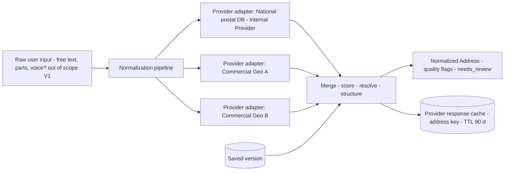

**Address Provider Abstraction (normative interface):** `suggest(query, locale, country?) -> candidates`; `parse(raw_text, locale) -> structured`; `geocode(structured) -> lat/lng/accuracy`; `reverse(lat,lng) -> structured`; `validate(structured) -> quality+corrections`. Every provider is an adapter behind this contract with capability flags (parse? geocode? coverage countries), per-country routing table (e.g., IR → internal postal-code database first (authoritative, offline-updatable reference data), commercial providers as enrichers; DE → official; etc.), timeout + circuit breaker, response cache (provider responses are *not* re-billed on every keystroke), and **never provider-authored storage** (stored address = resolved snapshot + provider provenance fields, so a provider outage or relationship change never invalidates history — this is the anti-lock-in clause).

Pipeline behavior: (1) client-side progressive suggestions (debounced `suggest`, edge-cached) → (2) user confirm/adjust → (3) server-side parse+geocode *asynchronously after save* for enrichment (raw-saved-first — the save never blocks on a third party; §46 geo-failure path). `needs_review` flags drive a data-quality queue (admin, V2). Provider failures ⇒ store stays `RAW`, retry job backfills — the *user* flow is unaffected (Decision: Smart Address is an enhancement, not a gate; brief-compliant "input never lost").

### 20.5 Address history & point-in-time (brief §19)

`GET /v1/me/addresses?at=2024-03-15` → rows where `valid_from ≤ at < COALESCE(valid_until, now)`; `purpose=shipping` filter etc. Closed intervals are immutable (update to a closed row = 409 unless admin-correction flow with audit `address.corrected` — corrections of *typos in historical rows* are possible via supersession rows, never in-place edits). Verified-address concept: a *closed* address row can be VERIFIED for the interval it covered (`AddressVerification` rows are the proof chain); current-verified vs historical-verified queries both supported. **Decision:** `valid_until` boundaries are transaction-consistent with the profile change (strong consistency, same PG transaction — §34.5).

### 20.6 Verifications

Levels: `GEOCODE_OK` (coords + street-level match), `POSTAL_OK` (exists in national postal DB), `DELIVERY_CONFIRMED` (V2: carrier/order feedback event hook), `MANUAL` (support). Verification never *edits* the address (it attaches evidence; user edits create new versions) — separation of fact (where user said) from attestation (what was proven).

---

## 21. Social Identity (brief §20)

### 21.1 Model

`social_identity(identity, platform, username, display_hint, profile_url? (template-derived or manual+flagged), verified, visibility, metadata JSONB (platform-scoped validation schema in registry), evidence (V2: proof via post/verification token))` + `social_platform` registry (`slug, name, url_template e.g. https://x.com/{username}, username_pattern, icon_asset, enabled, verification_support: NONE|OAUTH|CLAIM`). **No per-platform columns anywhere** (brief's explicit requirement); adding "Bluesky" is a registry insert (+ icon asset), zero migrations, zero code.

### 21.2 Validation & rendering

Username validated per platform pattern at write; URL **derived** from the template by default (manual override allowed but flagged `manual_url=true` and scanned: https-only, no credentials in URL, no redirect-ish hosts — open-redirect/SSRF defense at *read/render* time too: the API returns both `profile_url` (rendered) and `username` (data) so clients never re-parse user strings); domain allowlist check at render (template host is trusted, override host is validated against platform host list — Decision: UIAP renders/returns only allowlisted hosts for a platform, never arbitrary user URLs in product-facing JSON… products can render raw values at their own risk, contract warns).

### 21.3 Explicit non-features

No social-API scraping (follower counts, avatars — brittle ToS/PII mess; `metadata` is user-declared, schema-validated *types* only). No OAuth link-verification to social platforms for *profile display* purposes (external connections are authn, §12.8 — distinct plane; a verified-identity social link is V3 via challenge-posting or provider sign-in proof, `verification_support` flags reserve the path).

### 21.4 Visibility & consent

Default visibility `LINKED_APPS` (any product with `social_profiles` scope, consented); `PUBLIC` opt-in per row; `SELF` per row. Consent revoked ⇒ userinfo no longer serves them (no retroactive delete obligation on *non-sensitive* links beyond §18.7 cache contract).
---

## 22. Device Architecture

### 22.1 Separation: Device ≠ Session (brief §21)

A **Device** is a durable "where" (a phone, a laptop's Chrome profile); a **Session** is a temporary "being signed in here" (one login event). One device hosts many sessions over months; one login can span devices (no — one session is one device; but re-auths create *new* sessions on the same device). This split is load-bearing: "revoke device" (lost phone) must kill all its sessions + block new ones, while "revoke session" (work laptop, one coffee shop) must not. Schema: `security.device` owns identity; `access.session` references it; session revocation never touches device state; device block cascades sessions (transactional, §34.5).

### 22.2 Device model

```
Device
  id, identity_id (a device row is per-identity — shared devices across family accounts are represented as separate device rows sharing coarse fingerprints, no cross-identity linkage by device: privacy decision, documented)
  label (user-named: "Soroush's Pixel"), name_suggested (parsed)
  type: mobile|desktop|tablet|tv|embedded|unknown
  os_name, os_version, browser_name, browser_version, app_package, app_version  (all parsed SERVER-SIDE from UA — never trusted client self-declaration; declared-by-client fields only via signed app attestation later)
  manufacturer, model: best-effort (sec-ch/`navigator.userAgentData` client hints where sent; optional, advisory)
  first_seen, last_seen, push_tokens: [ref], locale/tz hints (from authn events)
  trust_state: NEW|RECOGNIZED|TRUSTED|UNTRUSTED|BLOCKED|REVOKED
  risk_summary (derived, cached): score band, signal names — recomputed, never authoritative alone (P-10)
  binding: device_identity_id? (§22.4)
```

### 22.3 Registration / trust / revocation lifecycle

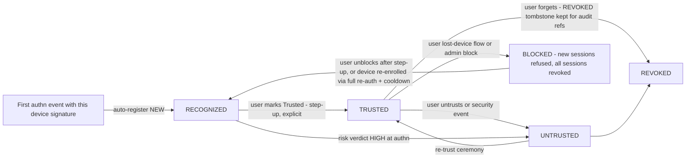

Trust semantics: `TRUSTED` buys *convenience* (idle-timeout multipliers, softer risk friction, optional skip of *second* factor for low-risk logins where policy allows) — never *capability* (INV-16). The strongest form is a **cryptographic device binding** (`DeviceIdentity`): a WebAuthn device-bound credential or platform push-install proof — then "revoke device" is enforceable at the protocol layer (assertion refuses), not just by UA heuristics. V1: passkeys already give this for login; explicit device binding (separate credential) = V2 (mobile first).

### 22.4 Lost device / stolen device

User flow: any other session (or recovery if none) → "mark lost" → BLOCKED + all sessions revoked + RTs revoked + push-token unregistered + notifications (email + SMS if factor); optional (V2) locate-ish "last seen" map from authn events. Admin assist: §44 capability `revoke_device`. Un-blocking requires re-enrollment + cooldown + notifications to all factors (theft-revert protection — Initial Policy 24 h).

### 22.5 Device fingerprinting — position (brief §21 hard requirement)

**Decision:** *coarse, hashed, advisory-only.* We compute a bucketed fingerprint (`fp_hmac = HMAC(kfp, sha256(normalized UA ∪ tz ∪ screen bucket ∪ lang ∪ edge TLS-hash if provided) ∪ identity_salt)`) — rotation of `kfp` quarterly (rolling both keys), stored 90 d (R-22). Fingerprint NEVER: identifies devices for auth decisions, links across identities (salt is per-identity), survives as plaintext inputs, or gates *grants* (INV-16). 

**Threat model of fingerprinting (normative):** (1) *Spoofable* — attacker controls UA/hardware strings; treat matches as weak-positive, mismatches as weak-negative. (2) *Churn* — OS/browser auto-updates change fingerprints → false "new device" alerts; mitigated by bucketing + 72 h grace in risk rules. (3) *Collisions* on NAT'd shared stacks (IR mobile carriers!) — never hard-block on a mismatch (policy rule, §25.4). (4) *Privacy/law* — passive fingerprinting is regulated territory (GDPR rec. 26 identifiable-data thinking, ePrivacy); mitigations: disclosure in privacy notice (§37.7), 90 d TTL, no device graph. (5) *Abuse by insiders* — fingerprints are risk-internal fields, not admin-searchable ("search by fingerprint" is deliberately absent).

### 22.6 Push & notifications binding (V2)

`push_token_registry(identity, device, platform token, topic, proof)` with rotation on uninstall/refresh; used by push MFA challenges (V2) — pushes are *presence* proof, MFA answer happens in-app against UIAP (never trust push payload as authenticator).

---

## 23. Session Architecture

### 23.1 Session definition & binding

```
Session
  sid (128-bit CSPRNG opaque; the session's only public handle)   # cookie value == sid; DB stores sid directly
  # tradeoff recorded: a DB leak exposes sid rows, but sessions are inert without the identity's
  # factors/RT hashes, and revocation makes any leaked sid worthless within 60 s; a ticket/sid
  # indirection layer was considered and deferred to V2 pending pentest input (single-sid is simpler
  # to operate and to join across tokens/audit/events)
  identity_id, device_id, application_id? (first-party sessions belong to UIAP, product sessions are product-local - UIAP sid covers the IdP session; tokens minted for products carry this sid for revocation linkage)
  authn: amr[] (cumulative), acr, auth_time, step_up: last_grant_at? (grants are separate - §16.5)
  network: created ip (truncated per retention), geo snapshot id, ASN ref
  lifecycle: created_at, last_activity_at (async flush ≤ 60 s), expires_at (policy per §13.7), absolute_expires_at, status ACTIVE|ENDED|REVOKED_*
  flags: trusted_device (mirror of device state at creation, recomputed on renewal), risk_band, region, client_ids[] (seen)
```

### 23.2 Storage & propagation (Decision)

**PG is source of truth** (auditability, restart survival, "Redis never source of truth" — §35.3); **Redis is a read-accelerator**: `session:{sid}` entry (TTL 60 s, refreshed on read) + a **revoked-sids** set (bloom+exact hybrid: bloom for speed, exact set for ≤ 100 K recently-revoked) consulted only for sensitive-op endpoints (§24) and product revocation-feed publishers; write path: create/revoke in PG + sync Redis invalidation *same transaction post-commit hook* with relay guarantee ≤ 1 s (SLO; §45.4 metrics `revocation_lag_seconds`).

### 23.3 Concurrency & single-flight refresh

Per-session refresh serialization: RT rotation requires lineage-row lock — parallel refreshes (mobile app foreground + background sync) are serialized by a `refresh:lineage:{id}` Redis lock (3 s) with bounded retry (1×) then `invalid_grant`; the client contract says: on `invalid_grant` ⇒ soft re-auth (silent `prompt=none`) rather than logout storm. Reference integration includes this retry logic (it's the difference between rotation working and support tickets).

### 23.4 Cookie & CSRF (browser-side)

IdP cookie: `Secure; HttpOnly; SameSite=Lax; Path=/` on the IdP host; no `SameSite=None` anywhere (cross-site SSO is via redirects only); `__Host-` prefix where port-less TLS (deployment constraint, documented). Product BFF cookies: platform guidance not control (each product's own `__Host-session`). CSRF: all state-changing *cookie-credentialed* endpoints (hosted pages forms; SPA cookie-refresh token endpoint) enforce `Origin`/`Sec-Fetch-Site` check + SameSite + (for XHR-capable surfaces) custom-header `X-UIAP-CSRF: <nonce from page>` double-submit — standard OWASP CSRF Defense pattern; CORS never used as defense; `Sec-Fetch-*` signals logged as risk signals.

### 23.5 Session UX APIs (brief §22)

```
GET    /v1/me/sessions                 # live + recent (30 d), metadata per §22.2 fields user-safe
GET    /v1/me/sessions/current
DELETE /v1/me/sessions/{sid}           # end one
DELETE /v1/me/sessions?scope=all       # end all (step-up required)
DELETE /v1/me/devices/{id}/sessions    # end device's sessions (≠ revoke device)
POST   /v1/me/devices/{id}/revoke      # block device (step-up)
POST   /v1/me/devices/{id}/trust | /untrust
GET    /v1/me/login-history            # AuthenticationEvents, paginated, filters: success, country, period
```
All under `uiap:me` + step-up on the destructive ones (§24.1). Product-visible surface: only `sid` + amr/acr/auth_time via userinfo extension claim `sid` (for mirror-sign-out) — **never** session *contents* to products (their BFF tracks its own session-to-sid map).

### 23.6 Session vs consent vs token — the revocation matrix (implementation-critical, single source)

| Trigger | Sessions | RT lineages | ATs | Consents | Device | Notes |
|---|---|---|---|---|---|---|
| Password change | keep? **end non-current sessions** (policy default: current survives, others end; admin can force all) | revoke all except current session's family | expire naturally | keep | keep | §13.5 analog for password; notification |
| Email change | current kept, others kept but flagged | kept | kept | kept | keep | + 48 h revert window |
| MFA enroll/rotate | keep | keep | keep | — | — | enrollment itself step-up'd |
| MFA **disable** | end all? **Decision: end all other sessions, keep current** + 72 h cooldown on sensitive ops + double notification | all | natural | — | STALE flags | Disable is the #1 ATO goal (T-08) |
| Passkey delete | keep current, end other sessions bound ONLY to deleted factor | those lineages | natural | — | — | INV-10 floor check first |
| Trust device revoked | end device's sessions | device's lineages | natural | — | UNTRUSTED | |
| Device revoked/blocked | end all sessions on it | lineages | natural | — | BLOCKED | + notifications |
| Consent revoked (per app) | IdP sessions kept | **app's lineages revoked** | expire ≤ AT TTL; sensitive routes re-check | REVOKED append | — | product notified `consent.revoked` |
| Suspension | end all | revoke all | kill-switch flag optional | frozen | — | admin |
| Lock (auto) | end all if risk CRITICAL, else keep (policy) | keep unless risk | keep | keep | risk flags | avoiding self-DoS of the user by attacker (see T-13: lockout-as-denial) |
| Logout all | end all | revoke all | expire | keep | keep | + re-login only |

### 23.7 AuthenticationEvent (brief §23 — the schema)

`{id, at (db now()), identity_id? (null for unknown-alias failures), outcome: SUCCESS|FAILURE|BLOCKED|CHALLENGED, method(s) (amr at decision), failure_code enum, ip (full for 7 d then truncated per R-23), ip_version, geo: {country, region, city, lat_bucket}, asn, isp (enriched async, may be null initially — enrichment never blocks the event, §36), user_agent (raw + parsed ids), device_id?, session_id?, application_id, assurance_before/after, risk: {assessment_id, score_band}, request_id, correlation_id, trace_id}`. Append-only, monthly partitions, retention R-23 (user-visible 13 months, full-grain security 25 months, truncated 60 months — numbers Initial Policy). This table is *the* login-history product surface (Security Center) and the feature store for risk (§25.6).

### 23.8 Session security properties (Decision summary)

- No URL-borne sids (fixation class defanged: sid never in query params; `auth_req` ids are separate, 10-min, single-use, unauthenticated-context-only).
- Session ≠ auth state for tokens: token claims carry `sid` but resource servers never need to resolve it (offline validation); `sid` only for revocation coupling and step-up ops.
- Concurrent logins bounded (policy ceiling: 100 live sessions per identity → oldest evicted + security event — prevents both session-hoarding abuse and unbounded table growth per identity — Initial Policy).
- Idle expiry is enforced at access, absolute expiry at touch or sweeper (≤ 60 s skew) — both are lazy-with-cron, no timer fanout (operational simplicity).

---

## 24. Security Architecture

### 24.1 Sensitive operations & required context (policy table, Initial Policy — changeable via `SecurityPolicy` versions, not code)

| Operation | Minimum factors | Step-up? | Cooldown after |
|---|---|---|---|
| Change password | current password (if set) | yes (pwd/OTP) | end other sessions |
| Change email / phone | as §13.5/13.6 | **yes, phishing-resistant if available, else 2-of-3** | see flows + 24 h for MFA-less accounts |
| Disable MFA / remove last passkey / delete recovery codes | full re-auth (passkey or pwd+TOTP) | yes | 72 h restricted: no email/phone/password change |
| Remove trusted device / untrust | — | yes | n/a |
| Account recovery completion | §27 | yes | 24 h sensitive block |
| Delete account | re-auth | yes | grace 30 d, reversible |
| Change security settings (MFA policy, OTP channel prefs) | re-auth | yes | 24 h notify |
| Add/remove Application consent (consent grant) | login session sufficient (that's the flow) | yes for `phone/address/professional` groups | n/a |
| Admin impersonate | §44.7 | MFA + 4-eyes | session-capped |

### 24.2 Step-up mechanism (brief §8)

**Decision:** session-freshness *plus* operation-bound grants (§16.5), replacing the common (insecure) pattern of "auth_time within 10 min is enough."

```
flow: API returns 403 + problem-doc {error_code: step_up_required, challenge: {sid, method_policy, operation}}
 → client (Security Center or product via deep-link to IdP) runs ceremony (F-05 machinery with operation binding)
 → POST /v1/security/step-up/complete → step_up_token (5 min, single-use, op-bound)
 → client retries original call with X-Step-Up-Token → consumed in-handler
```
Threat model of step-up itself (normative): token replay (jti one-time + op-hash binding + 5-min TTL), ceremony phishing (hosted page at IdP origin only — never client-collected), step-up laundering (attacker triggers own step-up then races: op-binding includes *object version* (`row_version`) so state must be unchanged, else re-challenge), silent 2FA downgrade (method policy is server-decided; client cannot request weaker factor — `amr_achieved` audited in the grant).

### 24.3 Security notifications (cross-cutting Decision)

Events: `security.event` catalog (§30.3) for login-from-new-country, new-device trust grant, MFA changes, credential changes, consent grants/revokes, session-all revoke, risk blocks. Policy: security class = **non-opt-outable** (2 channels best-effort), rate-capped only for redundancy per event-type per identity (anti-spam *within* security: ≤ 3 per 10 min else digest), delivered via §30 with receipt tracking; a security event with *no* reachable channel ⇒ user sees a Security Center banner + product-assisted prompt (fail-visible, never silent).

### 24.4 Security Center API surface (brief §25)

`GET /v1/me/security/overview` (aggregates: risk posture summary, factors count, active sessions/devices counts, last login, open recovery cases, unverified flags); `GET/PATCH /v1/me/security/settings` (MFA policy preference — within allowed ceilings, OTP delivery preference, notify settings); plus the per-object APIs of §12/§22/§23/§26/§27. UI composition = products' job (V1: EMP + Kheradsara embed IdP-hosted security views via iframe-popup? **Decision: no iframe embedding of security flows** (clickjacking surface + cookie partitioning); products deep-link to IdP pages; native apps use the direct API flows).

### 24.5 Login intelligence for users

Security Center shows: "Where you're logged in" (sessions/devices), "Recent sign-ins" (login history incl. *failures*, with "Was this you?" actions → **if no: revoke everything + change password + mark device** — one-tap incident containment flow, `POST /v1/me/security/incident`), risk explanations never expose scoring internals (opaque verdicts, user-safe reasons from an approved message catalog — anti-education-of-attackers rule, with the approved-reason list maintained by security).

### 24.6 Rate limiting (brief §37 + §73)

Dimensioned buckets (Redis token bucket, Lua-evaluated; local static fallback when Redis down per §46): `identity`, `alias-hash` (pre-auth identity), `ip` (v4 /32 + /24 dual bucket; v6 /64 + /48), `device fp`, `application` (its *own* traffic + its users), `endpoint`, `global`. Policies (Initial Policy, tunable via RatePolicy rows): login per alias 10/15 min fail-driven exponential (1 m→5 m→15 m→1 h with lock escalation after 25 fails/h); OTP request: 5/h/email, 5/h/phone, 20/h/ip; OTP verify: 10/challenge-try + 30/h/identity; password reset: 5/h/identity + 20/h/ip; email/phone change: 3/h + 10/24h per identity (not just per session!); token endpoint: 120/min/client + **600/min/identity** (refresh rotation from multiple devices; 60/min would self-DoS a user with many sessions — rc2); general API: 300/min/identity default, 60/min/ip anonymous. Semantics: `429` + `Retry-After` + `X-RateLimit-*`; soft-429 (progressive challenge) before hard for human-UX endpoints; **distributed counters degrade by static local ceilings** (fail-safe posture per endpoint class: sensitive authn endpoints *limit up* (tighter local ceilings), read APIs *allow* (fail open) — explicit per-row in the policy table, no blanket default). Anti-lockout-as-a-weapon: login *lockouts* must never be reachable by IP-only input (per-alias ceilings are global but recovery channels exist; §23.6 lock policy prefers challenge-escalation over lock, lock reserved for verified credential-match storms — Decision, mitigates T-13).

### 24.7 Anti-enumeration (brief §39)

Response-equality doctrine: for login/reset/verify/recovery/registration-alias-check endpoints, all failure classes (unknown alias, revoked identity, locked) collapse to one of `generic_invalid_credentials | generic_check_your_inbox` with byte-stable payloads; timing padded (fixed-response budget via dummy KDF for missing alias; ± 15 % jitter, measured in load tests, NFR-002); error codes never reveal which of (alias, password) failed; registration conflict → "this email is already in use *to sign in* — continue to recover or use another email" (deliberate GDPR-era UX: enumeration vs usability → Decision: **conflict IS revealed at signup** with a *safe* recovery path (industry norm, and hiding it causes worse outcomes: silent account squatting; risk accepted + documented in T-14; per-customer override flag `hide_signup_conflicts` reserved for enterprise tenants). Monitoring (not user-facing): signup/reset volume by alias prefix as an enumeration-drift signal feeding risk engine (§25.3).

### 24.8 Anti-brute-force & credential-stuffing (brief §38)

Layered (defense-in-depth, each layer bounded): L1 password/OTP throttle + attempt caps (§24.6) → L2 progressive challenges (privacy-preserving interactive challenge — self-hostable puzzle, e.g., ALTCHA-class; **no third-party tracking CAPTCHA by default** (privacy + IR reachability), decision `challenge_vendor` in Appendix A) → L3 device/IP reputation signals (ASN, hosting/VPN blocklists for *OTP delivery* decisions only, not account blocking) → L4 velocity anomaly detection (credential-stuffing: per-application login-fail-rate vs volume with auto-challenge escalation + on-call alert; **spraying**: fail-rate per IP-segment per identity) → L5 breach-corpus at set-time (§12.2) + future "password already in breach" re-check cron (V2, hashed-only check) → L6 containment (risk verdicts §25: block + notify + require-OTP for targeted accounts, i.e., **targeted** step-up is the ATO-killer: attackers with stuffed creds face 2nd factor; accounts with no MFA get a forced "verify email" gate). Cookie theft defenses: short TTLs, `Secure`-only, TLS 1.3 (no session resumption across key rotation? documented infra note), RT rotation/reuse detection (F-04 — the platform's *main* token-theft answer), `sid`-revocation coupling (§16.4), optional per-app `require-introspection-sensitive` flag (§14.4). Replay: jti stores, single-use auth codes/challenges, idempotency ledger (§33.6), PKCE binds intercepts (auth code interception needs verifier+client).

### 24.9 Session/token theft playbooks (operational)

Reuse-detection fired (F-04): auto-contain (revoke lineage+session, STALE device, notify, require re-auth, escalate to admin queue if CRITICAL); admin investigation: "revoke everything" kill-switch with introspection enforcement for that identity (§44.6); client-credential (not user) leak: rotate client secret, revoke client tokens, review token volumes, audit redirect URIs (§17.5).
---

## 25. Risk Engine

### 25.1 Design goal

Deterministic, explainable, pluggable scoring on a synchronous hot path (budget: p95 ≤ 10 ms for V1 rule evaluation, to be validated, §50), with asynchronous re-scoring for anything heavy (GeoIP, graph features). The engine advises; the **policy layer** decides; the **protocol layer** enforces. These three never merge (audit trail = which signals → which score → which policy → which verdict, all recorded, §10.5).

### 25.2 Architecture

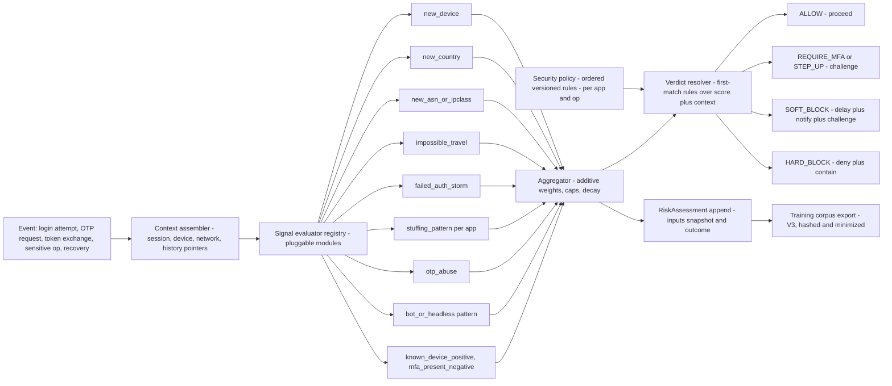

### 25.3 Signals (V1 list)

Each: name, version, inputs, output `(weight, direction, explanation_code)`.

| Signal | Kind | Notes |
|---|---|---|
| new_device / unrecognized device | risk+ | trusted_device ⇒ negative |
| new_country (geo from IP, enriched async; synchronous = ASN class + country of IP block if cached) | risk+ | geo-IP provider adapter, cache-first; on provider outage → signal abstains (score unaffected, "unknown" never treated as "bad" — fairness + availability rule, Decision) |
| new_asn / hosting-VPN-Tor class | risk+ small | |
| impossible travel | risk+ | haversine on last two *successful* authns; tolerance windows (airport dwell ≥ 2 h? simplified v1: threshold on implied speed > 900 km/h over > 120 min apart — Initial, to be tuned); false-positive dampers: trusted device −, VPN −; never auto-block on this alone (policy rule: impossible-travel alone maxes at REQUIRE_MFA) |
| repeated failures (per alias, per IP, per app) | risk+ | |
| credential-stuffing pattern (velocity of distinct-alias attempts from subnet + failure ratio per app) | risk+ | org-level: raise app-wide friction (progressive), not per-account |
| otp_abuse (request velocity per target, code-reuse attempts) | risk+ | |
| bot/headless (UA anomaly, sec-fetch gaps, TLS-JA4-ish edge hash if edge exposes it) | risk± | advisory only (INV-16 analog for bots: cannot hard-block humans on this) |
| mfa_present, phishing_resistant_present | − | |
| known_network (home ASN+country+device triple seen for this identity ≥ 30 d) | − | |
| recent_credential_change (72 h window) | ++ | attacker post-compromise behavior, T-08 |
| disposable-email / VoIP hint (per §13.6: advisory) | + small | |
| admin-context signals (out-of-hours, unusual geo) | ++ | §44 admin policy reuses the same engine — one risk core, two policy domains |

**Extensibility contract:** signals are registry rows (`risk_signal_registry(key, class, weight, decay, enabled, version, config JSONB)`) + registered evaluator modules; adding a signal = config + code, never schema change (ADR-0011 adjacent). ML swap-in (V3) = new evaluator kind reading the same context, verdict path unchanged (this is why features are recorded as *inputs of assessments* from day 1).

### 25.4 Scoring & bands

Additive weights per signal, per-context caps (band never CRITICAL from a single weak signal), exponential decay for history-based signals (half-life 14 d Initial). Bands: LOW < 30, MEDIUM 30–59, HIGH 60–84, CRITICAL ≥ 85 (score = 0–100). Bands are *policy inputs*, never shown to users raw (opaque, §24.5). Threshold table lives in `SecurityPolicy`; changing a band boundary = new policy version + shadow-evaluation window (policy-as-code governance: every prod policy change runs in shadow mode ≥ 24 h emitting *would-be* verdicts to metrics before enforcement — Decision; prevents the classic risk-engine self-DoS, T-20).

### 25.5 Verdicts

| Verdict | Effect | User-visible |
|---|---|---|
| ALLOW | proceed | nothing |
| REQUIRE_MFA | challenge added to login | factor chooser |
| REQUIRE_STEP_UP | operation-bound re-auth (§24.2) | ceremony |
| SOFT_BLOCK | proceed-but-deny-then-notify (used for low-confidence HIGH on risky-but-legit-looking flows, e.g., block *this login attempt* once + require OTP next) | generic "temporarily unavailable, try again" (never reveal risk) |
| HARD_BLOCK | deny + containment hooks | safe copy from message catalog |

Verdicts never explain themselves; `explanation_code` is for admin/SIEM only. Feedback loop: users' "Was this you?" answers (§24.5) create labeled rows → policy tuning + V3 training.

### 25.6 Governance & privacy

Risk telemetry minimization: assessments store signal *names + weights*, not raw feature payloads (IP stored as event FK, truncated per retention); no permanent device graphs; scoring on non-consented data classes is forbidden (e.g., never score on address content); fairness review checklist per new signal (does it penalize shared-IP populations — IR carriers! — disproportionately? documented mitigations required for signal acceptance); model/signal registry versioned for post-incident explainability ("why was this blocked" audit answer = assessment id → policy version → signals).

### 25.7 Risk evaluation lifecycle

Risk evaluation occurs at defined points in the authentication and session lifecycle. Each evaluation produces an immutable `RiskAssessment` snapshot.

#### Evaluation points

```text
Pre-authentication risk snapshot
        ↓
Authentication decision (ALLOW / REQUIRE_MFA / STEP_UP / SOFT_BLOCK / HARD_BLOCK)
        ↓
Authentication ceremony (factor verification)
        ↓
Session establishment (if allowed)
        ↓
Post-authentication risk evaluation (async, on session events)
        ↓
Security event / risk update (if verdict changes)
```

#### Pre-authentication evaluation

- **When:** AFTER credential verification (password/TOTP/passkey), BEFORE session creation
- **Inputs:** request context (IP, ASN, UA, device fingerprint from request), historical data (last successful authn, failure counts, known devices, previous risk assessments)
- **Timing:** Synchronous, blocking (budget p95 ≤ 10 ms)
- **Output:** Verdict (ALLOW / REQUIRE_MFA / STEP_UP / SOFT_BLOCK / HARD_BLOCK)
- **Authority:** This verdict is FINAL for the current authentication ceremony. It determines which factors are required and whether login proceeds.
- **Device state:** Device is NOT yet registered at this point. The `new_device` signal compares the request fingerprint against existing device records in the database. This is a read-only comparison; no device is created or modified.

#### Post-authentication evaluation

- **When:** Session renewal (§13.7), step-up operations, geo/device discontinuity, RT reuse in family, policy changes affecting session
- **Inputs:** session state (amr, acr, auth_time, device_id, network), new request context
- **Timing:** Synchronous for step-up decisions; asynchronous for enrichment
- **Output:** May require re-authentication (`prompt=login` equivalent) or hard-end session. Never retroactively invalidates already-granted access within AT TTL (§16.4 documented residual window).
- **Authority:** Controls session continuation, not initial authentication.

#### When device becomes authoritative

- **Before session creation:** Device fingerprint from request is advisory only (read against existing device records for `new_device` signal)
- **At session creation:** Device record is created/updated (fingerprint, trust state). Session references device_id.
- **After session creation:** Device is authoritative for that session. Session renewal uses device trust state.

#### Circular dependency prevention

The architecture avoids circular dependency through sequential evaluation:

1. Pre-auth risk reads device state (historical records in DB) — does NOT create or modify device state
2. Authentication proceeds (credential verification, session creation)
3. Device is registered/updated as part of session creation (after risk evaluation)
4. Post-auth risk reads session + device state — evaluates for session continuation, not initial authentication

Risk evaluation is read-only on device/session state during the pre-auth phase. Authentication creates device/session state after risk has already evaluated. There is no feedback loop: risk → auth → device → risk does not occur within a single authentication ceremony.

#### Immutable snapshots

Each risk evaluation produces an immutable `RiskAssessment` row:

```text
RiskAssessment {
  id (uuid),
  identity_id,
  session_id? (null for pre-auth),
  evaluation_point (PRE_AUTH | POST_AUTH | STEP_UP | RENEWAL),
  input_snapshot (JSONB: all signal values at evaluation time),
  score, band, verdict,
  policy_version,
  created_at (immutable)
}
```

Decisions are made against the snapshot, not against live state. This ensures auditability and eliminates any possibility of state-dependent feedback loops.

---

## 26. Consent

### 26.1 Model

Consent is the *privacy gate* between products and user data, and the *security gate* for scopes with side effects (e.g., `offline_access` extends attack window — brief §26).

```
Consent
  id, identity_id, application_id (env-specific client resolves to app)
  scope_set: [scope refs], consent_policy_version (hash of app's purpose texts + platform disclosure text version at grant time)
  granted_at, expires_at? (per-scope expiry policy, V2), source: AUTHZ_FLOW | ADMIN_MIGRATION | LEGACY_IMPORT
  status: GRANTED | SUPERSEDED | REVOKED, revoked_at/by/reason
  auth_context: {sid, amr, acr}, consent_interaction_id (traceable to the exact UI + locale)
  per-scope metadata (purpose copy shown, "single-session" flags)
```

Granularity **Decision:** the *grant is per (application, scope-set) snapshot*, stored with per-scope rows (`consent_grant_items`) for revocation of individual scopes (UI: checkboxes per data class; revocation granularity per scope; storage is both — the brief's per-scope need vs OAuth protocol's per-flow grant, reconciled).

### 26.2 Consent flow (protocol)

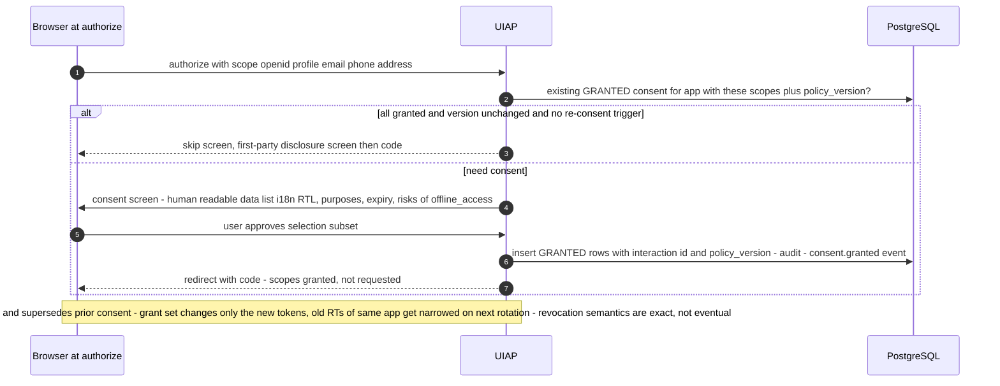

Screen content is *registry-driven*: per scope the catalog supplies display title + purpose statement (i18n) + data fields preview + "why" — products can't inject custom consent copy beyond their policy texts (§17.2) — copy review is part of app activation (governance, §17.6).

### 26.3 Rules

Scope request > granted → `invalid_scope` (never silent narrowing) unless client registered with `scope_narrowing=soft`. New scopes requested later → incremental consent screen (only the new ones; existing shown as granted — UX decision + audit records the delta as a superseding consent). Consent to a `ScopeDefinition` change: *widening* (claims added to `ScopeClaimMap`) or purpose-text change ⇒ **re-consent at the next authorization request** (not mid-token). Existing access/refresh tokens **retain the old granted scope set** until rotation or explicit revoke. Products receive `consent.superseded` with old/new scope diff and MUST NOT serve newly-added claims until a token minted after the new grant. Narrowing ⇒ no re-consent (privacy-safe direction); next rotation MAY drop removed claims. TOS/privacy consent is separate: `consent(kind=TERMS|PRIVACY|MARKETING)` rows with the same ledger semantics but shown at signup and settings, never as OAuth scopes; marketing consent gates §30 classes.

### 26.4 Revocation (user)

`GET /v1/me/consents` (apps with granted data classes), `DELETE /v1/me/consents/{application_id}` (+ scope-level `?scope=`): tx = consent→REVOKED append, all that app's token lineages revoked, sessions kept (IdP session ≠ app consent), `consent.revoked` event to app (contract: apps must then delete caches §18.7), audit (Y), notifications (security-class) to user and app-owner contact. Re-grant possible; revocation history kept as consent proof (R-12).

### 26.5 Admin/legacy

Admins cannot grant or widen consents for users (FR: admin cannot do what users don't; §44). Legacy product-migration consent: bulk import with provenance `LEGACY_IMPORT` + per-user re-consent campaign on first federated login (onboarding requirement; data imported without a purpose mapping is quarantined and never served through userinfo — Decision).

---

## 27. Recovery Architecture

### 27.0 Principles

Recovery is the primary attack surface of identity platforms (account recovery = permanent ownership transfer if abused). Decisions: (1) **no recovery without identity assurance:** **tier-2/tier-3 recovery** outcomes mint `IAL1-only, AAL-upgrade-forbidden` sessions that can't change factors for 24–72 h (the *cooldown wall*: an attacker who wins recovery still can't lock you out — they can log in but their session is flagged, sensitive changes blocked, notifications fire). **Decision: sessions created via supervised/tier-3 recovery never revoke other sessions** — this asymmetry breaks the standard ATO-completion pattern. **Password reset (§27.1) is not that path:** the legitimate owner who completed a reset **does** revoke other sessions by explicit request. (2) **Evidence hierarchy:** passkey/TOTP+email > email+phone (two independent channels) > email-only (time penalty) > SMS-only (disfavored, policy floor per §12.9) > documents + 2-person review. (3) **Uniform UX** (no enumeration, §24.7). (4) Every step audited + SecurityEvent; recovery cases are visible in Security Center ("we approved a reset on day X from device Y" — user-side anomaly visibility matters more than attacker obscurity).

### 27.1 Password reset (default tier)

Flow F (diagram §13.8). Rules: single-use reset token (opaque 256-bit, hash-stored, 30 min, bound to request's device/UA family — mismatch still works but raises risk, because travel-reset on a new phone is a *real* pattern; never hard-fail), all *other* sessions + RTs revoked on completion (the user explicitly asked to kick the world), current session upgraded not revoked (convenience + the *new* password must not require immediate re-login), notifications on old email + SMS(if factor) + Security Center; breach-corpus re-check at set; recovery-created sessions can't change the password they recovered through within cooldown (no instant re-lockout games).

### 27.2 Email loss / change-without-old-access (e.g., left company)

Tier-2: verified phone + passkey/TOTP ⇒ allowed with step-up + 72 h sensitive-change delay + old-channel notification *if still reachable*; none of those ⇒ supervised recovery (§27.5). Decision: email change through recovery **always** has the delay (compromise window is why email-recovery-only is dangerous).

### 27.3 MFA loss (TOTP device gone; passkey device = the phone lost)

TOTP gone + password ok → login allowed with `amr: pwd` only → immediate "re-enroll MFA" gate with **passkey-first** CTA, recovery-code path (consume → session restricted: read + re-enroll only), cooldown 24 h on sensitive ops, notification to all channels. All MFA lost + no codes ⇒ tier-2/tier-3 recovery; **SMS-OTP alone never re-establishes MFA status** (it *can* log in at AAL1 with restrictions — the AAL downgrade is visible to the user, not silent). Passkey lost: same, plus passkey-delete implications (§23.6 matrix).

### 27.4 Device-loss combo (phone had passkey + authenticator)

Priority flow: from any remaining session "mark device lost" (§22.4) *or* password + email-OTP + 72 h delay wall (attacker holding the phone still can't strip the account because password-only login post-theft is AAL1-restricted: read-only + no security changes + consent grants blocked — **Decision:** AAL1 sessions cannot perform factor removal — INV-16-adjacent rule R). Trusted-contact recovery: V3 (opt-in, 2 contacts required, notify-on-use, contacts see only "X locked?" not any data).

### 27.5 Supervised account recovery (tier-3, full lockout)

Case model (`recovery_request` §10.2): user answers platform-retained facts (NOT secrets — no DOB-only "knowledge questions": weak; used as *contributing* signals), uploads documents to the evidence vault (encrypted, access-grant-per-file, 30-day post-decision purge (to be validated with counsel, OQ-09)), risk engine pre-screen; 2-person review with checklists; outcomes: (a) approved reset (sessions flagged, cooldown wall applied, all factors reset policy — the *user gets the account back*, attacker gets nothing: forced MFA re-enrollment with passkey-or-email only, notification storm to all, admin review pinned 7 days). (b) denied with reasons from approved catalog + appeal path (human review, second pair). SLA: 3 business days (Initial Target, to be validated with support volumes). Fraud controls on the recovery queue: rate-limited per reviewer, case-aging alerts, reviewer cannot approve own-linked cases, all case actions audited (actor=reviewer).

### 27.6 Recovery integrity properties

Recovery tokens are single-use, never loggable (redaction), TTLs short, bound-but-not-rigid (risk not error), cooldown wall enforced *at capability level* (not UI), every artifact append-only; **the platform cannot "just reset" an identity** — there is no admin button that skips verification (§44).

### 27.7 Admin lockout self-recovery

Platform admins are normal identities too (eat-your-own-dogfood): break-glass = hardware keys + documented offline envelope procedure (§41.5), never a support-side override.
---

## 28. Audit Platform (Tamper-Evident)

### 28.1 Purpose & placement

Audit is a *first-class domain* (brief §27): the forensic truth of who changed what security/identity state. It answers: **Who** (actor), **What** (action + before/after), **When** (DB-clock timestamp), **Where** (endpoint/region), **From which application / device / session**, **Why** (reason/context), plus **Request ID / Correlation ID / authentication context**. Design constraints that shape the architecture: (1) audit *append* is on the critical write path (it participates in the domain transaction — INV-08 — a state change that fails to audit must roll back; a 99.9%-availability platform can afford one extra insert, not a lossy side-channel), (2) audit *read* is rare, heavy, and must never impact the write path (separate replicas + export pipelines), (3) retention is years while storage must stay bounded (partitioning + tiering), (4) PII in audit payloads is the #1 leak vector (redaction is structural, §28.6).

### 28.2 Schema (contract level; DDL belongs to implementation)

`audit_event` — append-only, RANGE-partitioned by month (subpartition: by stream §28.5), PK `(partition_key, audit_id)` with `audit_id BIGSERIAL`-per-partition (internal only, never exposed; external ref = `event_uuid`), columns:

| Column | Notes |
|---|---|
| audit_id (bigint, per-partition sequence), audit_uuid | id; uuid is the public handle (refs from exports, admin URLs) |
| at_ts | timestamptz, `DEFAULT now()`, DB-authoritative |
| actor_kind | IDENTITY | SERVICE | SYSTEM_JOB | ANONYMOUS (authn attempts that never reached an identity, kept only where security-relevant) |
| actor_id | identity/service id; **never a name** (names come from joins at read time → survives anonymization, §28.6) |
| actor_amr / actor_acr / actor_auth_time | authentication context of the actor at action time |
| subject_kind, subject_id | what was acted on (identity id for user-scoped changes; app id; policy id…) |
| action | namespaced verb from closed taxonomy (§28.3): `identity.status.set`, `credential.password.superseded`, `consent.revoked`, `policy.version.created`, `key.rotated`, `admin.impersonation.started`, … |
| resource_type, resource_id | fine-grained object |
| outcome | SUCCESS | DENIED (denied admin attempts are audited too — denial is a first-class event) |
| before_digest, after_digest | SHA-256 over canonical JSON of the *redacted* before/after states — digests stored, **full redacted states stored in cold tier** (§28.6) via payload refs; hot rows keep digests + diff summary fields (which keys changed + old/new *labels*, values only where non-personal, e.g., status codes) |
| payload_ref | object storage ref for full (redacted) before/after snapshots, encrypted with audit-tier key, never user-PII beyond what action needs |
| ip, geo, ua_ref | sessionless events (admin, API) capture actor's network; truncated per retention |
| application_id, device_id, session_sid | where/through-which, nullable (system jobs) |
| request_id, correlation_id, trace_id | propagation per §45.2 |
| reason_text | free text, required for all admin actions (§44.4) + ticket URL; PII-free discipline via validation (no emails/phones in reasons — regex guard, soft-block with guidance) |
| context JSONB | action-specific structured context (e.g., challenge id, policy version, scope names) |
| stream | SEC | IDN | APP | ADM | POL (partitioning + anchoring grouping, §28.5) |
| seq_in_stream, prev_hash, row_hash, root_id? | tamper structure (§28.4) |

DB-level enforcement of append-only: role `uiap_app` has `INSERT` on audit partitions, `SELECT` via `uiap_audit_read` role only; `UPDATE/DELETE` revoked + trigger-blocked at DB level (defense-in-depth: triggers can be removed by a superuser — the *real* guarantees are the hash structure + external anchors + privilege separation + monitoring §28.7).

### 28.3 Event taxonomy (audited set — the INV-08 "in-scope" definition)

Closed list, versioned with the document; additions are spec changes (ADR-free but review-gated):
- Identity: created, status transitions (all edges of §11.4), verification level changes, handle changes, merged (both directions), anonymized, deleted.
- Credentials: every kind's create/enroll/verify/rotate/supersede/revoke (never *use* — uses are AuthenticationEvents), recovery-code set generation/consumption, factor-policy overrides.
- Access: application create/update/suspend/retire (per-field), redirect URI add/remove (security-critical), secret rotate/expiry events, consent granted/superseded/revoked, scope definition changes, key rotation/retirement/emergency-revoke, service credential lifecycle.
- Sessions/devices: created, ended (by user/admin/risk/device), trust transitions, blocks.
- Security: risk policy version changes, challenge blocks (bulk-safe sampling rule: individual `BLOCKED` challenges are AuthenticationEvents; *policy* changes are audit), step-up grants issued? (no — sampled to security events only; Decision: issuance not audited, *consumption failures* are security events; rationale: volume vs value).
- Recovery: every state transition of a recovery request incl. reviewer actions.
- Admin: all §44 actions incl. DENIED, impersonation start/end, data exports, audit queries themselves (auditing the audit-reads: `audit.queried` — Decision: yes, sampled 100% for admin actor, because "who looked at user X" is a core privacy control).
- Privacy: consent-policy text version changes, retention job runs (summary row per run, not per record), anonymization batches, DSAR fulfillment events, breach-flag changes.
- Platform: deploy marker (version + manifest hash), feature-flag flips affecting authz/consent/risk, KMS key events (no secret material), outbox relay config.

### 28.4 Tamper-evidence design (brief §28 — Decision + rationale)

**Decision:** *Not* a naïve global row-by-row hash chain (one global sequential hash chain serializes all audit writes across contexts → throughput ceiling + hot-row contention on the critical path; and a single-chain insert/delete anywhere invalidates everything, making the common "prune one early chain segment" attack indistinguishable from normal rotation). Instead: **per-stream, per-partition chained commitment with optional external anchoring.**

#### V1 scope (Initial Policy)

V1 implements a **layered** tamper-evidence model appropriate for the initial threat model (<1M identities, internal platform):

1. **Structure (V1):** within each `(stream, month-partition)` subpartition, rows form a hash chain (`prev_hash`, `row_hash = H(row_hash_input || prev_hash)`) maintained with **partition-local advisory locks** (write contention = per-partition, tolerable at V1 volumes; to be validated §50 with audit-write benchmark).
2. **Checkpoint (V1):** every 5,000 rows or 15 min (whichever first): a commitment hash over the chain segment → `audit_roots` row {root_hash, range (seq_from, seq_to), stream, partition, created_at, prev_root_hash}. Root-to-root chain = the "big chain"; row-to-row = detail; a single-row tamper breaks both, a reordering breaks roots.
3. **PG-level immutability (V1):** UPDATE/DELETE revoked on audit tables via role grants; only INSERT permitted through the application module interface.
4. **Verification (V1):** nightly job recomputes chains from PG and compares to `audit_roots`. Failure ⇒ CRITICAL security alert, audit endpoints go read-only-with-incident-mode banner (Decision: never auto-"heal" by rewriting chains).

#### Future layers (V2/V3, conditional on business/legal/compliance requirements)

The following layers are designed as additive extensions to the V1 base. They may be introduced if the threat model justifies the operational complexity:

- **V2 — External anchoring:** daily anchor digests written to WORM object storage (S3 Object Lock compliance mode or equivalent; retention ≥ audit retention + 1 y). Independent verifier service (separate deployable/service account) recomputes chains, compares to `audit_roots`, compares roots to anchored WORM files.
- **V3 — Non-repudiation:** RFC 3161 TSA timestamps on anchor digests (external, non-repudiable time proving data existed at a specific point). Optional cross-org or public anchor (transparency log).

**V1 threat model → mechanism map:**

| Threat | V1 mechanism |
|---|---|
| Attacker edits/deletes a row via compromised app credentials | UPDATE/DELETE revoked via role grants; recomputed chain ≠ stored root; nightly verification detects |
| Attacker (DBA/superuser) truncates partitions | Partition seal state is itself in audit_roots; truncation = missing partition = alarm (monitor §28.7); forensic copy in WAL/backup |
| Attacker hides one specific event without touching rows | Suppression at write time is caught by the *count/sequence* chain (gaps impossible: seq assigned pre-commit, gaps roll back the transaction) + INV-08 cross-check |
| Retention pruning vs immutability tension | Pruning is *audited tombstoning*: partition-level legal expiry runs only after re-anchoring a "pruned-through" certificate (root before pruning stored forever) |

**Upgrade trigger to V2:** compliance requirement for external audit verification, or threat model escalation to include nation-state-level adversaries. The V1 hash chain + checkpoint design is the foundation that V2 anchoring builds upon.

### 28.5 Streams, partitioning, volume control

Streams (SEC/IDN/APP/ADM/POL): separate write hot-spots and separate retention defaults (ADM/POL: 7 y Initial Policy; SEC: 5 y; IDN: 3 y after anonymization transition; APP: 1 y — config, R-31). Monthly range partitions; 2 months forward-created by job; row caps: `before/after` labels ≤ 4 KB per row (larger payloads → `payload_ref` only — bounded rows keep chain perf sane). Sampling policy: *never* sample the in-scope set (bounded-by-taxonomy makes volume controllable; if volume explodes, the fix is taxonomy review, not sampling of security events — recorded as an explicit anti-pattern to avoid).

### 28.6 PII in audit (Decision)

Redaction registry drives what a diff may contain: allow-list of redacted shapes per action (e.g., email change stores `{from: "so***@do***.com", to: "…", to_verified_at: …}` — the *to-address itself never stored in hot row*; the encrypted payload_ref for the full state exists only for `ADM`-stream actions with explicit legal need, else only the blind-index hash so the exact event "identity X set email with index Y" can be cross-referenced without the value. Rationale: audit stores are long-retained, broad-read (auditors, SIEM mirrors), and the worst breach copy — minimize them structurally; the *facts needed for forensic reconstruction* (which identity, which action, when, from where, which outcome) are not PII-heavy.

### 28.7 Access, monitoring, operations

Read paths: admin search API (§44), SIEM mirror (async consumer), DSAR export builder — all SELECT-only via dedicated roles; audit query rate-limited + itself audited (admin). Monitoring: verifier failures, anchor lag (`audit_anchor_lag_seconds`), chain-recompute drift, WAL/replication lag of audit-only replica, partition-creation job health. Runbooks in §48.5 (audit storage loss scenario, verifier-fail scenario).

---

## 29. Event Architecture

### 29.1 Why events (justification per P-12)

UIAP is *the* source of identity truth for a product portfolio; every product needs timely, ordered, replayable knowledge of: identity lifecycle (suspend/delete), factor changes (security), consent (data governance), profile/address/social changes (cache invalidation + sync), devices/sessions (security mirroring), applications (admin), keys (security ops). Pull-only polling per product = N× read amplification and no security-critical immediacy; pure synchronous callbacks = coupling + outage cascade (products must not be able to fail our login path). The outbox+stream pattern buys: decoupled consumers, replay, ordering, and the extraction seams (§8.1) — that's the rent it pays.

### 29.2 Synchronous vs asynchronous domain map (brief §30)

| Interaction | Mode | Rationale |
|---|---|---|
| Password/OTP/TOTP/passkey verification, challenge consume, code/token issuance, consent check, session/revocation writes, audit append, step-up, token introspect | **Synchronous, strong** | Security decisions cannot wait for queues; correctness > availability of downstream |
| Notifications, authn-event GeoIP enrichment, risk async re-scoring, breach re-checks, metrics/telemetry, consent-cache refresh at products, profile read-replicas, webhook fan-out, retention jobs, exports | **Asynchronous, eventual** | Enrichment/fan-out tolerates seconds–minutes; keeps critical path free (brief §48) |
| Profile reads on read replica | eventual (bounded staleness ≤ 10 s typical, documented) | high read volume, low consistency requirement (self-view reads use primary — "read-your-writes for the owner" rule, §35) |
| Product local caches of profile/email/phone | event-driven + fetch-on-change; **products must treat event as nudge, refetch = truth** (§29.7) | exactly-once doesn't exist; nudge pattern is honest and simple |

### 29.3 Event catalog (V1) — names are contracts

Naming: `domain.aggregate.action`, past tense (`identity.suspended`). Catalog (payloads abbreviated; full JSON Schemas live in the registry artifact `event-schemas/` maintained with this doc; each row = one schema doc with version):

`identity.created | identity.activated | identity.provisional_expired | identity.suspended | identity.reinstated | identity.locked | identity.unlocked | identity.deletion_requested | identity.deleted | identity.anonymized | identity.verification_level_changed | identity.merged_applied | identity.merge_reverted`
`credential.added | credential.verified | credential.revoked`
`email.added | email.verified | email.changed | email.primary_changed | email.revoked` (mirrors for `phone.*`)
`password.changed | password.imported`
`mfa.enabled | mfa.disabled | totp.rotated | passkey.added | passkey.removed | recovery_codes.regenerated`
`authn.login_succeeded | authn.login_failed | authn.step_up_failed | authn.blocked` (low-cardinality security feed only — details stay in UIAP; payload = identity, app, outcome, ts, ids; geo **not** in payload (PII minimization, refetch policy))
`session.ended | session.all_ended | device.registered | device.trusted | device.untrusted | device.revoked | device.blocked`
`token.lineage_revoked | consent.granted | consent.revoked | consent.superseded`
`profile.updated | professional.updated | address.added | address.updated | address.removed | social_identity.added | social_identity.removed`
`application.updated | application.suspended | application.retired`
`security.event_created (summary only) | risk.assessed (sampled, admin-feed only) | jwks.rotated | admin.impersonation_started | admin.impersonation_ended | recovery.completed | retention.job_completed | dsar.export_ready`

Consumers: notifications, audit (already same-DB — events for *external* mirrors), analytics (V2), products (per subscription filters), security tooling (SIEM feed).

### 29.4 Transport & guarantees (Decision)

**V1:** PostgreSQL **transactional outbox** (same tx as domain write → atomic publish-intent; delivery guarantees "committed ⇒ eventually published", crash-safe, zero dual-write problem — this is also why audit is in-DB, not bus-based, §28.1) → relay publishes to **Redis Streams (consumer groups)** (V1 infra already has Redis/Valkey; max 6–12 months of product fan-out volume; ops simplicity). **Upgrade trigger (documented):** > 5 M events/day sustained, > 30 consumer groups, ordering needs > per-stream FIFO (Kafka-style partitioned log) → migrate to **Kafka/Redpanda or NATS JetStream** with the *same* envelope + subjects (that's the contract; the bus is swappable — ADR-0022).
Guarantees: **at-least-once** delivery, **per-aggregate ordering** (stream key = `identity_id` hash — single-writer partition; aggregate-scoped monotonic `seq` in the envelope so consumers can detect gaps → refetch), **idempotency** by consumers keyed on `event.id` (dedup table/window 7 d recommended), **retry**: exponential 1 s→15 m + jitter, per consumer group; **DLQ stream** (`dlq.<group>`) with alert at > 0; **poison message** handling: N=5 attempts then park (manual replay tool with dry-run + audit); **replay**: per-group offset reset tooling (admin API), with fan-out protection (token bucket on replay publisher — Decision: replay must not DDoS products that already processed history: replay mode sets `X-UIAP-Replay: true` + products SHOULD skip side-effects (notifications) on replayed events — contract clause); **backpressure**: relay lag metric + auto-throttle; retention: streams trimmed at 7 d (V1 Redis) — replay window bounded ⇒ products MUST poll for gaps > 7 d (§33 API `?since=` supported on change feeds — Decision: all product-facing feeds expose a time-cursor list API so bus retention never equals data loss).

### 29.5 Envelope & versioning (brief: event versioning)

Envelope (CloudEvents 1.0-compatible subset — Decision: CloudEvents shape, JSON transport):
```
{ specversion:"1.0", id (uuidv7), type:"email.verified", source:"https://id.…",
  subject:"identity:<id>", time (UTC), datacontenttype:"application/json",
  schemaurl:"…/event-schemas/email.verified/1.2.0", dataversion:1, seq (per-subject),
  partition_key, traceparent, request_id, correlation_id,
  data:{…}, metadata:{producer:"1.24.0", region, test:bool} }
```
Versioning: **semver per event type** (major = breaking → new `type` suffix `email.verified.v2` is *forbidden*; instead new version with old+new emitted in parallel for ≥ 180 d migration window — Decision: dual-emission; consumers pin `(type, version)` and CI validates they consume *only* advertised versions; old-version removal requires consumer census showing zero usage, checked via a consumer-ack registry — lightweight governance not new infra). Additive changes (new optional fields) = minor bump without ceremony (documented so teams don't over-governance). No unknown-field rejection required from consumers (tolerant reader), but UIAP's own consumers MUST tolerate. Breaking *removals/renames* prohibited within a major window.

### 29.6 Idempotency & consumer contract (normative for products)

Products MUST dedupe on `event.id`; MUST treat `X-UIAP-Replay` events as nudge-only for side-effecting consumers; MUST NOT assume cross-subject ordering; SHOULD verify event freshness against `updated_at` on refetch (last-write-wins by `profile_field_events` timestamps). We publish an integration guide + a conformance test harness (contract tests §51.4: a product failing dedupe or refetch rules fails onboarding).

### 29.7 Event vs nudge (the honest contract)

`email.verified` payload = identity id + timestamp (+ actor kind). It is an invalidation signal, not a data sync. Products that need the value call userinfo/APIs. This keeps the event plane: small, PII-light, replay-safe, and stable across schema churn (the #1 failure mode of enterprise event buses: shipping mutable PII in payloads forever).
---

## 30. Notification Architecture

### 30.1 Placement

Notifications = *delivery orchestration context*, not a product feature (NG-03): UIAP renders and sends its own security/verification/transactional messages, hosts the template/preference model, and (V2) may offer a generic notify API to products (scoped + consent-gated; **V1 decision: products do not outsource marketing sends to UIAP** — the temptation to double as an ESP creates deliverability, rate, and legal coupling we refuse in V1; revisit §60 with volume data).

### 30.2 Classes & policies (Decision table — the core of this section)

| Class | Channels | Opt-out | Queue | Fallback | Retry | Failure alert |
|---|---|---|---|---|---|---|
| **verification (OTP)** | email or SMS single channel (flow-pinned) | n/a | **high, pre-emptive** | channel-specific (§13.9) | fast, ≤ 2 (user can resend; latency matters more than delivery perfection) | SLO: p95 deliver ≤ 45 s (to be validated), alert at breach |
| **security** | 2 verified channels (email primary + SMS/second if factor), in-app always | **never opt-outable** (preference model has no security class; floor enforced in code) | high | try all channels, don't stop at first success | generous (15 m → 6 h), delivered-or-escalate (admin-visible open queue at SLA) | deliverability alarms + Security Center banner fallback |
| **transactional** | per user preference, email default | limited (per-app muting allowed) | default | queue+retry | 3 d | digest |
| **marketing** | per-app consent (`MARKETING` consent kind) + global freq cap (3/wk/identity, Initial Policy), unsubscribe mandatory in-template, per-channel caps | full | bulk (separate workers/credentials) | none | 24 h | none (self-monitored) |
| in-app | Security Center feed (always for security class) | n/a | pull | n/a | n/a | n/a |

### 30.3 Security-event → notification mapping

Catalog of triggers: new device login, new country login, MFA change, credential add/remove, password change, email/phone change (both endpoints, §13.5), consent grant/revoke, session-all revoke, recovery progress, risk block, admin action on the user (every user-visible admin mutation ⇒ security notification, §44.4), device trusted/blocked, key/security policy change affecting the user (rare, via digest). Each maps to template(s) with class, channels, copy (no secrets/OTP in bodies; "someone did X, if not you: <revocation link>" pattern with **operation-bound deep links** (link = start of step-up/revert flow, single-use, TTL 48 h — never an auto-executing magic link for destructive actions — Decision; revert-of-email-change *is* allowed by link because it *restores* prior state (safe direction)).

### 30.4 Channel adapters

```
Notification Orchestrator
   ├── EmailAdapter interface  → SMTP / Transactional-email provider (adapter per provider; capabilities: DKIM/SPF/DMARC-managed domains, delivery receipts (SES-style) → bounce pipeline)
   ├── SmsAdapter interface    → gateway A / gateway B / IR-local aggregators (Appendix A); capabilities: concatenated long-SMS, DLR receipts
   ├── PushAdapter (V2)        → APNs/FCM via device registry (§22.6)
   └── InAppAdapter            → Security Center feed rows (queryable, read-state)
```
Rules: per-channel circuit breakers + health (provider down ⇒ failover order table); provider credentials from KMS (§41.4); **bounce/complaint pipeline**: hard bounce on primary email ×2 within 7 d ⇒ email marked `STALE` (not deleted), security notification to *other* channels + product-visible `email.stale` flag in userinfo? — no: it becomes an identity-verification downgrade (IAL1) + banner, never silent (Decision: deliverability failure is a security signal); SMS opt-out keyword handling per locale (IR aggregators vary) — `STOP`/`توقف` honored across all non-verification classes; verification classes cannot be stopped (user initiated them; abuse handled by rate limits).

### 30.5 Templates, i18n, rendering

Template registry rows (key, version, locales {fa, en}, per-channel variants, subject-line rules, plain-text-alternatives REQUIRED (email), RTL blocks via `dir=rtl` + mirrored layouts); rendered at queue time (not enqueue time — user may change locale mid-queue; content is a *reference* to data, values resolved at render from consented-safe fields only; OTP bodies never include the code in previews; subject lines never include user-specific data (inbox-index leaks) — Decision). Rendering engine: template files (jinja-class, sandboxed) with strict autoescape + email-safe-CSS constraints (implementation detail; architecture constraint: **no user-controlled HTML in templates** — profile fields enter emails only via `|striptags|truncate` — XSS-by-template class eliminated at policy level).

### 30.6 Failure behavior (feeds §46 matrix)

Email down: verification → fallback per policy; security → retry+escalate+in-app banner; marketing → delay (never failover to SMS — cost + tone-deaf during incidents). SMS down: verification via email if that's the registered factor → session marked degraded + risk event; security → email. Both down (provider catastrophe): **flows that require OTP for a first factor must not deadlock** → policy: rate-limited fallback to password path with forced step-up later; documented in §46.5.

### 30.7 Dedup & idempotency

`dedup_key` (event-derived, e.g., `sec:pass_change:{identity}:{credential_id}`) → Redis SETNX window (10 min) + DB unique on attempts for security class (double-send is worse than lost-send only for marketing; for security class we accept duplicate over loss but dedup at 10-min granularity). Send records (§10.5) track: class, template@version, channel, recipient snapshot *hash* (not address — recipient resolved at send), status, provider msg id.

---

## 31. Organization Architecture (V1: schema + seams; V2+: features — brief §33)

### 31.1 Positioning

Orgs are *identities* (type=ORGANIZATION, §11.2) with membership, roles, permissions, and policies — the same primitives the admin plane already uses, scoped. We do not "add tenancy" as a bolt-on; we generalize `access` role assignment (already `(subject, role, org?)` in §14.5 — the `org?` column is null in V1 = single-tenant platform admin). That is the entire architectural trick: **enterprise features in V2 are additive data + policies, not a new model.**

### 31.2 Model (V1 provisioned)

`organization {id (→ Identity), legal_name_enc?, country, status, domains[], policy defaults}`, `org_membership {org, identity, status, joined/left, seat_type}` (members are human identities; *seat* semantics reserved: UIAP records membership, products bill seats — NG), `org_role {org, name, perms[]}`, `org_permission_catalog` (platform-wide perms; org-scoped assignment only), `org_policy {key-value versioned refs into SecurityPolicy scopes: MFA-required, passkey-required, IP allowlists, SSO-only (V4), session TTL}`, `org_domain` (verification V2: DNS TXT + email), `org_invitation` (V2: email invites with claimed handles).
V1 delivered: org identity CRUD (admin), memberships API (admin-only), org policies stored + *enforced for admin-plane actions of org admins* (which don't exist yet — i.e., engine ready, no UI). V2: self-serve org admin console (per-org), invites, domain verification, conditional access for org members (IP ranges), delegated recovery for org members.

### 31.3 Multi-tenancy invariants (set now so V2 is data-only)

1. **Ownership is never ambiguous:** a human identity joins an org; orgs do not *own* identities (employment is a membership, not a parent — ex-employees keep accounts; `assertion`/`experience` links the professional profile, §19). This choice prevents the worst enterprise pattern (corporate lockout of personal accounts) and matches GDPR (personal data belongs to the person; org gets a *scope*, enforced via per-org `ScopeDefinition.app_scope_grant` ceilings when org-scoped apps arrive).
2. Authorization checks always evaluate `(subject, action, resource, org_context, policy_versions)` — the org dim is a *filter*, never a data boundary in physical schema (schemas stay per-context; `org_id` columns with indexes; row-security as V2 hardening option — noted so nobody builds a separate "enterprise DB" — single model, orgs are rows).
3. Org data residency inherits §37.6 (org may pin a region at creation when multi-region exists).

---

## 32. Service Identity (brief §34)

### 32.1 Model

`identity(type=SERVICE)` + `service_ext {owner_team, purpose, allowed_scopes_ceiling, rotation_policy_days (90 default, 365 max — policy), auto_expire_at (default: 13 months — dormant credentials die), human_sponsor (mandatory! — orphan robots are the audit hole, Decision: every service identity has a named human owner; departure triggers transfer flow)}` + `service_credential(s)` (§10.3: JWKS of public keys for `private_key_jwt`; cert bindings V3). **No sessions, no refresh tokens, no recovery flows** (a service is not a user; rotation is the "recovery"; §32.4).

### 32.2 Authentication flows

```
machine: POST /oauth2/token, grant_type=client_credentials
   client_assertion (private_key_jwt: iss=client_id, aud=us, exp≤2 min, jti) signed by registered key
   → AS verifies (kid in client JWKS, pinned algs, jti replay cache, clock skew ≤ 60 s)
   → scope ∩ allowed ceiling; optional target `aud` (RFC 8707-lite in V1: `aud` claim = product API id set from a `resource`-style allowlist registered per service)
   → AT (5 min, no RT), service-class rate limit, audit: no per-mint audit row (metrics + credential-usage anomaly detection §25 carry it); security-relevant events only
client_secret_basic path: only for pre-existing legacy services (migration queue), same ceilings, rotation enforced 365 d max.
V3: mTLS (RFC 8705) for high-trust internal lanes; K8s workload identity federation: exchange of cluster-issued SA tokens (aud-bound) for platform tokens - path reserved as grant type (RFC 8693), config rows V1 (`federation_config`), behavior V4 - avoids inventing "just for k8s" tokens.
```

### 32.3 On-behalf-of (delegation, V3)

`token-exchange`: service AT + user AT (from product) → new AT with `act: {sub: service_id}` + user `sub`, capped scopes ⊆ user scopes ⊆ service ceiling, TTL = min(5 min, user AT remaining); claims expose `act` for product-side "which robot acted through me" audit (JWT `act` per RFC 8693). Until V3: products attach `X-On-Behalf-Of`? **Decision: no ad-hoc headers as auth** — service tokens cannot call *user-scoped* APIs (`/v1/me/**` is user-AT-only) until token exchange exists; services that need user data in V1 use service accounts with admin-plane scoped read APIs + audited `reason` (the honest, ugly-but-auditable path; this also closes the "client_credentials + subject assertion" impersonation footgun).

### 32.4 Lifecycle & abuse

Creation: via admin API/approval queue; rotation: service self-posts new JWK set (overlap ≥ 24 h; old key removal requires 0-usage window — enforced by usage counters); expiry: auto-expire dormant (notifications to owner+sponsor at 30/7/0 days before), revocation = instant `aud` kill for future mints + kill-switch introspection mode for existing tokens (service ATs are short: blast radius ≤ 5 min — one reason for the 5-min TTL). Scope ceilings are the big lever: service ATs MUST NOT obtain `admin:*` without explicit elevated class (elevation requires 4-eyes, TTL ≤ 15 min, step-up'd sponsor approval recorded — Decision: no standing superhuman robots). Usage anomaly (new source IP, new scope combo, volume) → security events (not blocks — availability of automation > false-positive lockouts; blocks are policy-optional per service, "protective mode" — Initial Policy: alert-only).
---

## 33. API Architecture

### 33.1 Style

**Decision:** resource-oriented REST over HTTPS (brief: "review best REST architecture before finalizing paths" — reviewed; the following is the chosen doctrine). Why REST: cacheability, tooling, OAuth binding (tokens map to route authorization), debuggability for a mixed senior team; GraphQL rejected for V1 (introspection = attack surface on a security API; N+1 risk against latency budgets; versioning pain — documented rejection with revisit trigger: only if product query patterns fragment >3 API variants); gRPC internal-only rejected (V1 monolith = in-process interfaces, §8.1).

Base planes (per §8.3) with versioning in the path: `/v1/...` (public + admin + service). Protocol plane (`/oauth2/*`, `/.well-known/*`, `/userinfo`) is unversioned-by-rule (standards endpoints cannot version paths; capability = discovery metadata). **Naming:** plural resources, lowercase, kebab-free (snake avoided; strict `/[a-z]+(/[a-z]+)*`), sub-resources ≤ 2 deep, actions only where a workflow exists (`/verify`, `/revoke`, `/rotate`) and then only as POST on a *sub-resource* (`POST /v1/me/emails/{id}/verifications` then `POST /v1/me/verifications/{id}/consume`) — **Decision: "actions as resources" for challenge-like flows** (idempotent, observable, replay-safe), classic `POST /change-password` verbs rejected.

### 33.2 Identity scoping doctrine (`/me` vs `/identities/{id}`)

User-facing API: everything self-scoped under `/v1/me/**` — *impossible* to IDOR by construction (subject always from token, never path), the product of §14.4 contract. Admin/service data access lives under `/v1/admin/**` (role-scoped, audited) and internal service APIs `/internal/**`. A product never sees another product's users by id; "resolve a person by email" endpoints don't exist in any public plane (only admin with purpose + audit). This kills an entire vulnerability family and is the primary reason `/me` is mandatory-first-party.

### 33.3 Endpoint catalog (V1, representative — OpenAPI registry is the full list)

Protocol: `GET /.well-known/openid-configuration`, `GET /oauth2/jwks`, `GET /oauth2/authorize`, `POST /oauth2/token`, `GET /userinfo`, `POST /oauth2/revoke`, `POST /oauth2/introspect`, `GET /oauth2/end-session`.
Auth flows (public, no token — cookie/short-lived-context): `POST /v1/auth/login/begin|complete`, `POST /v1/auth/passkey/begin|complete`, `POST /v1/auth/otp/request|verify`, `POST /v1/auth/recovery/password/begin|challenge|complete|escalate`, `POST /v1/auth/external/begin|callback` (§12.8), `POST /v1/auth/logout`.
Self-service (user AT): `GET/PATCH /v1/me`, `GET/PUT /v1/me/profile`, `GET/PUT /v1/me/professional`, `POST /v1/me/credentials:enumerate`, `POST /v1/me/emails` (+`/verifications`, `/set-primary`), same for `/phones`, `PUT /v1/me/password`, `POST /v1/me/passkeys/registrations/begin|complete`, `DELETE /v1/me/credentials/{id}`, `GET/POST /v1/me/addresses`, `GET /v1/me/addresses?at=`, `POST /v1/me/addresses/parse` (Smart Address), `GET/POST/DELETE /v1/me/social-identities`, `GET /v1/me/sessions`, `DELETE /v1/me/sessions/{sid}`, `DELETE /v1/me/sessions`, `GET/PATCH /v1/me/devices(/actions/trust|block)`, `GET /v1/me/login-history`, `GET /v1/me/security/overview|events|consents|connected-apps` (+revoke), `POST /v1/me/export` (+`GET /v1/me/export/{job}`), `POST/DELETE /v1/me/deletion`, `POST /v1/security/step-up/begin|complete`.
Products (AT + scope): read user data exclusively via `/userinfo` + scope-gated reads + event subscriptions; no bespoke per-product endpoints (a `GET /v1/people/{sub}`-style API was explicitly refused — enumeration and scope-creep risk for zero benefit over userinfo). Kept thin deliberately: the product-facing surface is the *standards surface* + webhooks, not bespoke per-product endpoints (anti-N-platform-sprawl rule; anything tempting products to build custom pipelines gets *refused with an event/API design*, tracked in the integration backlog).
Admin (`admin:*` scopes + step-up): `GET /v1/admin/identities?query=`, `GET/PATCH /v1/admin/identities/{id}` (status/verification only), `POST /v1/admin/identities/{id}/actions/suspend|reinstate|lock|unlock|force-logout|revoke-credentials|require-mfa-reset-approved`, `GET /v1/admin/audit?…` (search only), `POST /v1/admin/impersonations/begin|end`, `GET/POST /v1/admin/applications(/…)`, `GET/POST /v1/admin/policies(/versions)`, `POST /v1/admin/keys/rotations(/emergency-revoke)`, `GET /v1/admin/metrics/health`.
Internal/service (network-restricted): event subscription admin, retention ops, verification evidence vault access (per-file grant), address provider admin, health.

### 33.4 Error model (brief §36)

**Decision:** RFC 9457 Problem Details (`application/problem+json`) with platform codes; OAuth endpoint errors retain RFC 6749 §5.2 wire format (spec constraint — the protocol plane must not be "improved").

```json
{
  "type": "https://id.example/errors/step_up_required",
  "title": "Step-up authentication required",
  "status": 403,
  "detail": "This operation requires a fresh, stronger authentication.",
  "error_code": "step_up_required",
  "error_id": "0198…",            // unique instance, log-searchable, non-PII
  "request_id": "req_…",
  "correlation_id": "corr_…",
  "instance": null,
  "details": [ { "field": "current_password", "code": "required" } ],
  "retry_after": null
}
```

Rules: `error_code` is the stable machine token (enum catalog in OpenAPI + i18n key — clients localize from *their* copy of the catalog, UIAP returns English `title` only; codes never re-used with different meaning); OAuth-style endpoints additionally set `error`+`error_description` per RFC 6749; rate limits: `429` + `Retry-After`; conflict semantics: `409` (`idempotency_conflict`, `stale_version` — client retries with fresh `If-Match`); `410` only for deprecated-retired resources with pointer to replacement; security-sensitive failures NEVER in bodies (which factor failed etc.) beyond the generic catalog; every error carries ids (traceability requirement, §45.2).

### 33.5 Idempotency (brief §35)

`Idempotency-Key` (client uuid, ≤ 200 chars) required-by-policy on: sensitive POSTs (email/phone add+verify-complete, credential delete, consent revoke, deletion request, export create, recovery complete, admin actions). Mechanism: Redis SETNX(record-hash) + PG ledger (source of truth, 24 h replay table, R-18); same key + same request hash → stored response replay; same key + different body → `409 idempotency_conflict`. Non-replay of side effects is the *contract* (e.g., a double-clicked "delete account" must not double-revoke). List-GETs are naturally idempotent; conditional writes use `If-Match` + row_version ETag (optimistic concurrency, §11.2) — **Decision:** sensitive mutations require `If-Match` (prevents lost-update races in security settings, e.g., "revoke session" vs "revoke device" interleavings — TOCTOU at the *state* level; documented with 412 handling).

### 33.6 Pagination, filtering, payload rules

Cursor pagination (opaque base64 `v1.<encrypted(offset|id,sort)>`, HMAC'd to prevent user-controlled scans), default 50 / max 200 (INV-17), `next` plus `has_more` (no unbounded `total_estimate` — count queries leak enumeration volume). Filtering: allow-list per endpoint (session/device/login-history: `success`, `country`, `date_from/to`; audit: `subject`, `actor`, `action`, `date`; products MUST NOT get arbitrary filters on people — §33.2). Sorting allow-list. Sparse fieldsets via `?fields=a,b` (profile only, consent-scoped intersection enforced server-side). Payload caps: 64 KB request (profile JSONs ≤ 16 KB; avatar *URLs* only, files via dedicated upload flow §18.5), standard JSON, `Accept-Encoding: gzip/br` at edge.

### 33.7 Transport security, headers, CORS, caching contract (brief §59)

TLS 1.3 preferred (1.2 max, AEAD only), HSTS preload on IdP + products, ATS-style mobile requirements documented; no HTTP redirects from any sensitive path (301/302 only for GET authorize/end-session per spec needs). Response headers: `Cache-Control: no-store` on ALL auth/token/session/mutation responses (default deny; only `/oauth2/jwks`, `/.well-known/openid-configuration`, public static assets cacheable with explicit values, §35); `X-Content-Type-Options: nosniff`; `X-Request-ID` + `Link` (well-known) on all; hosted pages: `Content-Security-Policy: default-src 'self'; script-src 'self' 'nonce-…'; frame-ancestors 'none'; form-action 'self'; base-uri 'none'` (+report-uri), `Referrer-Policy: no-referrer`, `Permissions-Policy: camera=(), microphone=(), geolocation=()` (we never need them), `Cross-Origin-Opener-Policy: same-origin` (COEP not enabled in V1 — avatars are same-origin-served, so no CDN dependency exists — revisit with external embeds); `X-Frame-Options: DENY` (legacy belt). `Sec-Fetch-*` logged as signals (§23.4). API CORS: UIAP-originated pages only (`default-src self`), CORS allowlist per application registry entry (origins are registered, exact), `Access-Control-Allow-Credentials: true` ONLY for `uiap` first-party origins, `Private-Network-Access` preflights rejected (SSRF via browser → internal).

### 33.8 Versioning & backward compatibility (brief §60, §61, §94-adjacent)

Surfaces & rules:
- **API:** path `/v1` — breaking change → `/v2` (parallel-run ≥ 12 mo, sunset notice 6 mo ahead, per-app usage dashboards); additive → same version. `Deprecation` + `Sunset` + `Link: rel="deprecation-info"` headers (Deprecation draft + RFC 8594 `Sunset` headers are the contractual mechanism).
- **OpenAPI spec:** machine-checked in CI; a "diff gate" fails any removal/retyping in a minor version (contract artifact governance = the enforcement mechanism; policy over promises).
- **Events:** semver per type + dual-emission (§29.5).
- **Tokens/claims:** claims are additive; removing/renaming = *breaking* requiring: 12-mo dual-claim window + consumer census; `v` claim? — no: `scope`/`acr` versions are the semantic guards; products MUST treat unknown claims as ignorable (integration rule), MUST NOT depend on presence of non-essential optional claims (documented per product in onboarding attestation).
- **Policies:** versioned rows, never mutated; effective_from/to so old tokens remain interpretable against the policy that issued them (e.g., consent purpose text version — §26.1).
- **DB:** expand/contract migrations, backfill + dual-write windows; contract detail in §34.6.
Deprecation policy numbers (12 mo / 6 mo) are Initial Policy (OQ-06 may relax for first-party products where portfolio control allows faster — but *never* below 6 months for partner apps).

### 33.9 Search & analytics APIs (bounded)

`GET /v1/admin/audit` = filter-composition on indexed columns (bounded windows: max query range 90 d, require `subject|actor|date_range` — prevents "SELECT *"), async export for bulk (CSV/NDJSON to object storage, 24 h signed URL, request audited, §44.5). Products get **no** search API over identities (G-01 line: identity platform ≠ people-search provider).

---

## 34. Database Architecture

### 34.1 Placement

PostgreSQL 17 primary, single cluster V1 (one instance, multi-AZ replicas), logical model = §34.4, physical = §34.2 (schema-per-context). No sharding V1 (scale ladder §49), no multi-master (consistency beats availability here; §46.4), no read-replica writes (obviously) and *bounded staleness* documented for profile reads (§35.4).

### 34.2 Schema boundaries (enforced)

Schemas: `uiap_identity`, `uiap_access`, `uiap_profile`, `uiap_address`, `uiap_security`, `uiap_audit`, `uiap_notification`, `uiap_org`. Cross-schema FKs: permitted **only** where ownership requires it (`identity_id → uiap_identity.identities(id)` from any table — the platform spine FK, explicitly blessed); *joins across schemas in app code* are banned (lint: module's DB role grants SELECT on foreign schema **views** only for the two blessed cases — implementable now cheaply: per-module PG roles with column grants; upgrade path to DBMS-level guards if extraction happens — **Decision: implement logical (role+lint) enforcement in V1, physical later only on extraction**). Rationale: role explosion hurts day-1 velocity; module discipline is testable with `EXPLAIN`-based CI rules; physical separation must follow extraction, not precede it (complexity-must-pay-rent).

### 34.3 Storage conventions

PKs: `uuid` (v7) except append-only logs (bigint + uuid handle, §28). Timestamps: `timestamptz` (UTC), never naive; `now()` server-default for audit/chain (INV-13). Soft delete: none as a *pattern* — status machines instead (a "deleted" identity is `status=DELETED` + scrubbed PII, never a `is_deleted` boolean that lies); this is deliberate (booleans rot; status machines are auditable, §11.4). Row versioning: `row_version bigint` for optimistic concurrency on MUT rows; `updated_at` with trigger (audit *why* at event level, not column level). Enums: `text` + CHECK constraints + app-level catalogs (PG enum type changes are ops-hostile — Decision + note for DBAs). JSONB: `metadata`/`context` columns only, with validation at module boundary (never queried without GIN index intent); hot facts get columns. Collation: `C` for id/hashes, ICU collations for locale-aware text (e.g., `de-u-co-phonebk`, `fa-u-ka-true`) via PostgreSQL's built-in ICU support (ops note: collation version pinning), NFC at edge (§53.2).

### 34.4 Table catalog (key tables — responsibilities, constraints, indexes; per brief §44 without DDL)

| Table | PK → | FKs | Unique / checks | Indexes (purpose) | Temporal/PII/audit notes |
|---|---|---|---|---|---|
| identities | uuid | — | (type ∈ enum set); `status` CHECK | created_at BRIN (analytics), status partial (ops scans) | tombstone forever (INV-01); PII class PRV, no values except status |
| identity_status_history | bigint | identity | (id, valid_from) | id | point-in-time status answers for admin/audit |
| email_credentials | uuid | credential, identity | blind_index (unique WHERE status=ACTIVE — **DB-enforced uniqueness of live emails**; blind index = HMAC §40.3) | partial on (identity) | values encrypted; verified_at immutable once set |
| phone_credentials | uuid | credential, identity | blind_index e164 for lookup; **no global unique on live phones** (shared household/corporate numbers, §12.3). Partial unique: at most one PRIMARY+VERIFIED phone **per identity**. | (identity), blind | encrypted; recycled_estimate |
| password_secrets | uuid | credential | argon params NOT NULL; hash len | none hot | hash only; superseded rows: keep current + previous, then wipe |
| totp_secrets | uuid | credential | one ACTIVE per identity (partial unique) | identity | envelope-encrypted secret + window counter |
| passkey_credentials | uuid | credential | (credential_id base64url) unique | identity | public key + counter; transports JSONB |
| recovery_code_sets/items | uuid | credential | set ACTIVE partial unique; item (set, index) unique | set | hashed codes |
| external_connections | uuid | identity | (provider, provider_user_id) unique WHERE ACTIVE; (identity, provider) unique WHERE ACTIVE | identity | vault refs for provider tokens |
| verification_challenges | uuid | identity | purpose enum; (identity, purpose) partial unique WHERE OPEN | (status, expires_at) BRIN + (identity, created) | hash, attempts; TTL short — sweep job, R-07 |
| webauthn_ceremonies | uuid | identity, session? | (challenge hash) unique; status OPEN partial unique per session | expires | PG-authoritative ceremony (rc2); analogous consume to OTP |
| credentials | uuid | identity | (identity, kind) CHECKs (floor rules via app) | (identity, status), kind partial | lifecycle hub (INV-08 hook) |
| identity_merges | uuid | identities ×2 | grace state | winner, loser | R-09 |
| recovery_requests | uuid | identity | state machine CHECK | (identity, state), created | evidence refs (vault), reviewers list |
| applications | uuid | — | slug unique; status | owner_team | INT, policies JSONB |
| oauth_client_configs | uuid | application | client_id unique | client_id | secrets hashed; JWK sets |
| redirect_uris | uuid | application | (app, uri) unique; native loopback rules CHECK-ish (app validation, pattern kept simple at DB) | app | change = add+retire rows (audited) |
| scope_definitions / scope_claim_map | name/text | — | name unique; version partial-unique ACTIVE | — | INT; versions kept |
| consents | uuid | identity, application | (id, app) partial unique ACTIVE | identity, app | supersede chains; interaction ids |
| consent_grant_items | bigint | consent, scope | (consent, scope) unique | consent | per-scope revocation support |
| sessions | sid (uuid) | identity, device?, application? | status; amr as ordered text (not indexed) | (identity, status) partial ACTIVE (user sessions list O(1)), device | last_activity write-behind (Redis), status transitions append to history table for user-visible history |
| session_device_trust_events | bigint | session, device | — | device | audit-lite for UX ("trusted on this device since") |
| authorization_codes | uuid | application, session? | code hash unique | expires partial | R-13 sweep |
| token_lineages / refresh_tokens | uuid / bigint | session, lineage | token_hash unique; (lineage, seq) | session, expires | rotation fields; compromise flags |
| signing_keys | kid text | — | kid unique; exactly one CURRENT (partial unique) — **Decision: DB-level guarantee of single active key**, dual-active windows via status NEXT + grace flags | status | no private material ever (KMS refs) |
| service_credentials | uuid | identity | (identity, kid) | expires | public JWK set |
| jti_replay_store / idempotency_ledger | (client, jti) / (key) | — | TTL | — | R-18 |
| profiles (+profile_field_registry, profile_field_events) | identity | | (id, namespace, key) unique ACTIVE | identity | values encrypted per class; history table (400 d) |
| professional_* (5 tables) | uuid | profile | periods (from ≤ to CHECK), overlap = app-level advisory | profile | from/to closed-open |
| social_platforms / social_identities | uuid | | (identity, platform, username) unique WHERE ACTIVE | platform | INT/PRV split per §21 |
| addresses | uuid | identity/org?, purpose | (subject, purpose) partial unique current (valid_until IS NULL) — **temporal invariant enforced in DB via exclusion constraint (btree_gist: no two open rows for same subject+purpose)** | (subject, valid_from DESC), geo GiST (V2 analytics) | R-20; encrypted street addressee; provider meta |
| address_verifications | uuid | address | one OPEN per address partial | — | provider refs |
| devices | uuid | identity | soft-unique per (identity, fingerprint) | identity, last_seen | trust state transitions → device_events append |
| authn_events | bigint+uuid | identity?, session?, device?, app? | — | (identity, at DESC), (app, at DESC BRIN), outcome partial WHERE FAILURE (investigation speed) | R-23; truncation on retention (geo/UA trimmed, outcome kept — **Decision: security analytics keeps coarse forever, fine grain expires** — a good example of balancing) |
| security_events | bigint | identity | dedup unique (identity, key, day)? app-level | (identity, at) | user-visible ledger |
| risk_signal_registry / risk_assessments / policy tables | — | | versioned policies (status CURRENT partial unique) | assessments (identity, at) | R-25 |
| step_up_grants | uuid | session, identity | status | identity, expires | consume path |
| rate_policies / rate_counters (definition only; counters Redis) | — | | versioned | — | INT |
| notification_templates / notifications / delivery_attempts / preferences | uuid | identity, template | prefs (id, class, channel) unique | (status, queued_at) partial QUEUED (worker claim) | R-28 |
| organizations / org_memberships / org_roles … | — | | membership (org, identity) unique ACTIVE | (identity, org) | reserved V1 |
| outbox_events | bigint seq | | (subject, seq) unique | state PENDING partial (relay claim, SKIP LOCKED — the classic queue table pattern, explicitly chosen) | R-30: published rows move to cold (90 d) |
| audit_events / audit_roots (§28) | — | | prev_hash chain fields | stream, partition | R-31, immutability machinery |
| blind_index_keys / kms_key_cache | — | | | | key refs only |

~60 base tables + partitioned log tables — bounded, each with a one-line job (P-12 compliance; "every table has a responsibility" gate is checkable in the §56 review by pointing at this table).

### 34.5 Consistency model (brief §45) — per-flow declarations

| Flow | Consistency | Mechanism |
|---|---|---|
| login / token mint / refresh / code consume | strong | single PG transaction (session + lineage + audit + outbox) |
| credential change cascade (§23.6 matrix) | strong in-DB (sessions revoked + audit + intent outbox atomically); consumers eventually (notification fan-out ≤ seconds) | same tx + relay |
| email/phone change promotion | strong (two-row swap + flags + audit in one tx) | INV-04 partial uniques protect the invariant under races |
| consent grant/revoke | strong (consent rows + lineage revocation + audit + outbox) | same tx |
| step-up consume | strong (PG atomic UPDATE WHERE status='ISSUED' + expires check + binding check → single-row transition to CONSUMED; Redis DEL best-effort after PG commit — **PG is authoritative; Redis failure MUST NOT bypass consumption**; §16.5) | |
| audit append | same tx (strong by construction) | |
| events → products | eventual (at-least-once + nudge contract) | §29.4 |
| notifications | eventual, best-effort with escalation (never blocks commit; failures visible in Security Center) | §30 |
| risk enrichment (geo, ASN) | eventual (async job updates the event row + *may* post a follow-up security event if a verdict flips post-hoc: "the login you accepted was from country B" — Decision: retroactive disclosure beats retroactive blocking for UX integrity) | §25 |
| profile read replicas | eventually (≤ 10 s), owner reads pinned to primary | §35.4 |
| retention/anonymization jobs | batched idempotent, per-record atomicity (row + audit + outbox per unit) — a half-anonymized state is impossible | §39 |
| counters/rate limits | **not** transactional (deliberately approximate, documented: rate limiting is a damper, not an invariant; the *hard* limits (attempts-per-challenge) live in strongly-consistent PG rows, the *soft* volume limits live in Redis) — this split is the honest answer to "distributed rate limiting vs correctness" | §24.6 |

### 34.6 Migrations, maintenance windows, growth

Expand/contract discipline: (1) additive → backfill (batched, replication-lag-aware throttle) → dual-read → flip → drop in a later release (never same release as flip); NOT NULL/CHECK tightening after backfill verified; every migration ships a *reverse plan* + data-repair script (implementation-owned). Long-running ops (partition creation, BRIN build) scheduled; autovacuum tuning per table class (log-heavy tables aggressive, HOT-update-friendly (no unneeded index on updated columns)). Size model (assumptions for implementation capacity planning, not promises): 1 M identities ≈ few GB core; authn_events ~ 1–5 M rows/day at portfolio-wide 10 M scale (to be validated §49); audit ≈ 2–10 M events/month. These drive the partitioning choices, nothing exotic.

### 34.7 Backups/restore/DR touchpoints live in §48 (single home for DB ops to avoid duplicate source of truth); DB roles & grants: app (RW on own-schema objects only), relay, verifier (audit SELECT), admin (RW + audit SELECT), migration (DDL via CI-pipeline only — humans have no DDL creds in prod, **Decision: schema changes are migrations only, no hand-DDL, ever** — this is what makes audit-table immutability + role model trustworthy in the long run).

---

## 35. Caching

### 35.1 Doctrine

Cache = performance, never correctness (except explicitly-declared "cache-as-lock" cases below); every cache has: key, TTL, invalidation path, staleness bound, and a **fail-open/fail-closed behavior** on miss or outage. `no-store` default on API responses (§33.7).

### 35.2 Matrix (per brief §46 list)

| Item | Cacheable where | TTL / policy | Invalidation | Notes |
|---|---|---|---|---|
| JWKS | app in-mem + edge + clients | 24 h | rotation pre-announce ≥ 24 h (§15.8) | safe because of overlap design; emergency revoke = the documented 24-h worst case (accepted tradeoff, §15.8) |
| OIDC discovery | edge + clients | 24 h | no URL-versioning (well-known is immutable by spec); 24 h stale metadata accepted — endpoint lists rarely change, `configuration_endpoint` not offered | clients refresh-on-401 hint documented |
| Application/OAuth client config | app L1 (in-proc, 60 s) + L2 Redis (300 s) | active purge on registry mutation (relay hook, < 1 s) + version stamp `app_config:{id}:{v}` | **consistency bound: new redirect URIs live within 1 s; scope ceiling *narrowings* also 1 s** (invalidation is synchronous in the mutation tx commit-hook) | never cache secrets |
| Session records | Redis 60 s read-through | 60 s + revoked-set guard (§23.2) | revoke = immediate Redis delete + revoked-set add | the revocation-propagation SLO (§23.2) |
| Profile / userinfo response | UIAP sends `Cache-Control: no-store`; products may cache locally per contract: display-only fields ≤ 1 h (nudge-invalidated), authoritative fields (email/phone) ≤ 60 s + MUST refresh on nudge | 60 s / 1 h | `profile.updated` / `email.*` nudge events | two-tier rule prevents stale-primary-email ATO windows |
| Address normalization results | provider-response cache 90 d (content-hash key) + saved-snapshot forever | none (immutable by input) | provider changes → recompute lazily for *new* saves only | never re-run provider on render |
| Rate counters | Redis (source-of-truth-lite, declared: counters may lose ≤ 1 window — **documented exception to "Redis never source of truth": the *policy* is in PG, the *count* is in Redis; losing counts = limit resets, bounded by other layers (attempt caps are PG)**) | | |
| Risk data | feature caches (recent geo of IP: 24 h; device summary: 60 s) | | | must not create stale "trusted" states that outlive a revoke → trusted summary carries `as_of` + revoked-set check |
| Static pages/assets | edge forever (content-hashed) | | | |
| Authn challenges, tokens (raw), OTP codes, passwords, step-up grants | **never cached anywhere** except their own authoritative stores (§12.4: PG is authoritative for OTP consume; §16.5: PG is authoritative for step-up consume; Redis is cache/lock only, not a consume authority) | | | |
| Consent state for authz hot path | Redis 30 s ALLOW-cache, keyed by consent version stamp | 30 s | purge on revoke/supersede (same commit hook as app config) | **Decision: positive results cached only, and only while the version stamp matches** — consent is security-relevant: short TTL + active invalidation, never long-lived |
| Discovery metadata for admin/internal | none needed | | | |

### 35.3 Redis/Valkey role (brief §47)

Uses: hot caches (sessions, app config, JWKS mirror), distributed locks (single-flight refresh, device ops, OTP create_challenge), rate counters, revoked-sid set, idempotency replay (mirrors PG, PG wins). **WebAuthn ceremonies and OTP challenges are PostgreSQL** (§12.4, §12.5). Redis MUST NOT be the consume authority for either.
Never: durable identity state, tokens (RT hashes), audit. HA: Sentinel; persistence AOF (sec) for lock/counter stores; **failure behavior = everything degrades to documented static-fallback ceilings (§46), no correctness dependency** — this sentence is the architectural justification Valkey survives.

### 35.4 Read replica routing (V1 single writer)

Rules: profile/audit-queries/analytics → replica (staleness ≤ 10 s); auth-critical reads (session status for *sensitive* ops, challenge rows, lineage state, blind-index lookups at login, consent for mint) → primary; read-your-writes: explicit — same-node in-mem write-through marker for 2 s + owner-view reads on primary (cheap and kills the entire class of "I saved and didn't see it" bugs); LB-level: pool split `rw/r` in PgBouncer (implementation detail flagged).

---

## 36. Async Processing (brief §48)

### 36.1 Runner decision

**Celery 5 (Redis broker)** for V1 (team stack, mature beat/retry/queue patterns) — *evaluated, not assumed*: rejected (for V1) — RQ (too thin for routing/priority needs), Temporal (operational weight unjustified: our jobs are stateless idempotent tasks, not sagas — revisit when recovery flows grow a *workflow state machine*), sidekiq-style workers in Go/Rust (polyglot ops cost without benefit at this scale). Upgrade trigger documented: > 1 M tasks/day, or fan-out latency SLO < 500 ms at 99th percentile, or DAG-heavy pipelines → revisit.

### 36.2 Queues (tiered isolation = failure isolation without microservices)

`critical` (OTP sends — pre-empts everything; separate pool), `security` (security notifications), `default` (transactional, enrichment, backfills), `bulk` (retention sweeps, exports, reports, re-encrypts, analytics), each with worker pools, timeouts, rate limits, and concurrency ceilings (bulk: 2 workers max, off-peak schedules; Decision: bulk queues MUST NOT be able to starve default/critical — enforced by separate pools per queue-class on separate node pools, and bulk tasks are checkpointed+resumable); beat schedule: sweeps (challenges every 5 m, code TTLs 15 m, outbox relay continuous), daily: authn-event geo backfill + truncation, anchor seal, verification of audit ranges (rotating: last 7 d daily / full monthly), risk policy shadow-eval refresh, breach re-check cron (V2), dormant-app checks, key rotation checks, retention enforcement, weekly: certificate/secret expiry digest, monthly: dead-app census + consent census.

### 36.3 The critical-path rule (brief §48 hard requirement)

**Decision:** the login/token/consent/mint path performs **zero** Celery waits. Allowed in-path: synchronous PG work (audit, lineage), *enqueue* (outbox row, or Redis LPUSH for `critical` — enqueue is a < 2 ms op, failure ⇒ the whole request fails safely (a login whose OTP never queued must error honestly: `503 delivery_unavailable`, never a 200 "code sent"). Everything else (delivery, enrichment, fan-out, re-verification) is post-commit async with idempotency keys. This rule is checkable: CI perf regression tests run the authn path with Celery *stopped* and assert 200s + outbox growth.

### 36.4 Idempotency & replay

Every task: `task_id = sha256(type + dedup_key)` claim in Redis (SETNX, TTL = max-runtime) + per-table idempotency constraints where durable; side effects keyed on outbox `event.id` (§29.6); batch jobs (retention, re-encrypt) resumable (cursor table, checkpoint ≤ 1 k rows). Poison handling: retry (3, backoff+jitter) → dead-task table (bounded 90 d) + alert. Chaos-test: kill workers mid-batch (test suite §51.6).

### 36.5 Failure-mode behavior

Worker pool down: `critical` re-queues with escalation alert at 2 m (OTP is latency-critical — alert, not silence), security at 15 m, bulk at 24 h; beat down: sweeps back-fill lazily (TTLs are *checked* at access time too — belt rule: never rely solely on sweeper for expiry *security* decisions; expiry is *enforced* at read, swept at leisure — **this sentence prevents the classic "sweeper down = expired challenge accepted"**). Broker (Redis) down: producers hold in outbox/PG, consumers pause (backpressure), alerts; task *state* loss tolerated by design (re-run safe).
---

## 37. Privacy Architecture

### 37.1 Program stance

Design target = **GDPR-grade compliance for all users regardless of residency** (GDPR as the floor, not the ceiling; other regimes mapped in §52). Compliance *readiness*, not certification claims (NG-15). Privacy is enforced structurally (data doesn't exist in a bad place) over procedurally (don't look) wherever feasible — the pattern used across §16.2 (no PII in ATs), §28.6 (id-not-name audit), §29.7 (nudge-not-data events), §40 (blind index + encryption).

### 37.2 Purpose & lawful basis register (data minimization made concrete)

| Data family | Purpose | Basis | Retention tie |
|---|---|---|---|
| identity, credential state | provide authentication/account service | contract | R-01…09 |
| email/phone + verification metadata | security, recovery, service notices | contract (legitimate interest fallback for notices) | R-03 |
| profile fields | service personalization, portfolio display | contract for core fields (name); **consent** for extended/public | R-19 |
| professional, social | optional features | consent (explicit, per §26.3 screens) | R-19 |
| addresses | delivery/billing/legal purposes of products | per-purpose consent + contract where the *product* needs it (UIAP as processor) | R-20 |
| devices/sessions/authn/security events | security (Art. 6(1)(f) legitimate interest — "security of the service") | legitimate interest (documented LIA) | R-14, R-21…24 |
| risk telemetry (coarse) | fraud prevention | legitimate interest (LIA required per new signal, §25.6) | R-25 |
| consents/audit | legal obligation + accountability | legal obligation (e.g., GDPR Art. 7(1), 5(2)) | R-12, R-31 |
| recovery evidence | security + account-recovery fairness | legitimate interest; documents purged post-decision | R-08 |
| marketing notifications | marketing | explicit consent, opt-out honored ≤ 72 h | R-28 |

Processor/controller model: **UIAP = controller for identity/security/profile service data; UIAP = processor for product-purpose data it stores on their behalf** (addresses, app-imported fields). DPA + SCC-analog templates ship with onboarding (§52.4); products' own controllership for derived data is theirs (contract clause, not our enforcement).

### 37.3 Rights automation (the platform's DSAR surface)

`GET/POST /v1/me/export` → async job builds {profile, credentials-metadata (masked), addresses, social, consents, sessions summary, login history (13 mo), security events, audit-relevant-to-me (admin actions on me)} in JSON (+ human-readable HTML/CSV bundle), PII-decrypted, stored encrypted (KMS, per-file key), single-use 24 h link. Rectification = APIs (§18). Erasure = §11.4/11.5. Objection/restriction = consent class toggles + flags honored by serving layer. Portability: JSON = the format; documented machine-readable guarantee. SLA: initiate ≤ 72 h, fulfill ≤ 14 d (Initial Policy vs legal 30). Identity-proofing for rights requests: self-service under `uiap:me` (the authenticated owner, step-up for export/deletion); admin-initiated DSAR assistance = §44 flow with user notification (never silent).

### 37.4 Deletion reconciliation (brief: "if a user is deleted, how does audit survive without PII?")

The answer by construction: audit stores *references and outcomes*, not contents (§28.2/28.6); names/emails are resolved at read time from live profile — after anonymization, resolution yields `{anonymized}` labels; the chain/anchors remain valid (hash inputs never contained the PII). Login history keeps truncated coarse geo (R-23); notifications: recipients addressed via identity id (delivery snapshot has masked value, §30.7); product-side copies governed by their DPA. Result: full erasure of the *person* is possible without touching the *truth of what happened* — the standard legal conflict (Art. 17 vs Art. 5(2)/16 defense obligations) is pre-resolved this way, and we state it exactly so implementers never "fix" it by deleting audit rows.

### 37.5 Minimizations enforced by design (recap of the pattern list)

opaque ids; scope-gated claims; no PII in tokens/logs/metrics labels/trace names/audit chains (CI redaction scanner §45.3); event payloads as nudges; authn events geo/UA truncated at retention; blind-index-only cross-reference for encrypted factors; consent-purpose text versioning; device fingerprint = coarse hash + 90 d (§22.5); no social scraping; no product-side identity search APIs; IP truncation defaults; marketing consent-gated + freq-capped; in-app notifications preferred over email-metadata leaks where possible (V2 default-change review).

### 37.6 Data residency (brief §75)

V1: single region (OQ-02). Design for future: every identity row carries `region_tag`; object storage per-region buckets with regional KMS keys; region affinity routing at LB/DNS per identity (products route users via `GET /v1/routing/{sub}` → home region — seam defined in V1 so it's a contract, not a retrofit); events partitionable by region (subject hash already); no cross-region personal-data replication — only config/catalog (applications, policies, JWKS) replicate. Active-active is NOT designed (NG-09); residency = *where primary lives*, with export/backfill tooling cross-region allowed under explicit process.

### 37.7 Transparency artifacts (owned by the platform, kept in repo with the doc)

Privacy notice (per locale, versioned), LIA register per risk signal, ROPA rows auto-derivable from §38 classification + §39 retention (machine-readable tables in this doc double as the compliance register source — Decision: single source of truth beats parallel Excel docs), breach response runbook (§48.5), sub-processor register (email/SMS/KMS/hosting providers, updated via PRs — auditable by history).

---

## 38. Data Classification (full map)

Classes (definitions): **PUB** publicly serveable, no consent needed · **INT** internal platform data (configs, catalogs) · **PRV** personal/private (owner + consented parties) · **SEN** sensitive personal (financial-adjacent location, exact network identity, contact channel values) · **HS** highly sensitive (identity evidence documents, verification artifacts) · **SEC** security-critical material (secrets, hashes, key handles) — *integrity + confidentiality* paramount; a breach here breaks the security model itself.

| Domain | Class(es) | Notes |
|---|---|---|
| Identity core (ids, status, timestamps) | PRV/INT | linkage-PRV |
| Email/phone values | **SEN** | encrypted + blind index (§40.3); masked forms PRV |
| Passwords, TOTP secrets, passkey material, recovery codes, OTP codes, client secrets, provider creds, KMS refs | **SEC** | never in logs/payloads; hashes only |
| Tokens (RT hashes, AT contents), session ids, step-up grants, auth codes, challenge hashes | **SEC** | raw never stored; hashes OK-SEC |
| Profile core (names, avatar, bio, birthdate) | PRV (birthdate SEN) | public views opt-in → fields become PUB *by user action* |
| Professional/social/prefs | PRV → PUB by visibility setting | user controls disclosure; platform remembers per-field |
| Addresses (structured, geo) | **SEN** | street+person linkage is the risk; city/country PRV analytics-allowed only aggregate |
| Devices (UA, model, push tokens) | PRV/INT | push token = SEC |
| Sessions, login history, security events | PRV (IP/geo SEN) | truncated at retention |
| Risk assessments/signals | INT (contents PRV via refs) | admin+SIEM views |
| Audit events | INT/PRV by field; chain data = INT | §28.6 |
| Applications/clients/redirect URIs/scopes (registry) | INT (client_id PUB, secrets SEC) | |
| Org data | PRV/INT | |
| Verification evidence documents | **HS** | vault, per-file grants, purge (R-08) |
| Notification contents | PRV (class-dependent; OTP-free bodies) | |
| Metrics/logs (must stay) | INT — with redaction contract (§45.3) | a *log* containing PRV is a control violation by definition |
| Backups | mirrors source class, encrypted-at-rest always (§40.5) | |

Handling matrix (condensed, per class): storage (encryption: none / at-rest / field / KMS-envelope), access (owner-only / consent-scoped / role-scoped), logs (full / masked / prohibited), retention default, incident severity on breach (PUB: none → SEC: Sev-1 + key rotation + notify) — the full 6×6 table is the appendix artifact referenced from ROPA; key rows already embedded in §10.

---

## 39. Data Retention (Initial Policy; config-driven per region — brief §43)

Engine: `retention_rule {table/stream, scope (class/region/app override), action (delete | anonymize | truncate | tombstone | purge-key), delay (interval), grace (legal-hold check), verified_run_id}` — declarative, versioned rows (policy-as-data = auditable, testable). Legal holds: table `legal_hold(scope, ids)` short-circuits erasure (audit event per skip). Jobs run on `bulk` queue with checkpoints (§36.4). *All intervals below are Initial Policy pending legal + ops confirmation (OQ-10/11):*

| Ref | Data | Active life | Post-life treatment | Total |
|---|---|---|---|---|
| R-01 | identity tombstone | forever (no PII) | — | ∞ |
| R-02 | credential lifecycle metadata (kind, timestamps) | with identity | anonymized → id + state only | ∞ (minimized) |
| R-03 | email/phone values | with identity (+revoked: 90 d hash for reuse-rules) | blind index kept (abuse rules, PRV-minimized), value erased | 90 d / anonymized |
| R-04 | password hash history | current + 1 prior | wiped | — |
| R-05 | TOTP/passkey/recovery records | while ACTIVE; revoked rows 400 d (forensics) → tombstone ids | key material destroyed | 400 d / id only |
| R-06 | external connections | until unlink (+30 d) | vault tokens destroyed | — |
| R-07 | verification challenges | 24 h after terminal (state-only, no code) | sweep delete | 24 h |
| R-08 | recovery requests + evidence | case + 18 mo (abuse defense), evidence purge 30 d post-decision | documents shredded | 18 mo |
| R-09 | merge records | forever (id-pair linkage is audit-essential) | — | ∞ |
| R-10 | application records | until RETIRED + 3 y (billing/security forensics) | metadata → PRV-stripped archive | 3 y |
| R-11 | scope/platform catalogs (versions) | forever (proof of what was shown/allowed) | — | ∞ |
| R-12 | consents | granted-life + 7 y after revoke/identity-delete (proof of consent, minimized: id, app, scopes, ts) | values scrubbed | 7 y |
| R-13 | authz codes | 24 h | — | 24 h |
| R-14 | sessions | ended + 90 d detail → aggregate counters (counts/durations, no network/geo) 24 mo | geo/UA trimmed at 24 mo | 24 mo coarse |
| R-15 | RT lineages | lineage until session death + 14 d (reuse forensics) | hashes destroyed | 14 d |
| R-16 | signing key records/metadata | forever (kid → dates; public JWK archived) | private destroyed per §41.3 | ∞ |
| R-17 | service credential rows | until revocation + 90 d | — | 90 d |
| R-18 | idempotency / jti replay | 24 h | — | 24 h |
| R-19 | profile values + field events | with identity; field events 400 d | anonymized | 400 d history |
| R-20 | addresses (incl. history) | user-owned until delete; revoked purposes 30 d; **legal-purpose addresses per product contract (invoices: product keeps its own copy under their obligations — UIAP keeps only the address row it was told to hold)** | anonymized on identity delete | user-life |
| R-21 | devices (+state history) | until FORGOTTEN/unlink + 90 d | coarse summary (count, not UA) 24 mo | 90 d / 24 mo |
| R-22 | fingerprints (hashes) | 90 d rolling | delete | 90 d |
| R-23 | authentication events | fine 25 mo → truncated (country + /24 + outcome, no UA/session links) 60 mo → aggregate counts | coarse forever (volume-accepted, no PII) | 5 y coarse |
| R-24 | security events (user-visible) | 24 mo in UI; 60 mo in store | — | 60 mo |
| R-25 | risk assessments | 400 d | — | 400 d |
| R-26 | policy/role/template catalogs (versions) | forever | — | ∞ |
| R-27 | step-up grants | 24 h | — | 24 h |
| R-28 | notification records | delivery metadata 13 mo; content refs 30 d; security receipts 60 mo | — | 60 mo |
| R-29 | org membership rows | until left + 90 d → closed record forever (minimized) | — | — |
| R-30 | outbox published rows | 90 d hot + 90 d cold → purge | replay needs 7 d guarantee (§29.4) | 180 d |
| R-31 | audit | ADM/POL 7 y · SEC 5 y · IDN 3 y post-anon transition · APP 1 y (config) | per-stream; anchors forever | see §28.5 |
| R-32 | logs (app) | 30 d Loki full → 180 d errors-only sample | — | 180 d |
| R-33 | metrics | 13 mo raw, 5 y rollups | — | 5 y |
| R-34 | traces | 30 d | — | 30 d |
| R-35 | backups/WAL | 35 d rolling (restore drill copies tagged + expiry enforced) | — | 35 d + drill copies (bounded 12 mo) |
| R-36 | DSAR exports | 30 d | destroyed after delivery | 30 d |
| R-37 | SIEM mirror | per SIEM policy (their controller scope; contractual cap 90 d) | — | 90 d |
| R-38 | marketing suppression lists (hashed contact values) | 3 y | — | 3 y |

Backups interaction: retention jobs run *before* snapshot windows so backups shrink naturally (R-35); "backups contain older data" is handled by restore-then-reprocess (restore applies retention pipeline before serving; documented so nobody designs a second delete mechanism).

---

## 40. Encryption Architecture (brief §41)

### 40.1 Layers

(1) **In transit:** TLS 1.3 everywhere incl. Redis/Valkey TLS (auth + tls), PG mTLS for app/relay/admin roles (single CA per environment), provider APIs (provider TLS pinned where supported — e.g., JWKS for OAuth IdP metadata, not blind pinning); HSTS; internal east-west via mesh? — V1: mTLS to PG + Redis + admin plane only; app↔Celery broker mutual auth (broker has state → treat as trust boundary §43). (2) **At rest:** LUKS on node disks + PG-level (no pgcrypto reliance for mainline) + storage-level encryption on object stores (KMS-managed) — *assumed but never sufficient alone*: the field layer below carries the real protections against the realistic threat (SQLi/log-leak/insider, §42 T-15/T-16).

### 40.2 What gets field-level encryption (the "actually justified" answer, brief: "which data really needs separate encryption and why")

| Data | Mechanism | Why it earns the cost |
|---|---|---|
| email/phone values | AES-256-GCM envelope (KMS DEK per region-class), blind index (HMAC-SHA256, KMS-mackey, quarterly rotate blind-index keys with dual-index window — migration cost acknowledged) | lookup-by-value needed (login) + high breach value + enumeration-mitigation (blind index ≠ reversible) |
| TOTP secrets, WebAuthn *private*? (none — public keys stored plaintext), provider tokens (Google/… refresh tokens at UIAP-as-RP) | envelope | credential-equivalent; slow-leak protection even from DB-only attackers |
| address structured street lines + addressee name | envelope | SEN, exact-location + person = physical safety class |
| recovery-evidence document blobs | per-file key, vault, access-grant tokens | HS |
| audit `payload_ref` snapshots | separate key namespace, burnable (§28.4) | lets erasure-without-breaking-chains exist (shred key = value gone, hash chain intact? **chain covers row_hash inputs; payload is external → yes by construction — this design point is deliberate**) |
| notification rendered content blobs (V2) | envelope, short TTL | PRV in transit to storage |
| **not encrypted field-wise:** names/bio/headline/skills/social (search + render would die; at-rest disk crypto + row security is the honest protection — documented deviation from blanket-encryption maximalism, Appendix D-5), session ids (unguessable + single-purpose + revocable — the property that matters is revocation, not secrecy of stored value; RTs: hashes stored ⇒ at-rest only), JWKS public, application metadata (INT). Passwords: *hashed* (Argon2id) — "encrypted passwords" is the forbidden pattern (§6.6-2).

### 40.3 Blind indexes & searchable encryption

`bi = HMAC(k_bi, canonical(value))` (canonicalization = NFC, casefold(email), E.164(phone) — normalization-before-hash so lookups match; a normalization change = re-index migration, flagged); uniqueness constraints operate on `bi` (§34.4); collision risk: SHA-256 truncated to 160 bits? — Decision: full 256-bit index value (space no concern at 10 M scale; truncation only buys risk).

### 40.4 Envelope scheme & key hierarchy (canonical)

KMS master (per-purpose root: `k_field_regionX`, `k_blindindex`, `k_audit_payloads`, `k_vault_files`, `k_signing_wrap`, `k_secrets`) → DEKs generated per *table-class-partition* (bounded count — decision against per-row DEKs at this scale: rewrap jobs complexity > benefit when access roles + row-level controls exist; revisit if compliance audit demands row-scoped shredding — recorded), stored wrapped in DB, unwrapped in-process (never on disk, never logged, cache TTL 15 min + memory-scrub discipline delegated to `cryptography`-level care), rotation = new DEK + lazy rewrap on write + batch rewrap job (`bulk`, throttled) — "crypto-period" target ≤ 3 y per data class (Initial Policy; audit payloads shorter).
AAD discipline: every encryption carries `AAD = table::column::row_id` (prevents ciphertext transplantation between rows/columns — quiet, cheap, high-value control).

### 40.5 Backups & exports

encrypted always (same-class KMS), restore drills verify decryption (§48.2), export bundles encrypted-at-rest + single-use tokens (§37.3), DSAR/audit exports never re-encrypt with weaker transport keys.

---

## 41. Key Management (brief §66–68)

### 41.1 Custody topology

| Key family | Where | Rotation | Notes |
|---|---|---|---|
| OIDC signing private keys | **Decision: sealed in KMS as secrets** (Vault KV or cloud KMS `SecretsManager`), fetched at boot, in-process for fast signing; **NOT raw-HSM-signing by default** (RS256 sign ≈ 0.2–0.5 ms vs KMS API latency/limits/risk of coupling login to KMS availability — G-11 requires signing to survive KMS outage); if compliance later mandates HSM ops, `signer` interface already abstracts it (ADR-0013 — decision *with a stated tradeoff*, honest about "the private key is in process memory": mitigated by KMS secret policies, node hardening, memory hygiene, and rotation cadence; pentest item) | see 41.3 |
| Field/blind-index/audit/vault keys | KMS (seal + auto-rotate) | 41.2 | |
| Client secrets (hashed), provider creds | KMS secrets for *providers*; client secrets hashed in DB (§17.5) | per-provider | |
| DB creds, Redis auth, queue creds | KMS/Vault, short-lived per-pod (DB role password rotation ≤ 24 h with dual-password window; PgBouncer auth_query) | auto | humans never hold prod creds (34.7) |
| Webhook HMAC keys | per-app secret, overlap rotation like client secrets | 1 y max | |
| TSA/key-wrap/seal keys | KMS | — | |

### 41.2 Rotation machinery (dual-active everywhere, no downtime)

Rotation states for **encryption** keys: `CURRENT/DECRYPT_ONLY/RETIRED`: writes use current; reads try current→previous→(wrap-version-tagged) — key-version stamping in ciphertext headers (implementation: prefix `v2:`) so *no* dual-read window math is needed; batch rewrap retires old (bulk). **Blind index** keys: dual-index migration (index_new populated by backfill → unique-check both → cut over → drop old) — runbook, not improvisation. **Signing keys (§15.8):** the CURRENT/PREVIOUS/NEXT state machine with DB-enforced single-CURRENT (§34.4). **Emergency:** revoke key = (1) remove from JWKS/registry, (2) mark `keys.revoked` event, (3) force `introspection_required` mode flag on affected apps for a bounded window (products that skip introspection are the residual risk — measured, warned, logged), (4) trigger dependent rotation (client creds if AS-compromise suspected, DB creds, KMS re-seal), (5) post-incident: which tokens/sessions existed under that key (jti retention R-15/§16.2 forensics) — the playbook exists because rotations go wrong (T-18).

### 41.3 Key custody & separation

KMS admin ≠ platform admin ≠ auditor (separate IAM paths, MFA+hardware, 2-person for destructive ops: delete/rotate root, unseal); break-glass: offline ceremony, logged, alerting; KMS access = infra roles only (no app access to key *administration*, only `unwrap/sign` operations with per-scope IAM); all KMS operations logged to an SIEM lane *outside* the platform's own log path (so a platform breach can't silence it — trust-boundary completeness).

### 41.4 Secrets hygiene (brief §68)

No secret patterns: DB, Git, source, images, logs (structured redaction pipeline: field-name denylist + entropy-scan + pre-commit/CI secret scanner (gitleaks-class) + Sentry scrub hook + *audit* payload redaction (§28.6) — the rule "no secrets in audit" is enforced at the same choke as logs). Config = non-secret params; everything else via KMS/Vault agent-injection at runtime (no env-dump-able secrets in sidecar? acknowledged limitation → V3: workload identity short-lived creds replaces all long-lived env secrets (OQ-05)).

### 41.5 Ceremony: key lifecycle records

every key = row in `key_registry` (purpose, state, created_by, rotated_from, policy ref, expiry, owner) — audited actions, dashboards for expiry (30/7/0-day notifications), orphan-key sweeper reports (bulk). No untracked key may exist: creation via API only.
---

## 42. Threat Model

Methodology: STRIDE-flavored enumeration over the trust boundaries of §43, for the highest-value assets: **credentials, tokens/sessions, identity integrity (no takeover/merge abuse), consent & PII, audit integrity, availability of the authn path** (portfolio SPOF). Likelihood/Impact/Residual use {L, M, H} as qualitative architect judgments (not measured — to be validated by the §51.7 pentest; ordering is what matters). Mitigations cite owning sections.

| ID | Threat (actor, attack) | Likelihood | Impact | Mitigations (design) | Residual |
|---|---|---|---|---|---|
| T-01 | **Credential theft via phishing** (fake UIAP login) | H | H | Hosted-page origin discipline; passkey promotion (AAL2), `recent_credential_change` risk signals, MFA, notification on new device; **no password entry on product origins** (§7.2 Decision) — the single biggest structural win | M — password users remain phishable until passkey adoption; risk layer compensates |
| T-02 | **Token theft (log/JS/memory XSS)** | M | H | AT 10 min + `aud` binding (theft = short, scoped), no PII in AT; RT httpOnly/secure storage matrix (§13.3); CSP on hosted pages; DPoP for sensitive apps V2; RT rotation+reuse-detection makes stolen RT *detectable* (F-04); no tokens in URLs/refs (defense: referrers stripped `no-referrer`) | M — 10-min bearer window accepted by design (§16.4) |
| T-03 | **Session hijacking (cookie theft via XSS/MITM)** | L | H | Secure/HttpOnly/SameSite=Lax cookies; TLS 1.3+HSTS; `sid` revocation machinery (single-device kill, logout-all, device block); session→risk re-evaluation on renewal (§13.7); origin/Sec-Fetch checks | L-M; residual = XSS on product origins stealing *product* sessions — products' problem per contract, mitigated by `sid`-mirror sign-out tooling |
| T-04 | **CSRF** (state change via ambient cookies — email change!) | L | H | §23.4: SameSite, Origin check, CSRF nonce header on XHR-capable cookie surfaces, step-up on all sensitive ops (attacker cannot mint a step-up grant), no GET mutations, `If-Match` | L — the *design* (step-up + challenge) makes classic CSRF dead on arrival for the dangerous set |
| T-05 | **XSS** (hosted pages: profile data reflected in login greeting "Hi, {name}") | M | M | Server templates autoescape, context isolation for user strings, `|striptags` everywhere (§30.5 analog), CSP nonce (no unsafe-inline anywhere), `sandbox` for any user-HTML (avatars rendered as images only — no user SVG *ever*: SVG sanitization class banned, Decision) | L — SVG ban moves risk to products if they fetch avatars raw; contract says `/v1/media` proxy required |
| T-06 | **OAuth redirect attack / open redirect on `redirect_uri`/`post_logout`** | M | H | exact-match validation (§15.4), no wildcards, code bound to auth-req tuple (state+nonce+PKCE+client), post_logout exact + short hostlist; native loopback-only exception; conformance test suite "RedirectURI abuse" (§51.4) | L |
| T-07 | **Authorization code interception** (malware, logs, back-button) | M | H | PKCE S256 mandatory (RFC 9700 requirement for all clients), 60-s code TTL single-use, `redirect_uri` + client binding, BFF recommendation, no code in referrer (302 from https, `Cache-Control: no-store`), `iss`-binding (RFC 9207), PAR V2 | L — malicious native app w/ claimed-https misconfig handled by app-type policy + review gate (§17.6) |
| T-08 | **Step-up abuse / post-ATO lockout** (attacker changes email → resets password → revokes victims) | **H for platforms without containment** | H | The entire §27.0/24 design: cooldowns (72 h on MFA disable, 24 h), notifications both-ends + revert windows, AAL1-cannot-remove-factors, session matrix §23.6 (never revoke *other* sessions from a recovery-created session), risk `recent_credential_change` | M — motivated targeted attacks vs no-MFA accounts stay possible; product-visible signal (email STALE etc.) + containment flows; passkey-first culture is the true fix |
| T-09 | **Brute force / spraying passwords** | H | M | §24.6 layered throttle + challenge escalation + anti-lockout balance (T-13) | L |
| T-10 | **Credential stuffing** | H | H | §24.8 L1–L6 + velocity detection per app + breach corpus + MFA-required policy for high-value apps (EMP admin) | M — stuffing into low-value accounts (spam signups) handled at signup (challenge tier), not here |
| T-11 | **OTP abuse** (flooding SMS, burning a number; code guessing) | H | M | §12.4 caps (per challenge/identity/target/IP/phone), short TTL, resend cooldown, delivery-cost circuit breaker (`otp_abuse` risk signal → SOFT_BLOCK on *request*, never on verify), disposable/VoIP advisory | L-M — delivery-cost DoS on victim phones partially unavoidable (industry-wide); monitored |
| T-12 | **Replay** (authz req, token req, ceremonies) | M | M | code single-use+locks; jti replay cache; nonce; step-up consume-atomic; idempotency ledger; TLS-layer freshness (no 0-RTT resumption for POSTs) | L |
| T-13 | **Lockout-as-DoS** (attacker force-locks victim accounts) | M | M | §24.6: lock thresholds require *credential-match* storms not just failures; unlock via OTP (victim can self-heal); challenge-escalation preferred; IP-punishment never identity-punishment | L |
| T-14 | **Enumeration** (signup/reset/verify oracles) | H | L-M | §24.7 doctrine (uniform responses, timing pad); signup-conflict exception disclosed & justified (GDPR-consistent; residual = people-search via signup probing → rate-limited + monitored as `enumeration_drift` signal, anomaly alert) | M accepted (product tradeoff, reversible via flag for enterprise tenants) |
| T-15 | **SIM swap / number recycling** | M | H | SMS demoted (§12.9): never sole 2FA for AAL2, never recovery-of-MFA channel; recycling heuristics flag `recycled_at_estimate`; policy: verified email + password+SMS cannot do *sensitive* ops after phone-age < 14 d? — Decision: risk *up-weights* fresh numbers (recent-ownership), requires email confirmation of security ops | M — high-value accounts must move to passkeys (roadmap messaging) |
| T-16 | **Email account compromise → cascade** | M | H | email factor rank + TOTP/passkey floors, change notifications to *other* channels, revert windows (13.5), risk: login from mailbox ASN? (no — we can't know; heuristic: new browser+no history+email-recently-changed combo), admin actions on accounts with < 14 d old email = extra friction | M inherent to email-as-factor |
| T-17 | **Device theft** | M | M | §22.4 flows (remote block, session kill, push unreg), OS-level auth (passkeys bound to device unlock), trust never grants capability (INV-16) | L |
| T-18 | **DB compromise (attacker dumps data / edits)** | M | H | field encryption (§40.2) limits readable PII to values *in use* (blind-index-only offline), hashed secrets (crack-resistance via Argon2id params = honest 2025-era cost), token/RT hashes unusable without live Redis+PG, AAD anti-transplant, audit tamper-evidence + external anchors + WORM (T-21), role separation (§34.7), network segmentation (§43) | H for *availability*, M for confidentiality — plaintext names/addresses are the honest exposure; documented for breach-response planning (§48.5) |
| T-19 | **Insider: platform engineer / DBA** | M | H | least-privilege roles, no DDL by humans, admin plane = audited like everyone (§44), audit verifiable independently (§28.4), secrets via KMS (no god-mode creds in CI images), break-glass with dual control, **daily admin-action digest to security channel** | M — the strongest insider (superuser + WORM delete + TSA) defeats any DB-only design; separation-of-duties + external anchoring is the honest mitigation (stated, not hidden) |
| T-20 | **Risk/policy misconfiguration → mass self-DoS** (a rule blocks all logins) | M | H | §25.4 shadow-eval + staged rollout (% of traffic) + kill-switch "policy freeze → ALLOW-logged" one-click, deploy gates: policy change requires 2-person (policy admin + security) + rollback tested; SLO alert: authn-success-rate delta per minute = page | L-M — process controls carry the risk; the engine is fail-open-to-allow by default for *availability-critical* verdict classes (documented, security accepts: wrong-challenge volume spikes are recoverable, outages are not — this is an explicit risk-acceptance to record) |
| T-21 | **Audit tampering/deletion** | L(motivated: H) | H | whole §28.4: V1 chains+roots+PG-level immutability+nightly verifier; V2+ optional WORM+TSA; DB grants; partition-seal mirroring; erasure-of-audit is itself impossible without breaking chain integrity (detected) | L — the residual (destroy DB+backups simultaneously) is a physical/legal scenario, handled by offsite mirrors + immutable-vendor lock (§48.2); V2+ WORM anchoring strengthens further |
| T-22 | **PII leakage via logs/metrics/traces/errors** | H | M | INV-14 + redaction pipeline + entropy scanners + CI log-content tests (login with crafted "email-looking string" then assert it's absent in a captured log sink), problem-docs carry no echo of input values, Sentry scrub hook (§41.4) | L-M — always possible in new code paths; the *gate* (CI scanner + release checklist) is the control |
| T-23 | **Id enumeration/guessing** (UUIDv7 clocks + entropy? sessions? challenge ids?) | L | M | 74+ random bits ids, 128/256-bit sids/tokens, rate limits, blind-lookup-only for factors (no numeric ids anywhere) | L |
| T-24 | **SSRF via user-supplied URLs** (avatar URL import, portfolio, social override, webhook targets, provider callbacks) | M | H-M | egress proxy with private-range deny, DNS-resolve-then-revalidate (TOCTOU), redirect-following cap (0 for user URLs), size caps (avatar ≤ 5 MB, content-type sniff), webhook targets = https only + no RFC1918 + secret-in-header only, address provider = server-side fixed hosts only (never user-URL passthrough), `urlguard` library at every fetch choke (§51.7 fuzz set) | L-M — cloud metadata endpoints specifically blocked at proxy |
| T-25 | **Supply chain** (PyPI/npm images; Celery pickle!) | M | H | deps: lockfiles+hashes, pip-tools/uv, SBOM, signature verification for base images, *no unpinned versions ever*, Celery serializer = **JSON mandatory (pickle is a known RCE class — hard rule in config review)**, private index mirrors with audit (implementation note), renovate-style update cadence + build reproducibility checks, secrets scanning in CI, minimal container (distroless), egress: workers can only reach broker/DB/KMS/provider endpoints (netpol allowlist = the containment that makes a bad dep's blast radius small) | M — internal build infra (Jenkins etc.) hardened separately (out of doc, referenced) |
| T-26 | **Privilege escalation (vertical via claims/scopes)** | L | H | scope-claim separation (products can't self-issue scopes: registry-driven), admin scopes non-consentable, token `scope` is the only grant (no header-claims honored), introspection re-check for `admin:*`, role assignment = audited admin action requiring step-up + 4-eyes for elevation, `aud` separation per plane (§8.3) | L |
| T-27 | **Cross-app data misuse by *authorized* product** (over-collection abuse) | M | M | purpose registry per scope, consent census + abuse telemetry (userinfo volume per app per scope anomaly report), contract: DPA + platform right to audit an app's declared usage (documented + contractual control), scope *ceiling* review on app updates, event delivery allowlists (§17.4) | M — human/contractual layer carries it; the technical part is bounded collection |
| T-28 | **Federation downgrade via external IdP** (fake "verified" email from a mis-trusted provider; provider impersonation) | L | M | provider registry = admin-controlled config with pinned metadata (OIDC discovery validated once, JWKS cached per-provider, no dynamic trust), `email_verified` claim policy per provider (Apple/GitHub verified-by-default, Google verified, generic: unverified ⇒ no auto-link), connection uniqueness guards (§12.8) | L |
| T-29 | **DoS on authn path (Argon2 bombs, JWKS hammering, email-flood)** | M | H | bounded KDF params + max password len (256), Argon2 worker isolation + queue shed rules (§13.9), JWKS/edge cached + per-IP capped, provider budgets (otp caps), ingress-level rate (WAF) + app-level, no unbounded list endpoints (INV-17) | M — full DoS against LB is infra-adjacent; documented reliance on provider shield tier + multi-zone (OQ-02 hosting) |
| T-30 | **Identity merge abuse / `sub` reassignment fraud** | L | H | merges: both-verified + 4-eyes + grace + reversible + full audit + products re-linked explicitly (§11.6); automatic dedup disabled for verified values (12.3) | L |
| T-31 | **Malicious admin "legitimate-looking" abuse (read emails, suspend competitors)** | M | H | §44: everything audited (incl. DENIED + *audit-queries-audited*), admin actions user-visible where impactful (security events "admin action"), dual control for irreversible/elevating, retention of admin *history* forever (R-26), product-owner notification on their-app admin actions | L-M — full-superuser is the residual (T-19 same answer) |
| T-32 | **Recovery social engineering** (fake documents to support) | M | H | §27.5 controls: evidence chain (file hashes, EXIF stripped but provenance-stamped), 2-person + checklists + fraud-rate monitoring per reviewer, cooldown wall after any recovery, documents *not* returned/deleted after 30 d (leak-proofing), support cannot see documents beyond decision UI (access = per-file grants, KMS) | M — social engineering never fully solved; the cooldown wall + visibility are the backstops |

**Cross-cutting notes (Honesty items):** (1) We do not claim to defeat a nation-state with full infra compromise — the design ensures *detection* (anchors, verifiers, feeds) and *containment speed* (revocation machinery) rather than invulnerability; stated so no one oversells the doc. (2) Passkey rollout is *the* security roadmap (every T-01/T-15/T-16/T-08 entry softens materially with AAL2 defaults); the architecture optimizes adoption (hosted UX, recovery flows) toward that. (3) Threats that live in *product* trust domain (their clients, their XSS) are named as contracts, not solved here — the shared-responsibility matrix (implementation of onboarding) makes that explicit (§61.2).

---

## 43. Trust and Security Boundaries

### 43.1 Trust boundary diagram

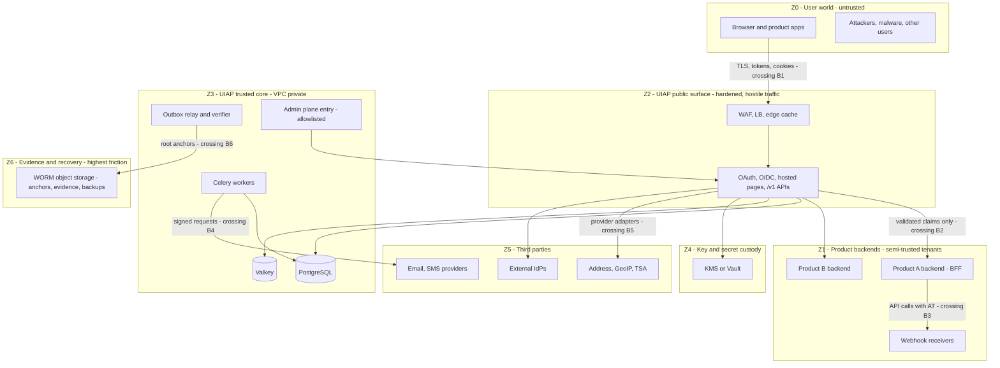

### 43.2 Boundary register (controls per crossing, "what is allowed to cross")

| Boundary | Crossing | Controls |
|---|---|---|
| B1 Z0→Z2 | all user traffic | WAF rulesets (OWASP CRS tuned), rate/geo policies, TLS, hosted-page CSP/nonce, bot scoring, header stripping (client `X-Forwarded-*` only from LB), payload size caps, `Origin` validation |
| B2 Z2→Z1 | tokens, claims, events, webhooks | `aud` binding, `iss` exact, consent-scoped claims only, event HMAC/JWT-signed webhooks + replay window, mutual rate limits (products can't flood the bus via webhooks retry storms: backpressure documented) |
| B3 Z1 internal | product↔product calls using UIAP tokens | never via UIAP — products talk via their own APIs; UIAP only vouches for identity (shared-responsibility line) |
| B4 Z2/Z3→Z5 | provider egress | per-provider egress allowlist via proxy (the SSRF dam — T-24), mTLS/signing where offered, secret rotation, provider outage behaviors (§46), *no user input in URL positions* (path-safe encoding + allowlists) |
| B5 Z3→Z4 | KMS ops | IAM: per-role key ops (unwrap yes, create/delete admin-only), jti/auth tokens short-lived, mTLS, KMS access logs off-platform (§41.3) |
| B6 Z3→Z6 | anchors, evidence writes | write-once, separate credential path (signer identity), no read-back into app (verifier is separate identity), versioned object tags |
| B7 Z2 admin ingress | admin API | IP allowlist + zero-trust broker + admin AT with `admin:*` scope + hardware MFA step-up + device trust (admin device policy stricter, session ≤ 15 min idle — §44.2) |

### 43.3 Plane protection summary (brief §52)

| Plane | Exposure | AuthN | AuthZ | Extra |
|---|---|---|---|---|
| Public protocol | internet | per spec (code/PKCE/RT) | client + user consent | strictest rate tiers, conformance tests, `no-store`, `Cache-Control` exact on JWKS |
| User-facing `/v1/**` | internet | AT or session-context | `uiap:me` + scopes; step-up per op | enumeration doctrine, idempotency, pagination caps |
| Product API (`/userinfo`, introspect) | internet (or peering VPC later) | client auth + AT | scope | aud-restricted introspection |
| Admin API | allowlisted only | admin AT + step-up + hardware keys | roles + 4-eyes | every read audited; denied attempts audited |
| Service-to-service | private net | `client_credentials` / `private_key_jwt` (V3 mTLS) | scope ceilings + `act` | short TTL, no interactive recovery, rotation policy |
| OAuth/OIDC pages | internet | browser session | cookie/CSRF doctrine | CSP/COOP/Referrer-Policy; frame-ancestors none |
| Event delivery (webhooks) | out to product URLs | HMAC/JWT-signed events | subscription filter | retry/backpressure, product-side idempotency contract |
| Internal `/internal/**` | **never** routable publicly (ingress config test in CI, §51.4) | service AT | explicit scopes per route group | admin-usable only via admin API |

---

## 44. Admin Architecture

### 44.1 Roles (V1)

`SUPPORT_READ` (identity summary + security state, **no PII values beyond masked**, no actions), `SEC_OPS` (revoke sessions/devices, force logout, lock, require-recovery, risk policy *propose*), `IDENT_ADMIN` (status changes, merges (4-eyes), credential resets *only through recovery flows* — no direct password set), `POLICY_ADMIN` (scope catalog, app approvals, security policies — 4-eyes on authz-affecting), `AUDITOR` (read-only audit + dashboards, **no** identity mutation, cannot export bulk PII, exports of audit allowed), `BREAK_GLASS` (cold, dual-control, alerting-everyone, all actions extra-audited), `SUPER` **does not exist** (the union role is prohibited — decomposition is the point, §61.2).

### 44.2 Access chain

Admin client = registered app (first-party) with `admin:*` ceiling → token requires role assignment (no org scoping in V1) + hardware-key step-up (passkey/AAL2 only — Decision: admin cannot enter without phishing-resistant factor, ever, no SMS fallback — policy floor, not configurable) + session ≤ 15 min idle / ≤ 4 h absolute + device policy (managed devices only for `POLICY_ADMIN`+; managed-device attestation = V2 hardening, V1: soft requirement via device state + anomaly alert if admin login from unrecognized device = security event to *everyone*, including the admin's team channel).

### 44.3 What admin can see (and never)

Sees: identity state, factors *metadata*, sessions/devices, security events, authn history (user-visible-equivalent), consents *list* (not granted values — e.g., "grants professional_profile, address" yes; the actual address, no), audit (own role + subject-scoped), verification evidence (via per-file vault grant, logged, time-boxed), app registrations, policies.
**Cannot (brief §54, all four named in prompt):** read password hashes or any secret (field encryption + no SELECT grant + API never returns them — enforced at DB roles *and* API layer *and* UI); bypass verification (every admin "reset" *is* a §27 recovery case — there is no "mark verified" button; the only force-path is document review with 2 humans, and even then factor *reset* not factor *verification*); modify audit (§28.2/§44.5); silently impersonate (§44.7). **Also cannot:** read unmasked email/phone (masked in admin APIs; unmasking requires a scoped, *reasoned, step-up'd* `reveal` action — audited + visible to user in their Security-Center "admin activity" view — Decision: user sees admin looked/revealed, because transparency-to-the-subject is a privacy control not an obscurity failure; enterprise tenants may be able to silence *content* but never the *fact* of access).

### 44.4 Admin actions pipeline

every admin call: `POST /v1/admin/identities/{id}/actions/{action}` requires: `reason` (min 20 chars, no-PII lint), `ticket` (required always — no incident-mode exemption; validated host allowlist), `expected_row_version` (`If-Match` concurrency), step-up grant (§16.5), dry-run mode via explicit `?dry=true` for non-destructive planning, 4-eyes for: merges, suspensions of *active paid* identities?, policy authz changes, emergency key revokes, role grants to `POLICY_ADMIN`+, admin creation — approvals land in queue (other-holder or security channel; approver sees diff not PII).
Outcomes: audit (actor = admin, `via = admin-api`), **subject notification** (security event to affected identity's in-app always; email if action is identity-affecting: suspension, credential resets, forced recovery), event emission to products (they react: a suspended user's product sessions must die via §23.6 cascade — Decision: admin suspension triggers full session+lineage revoke, products also subscribe).

### 44.5 Impersonation & support access (brief §54)

`POST /v1/admin/impersonations/begin {identity, reason, ticket, mode: view|assist|act, ttl≤30min}` → **modes:** `view` = admin sees *their own* Security-Center-like window with the target's *data* masked per role rules (support often needs "the user's screen" = hosted-page rendering *to the user* via a one-time share-link the **user** initiates ("help me" flow: link valid 10 min, user watches, revocable anytime, screen-share optional product-side); `assist` = UIAP renders the target's security pages *inside a supervised session* — Decision: no "live proxy browsing as user" in V1 (too dangerous), only guided-action (admin can *send* the user a deep-link to start flows with pre-filled context, user acts); `act` = admin acts *as* user — reserved for recovery completion (e.g., confirm email change) and requires: user consent token (user emailed "admin X is helping, approve within 5 min") + explicit per-action step-up + the *action executes through the user's own constrained "act" session*: same rules, same step-up, plus `act` claims in tokens and **persistent visible banner** on every affected page + audit `actor=admin, on_behalf_of` **and** `impersonation_id`.
Impersonation tokens: `act.sub = user, act.azp = admin-client`, `amr + [imp]`? — `acr: impersonated` value added (products can treat "impersonated sessions" with extra friction — documented in claims, §15.7); TTL hard 30 min, single concurrent per admin, auto-end on any risk HIGH on the underlying admin session, kill-all available to *user* (Security Center shows "admin session active" + one-click terminate). Silent impersonation: architecturally impossible (no such mode; the protocol surface requires the `impersonation_id` and every plane renders/records it).

### 44.6 Kill-switches & incident levers (operator-capability design)

Per-identity `force_introspection` flag (sensitive endpoints honor; products subscribing revocation feed honor globally — §14.4); app suspend; policy freeze (risk → ALLOW-log; §25.4); `sid` global revoke; JWKS emergency (41.2); region failover (48). All via admin API, 4-eyes, audited, rehearsed in game-days (§51.6).

### 44.7 Audit-of-audit, self-lockout prevention, and support UX

admins cannot revoke *their own* audit access; admin lockout handled by break-glass ceremony; daily admin-digest (counts by action type, anomalies) to security channel; onboarding: admins are identities like everyone else (their MFA = passkeys, their recovery = same §27 flows *without* any special path — symmetry by design: "the back door you build for admins is the back door attackers find").

---

## 45. Observability (brief §49)

### 45.1 Four signal planes, one doctrine (kept separate — the brief's ask, restated as Decision)

1) **Logs** (operational): structured JSON, level-key fields, **PII-redaction at source** (INV-14 + registry of sensitive fields + entropy-scan sampling), correlation ids, 30/180 d retention (R-32), shipped to in-region Loki (self-hosted — vendor-log-PII risk avoided; Decision).
2) **Metrics** (operational + business): RED + platform SLOs; namespaced counters: authn outcomes (by code, method, app — **no per-identity cardinality anywhere**, label denylist enforced by metric-SDK guard), latency histograms (login, token, step-up, risk-eval, revocation-lag, outbox-lag, anchor-lag), rate-limit hit counts, cache hit ratios (§35 targets), queue depths + age (critical/default), Argon2 pool stats, Redis/PG health, JWKS age, session-mint-vs-reuse-detected; Prometheus + Grafana, SLO burn-rate alerts (multi-window) — the *authn success-rate* dashboard is the platform's heartbeat (page threshold: −5 % absolute 5 m, 2 m fast burn; Initial Targets).
3) **Traces** (OTel): W3C `traceparent`/`tracestate`, root per request, spans: middleware, each factor verify, DB (query spans sampled), provider calls, *never* claim/token/otp values (attribute denylist); 100 % sampled for authn error paths, head-based 10 % + tail-all-for-errors; Tempo 30 d.
4) **Audit + Security events** (§28, §23.7, SecurityEvents): *not* observability — different consumers, different retention, different guarantees; never routed into the logs pipeline; the SIEM feed (§52.5) mirrors *security events* (not raw audit — privacy layering, documented).
5) **Correlation IDs propagation:** `X-Request-ID` minted at edge (or client-provided, length-capped), `trace_id` = W3C, **`correlation_id`** = client-provided `X-Correlation-ID` echoed + propagated into: logs, traces, problem-docs, events (envelope), webhooks, audit rows, and provider-request ids (SMTP `X-Entity-Ref`, SMS ref) — the single rule that makes "trace a user report from inbox to DB row" one query (Decision: this is a top-3 support feature; implemented as middleware in V1 not later).

### 45.2 Synthetic & UX-level observability

hosted-pages RUM = **none** (privacy: no browser analytics on login pages — Decision; server-side timings + field-data from the provider (email/SMS delivery receipts) + optional *anonymous* Web Vitals? rejected; if product teams need page-performance data they proxy through their own consented analytics — contract note); synthetic checks: per-region canary identities (a real account, real factors, scripted full login+refresh+revoke round-trip every 60 s per region — catches half-broken prod (provider creds, key mismatch) that 200s hide); cert/TTL/secret expiry dashboards; provider canaries (SMS test number, email seed inbox, geocoding probe address).

### 45.3 Security monitoring (platform-side, feeds SOC)

detection-content list (each = alert + rule ref, V1 minimum set): authn-success-rate drops (app+global), stuffing pattern (fail-rate/aliases/IP-set), reuse-detected spike, admin anomaly (new geo, volume, after-hours), verification velocity per identity (ATo beacon), redirect-URI-change events, application secret rotation, JWKS emergency use, outbox lag, audit anchor failures, revocation-feed lag, rate-limit saturations, KMS failures, Argon2 pool saturation, geo-provider failure, cross-app audience anomalies (introspection of foreign `aud` tokens = scanning behavior). SIEM contract: OCSF-class normalized security-event JSON via a dedicated consumer (never direct DB), PII fields per feed-schema (country, not street).

### 45.4 SLO/error-budget policy (operational decision)

SLO-1 public authn availability 99.9 % (V1) / 99.95 % (V2); SLO-2 login latency p95 ≤ 300 ms; SLO-3 revocation propagation p99 ≤ 60 s; SLO-4 OTP delivery p95 ≤ 45 s (per class measured); SLO-5 zero audit anchor gaps (availability of *integrity*, not latency); error budgets: feature freeze at 50 % burn, release gate at 100 % (documented so the tradeoff is a policy, not a fight).

### 45.5 Product-facing observability (they run services too)

Per-app dashboards: token volumes, error rates, latency, webhook delivery health + DLQ depth, consent/revocation volumes; "your integration is failing X" reports (proactive; supports the portfolio-adoption program: visibility is how a platform team avoids becoming a ticket queue — operational principle, recorded).

### 45.6 Health/Readiness/Liveness & release safety (brief §63 line items)

`/healthz/live` (process), `/readyz` (PG + Valkey + KMS-reachable + JWKS loaded + outbox-relay heartbeat + clock skew < 200 ms (NTP watchdog) — **Decision: skew is a readiness condition**: a drifted authn node = token expiry chaos), release: blue/green (54), canary (5 %) with SLO-delta auto-rollback rules, `X-UIAP-Build` header for fleet version skew observability (support forensics: "was this node on 1.23.2 during the incident?").
---

## 46. Reliability and Failure Modes

### 46.1 Doctrine

Two rules resolve almost every reliability-vs-security dispute here: **(R1) the authentication critical path fails *closed* on anything that would mint or extend access; (R2) it fails *open* (degrade, defer, shed) on anything that only enriches or notifies.** Every dependency below is assigned to R1/R2 explicitly, and every "open" has a compensating detection/alert so degradation is visible, not silent.

### 46.2 Dependency failure matrix (brief §64, exhaustive for V1)

| Dependency down | Detection | AuthN behavior (Decision) | Products |
|---|---|---|---|
| Redis/Valkey | health checks, command errors, replication lag | **R2**: session cache misses → PG (latency up, correctness none); counters fall back to static local ceilings (§24.6); locks (refresh single-flight) degrade to *no serialization* — accepted: RT reuse races get *more likely* under Redis outage → mitigation: during degraded flag, token endpoint tightens (RT reuse suspicion auto-revokes full family — the conservative direction is *revoke*, since users re-login but attackers don't get to keep stolen tokens); ceremony stores (WebAuthn) → users retry ceremony; OTP unaffected (PG) | transparent (metrics show) |
| PostgreSQL primary | Patroni, failures | **R1**: 503 + `Retry-After` (no fake-success, no "optimistic authn"); replicas serve *read-only* profile/audit? **Decision: no** — split-brain protection beats degraded reads for authn; products rely on their own sessions + AT TTL (G-11) | "log in later, stay logged in" contract holds (§46.4) |
| PG replica (read lane) | lag metric | profile queries move to primary (load up); replica lag alert | none |
| Email provider | canary, receipt SLO | §30.6: OTP → retry/fallback SMS; security → queue+escalate+in-app banner; login unaffected | none |
| SMS gateway | canary | OTP via email if factor available else honest `503 delivery_unavailable` (R1 for *new factor enrollment*, R2 for login OTP: policy `sms_unavailable: [allow_email_fallback|fail]` app config) | banner from product UX (their call) |
| Address provider(s) | canary probe | §20.4: `suggest/parse` degrade (raw save, `needs_review`), saves never blocked | none |
| GeoIP provider | canary | `new_country` abstains (§25.3 fairness rule), login proceeds; enrichment re-queues with backoff | none |
| KMS | API errors, sealed health | **R1-soft**: signing continues with boot-loaded keys (in-process; outage = "no rotation possible", alert); *unwrap* of field keys = authn of factors fails → policy: 5-min in-proc DEK cache covers blips; beyond: login R1 (can't verify password hash without DEK… actually password hashes don't need DEK — only encrypted fields do: lookup-by-alias (blind index) needs `k_blindindex` HMAC key — also in-proc cached; so KMS blips are absorbed by design; sustained KMS outage: R1, honest 503 (can't verify TOTP secrets etc.) | none |
| Event bus (Redis streams) | relay lag | outbox holds (PG durable), consumers idle, replay on recover (§29.4) — notifications/enrichment delayed, alerts fire at lag 5 min | webhook backlog + delivery-late headers |
| External IdP (login with Google…) | callback failures | that *button* errors gracefully (local factors always work); no retry storms against provider (circuit) | n/a |
| TSA / WORM anchor | anchor-lag metric | audit keeps chaining; anchoring queues (24 h SLO; beyond ⇒ CRITICAL alert, never drop audit) | none |
| SIEM feed | consumer lag | platform unaffected (fire-and-forget) | none |
| Celery worker/broker | queue depth, heartbeat | §36.5 (OTP queue special: 2-min alert escalation; if `critical` queue unprocessable > 5 m ⇒ OTP sends fall back to *in-process* direct-send mode (R2: degraded but functional — the one deliberate "sync escape hatch", documented, rate-capped) | none |
| NTP/clock skew | readiness metric | skew > 200 ms ⇒ node drains from LB (never a half-working authn node); sustained cluster skew ⇒ Decision: drain + page — no compensating expiry-grace is invented on the fly | tokens already minted: client-side validation unaffected |
| LB/edge | health | multi-zone, DNS failover (TTL 60 s, client guidance), WAF rule change = staged rollout | 48.4 region runbook |

### 46.3 Bulkheads (the "modular monolith does microservices' isolation, cheaply" answer)

Separate worker node pools per queue class (36.2); DB connection pools split `authn (rw) / read (r) / audit-append (rw, own pool)` so audit-write bursts can't starve login; Redis split into 2 logical DBs/clusters? — Decision V1: one cluster, key-prefix ACLs + maxmemory policies per use class documented; extraction candidates keep the seam (§8.1) so when bulkheads are insufficient, split happens by *moving a pool out*, not redesigning.

### 46.4 Product outage contract (G-11) — the anti-SPOF design (brief §62)

During full UIAP unavailability, products keep serving **already-authenticated users**: (1) ATs self-verify offline (≤ 10 min, then session-bound products keep their own BFF sessions alive per their policy — UIAP *recommends* product sessions ≤ 8 h so one UIAP outage never equals portfolio-wide lockout storm at recovery); (2) refresh fails with retryable `503` — clients MUST NOT treat it as logout (reference client logic ships with the spec: exponential backoff, 30-min grace UX "temporarily offline"); (3) step-up/introspection calls fail ⇒ products' sensitive ops *deny* (correct behavior); (4) sign-in = unavailable (expected — stated in onboarding so products cache-priming decisions are informed). This contract turns "IdP down" from *portfolio outage* into *new-logins-down*: SSO tradeoff accepted at V1 by design, revisit per product (offline-first kiosk flows V3+).

### 46.5 Load shedding & admission control (priority list, normative order)

Under saturation: 1) disable risk enrichment async (accept stale), 2) disable address suggest/parse endpoints (503 with Retry-After), 3) disable non-critical reads (profile lists, heavy admin queries) with 503, 4) never widen rate-limit ceilings under load (tighten only on abuse-detection); 5) hosted pages serve *cached static* minimal login (no dynamic risk checks) — last resort; never shed: OTP verify, password verify, token mint, revocation, audit append (R1 core = "verify + deny + record", the three things we never compromise — recorded as the reliability constitution).

## 47. High Availability

### 47.1 Topology (Initial Target, region = OQ-02)

App: k8s, ≥ 3 replicas/zone across ≥ 2 zones, HPA (CPU + in-flight + p95 latency signals), PodDisruptionBudget (minAvailable = ceil(2/3)), anti-affinity per zone; hosted-pages pool separate from API pool (different scaling + risk, 8.2). Ingress: managed LB ×2 (failover DNS), WAF, rate-shield; static/JWKS/discovery via CDN. PgBouncer: 2 pods (one/zone). PostgreSQL: **Patroni + etcd (3 nodes, cross-zone)** — 1 primary + 1 **synchronous** replica (zone 2; `synchronous_commit=on` for audit/token/session writes — RPO≈0 for security-relevant commits) + 1 async (reads + backup source); failover < 30 s detection + < 60 s promote (measured; runbook for stuck-failover); VIP/DNS via `pglookout`-style supervisor? — Decision: clients connect via PgBouncer + service name (DNS-based, no VIP magic), Patroni `failsafe_mode` documented. Redis/Valkey: 1 master + 2 replicas + Sentinel (3 nodes cross-zone), AOF everywhere (ceremony stores durability = bounded-loss accepted: losing ≤ 1 s of *ephemeral* state ⇒ users retry — correct per §35.3 classification; **Decision: no multi-AZ quorum overkill for V1**). Celery broker = same Redis (separate logical instance if size requires: threshold documented). Object storage = region-managed with WORM (ZRS class).

### 47.2 Health, readiness, graceful behavior

readiness gates: 45.6 list; liveness = process; startup probes = 90 s (key load + warm caches; cold-start storm protection: JWKS+configs pre-warmed from a snapshot cache in Redis/PG so a full cluster boot doesn't stampede KMS); preStop drains (SIGTERM → finish in-flight ≤ 25 s → close LB); connection draining on PgBouncer restarts. Zero-downtime deploys: blue/green at ingress (both fleets live; migrations expand/contract 34.6; `X-UIAP-Build` skew visibility).

### 47.3 Data-path HA decisions (the trade table)

| Question | Decision | Why |
|---|---|---|
| sync or async replica for commits? | **sync** for security-relevant writes (audit, tokens, sessions, consents), async-allowed for profile/media metadata (via per-connection `synchronous_commit` tuning by pool) | RPO 0 where tampering/revocation matters; latency where it doesn't |
| quorum writes for challenges? | no — single-primary + sync-replica enough (Redis only for cache) | simplicity wins at this write volume (validated: 500 writes/s target, 49) |
| multi-region active-active DB? | **no** (residency + consistency + cost) | 37.6 seam; revisit V3+ (post-product-need, pre-consensus-toolkit-regret) |
| session storage | PG sync + Redis mirror + feed | revocation correctness beats microseconds (23.2) |
| Redis loss = session loss? | no (PG rebuilds; sessions survive Redis — the deliberate opposite of Keycloak's default; ADR-0012) | brief §47 honored; ops simplicity > perf: cache handles load, DB handles truth |

## 48. Disaster Recovery (brief §62, §65)

### 48.1 Objectives (Initial Targets — validate in the quarterly game-day)

In-region: RPO ≤ 60 s (sync replica; worst case = promote lag), RTO ≤ 15 min (Patroni promote + LB reroute + readiness). Region-loss: RPO ≤ 5 min (WAL streaming cross-region + daily encrypted snapshot in DR region or vendor object replication; **Decision: WAL-G streams WALs to DR-region bucket — continuous, no snapshot-gap surprises**), RTO ≤ 4 h (bootstrap new cluster: infra modules, restore, verify anchors, warm caches, DNS cutover; rehearsal = semi-annual full game-day). Zero-loss guarantee boundary: only committed-sync transactions (anything the client got a 2xx for) — stated precisely because RPO claims that ignore ack semantics are the classic DR lie.

### 48.2 Backups

pgBackRest: daily full + continuous differential/incr + WAL archiving (both regions), encrypted with KMS (40.5), **immutable/object-locked copies** (ransomware defense: WORM for 35 d + air-gapped-ish secondary (no write creds in cluster IAM)), key rotation of backup keys yearly, *quarterly automated restore tests* (restore latest → checksum spot-tests on audit chains + counts against live → report; **a backup without a passing restore test is not a backup** — policy, 48.6 lists the drill). Config/IaC itself in Git (restore = rebuild infra from code + restore data — infra-as-code requirement justified by this line, not fashion).

### 48.3 Runbooks (one page each, owned, gamed):

PG failover; stuck-replication; restore-from-backup (PITR to `now()-5min` for corruption cases — PITR *is* the corruption tool: pause, point-in-time clone, diff, decide, repoint); Redis total loss (rebuild mirrors, static ceilings active, verify sessions from PG); event-bus loss (outbox replay from marker); audit-chain break (isolate, verify against anchors, forensic copy, disclose); KMS region loss (cached keys, boot from snapshot cache, no new unwraps beyond TTL); object storage loss (multi-zone ZRS + cross-region replicas; evidence vault degraded ⇒ manual review pauses); signing-key compromise (48.5); full region evacuation (48.4).

### 48.4 Region evacuation (the only *real* DR)

Trigger: region unavailable > 30 min or data-integrity event. Steps: declare (security + platform lead), freeze registry changes (config sync lag), promote DR: infra deploy from code (30 m budget), DB restore to PIT, JWKS already region-neutral (public keys identical — signing keys: replicate via KMS multi-region keys or pre-distribute? **Decision: signing + field keys available cross-region via multi-region KMS key policy — an availability requirement, documented as such; if hosting is single-region-managed-cloud, the runbook says RTO=KMS-region-RTO**, flagged in OQ-02), drain old (if alive: stop replication writes, retain for forensics), repoint DNS per-region + products told "sessions live: RTs valid (lineages exist in restored DB); consents/audit consistent (restored at PIT); *some unacked* writes since PIT may be lost — the only data-loss window and it's ≤ 5 min + documented). Re-enable enrichment after (geo backlog processed, outbox markers preserved so products resume cleanly). Post-incident: reconciliation jobs (counts, anchors, lineage integrity) run pre-announcement.

### 48.5 Disaster scenario playbook table (brief §65, concrete)

| Scenario | Containment (automated where possible) | Recovery | Follow-through |
|---|---|---|---|
| DB compromise (attacker dump) | alerts (audit stream anomalies, DB creds rotation self-trigger); assume *all* DB-resident secrets known: rotate blind-index + field DEKs (rewrap), client secret *hashes are fine*; **force global session+RT revocation?** — Decision: targeted by risk (blast radius 10 M users is the attacker's win); default = revoke suspicious cohorts (no MFA + high-risk) + enable `require-introspection` for sensitive ops fleet-wide + shorten AT to 5 min; notify counsel (breach assessment, 37.7/§52) | rebuild cluster from code + restore, re-verify audit chains, KMS key policy review | postmortem; rotation drills (48.6) |
| Signing key compromise | **emergency JWKS rotate (15.8): retire kid, force-introspection mode, revoke all sessions/RTs** (an AS key leak = every token forgeable: *this one* warrants global re-auth even at pain; Decision + rationale in ADR-0013 consequences) | new key generation, discovery republish, verify clients handled refresh (dashboards per app) | TSA/anchor: key events recorded; notify products of forced re-logins (comms template exists) |
| Refresh token leak (bulk) | rotation already bounds (stolen-but-rotated = reuse detected ⇒ family revokes); if attacker has *valid unused*: revoke lineages for affected sessions (feed-driven), targeted session kills, risk flag devices | users re-auth (annoying, bounded), monitor reuse-detection tail (new lineages = attacker active → escalate to step-up everywhere for cohort) | root cause (log leak? client leak? — jti/lineage forensics R-15) |
| OAuth client compromise (secret or its redirect URIs) | suspend app, rotate secret, revoke its tokens (RTs + sessions' app-side mirrors), audit redirect changes, review userinfo volumes for exfil | re-register with `private_key_jwt`, security review before re-activation (17.6) | product incident report required (contract, 52.4) |
| Admin account compromise | lock admin (`force-logout`, role suspend, credential revoke = all admin tools), rotate admin MFA (forced re-enroll), audit-review every admin action of the account (search by actor, export), **verify audit chain for the window** (they may have tried T-21) | restore admin state after evidence snapshot, 4-eyes retro-review of their actions, break-glass check for misuse | postmortem + admin-policy tightening (e.g., managed-device required for that role) |
| Notification provider compromise / abuse | provider creds rotate (blast radius: they see recipient lists = PII: treat as *breach* per 38/§52 — provider DPAs pre-sign this duty), DKIM/SPF/DMARC alignment audits, quarantine security templates (in-app-only until cleared) | switch provider (adapter swap — the abstraction pays exactly here), verify bounce pipeline intact | notify users if mailbox metadata exposure deemed material (process, not feature) |
| Redis data loss | none needed by design (23.2/47.3); mirrors rebuild from PG; counters reset (documented effect: throttling window restart — compensate: attempt-caps stay because they're PG (12.4)); sessions survive (PG) | none | postmortem: was the *assumption* (35.3) still true? — the one place this doc self-checks |
| Audit storage loss (partition) | verify worker flags gap (28.4); restore from backup + cross-verify against daily anchors (WORM) — **the anchors prove the restored shard is the real one, not an attacker's reconstruction** | re-anchor: seal current, re-publish day anchors after reconciliation | if unrecoverable: disclose per compliance policy (52.5), incident severity Sev-1 (audit integrity is a product-level promise) |

### 48.6 Drills (policy): quarterly restore test (automated), semi-annual region game-day (human), annual signing-key emergency (tabletop + one prod-equivalent rehearsal), annual admin-compromise tabletop; results land in this doc's appendix change-log (governance: the doc *is* updated when drills falsify a number).

## 49. Scalability

### 49.1 Ladder and levers (Initial Targets — capacity model, not promises; each gate = load-test evidence (§51.5))

| Scale | Bottleneck & lever |
|---|---|
| 10 K users | none architecturally; correctness focus (conformance, drills) |
| 100 K users | read amplification on profile/sessions → cache hits (35) + replica lane; authn_events volume → partitioning (23.7); Argon2 CPU at login peaks → pool sizing (10 min AT TTL means *steady-state* mints dominate, not verifications — measured in load tests: verify the assumption that login ≈ 1–2 % of requests/min at peak) |
| 1 M users | outbox volume + webhook fan-out → per-app subscription backpressure + batching (fan-out 10 M/day is fine, tail latency isn't); audit write throughput → stream partitioning (28.5); session table growth → partition + archival (R-14); first extraction candidates appear (profile read-service? audit ingest-service?) — Decision gate: measure, then extract per 8.1 seams, never pre-extract |
| 10 M users | authn_events ≈ 3–50 M/day (portfolio-dependent) → move coarse analytics to columnar sink, keep PG 25-mo fine window (23.7); risk scoring → per-region feature caches (25); JWKS/discovery → CDN already; **the one structural choice to revisit at ≥ 10 M: identity id range → PG partitioning by `region_tag` + per-shard clusters with identity→shard routing via directory** (routing directory = new component; only build it *with* the scale trigger, documented in §37.6); Redis → cluster mode (per-purpose clusters) |

### 49.2 What does *not* bottleneck (definitive, so teams stop worrying about them)

token verification (products' CPU, trivial per JWT); consent checks (cached + indexed); profile reads (replicas+cache); event fan-out (per-subscription queues scale with consumers); JWKS (static). The actual bottlenecks are, in order: (1) Argon2id throughput (a *chosen* cost — budgeted in 50.3; mitigation path: password→passkey migration literally reduces the ceiling, quantified for leadership comms), (2) audit+outbox commit coupling (mitigated: per-partition chains + batching inside transaction limits; extraction of audit = the V3 lever), (3) session write-behind contention (mitigated: 60 s idle-touch batching — the *only* place we allow stale-enough-but-bounded design; documented in 23.2), (4) Redis single-writer on hot lock keys (sharding per use-class at 10 M).

### 49.3 Tenant fairness

per-app ceilings (scope volume + rate + event fan-out budgets) prevent one product's launch week from degrading others (platform-tenant contract, dashboard per app, auto-throttle on breach with owner notifications — Decision: *protect the portfolio from its own products*, the SPOF problem is sociotechnical too).

## 50. Performance (brief §71 — all numbers Initial Targets, validated by load/soak per §51.5; recorded as SLOs on approval)

### 50.1 Budget table (server-side, p50/p95/p99, excluding network)

| Operation | Budget | Composition notes |
|---|---|---|
| POST /oauth2/authorize (authn success incl. password verify + risk + session mint + outbox + audit) | 150/300/600 ms | Argon2 60–250 ms + PG ~8–20 ms + risk ≤ 10 ms + audit ~3 ms + overhead |
| token exchange | 40/120/300 ms | hash lookups, single tx |
| refresh (rotation) | 30/90/250 ms | lineage lock included |
| introspection (hot cached path) | 5/25/80 ms | Redis-hit; PG path bounded |
| userinfo | 15/60/150 ms | primary-consistent (authn-critical reads on primary, 35.4) |
| profile get (cached) | 3/20/60 ms | |
| session list | 8/40/120 ms | indexed (identity, status) |
| security overview | 20/90/250 ms | fan-in bounded (parallel, caps) |
| risk evaluate | 3/10/30 ms | rule-table, no per-request geo calls (cache-first) |
| step-up complete | 40/120/300 ms | ceremony-bound |
| admin search identities | 50/250/800 ms | bounded windows (33.9) |
| OTP enqueue (request side) | ≤ 8 ms p95 | queue write only — delivery is SLO-4 (45.4), measured separately (provider territory) |

### 50.2 Query/limit rules (implementation-facing ceilings, CI-enforceable)

login path ≤ 6 statements (anti-N+1 rule: lint via query-count assertions in integration tests); no statement > `statement_timeout=500 ms` online (tuned per pool, bulk pools exempt); list endpoints cursor-only; `EXPLAIN ANALYZE` gates on new queries touching > 10⁶-row tables; per-request DB time budget 250 ms default; response serialization caps (profile ≤ 64 KB).

### 50.3 Argon2 capacity note (the honest math)

at `m=64 MiB, t=3, p=4` (~250 ms CPU-verify): one vCPU ≈ 4 verifications/s → a 16-core node ≈ 60/s; 10 M users with 2 % daily login rate ≈ 5.8 logins/s average, peak×20 ≈ 120/s → ≥ 3 dedicated authn nodes minimum at *peak password-heavy*; migration to passkey/passwordless (OTP for no-password accounts is cheaper, TOTP verification ~0) **reduces capacity cost** — recorded as a funding argument for G-04; load tests tune the params (floor: keep ≥ 150 ms p95 with headroom; if p95 blows, add nodes, don't weaken hashing — Decision, stated so perf tickets don't quietly degrade crypto).

### 50.4 Cache & hit-ratio targets

session-read 90 %+ Redis hit; userinfo 40–70 % (products' own caching per contract); app-config 99 %; risk feature caches 80 %; miss-paths bounded (never multi-miss stampedes: single-flight per key, 50 ms jitter); JWKS/discovery edge 99 %+; profile replica 85 %+.

### 50.5 Latency *budget allocation* governance

any new synchronous dependency must fit the budget (submit an ADR with measurement); dependencies > 100 ms p95 default to async-or-503 (P-07/P-12 combined); this table is the reference the CI perf-regression suite gates on (k6 scenarios per flow vs budgets, PR-blocking for > 10 % regression on authn p95; load profile: 100 %-ramp 20 min, spike 3× 5 min, soak 8 h — 51.5).
---

## 51. Testing Strategy (brief §69)

### 51.1 Levels & ownership

Unit (domain rules, invariants INV-01…17 as property tests — `hypothesis`-class, e.g., "any sequence of merges preserves the survivor set of ids"; normalization/IDN/bidi corpus tests 53.x); Integration (module↔PG real containers: constraints actually fire — blind-index uniqueness, one-CURRENT-key, challenge one-open-per-purpose, session↔device cascades; testcontainers, no sqlite stand-ins — Decision: **the DB behavior IS the architecture's guarantee**); Component/flow tests (full request paths with real tokens: login→token→refresh-rotate→reuse→revoked, using the *real* verifier).

### 51.2 Contract & conformance (the platform-killer tier — invested in deliberately)

- **OpenAPI contract tests:** provider-side schema conformance (schemathesis-class fuzz against the spec) + consumer expectations per product via consumer-driven contracts (Pact-class, repo `contracts/`): **every product onboards with a contract suite**; breaking changes fail CI before code review (33.8's promise without this = fiction).
- **OIDC conformance:** OpenID Foundation **OP certification test suite** runs per release against a staging instance (Basic, Config, Form Post N/A, Hybrid opt-in, Provider Config Standard/Private); results published; failures = release blockers. OAuth layer: RFC 9700 checklist encoded as executable tests (every BCP MUST is a test name — the mapping table lives in the test repo, count maintained: e.g., "BCP MUST-42: redirect exact match" ↔ `test_redirect_exact_match`).
- **WebAuthn:** matrix tests (FIDO conformance subset for *server side*: assertion verification, counter semantics, attestation=none, synced-passkey cases) across Chrome/Safari/Firefox + iOS/Android passkey providers; plus adversarial corpus (cross-origin challenges, stale count, alg-downgrade).
- **Interop:** "product zoo" fixture suite: BFF SPA, public SPA-cookie, native (AppAuth-parity), partner confidential, service `private_key_jwt`, legacy `client_secret_basic` — each runs full lifecycle: register→consent→login→refresh→rotate→reuse-detect→revoke→logout→back-channel.

### 51.3 Invariant & abuse testing (the security-semantics suite)

Enumeration corpus (39/24.7: byte-identical response assertions + latency-window assertions (± 20 %), timing-oracle fuzzers); factor-floor attempts (delete-last-factor games), consent boundary matrix (scope × visibility × revocation), redirect-URI abuse corpus (subdomain tricks, userinfo-in-authority, percent-encoding variants), PKCE downgrade attempts, `aud`-substitution (product A token at product B = always 401: INV-15 suite), step-up laundering (§24.2 races), session fixation checks, rate-limit boundary fuzz (off-by-one storms), idempotency replay races, clock-skew matrix (expired/challenged/±skew at 30/60/120 s), **merge safety suite** (11.6: concurrent merges, rollback, product-linkage), retention/erasure reconciliation suite (37.4: after erasure, assert no query returns PII + audit chains still verify), redaction pipeline tests (logs/metrics/traces never contain seeded PII markers — the *canary-PII* pattern: seed fake emails/phones, assert absence in sinks; INV-14 enforced, 22.5/41.4 too).

### 51.4 Security testing (brief §70)

OWASP ASVS 5.0 Level 2 checklist (authz/identity/session/defense against platform-class attacks = L3 items: V2, V3, V4, V6, V7) — *tracked as issues with owners, re-run quarterly*; OWASP Top 10 mapped (each entry has a test in 51.3 or an explicit "not applicable because…" — the doc-level claim is checked by test names, not vibes); **threat-model-driven pen-tests**: annual external + pre-GA, scope = this doc's §42 (attackers get the architecture doc — black-box + grey-box), findings SLA: critical 7 d fix, high 30 d; SAST (semgrep + bandit + django-specific), DAST (ZAP baseline on staging nightly with auth profiles), SCA/dependency audit + license gate (deny propagating copyleft in proprietary server-code paths per legal policy OQ-12; Valkey (BSD), Celery (BSD), Django (BSD), Authlib (Apache-2.0) all clear; Redis upstream is RSALv2/SSPL and is excluded by default — see App. A), secret-scan (41.4), container CVE, **supply-chain**: build from lockfiles in sandbox, provenance attestation (SLSA L3 goal), cosign-verify at admission (62).

### 51.5 Performance/load/soak (gates)

k6 suites per flow vs 50.1 budgets: (a) steady: scale-gate matrix 100 K/1 M/10 M profiles (synthetic data generators in-repo), (b) spike 3×5 m, (c) soak 8 h (memory: Redis maxmemory behavior, session-write-behind growth curves, Argon2 pool stability), (d) stampede: cold-start cluster (JWKS/config pre-warm proof), (e) failure-injection perf (Redis kill: assert static ceilings hold *and* latency degrades < 2×). Pass criteria: budgets + no error-rate > SLO + no unbounded resource curves (reviewers read the graphs, not just pass/fail).

### 51.6 Chaos & game-days (brief: chaos)

tooling: Chaos Mesh-class (kill PG primary mid-load; expect RTO ≤ 60 s + zero *committed* loss — the 48.1 claim tested); kill Valkey master (sessions survive from PG — 23.2 claim tested); KMS API stall (cache absorbs — 46.2 claim tested); provider fakes (email/SMS down sim); clock-skew injection (drain behavior); full-region simulate (restore from PIT in shadow); audit verifier adversarial (test suite *edits a row via superuser in staging* — verifier MUST scream); quarterly cadence with postmortems updating §46–48 numbers when they were wrong (this loop is *why* the doc's labels are honest).

### 51.7 Fuzzing & robustness

schema fuzzers (fuzzapi/class: OpenAPI-driven) on `/v1/**` + protocol params; normalizer fuzz (Unicode: combining marks, RTL overrides (U+202E — T-? named Trojan-Source class 53.3), IDNA edge (fullwidth digits, confusables), bidi address strings — seed corpus maintained); JWT parser fuzz (malformed, alg-confusion, kid-absent, oversized, decompression bombs — `jwcrypto`-level hardening asserted); Argon2 param-boundary tests; **webhook receiver fuzz** (products receive hostile events — our bug if they break: contract tests include malformed-signature, huge payload, replay). E2E: Playwright for hosted flows (login, MFA, recovery, consent, Security Center — RTL passes included, a11y axe gates 53.x).

## 52. Compliance Readiness (brief §74 — no certification claims, controls ready; all mappings are *readiness*, audits happen when scheduled)

### 52.1 GDPR (design posture, not legal opinion — counsel OQ-09/11)

Mapping: Art. 5 principles → (minimization 37.5; purpose 26/37.2; storage-limit 39; integrity/confidentiality 40/28; accountability 28+45+ROPA 37.7); Art. 6/7 → lawful basis register (37.2) + consent mechanics incl. withdrawal-equals-easy (26); Art. 12–22 → 37.3 self-service (export/rectify/erase/restrict/object) + portability (JSON); Art. 25 → default-deny caches, claim minimization, blind indexes; Art. 30 → ROPA from §10/§38/§39 tables (generated, versioned with this doc); Art. 32 → the security doc IS Art. 32's "appropriate measures" evidence trail (cite sections in audits — this section's purpose); Art. 33/34 → breach runbook with 72-h workflow + user-notification templates (30.3 — security class exists for this) + *processor-to-controller* notification duty to products (DPA clause); Art. 35 → DPIA template per new data-flow (onboarding checklist includes "DPIA triggered?"), risk-engine LIA (25.6); transfers → residency design (37.6) + SCC-analog stance in DPAs (per OQ-02 final).

### 52.2 SOC 2 (Trust Services Criteria, CC-series readiness)

CC1 control environment: this doc + ADRs + change gates (33.8, 44); CC2 comms: product security notices, incident templates; CC3 risk: threat model (42) reviewed annually, risk register = OQs; CC4 monitoring: 45, drills 51.6, log/monitor immutability (28); CC5 control activities: access provisioning (roles 44), change mgmt (CI gates), **deprovisioning** (admin offboarding = role expiry automation); CC6 logical access: least privilege (34.7, 43), MFA everywhere incl. admins (44.2), encryption (40), network (43.3); CC7 system ops: runbooks (48.3), incident mgmt, capacity (49, 51.5); CC8 change mgmt: migrations 34.6, release gates (51.5/33.8), config-as-code; A1 availability: 47/48 + SLOs; C1 confidentiality: PII maps (38) + retention (39) + subprocessors (37.7); P1 privacy: 37; PI processing limitation: scopes/consent (26). Evidence generation: mostly automatable from this doc's tables (that's why they're tables) — the audit-prep workstream = export mapping to evidence store (V2 operational task).

### 52.3 ISO 27001 (Annex A/2022 readiness, mapped)

A.5 policies (this doc + governance App. E), A.5.15 access control (roles/scope matrices), A.5.17 PII (37/38), A.5.19–22 supplier (provider DPA clauses, subprocessor registry), A.6.1–6.4 HR (admin trust model 44.7), A.7 secure dev (SDLC 55), A.8.2 privileged (break-glass, dual control), A.8.9 config (registry), A.8.10 capacity (49), A.8.12–13 audit + monitoring (28/45), A.8.14 protected data (40 + classification 38), A.8.15 logging (45, redaction), A.8.16 dev-ops (CI gates 51), A.8.20–23 networks (43, segmentation), A.8.24–28 crypto + key mgmt (41 — the kid state machine is the *evidence*), A.8.29/30 test (51.2/51.4), A.8.31 backup (48.2 + tests), A.8.13 infosec incident (48.5 + breach process 52.1), A.8.7 malware/deps (supply chain 51.4). Gap statements (honest, so nobody's surprised at audit): no formal internal-audit function (V3), training program = TBD (ops, not architecture), physical (inherits hosting provider — documented via their certs + contract clauses).

### 52.4 Other regimes (short, with reasoning)

**NIS2**: if EU hosting chosen and products are essential/important entities, UIAP likely becomes *supplier* — readiness via the same SOC2/GDPR evidence + contract Annexes (tracked, OQ-13); **DORA (financial products)**: not in scope V1 (no regulated customers onboarded; exit criterion defined: sub-processor tier-1 posture + incident comms + location policies — flagged if any product lands in EU fintech; kept short on purpose: over-claiming compliance reach without a business trigger is the anti-pattern this doc avoids); **HIPAA**: NG (no health data in scopes; address purpose `EMERGENCY` is contactability, not clinical); **PCI**: out-of-scope by NG-02 (billing *address* ≠ cardholder data — documented so a future auditor can't wave it in); **WCAG 2.2 AA** on hosted pages (53.6; platform accessibility is legal exposure *and* user duty); **Iran-specific**: local data-protection draft law + telecom regulations = track via counsel (OQ-11) — architecture already satisfies the strict superset (GDPR) so it's paperwork, not re-architecture; **ePrivacy/cookies**: hosted pages set only strictly-necessary (authn) cookies — no analytics (45.2) — so consent-banner exposure minimal by design (that design choice pays a compliance dividend worth noting here).

### 52.5 Auditor/SOC interfaces

read-only auditor role (`AUDITOR`, no mutation, exports bounded — 44.1), evidence export APIs (config/role inventories, access reviews, change logs), SIEM security-event feed (45.3, 37.1), quarterly access review automation (role expiry + reports), control-test queries as *code* (the `compliance/` queries tested in CI so evidence never bit-rot).

## 53. Internationalization & Time Architecture (brief §56–57)

### 53.1 Locales & writing systems

Default locales: `fa` (primary), `en`; extensible (registry: display name, RTL flag, collation, calendar default, number/date format policy). All platform strings i18n-keyed (no hard-coded copy anywhere, error catalog included — codes are the stable key, copy is data: 33.4); templates per-locale (30.5); RTL: logical markup only (no direction hacks), mirrored layouts via `dir` attributes + CSS logical properties, numerals: Latin digits default in *machine* surfaces, locale digits in human renders (Jalali date + Persian numerals in emails/UI only; **APIs never local-format** — machine-facing = ISO 8601 always, decided so products don't parse RTL numerals).

### 53.2 Unicode & normalization policy (normative — small text, huge vulnerability history)

Normalize to NFC at *ingest* for: display names, profile strings, addresses; usernames/handles: NFC + casefold + TR46 (IDNA for punycode-capable handles) — collisions resolved by fold-equality (two "visually identical" handles = conflict, rejected at registration — Decision); **never** normalize passwords — they are stored as given (post length-cap); folding changes *what the user typed* (login failures) and can reduce effective entropy; documented so implementers don't "helpfully" normalize them; emails: local part untouched, domain casefold + IDNA ASCII (SMTPUTF8 unsupported at send — platform limitation documented; provider decides); phones: E.164 after libphonenumber-class parse, locale-aware input; bidirectional hygiene: strip bidi **control** chars (RLO/LRO/RLM) from *display names and handles* (Trojan-Source class, CVE-2021-42574 lineage), **preserve** them in address free-text (legit RTL content) but render with `unicode-bidi: isolate` + `bdi` wrapping at every egress (emails, admin views, exports); homoglyph/confusable detection = advisory (visual-confusion flag on handle registration, no auto-block — locale fairness); emoji allowed in profile (storage 255-codepoint caps); truncation at codepoint/grapheme boundaries (no broken surrogate UX).

### 53.3 Phone & address i18n (IR-first, world-ready)

Phone: E.164 canonical (`+98…`), display locale (Persian digits in UI only); line-type classification (mobile/landlord/VoIP) via the *adapter* (advisory risk signal 13.6 — never gate); IR-specific: carrier portability unknown → recycle-estimation from first-seen + OTP-age heuristics (documented limit). Address (20): dual-script storage per field (`{en, fa}` variants in the `formatted_address` JSONB + structured Latin-translit optional for postal systems), IR postal format (10-digit), province/city registries in geo-reference catalog (`geo_reference` seeded per-region, versioned, importable from official datasets — the internal provider of 20.4 has *data*, not just API), RTL address line-order (display order reverses — render-layer rule, storage is logical-field order always — recorded so product teams copy the right pattern).

### 53.4 Time (brief §57 — compact because it's a law, not a discussion)

Storage: `timestamptz` UTC, always; DB clock authoritative for ordering/expiry (11.1 note, INV-13); API: ISO 8601 + `Z` (and `+00:00` accepted on input, rejected as ambiguous? — Decision: accept any offset, store UTC, return UTC — standard-compliant, no pedantry); user tz: profile field (IANA zone, validated; default from geo-provider, *changeable*, and used **only** for render + daily-bucket analytics — never for expiry math — recorded because product teams *will* propose "expires at midnight local"); calendars: storage Gregorian, presentation via Intl/CLDR (Jalali for `fa` in UI/templates; platform provides formatted strings via a locale formatter service? — Decision: UIAP returns ISO timestamps + `timezone` field; *rendering* calendars is client-side (Intl supports), keeping the platform a machine contract — one place where "API-first" (P-01) trims feature creep: no Jalali server-rendering service); DST-safety: all intervals absolute (30/90 d = absolute durations, not calendar days — Decision, prevents March-clock expiry bugs).

### 53.5 Translated content governance

copy catalog (hosted pages, emails, Security Center) = repo-managed i18n files + review flow (Persian copy reviewed by native staff; machine translations gated by approval — a security platform shipping "your password was changed 😅" in broken Persian is a trust failure, so the gate is real: translations need 2 approvals, terminology glossary binds *security terms* (e.g., "بازیابی حساب" = recovery, never "رمز" for passcode) — governance row so it's testable via CI (glossary checker)).

### 53.6 Accessibility (a11y) as an i18n duty

hosted login/consent/MFA pages: WCAG 2.2 AA gate in CI (axe-core, keyboard-only flows, focus management for OTP inputs, screen-reader labels in fa/en, `autocomplete="one-time-code|username|new-password"` set correctly — also fixes password-manager UX, high-leverage), reduced-motion respected, color-contrast incl. RTL themes; MFA flows must work with a11y-only paths (no camera-only flows; TOTP entry always available). Decision: a11y on *login* is a security property (users who can't use the flow pick weaker paths).

## 54. Deployment Architecture (brief — diagrams below; no Docker/IaC here by rule)

### 54.1 Model

k8s (any conformant distro per OQ-02), namespaces: `uiap-prod`, `uiap-staging`, `uiap-dev`; environment isolation via separate clusters + separate KMS + separate data stores (no shared infra across envs — Decision: staging must never be a prod breach path, includes *no shared Redis*, separate test data (synthetic only — PII ban in lower envs is a control, 38)); per-env app configs; **config**: env vars (non-secret) + KMS-references (secret) + feature flags via a flags service (registry + rollout % + owner + expiry — flags without expiry = rot; CI-gated); one image digest across stages (promote digests, not rebuilds).

### 54.2 Topology

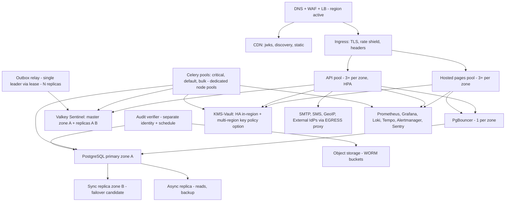

### 54.3 Runtime placement & security

nodes: distroless images, read-only rootfs, no shell (debug containers only in staging), securityContext non-root, seccomp/apparmor profiles, netpol default-deny + explicit lanes (43.2 B4/B5 = *implemented as netpol* — the egress proxy is a netpol *and* a component, belt+suspenders for SSRF/DNS rebinding), admission policy: signed-images-required (cosign), privileged-forbidden (PgBouncer/Patroni helpers = vetted exceptions list, documented — honest: "no exceptions" is a lie audits find later), workload identity per SA (32.2 V4 path pre-wired via SA names now).

### 54.4 Release process (the parts that are architecture)

Expand/contract migrations as separate, reversible steps with backfill throttling (34.6); blue/green via ingress weights (canary 5 %→25 %→100 % with auto-rollback on 45.1 SLO burns; feature flags decouple *deploy* from *release* for risky changes (e.g., new risk signal shadow mode 25.4 uses exactly this)); JWKS rotation compatible ordering (publish NEXT ≥ 24 h before promote — enforced in deploy plan validation); migration + app version skew tolerance window ≥ one full blue/green period (contract for ops: "always at most one version-skew step"); config changes versioned like code (registry rows, 11.2 row_version; catalog changes go through the same review as code — "config is code" is why 34.7 forbids hand-DDL: consistency of process, not ideology).

### 54.5 Environments & data

prod: real data; staging: synthetic + masked-imports (anonymized fixtures generated from prod *by the retention pipeline's own anonymizer — reusing the erasure tooling for test data = same guarantees, zero bespoke redactor, Decision); dev: factories + fakes (email/SMS providers = in-cluster fakes with UIs; provider canaries only against real vendors in a `staging-vendor` lane, budgeted); load: isolated `perf` env + shadow traffic replay (production *shape*, not data: PII never leaves prod — replay scrubbers are a tested component, 51.5).

## 55. Security Review of This Architecture (self-check — brief §55 spirit)

**What the design does well (and why it holds up):** every state-changing path is challenge/step-up + audited + notified (the anti-ATO tripod, 24); tokens are minimally-privileged by construction (scope+aud+TTL, 16); PII concentration points are exactly two (credential values, profile/address content) and both get field encryption + blind-index or scope-consent gates (40, 26) — no accidental PII sprawl because *claims-by-scope* (15.7) and *nudge events* (29.7) are the only data paths; audit is append-only with external truth anchors (28) — insider and DB-compromise both fail detection-proof; supply-chain, SSRF, enumeration, OAuth-classes all have named, testable mitigations (42 + 51.3/51.4); the platform's availability contract to products (46.4) prevents "security theater via outage."

**Named weaknesses (the honest list, each owned in §59):**
1. Password+OTP remains the *default* mix until passkey adoption moves (T-01 residual) — mitigation is rollout program (V1 hosted pages make passkeys one-click, 60.1 comms).
2. 10-min AT revocation window is an accepted trade (16.4) — enterprises may demand tighter; the lever exists (per-app `require-introspection`, kill-switch), the *default* optimizes portfolio-wide latency.
3. Admin/DB superuser residual (T-19/T-31) — mitigated by separation + anchors, not eliminated; WORM vendor lock + TSA policy is the backstop.
4. SMS/OTP channels carry SIM-port risk structurally (C-07, T-15) — design demotes but can't delete them while products require them (roadmap: 60.1 "SMS-deprecation program" = policy work, flagged).
5. Email-compromise cascade (T-16) — the 48-h revert window + cooldowns bound the window but don't close it (industry-wide).
6. Risk engine rules under-detect slow, well-behaved attackers (no graph analytics V1) — V3 ML path planned (25.6), shadow-eval culture keeps detection of *regressions* at least.
7. Compliance mapping is *readiness* (52) — audits may still find gaps vs their actual regimes (OQ-09/11/13 decide).

**Cross-references confirming no gaps against the brief's checklist:** all 25 prompt-listed threat items covered in 42 (map: credential theft T-01/T-02-ish? — explicitly: Credential Theft→T-01/T-02/T-03, Session Hijacking→T-03, CSRF→T-04, XSS→T-05, OAuth Redirect→T-06/T-07, PKCE bypass→T-07 (code bound + verifier + mandatory), Replay→T-12, Brute Force→T-09, Stuffing→T-10, OTP Abuse→T-11, SIM Swap→T-15, Email Compromise→T-16, Device Theft→T-17, DB Breach→T-18, Insider→T-19/T-31, Priv-Esc→T-26, Audit Tampering→T-21, PII Leakage→T-22, Enumeration→T-14, SSRF→T-24, Supply Chain→T-25, Open Redirect→T-06, Authorization Code Interception→T-07) — the matrix lives in §42 as the source of truth; a per-threat "covered by" column is also generated into Appendix C so auditors can follow it mechanically.

## 56. Architecture Quality Gates (brief §89 — executed)

Gate passed items below (each = section that closes it; "partial" = staged by design in §60; nothing is hand-waved):

| Gate item | Status | Where |
|---|---|---|
| Identity model coherent | ✅ | §11, §10 |
| Authentication separated from Identity | ✅ | §12 (separation), §13 (flows consume identity via interfaces) |
| Authorization separated from Authentication | ✅ | §14.1 |
| Profile separated from Identity | ✅ | §18.1 |
| Address independent domain | ✅ | §20 |
| Social Identity extensible | ✅ | §21 |
| Device separated from Session | ✅ | §22.1 |
| Audit immutable/tamper-evident | ✅ | §28.4 |
| OAuth/OIDC standards compliant | ✅ (conformance-gated) | §15, §51.2 |
| PKCE included | ✅ mandatory | §15.2, ADR-0003 |
| Refresh token rotation + reuse | ✅ | §16.3 |
| MFA supported | ✅ | §12.1 |
| Passkey extensibility (incl. discoverable V2) | ✅ | §12.5 |
| Step-up included | ✅ | §24.2 |
| Consent included | ✅ | §26 |
| Risk Engine extensible | ✅ | §25.3 |
| Recovery designed | ✅ | §27 |
| Application isolation defined | ✅ | §17.4 |
| Service Identity considered | ✅ | §32 |
| Admin security defined | ✅ | §44 |
| Privacy defined | ✅ | §37 |
| Data retention defined | ✅ | §39 |
| Encryption defined | ✅ | §40 |
| Key rotation defined (JWKS + envelope) | ✅ | §41 |
| Threat model complete | ✅ | §42 |
| HA considered | ✅ | §47 |
| DR considered | ✅ | §48 |
| Event architecture defined | ✅ | §29 |
| API versioning defined | ✅ | §33.8 |
| Testing architecture defined | ✅ | §51 |
| Observability defined | ✅ | §45 |
| Performance targets defined (labeled targets) | ✅ | §50 |
| Scalability considered | ✅ | §49 |
| Future federation considered | ✅ | §12.8, §60 |
| No hidden architectural assumptions | ✅ | §58, §59 explicit |

Additional internal gates added beyond the brief's checklist (all enforced in CI, §51): `no-secrets-in-logs canary suite`, `no-PII-in-metrics labels guard`, `audit-append-on-mutation fuzz (INV-08)`, `revocation-propagation perf test (NFR-004)`, `Redis-kill sessions-survive (23.2)`, `KMS-stall absorbs (46.2)`, `OpenAPI diff-gate (33.8)`, `event-version governance check (29.5)`.
---

## 57. Architecture Decision Records

Format: Status · Context · Decision · Alternatives · Consequences. All ADRs normatively restate the sections cited; on conflict, sections win and the ADR is corrected (governance, App. E).

**ADR-0001 — Identity as the Core Entity.** Status: Accepted (2026-09-11). Context: five products, future acquisitions, org & machine actors; naive `User(email)` design poisons every downstream table with PII and mutability (§11.3). Decision: root aggregate `Identity` with opaque immutable id; type discriminator; humans/orgs/services share the spine; profiles/credentials are satellites. Alternatives: per-product user tables linked by email (rejected: PII fan-out, alias-based joins = permanent fuzziness); `Person` + `Org` separate roots (rejected: cross-type authn/session/risk machinery duplicated). Consequences: merge/erasure flows get harder design responsibility (§11.5/6 — accepted as the *core* value), all products adopt `sub`-keyed schemas (onboarding cost).

**ADR-0002 — OAuth 2.0 + OpenID Connect as the only federation protocol.** Status: Accepted. Context: brief §2.2 mandates standards; enterprise SSO demands. Decision: Authorization Server + OIDC OP per §15, aligned to RFC 9700 BCP; **SAML SP in V2**; SAML IdP bridge and SCIM in V4, with registry hooks from V1. Alternatives: session-assertion custom protocol (forbidden §6.6), JWT-via-API-only per product (rejected: consent, token hygiene, ecosystem tooling all lost). Consequences: conformance suite as gate (§51.2), client library constraints honored, redirect-based UX limitations accepted (46.4).

**ADR-0003 — Mandatory PKCE (S256) for all clients.** Status: Accepted. Context: code interception (T-07) affects public *and* confidential clients (native, BFF misconfig); RFC 9700 requires. Decision: `authorization_code` always with S256; no exception path in the AS. Alternatives: public-clients-only (rejected: inconsistent defaults create migration debt and confused clients). Consequences: every client needs code_verifier custody (SDK burden, small), hybrid flows still covered.

**ADR-0004 — Modular monolith over microservices for V1.** Status: Accepted. Context: 10 senior engineers; strong-consistency needs on authn path (§34.5); extraction future. Decision: one deployable, schema-per-context, CI-enforced module interfaces (§9.4). Alternatives: immediate 8-service split (rejected: operational tax + distributed-transaction hazards, no team to run it), "Django + Celery everywhere as-is" (rejected: still needs the boundary discipline decided here). Consequences: extraction discipline paid daily in code review (accepted), single-deploy risk = blast radius per release (mitigated: canary + blue/green §54.4), scaling ceiling mitigated by 46.3/49.1 levers.

**ADR-0005 — PostgreSQL as primary datastore.** Status: Accepted. Context: relational invariants (partial uniques §10), transaction coupling of audit+state (28.1), row locking for rotation races (23.3), team expertise, HA tooling maturity. Decision: PG 17 as §34. Alternatives: MySQL (weaker logical-decoding/tooling posture for our outbox+partitioning needs here, team skill), CockroachDB (consistency model fits, operational cost + license direction at 1 M scale premature — revisit at sharding gate 49.1), document DB (rejected: relational constraints ARE the security model). Consequences: single-primary writes (46.2), sharding deferred by design (37.6/49.1), PgBouncer semantics documented (8.2).

**ADR-0006 — Token architecture: signed-JWT AT (minimal claims) + opaque rotated RT.** Status: Accepted. Context: products must validate offline (46.4), PII minimization (INV-07), revocation tradeoff (16.4). Decision: RS256 JWT AT 10 min, claim set §16.2; RT opaque+rotated (ADR-0007); introspection for legacy/sensitive paths; UserInfo for data. Alternatives: reference tokens (rejected: per-call introspection load + offline-tolerance lost), encrypted-JWT (rejected: complexity, no claim secrecy needed), HS256 shared secret (rejected: key sprawl across products = breach fan-out). Consequences: 10-min stale window contract (accepted, documented per-app §14.4), EdDSA/PS256 adoption gated on conformance-lib parity (stated, no premature crypto).

**ADR-0007 — Refresh token rotation with reuse detection and no grace window (V1).** Status: Accepted (grace = V2 data-driven revisit). Context: RT theft is the durable-token threat; grace windows hide reuse races. Decision: single-use RT per lineage, reuse ⇒ family revoke + session end + notifications. Alternatives: grace 30 s–10 s (rejected: race ambiguity + false negatives for exactly the stolen-token case), no rotation (rejected: no theft detection at all). Consequences: mobile offline-queue failures present (client spec mitigates §23.3), re-login pain bound by idle policy; revisit with telemetry (metric: rotation-race rate per app).

**ADR-0008 — Audit: transaction-coupled append, per-stream hash-chain checkpoints; V2+ optional external WORM+TSA anchors.** Status: Accepted. Context: INV-08 durability vs chain performance; tamper claims honesty (28.4). Decision: as §28 (V1: hash chain + PG-level immutability + nightly verification; V2+: optional WORM anchoring). Alternatives: global per-row hash chain (rejected: write serialization + "tamper or rotate" ambiguity), async audit bus (rejected: loss window on crash = forensics holes), blockchain-per-event (rejected: cost + PII-on-chain = privacy violation, explicitly). Consequences: V1 verifier = nightly PG-only check; V2+ verifier may become a separate deployable when WORM anchors are added.

**ADR-0009 — Device model: durable Device, advisory fingerprint, optional strong binding later.** Context: brief §21, ATO containment, privacy. Decision: §22 split; fingerprint coarse/hashed/90 d; `DeviceIdentity` = V2 passkey-binding. Alternatives: UA-as-device (rejected: collisions/churn — the brief itself warns), perma-fingerprint device graph (rejected: privacy + law + attacker-education, 22.5). Consequences: family-shared-device UX complexity accepted (per-identity device rows), device trust can't *grant* capability (INV-16).

**ADR-0010 — Address as temporal, purpose-scoped, provider-abstracted domain.** Context: brief §17–19. Decision: §20 (no overwrites, exclusion-constraint current-row invariant, providers behind capability interfaces, save-never-blocks-on-provider). Alternatives: user column (banned by brief), address-as-dictionary-only (rejected: loses history/verification semantics we need for legal/billing). Consequences: provider cache + backfill jobs needed (36.2), "needs_review" quality queue is a new admin surface, IR postal registry data maintenance becomes a duty (20.4).

**ADR-0011 — Eventing: outbox → Redis Streams (V1) with contractual upgrade to partitioned log bus.** Context: 29, extraction seams. Decision: as stated, CloudEvents envelope, per-subject ordering, nudge-payloads. Alternatives: Kafka from day 1 (rejected: ops burden unjustified pre-1 M), direct product webhooks only (rejected: replay/ordering/DLQ per client = N× bespoke infra), CDC-only (Debezium) for *some* events (deferred hybrid: CDC reserved for tables where app-emission is error-prone, V2 evaluation). Consequences: relay process SLO'd (8.2), 7 d stream retention ⇒ `since=` cursor APIs mandatory (29.4), products implement dedupe (contract §51.2).

**ADR-0012 — Redis/Valkey is never the source of truth (sessions, OTP challenges, WebAuthn ceremonies = PG; cache/locks/throttles = Redis).** Context: brief §47, Keycloak's inverse choice caused our review team to check twice. Decision: §23.2/§12.4/§12.5/§35. Alternatives: Redis-as-session-store (rejected: loss = portfolio-wide logout storm + forensics gap), Redis-only OTP or WebAuthn (rejected: consume race + AAL2 outage on Redis). Consequences: extra read latency handled by mirror (60 s bound documented), PG write load of session last_seen batched (write-behind), counter loss on failover = re-throttle from zero (accepted, bounded by attempt caps).

**ADR-0013 — Key custody: KMS-managed secrets with in-process signing (not KMS-attach per-token), kid-based dual-active rotation; emergency path = JWKS removal + introspection mode.** Context: signing throughput vs KMS availability coupling (46.2 KMS row, G-11). Decision: as stated (41.1 table row explains the honest tradeoff, incl. "private key in process memory" residual). Alternatives: KMS-sign per token (rejected: latency + hard outage dependency + cost — flagged as V3 option if HSM mandate lands), keys in app config (forbidden, §41.4). Consequences: nodes = key-holding security zone (hardened, netpol, distroless — 54.3), rotation ceremony = deploy-adjacent (15.8 timing constraints), emergency revocation blast radius documented (15.8).

**ADR-0014 — Privacy: data-minimization-by-architecture (scope-gated claims, blind indexes, nudge events, id-only audit) + rights-as-APIs.** Context: 37. Decision: §37 model (controller/processor split baked into data model; erasure reconciled with audit by construction 37.4). Alternatives: consent-banner-then-collect-everything (rejected: portfolio liability), full product-data custody in UIAP (rejected: we'd become a breach of everything, products keep what they own). Consequences: onboarding includes DPA templates (52.4), retention tooling is a *product* of the platform (39), some product asks ("push all profile changes to us") answered "no — nudge + fetch" (29.7).

**ADR-0015 — Versioning: `/v1` paths for APIs, unversioned protocol plane, semver events, additive claims policy, 12-mo breaking-change gates.** Context: products on platform "for years" (brief §61). Decision: §33.8 + OpenAPI diff gate. Alternatives: media-type versioning (rejected: proxy/CDN/tooling friction, half the header matrix untested), no versioning "move fast" (rejected: platform role = stability provider). Consequences: sunset machinery (headers, dashboards, notices) is a permanent duty, dual-emission windows cost storage (29.5) — both are the job.

**ADR-0016 — Identifiers: UUIDv7, blind-indexed encrypted factors, pairwise subs for third parties.** Context: 11.1, brief §58. Decision: as §11.1. Alternatives: ULID (rejected — storage/tooling), snowflake (rejected: coordination + leak of volume), hashids of integers (rejected: enumeration-resilience theater). Consequences: 128-bit index sizing accepted (60 M rows fine), v7 clock-info accepted with documented rationale.

**ADR-0017 — Password regime: Argon2id + NIST SP 800-63B (no composition, no expiry, breach-corpus deny, capped length).** Context: 12.2, OWASP. Decision: as stated, calibrated by login budget (50.3). Alternatives: 12-char+symbol+90-day rotation (rejected: empirically *worse* — NIST, and brief-adjacent "modern enterprise" reading might expect it — explicitly overridden with source), bcrypt/SCRYPT (rejected: Argon2id wins on GPU/ASIC margin + param agility). Consequences: CPU cost is the scaling bill (49.2/50.3), legacy hash import migration plan is per-product work (12.2).

**ADR-0018 — Errors: RFC 9457 + stable `error_code` catalog; OAuth endpoints keep RFC 6749 shapes.** Context: brief §36. Decision: 33.4. Alternatives: bespoke envelope everywhere (rejected: OAuth spec compliance violation at protocol plane), bare codes no problem-doc (rejected: support-ids missing = incident latency). Consequences: code catalog governance (33.4 never-reuse rule), i18n of copy per 53.5.

**ADR-0019 — Step-up via operation-bound single-use grants (not just `auth_time`).** Context: 24.2, brief §8. Decision: §16.5 mechanism + §24.1 policy table. Alternatives: "authed within 10 min" (rejected: replayable across all ops in window — exactly the ATO-completion trick), password-reprompt-only (rejected: UX + phishing mimicry risk). Consequences: extra endpoint + token consumption path, client integration documented for products.

**ADR-0020 — Tamper-evidence: V1 per-partition hash chain + PG-level immutability; V2+ optional WORM anchoring; transparency via verification, not trust; no blockchain.** Context: 28.4. Decision: V1 uses append-only + hash chain + checkpoints (PG-only verification); V2 may add WORM + TSA anchors if compliance requires. Alternatives: naive global chain (rejected: 28.4 perf/ambiguity), append-only S3-only (rejected: latency+cost on critical path; kept as *anchor* tier for V2), ledger DB service (rejected: still needs external non-repudiation = anchors either way, extra infra). Consequences: V1 verifier = nightly job; V2+ verifier may become a separate deployable when WORM anchors are added.

**ADR-0021 — OTP challenges live in PostgreSQL (source of truth), Redis only throttles/locks.** Context: 12.4, brief §47's "don't make Redis truth." Decision: as stated with the "one open challenge per purpose" serialization trick. Alternatives: Redis-only with AOF (rejected: lossy edge = login deadlock; "Redis never truth" applied to *security-relevant single-use state*), double-store sync both (rejected: two truths = race matrix for no availability win — PG path is already < 5 ms). Consequences: TTL sweeper job (36.2), PG write QPS for auth-heavy peaks (budgeted 50.2).

**ADR-0022 — Event versioning: per-type semver + dual-emission; tolerant-reader mandated; no v-suffixed types.** Context: 29.5. Decision: as stated (governance light: ack-registry census instead of infra). Alternatives: `/vN` type namespaces (rejected: schema-fork sprawl), frozen-v1-forever (rejected: profile/address domains evolve — the 5-year product promise (G-01/§61) requires *managed* evolution). Consequences: schema registry artifact is release-tested (CI asserts OpenAPI + event schemas co-version), consumer census tooling needed.

**ADR-0023 — DPoP deferred to V2 for sender-constrained tokens; `cnf` claim shape reserved.** Context: 16.2/24.8, RFC 9449. Decision: sign-path + TTL + reuse-detection now; DPoP when mobile/CLI estates justify it. Alternatives: mTLS-bound tokens everywhere (rejected at V1: client cert sprawl, LB complexity, product cert ops = adoption blocker — brief §91 complexity-rent rule), DPoP day 1 (rejected: key custody SDK burden on every product before they even onboard). Consequences: documented residual (10-min bearer window), `cnf` pre-included so no schema rework (V2 = policy flip).

**ADR-0024 — Single issuer for the portfolio; per-client audiences; pairwise subs for third parties.** Context: 15.6, 11.1. Decision: one `iss`, not per-realm. Alternatives: realm-per-product issuers (Keycloak-style — rejected: SSO semantics break across realms = the whole point of the platform dies), global shared `sub` for everyone including partners (rejected: silent cross-app correlation = privacy fail). Consequences: issuer domain is forever-binding (OQ-01!), partner pairwise `secret_kp` custody adds KMS ops.

**ADR-0025 — Hosted authentication UX at UIAP; products embed by redirect (no iframes).** Context: 7.2, 24.4. Decision: as stated. Alternatives: pure API (rejected: phishing + per-product credential UI duplication + security-review fan-out per client), iframe embed (rejected: clickjacking + partitioned-cookie fragility). Consequences: brand theming pipeline (17.7) becomes a real product surface, mobile-SDK tension resolved V2 (55).

**ADR-0026 — Build on maintained protocol libraries rather than stock IdP, with conformance gates (build-vs-buy closed for V1, revisit triggers stated).** Context: 8.1. Decision: build; `authlib`-class protocol implementations + our hardening; OIDC conformance suite = release gate; revisit triggers: conformance failures we can't fix upstream, or protocol scope explosion (e.g., FAPI2 requirement by a regulated product — OQ-14), or team size < 4. Alternatives: Keycloak fork (rejected: domain mismatch — our value-add is profile/security-center/recovery semantics; fork = permanent rebase tax), Ory stack (rejected for V1: microservices-by-default + TS-heavy frontends vs our team; revisit at extraction time — audit/notify could literally *become* Ory-shaped services). Consequences: we own protocol bugs (mitigated by conformance + pentest + BCP tests), hiring must include "can read OAuth RFCs" bar.

**ADR-0027 — Retention as versioned policy data, enforced by jobs; legal hold = first-class.** Context: 39, brief §43. Decision: §39 engine. Alternatives: config files (rejected: un-auditable, no per-region overrides), "TTL columns in app code" (rejected: 39 tables × N rules = undebuggable), DB-partition-drop-only (rejected: row-grain erasure needed for GDPR rights). Consequences: policy rows reviewed like code (2-person for shortening windows), per-region override matrix grows with OQ-02 answers.

**ADR-0028 — Data residency via region tags + regional KMS/storage; no multi-region active-active in V1.** Context: 37.6, brief §75. Decision: as stated (routing seam = a contract endpoint, not a retrofit). Alternatives: EU-only-first deployment (premature without legal trigger), active-active Postgres (rejected: consistency/latency vs real need). Consequences: DR region warm-standby cost (48.4), regional dataset backfill tooling needed if migration later required.

**ADR-0029 — ABAC deferred to V3; V1 authorization is scopes + RBAC + resource-owner checks.** Status: Accepted. Context: §14.2. Decision: no policy DSL in V1; `SecurityPolicy` + `ScopeDefinition` are the seams. Alternatives: OPA/Cedar day one (rejected: dual source of truth with tokens). Consequences: products enforce resource-level checks; platform does not become a general PDP in V1.

---

## 58. Assumptions (each falsifiable; if wrong, ADR/sections change — tracked as §59 refs where relevant)

| # | Assumption |
|---|---|
| A-01 | The portfolio (Product A/B/C, EMP, Kheradsara + future) will onboard per §60 phases; products accept the "nudge + fetch" contract (29.7) rather than demanding push-sync. |
| A-02 | Products own their *own* authorization for product content (UIAP issues scopes/roles only) — enterprise "centralized authz bus" not required V1. |
| A-03 | Traffic shape: logins ≈ ≤ 2 % of requests/min at peak; token validation ≫ login rate; cache hit ratios in §50.4 achievable (validate §51.5). |
| A-04 | User base grows to ≥ 1 M within 3 years; ≥ 10 M is a *planning* figure only (49). |
| A-05 | Email deliverability to IR inboxes is materially degraded; SMS latency p95 < 45 s at chosen providers — both **to be validated** in the first quarter with real providers (drives OTP policy). |
| A-06 | No product requires storing card data or clinical data in UIAP scopes (NG-02/HIPAA lines hold); if EMP adds payouts, that's its own systems, not UIAP (contract). |
| A-07 | Iranian users dominate initially → `fa` RTL and Jalali rendering are first-class from day 1 (53). |
| A-08 | The platform hosts its own login UI (7.2); product teams accept redirect-based UX including for mobile (AppAuth-parity guidance). |
| A-09 | A KMS/Vault (self-hosted Vault or cloud KMS per OQ-02) with multi-region key option is available; without it, signing-key custody fallback = sealed file on nodes — documented as weaker (46.2, 41.1) and pentest-flagged. |
| A-10 | Team = ~10 senior engineers including a dedicated security-minded backend lead; no dedicated SRE before V2 (54.3 assumptions about managed LB/CDN). |
| A-11 | Products have (or will adopt) HTTPS-only production front doors + secure token storage per §13.3 (onboarding gate). |
| A-12 | GDPR-level privacy expectations apply to users irrespective of actual jurisdiction (37.1 floor choice) and legal counsel will confirm OQ-09/11. |
| A-13 | Passkey support across our user devices (iOS/Android/desktop browsers circa 2026+) is sufficient for a V1 promotion campaign (55-1). |
| A-14 | No regulatory mandate for on-prem-only hosting of identity data currently applies to the portfolio (if wrong → OQ-02 resolves toward self-managed in-country). |
| A-15 | Event consumers (products) can implement dedupe + `since=` refetch (51.2 contract) — the weakest-link assumption; mitigation = SDK-lite snippets in docs, not code (no SDK V1). |
| A-16 | Argon2id parameter calibration lands inside §50.1 budgets on chosen nodes; if not, node count rises (50.3). |
| A-17 | The org will fund the extraction-triggered infra later (Kafka/NATS, read services) only when §49 gates fire (49.1) — i.e., "platform team keeps shipping" not "platform team becomes platform theater." |
| A-18 | Third-party partner apps (outside first-party portfolio) exist by V2 and get pairwise `sub` (11.1) — schema must not assume shared `sub` anywhere (tested). |

## 59. Open Questions (decision-forcing list; each has an owner + a deadline that is tied to a project event, so they don't rot)

| # | Question | Why it matters | Recommended default | Decide by |
|---|---|---|---|---|
| OQ-01 | Final issuer domain + hosting model (cloud region(s), managed vs self-managed, IR-local vs EU vs other) | `iss` is permanent (ADR-0024); residency (37.6), KMS choice (41), latency (C-07), compliance surface (52.4) all pin here | Managed cloud region closest to users with data-protection posture ≥ GDPR-grade (likely EU West) + IR-latency review; `id.<portfolio-domain>` | Before first production client onboarding (§60.1 gate) |
| OQ-02 | Cloud/k8s vendor & WORM/TSA vendors | HA/DR/anchor designs reference capabilities | Managed PG (Patroni-on-VMs if compliance demands) + vendor WORM with Object Lock + reputable TSA | §60.1 infra selection |
| OQ-03 | Breach-corpus source: HIBP k-anon online vs offline bloom (sanctions/egress constraints, C-07) | Signup security + privacy of partial hashes | Ship offline k-anon bloom (updated monthly via CI artifact) + optional online mode flag | §60.1 security config |
| OQ-04 | WebAuthn attestation policy (none vs enterprise AAGUID pinning for staff admins) | Admin hardening vs privacy | `none` for users; AAGUID allowlist for `POLICY_ADMIN`+ V2 | §60.2 |
| OQ-05 | Workload identity: adopt K8s SA-token exchange (32.2) now vs defer | service creds rotation ops | Defer to V3; registry rows exist | §60.3 |
| OQ-06 | Deprecation window numbers (12/6 mo) for first-party vs partner | portfolio velocity vs stability | 12/6; internal override possible *upward* only | §60.1 sign-off |
| OQ-07 | Min-age/child policy (11/13/16 per jurisdiction + IR specifics) | COPPA-GDPR-Art.8 class obligations | Platform default: 16 + `min_age_enforced: true` (products can't lower below 13 without legal); child-mode scopes (no marketing, no profiling) | Legal review §60.1 |
| OQ-08 | TSA vendor(s) & whether a second independent TSA is required for anchor trust | tamper-evidence strength (28.4) | **Not a V1 decision.** One TSA (ETSI-style, RFC 3161) if/when V2 WORM anchoring is approved; second added only if counsel requires non-repudiation | Before V2 audit-anchor program |
| OQ-09 | Recovery-evidence retention (30 d vs regulatory), DPIA formalization trigger | 11.8/27.5, privacy law | 30 d purge default; DPIA for risk engine + recovery program | Legal §60.1 |
| OQ-10 | Audit retention: 7 y vs regional law variance | 39/R-31 | 7 y ADM/POL floor, per-region deltas | Legal §60.1 |
| OQ-11 | Local regulatory mapping (IR draft PDP law, telecom rules) + whether any product triggers financial-reg scope (52.4) | compliance surface shifts | GDPR-floor stance; counsel opinion logged before public growth | §60.2 |
| OQ-12 | License policy: Valkey vs Redis (AGPL option) final call | Appendix A stack | Valkey (BSD, drop-in) unless ops requires vendor support | §60.1 |
| OQ-13 | NIS2/DORA exposure via product sectors (if a product serves finance/energy) | 52.4 | Track per product onboarding checklist; pre-agreed tier-1 posture upgrade path | per product onboarding |
| OQ-14 | FAPI 2.0 security profile (if any regulated partner arrives) | would force mTLS/JAR/enc-req on partner lane | Reserve partner class "fapi" in app registry flags now | when first partner demands |
| OQ-15 | Risk engine ML program scope/timing (V3) + data-retention for training (25.6) | privacy vs intelligence | rule-based only until labeled-data governance passes review | §60.3 |
| OQ-16 | Admin "reveal" transparency to users (44.3) — legal floor check (does revealing *help* stalkers in domestic-abuse accounts? "confidential account" state V2?) | user safety vs transparency | ship reveal-notice + plan a "hidden account" state (admin search suppressed) V2 | §60.2 |
| OQ-17 | Marketing on UIAP email domains — allow at all? | sender reputation of the *identity* domain (security emails) | **Decision-leaning: separate product sender domains; UIAP domain sends security/verification only** — confirm | §60.1 |
| OQ-18 | Push provider landscape for IR users (FCM reliability) | V2 push MFA | Treat push as optional; in-app + email fallback is the plan; vendor scout in §60.2 |
---

## 60. Roadmap (brief §86–87: V1 realistic, V2/V3/V4 never force a rewrite)

Principle (stated once, applied throughout): **V1 = simple implementation, strong architecture, future extensibility.** The architecture sections above already contain the V2–V4 seams (regions, pairwise subs, DPoP claim shape, org schema, outbox bus upgrade, event census tooling); the roadmap below schedules *features*, not *foundation*.

### 60.1 V1 — Core Identity & SSO (target: 4–5 quarters of engineering, Initial estimate)

**Scope (MVP-of-a-platform, deliberately narrow-but-deep):**
- Identity + Human type; PROVISIONAL→ACTIVE→… full lifecycle incl. anonymization pipeline (the legal/UX must-have)
- Credentials: password (Argon2id, import migration kit), email OTP, phone OTP/SMS, TOTP, passkeys (platform+roaming), recovery codes; change-email/change-phone flows; factor floor + policy
- Access: OAuth/OIDC (authorize/token/userinfo/introspect/revoke/jwks/discovery/end-session + back-channel logout), PKCE mandatory, code+refresh with rotation/reuse, BFF + public-SPA + native patterns, consent (screens + API + revocation), application registry (internal self-service + approval), **shared `sub` for first-party clients** (pairwise schema seam only), service identities (`private_key_jwt`), sessions/devices APIs, Security Center (self APIs + admin-visible parts), step-up machinery, rate limiting (Redis + static fallback), enumeration doctrine, audit (append + hash-chain checkpoints + nightly verifier + search API; **no WORM/TSA in V1**), events (outbox→Redis Streams, catalog, versioning, webhook delivery for products), notifications (email/SMS/in-app + security class + templates fa/en), retention engine v1 (R-tables + jobs + legal holds), observability (45 + SLOs + revocation lag + verifier alerts), HA/DR to §47/48 spec, key management (41 incl. rotation ceremony), hosted login/consent/MFA/recovery pages (i18n fa/en RTL, a11y AA gate), OpenAPI + conformance suite wired into CI from quarter 1 (non-negotiable).
- **Explicit V1 non-delivery (to keep it real):** SAML/SCIM (SAML SP → V2), DPoP enforcement, pairwise `sub` issuance, org admin console, push, discoverable passkeys, ML risk, multi-region, partner self-service portal, mobile SDK (docs + snippets only), profile "public card" *rendering service* (API only), WORM/TSA audit anchors.
**Dependencies:** OQ-01/02/03/06/07/09/10/12/17 decided; provider contracts (email/SMS) live; domain + TLS + object storage + KMS provisioned; first-two-products integration teams trained on `contracts/` suites. WORM buckets are **not** a V1 gate.
**Security gates per release:** ASVS checklist deltas, OIDC conformance green, BCP checklist 100 %, pentest before GA + fixes below medium, chaos drills for §46 matrix rows touched.
**Migration requirements:** product data imports (legacy hashes §12.2, consent LEGACY_IMPORT §26.5) per product = co-owned project; `sub` backfill + local link tables on product side (their migration, our runbook); rollback plan per phase (products keep dual-login window ≤ 90 d? Initial Policy with product sign-off — recorded here so it's *a decision*, not drift).

### 60.2 V2 — Advanced Security & Product Hardening

DPoP for sensitive apps; **SAML 2.0 SP** (UIAP as RP to enterprise IdPs); WebAuthn discoverable creds + enterprise AAGUID policy (OQ-04); push notifications; push-MFA if OQ-18 resolves positive; org memberships self-serve + domain verification + conditional access (IP ranges) + delegated admin (org-scoped RBAC on the V1 role engine); "confidential/hidden account" state (OQ-16); RT grace-window revisit (A-05 telemetry, ADR-0007); risk: policy-studio UX + shadow-eval automation + per-app custom rules (engine already supports); audit: per-row shredding option if compliance demands (40.4 rewrap note); API: PAR + JAR baseline for partners; event: CDC-hybrid evaluation (ADR-0011); notification templates governance; profile: professional "public card" render service + share links; address: verification levels `DELIVERY_CONFIRMED`; **extraction pilot: audit-ingest or notification as first service *if* §49.1 gates fired** (measured, not scheduled).
Dependencies: V1 GA + 2 products onboarded + load-test results (51.5) + OQ-05/08/11/18.
Security: same gates + targeted pen-test on push/org surfaces + ASVS L3 re-score on authz modules.
Migration: org schema (already live — V2 = enabling, zero-migration), DPoP = per-app flip (AT shape unchanged), push = device registry table exists (22.6).

### 60.3 V3 — Risk & Intelligence

ML-assisted risk (feature store exists via 23.7 + labeled "was this you" data; governance: OQ-15 + DPIA), device binding GA (platform attestation via Play Integrity / DeviceCheck adapters — *advisory* strength rules unchanged), token introspection feed GA to products as a service, data-residency enforcement automation (region-tag → routing live, OQ-02 answer permitting), audit: per-tenant export portals (org admins), retention: per-region legal packs, SCIM server (for enterprise provisioning) — chosen before SAML so enterprise onboarding path = API-first (standards-first P-02).
Dependencies: V2 + legal sign-offs (OQ-11/15), volume data justifying extraction of services (audit ingest, notification, read-scaling profile service).
Security: adversarial testing program for models (poisoning/drift monitoring as platform features), supply-chain program maturation (SLSA L3 target — ADR/51.4).
Migration: ML = policy flip behind shadow-eval (25.4), never a rewrite of verdict paths.

### 60.4 V4 — Enterprise Federation

SAML 2.0 SP/IdP bridge + SCIM client/server full profile; partner self-service registration + attestation; FAPI-grade partner class (OQ-14 if triggered); multi-region active-passive GA (DR automation from 48.4 into product choice); identity "portability" tooling (product sunset flows); optional public transparency log for audit anchors (28.4 V3 item promoted); mobile SDK GA.
Dependencies: enterprise demand signals (org table live since V1 ⇒ data model untouched), compliance regime decisions matured.
Security: conformance suites extended (SAML: idi2323/2.0 profiles; SCIM: interoperability tests).
Migration: org realms? still avoided (ADR-0024 holds — federation lands as *connection configs*, not realm splits).

## 61. Final Architecture Decision

### 61.1 The platform, in one place

| Dimension | Decision |
|---|---|
| Architecture style | Modular monolith (V1) with schema-per-context and CI-enforced module interfaces; audit/notification/risk are pre-seamed extraction candidates; no microservices until §49 gates justify them (ADR-0004) |
| Identity model | Root `Identity` (opaque UUIDv7, status machine, soft-delete + anonymization, IAL levels, merge-by-governance); email/phone are *mutable credentials*; human/org/service share the spine (ADR-0001/0016) |
| Authentication model | Hosted login at UIAP; password (Argon2id, NIST rules) + TOTP + passkeys + OTP (email/SMS demoted) with factor-floor, step-up grants, and session-upgrade `amr/acr`; all verifications synchronous + audited; recovery with cooldown wall (ADR-0019/0025) |
| Authorization model | Scopes (consent-gated, claim-mapped, catalog-versioned) + platform RBAC (roles/permissions with 4-eyes elevation) + resource checks at the edges; ABAC deferred with policy-engine seams kept (ADR-0029/0015) |
| OAuth/OIDC | Authorization Code + PKCE(S256) everywhere, RFC 9700-aligned, `private_key_jwt` for confidential clients, single issuer; pairwise `sub` for third parties **from V2**; conformance suite as release gate, back-channel logout, revocation/introspection complete (ADR-0002/0003/0024/0026) |
| Token model | 10-min minimal-claim JWT AT (RS256, kid-rotated, dual-active), opaque rotating RT with lineage + reuse-detection + family revoke, `sid` coupling + revocation feed for products, 60-s revocation propagation SLO, DPoP reserved (ADR-0006/0007/0023) |
| Database | PostgreSQL 17, one cluster, schema-per-context, partial-unique invariants (single-CURRENT key, one primary email…), monthly partitions for logs, expand/contract migration discipline, sync-replica durability (ADR-0005) |
| Cache / Redis | Valkey/Redis = accelerators, locks, counters — never source of truth (sessions/OTPs/WebAuthn ceremonies durable in PG) (ADR-0012/0021) |
| Event system | Transactional outbox → Redis Streams (contract-compatible with later Kafka/NATS), CloudEvents envelope, per-aggregate ordering, at-least-once + dedupe contracts, semver-per-type + dual-emission, nudge-not-data (ADR-0011/0022) |
| Audit | Append-only, in-transaction, per-stream hash-chain + nightly verification; V2+ optional WORM anchoring, id-not-name payloads, retention certificates for pruning (ADR-0008/0020) |
| Security posture | Threat-model-driven (§42, tested per 51.3/51.4), layered throttles + progressive challenges, no-enumeration doctrine, notification-on-everything-security, secrets hygiene, supply-chain controls, admin plane as hardened tenant (§43/44) |
| Risk | Deterministic pluggable signals + versioned policies + shadow-eval culture; ML-ready feature capture from day 1; verdicts ALLOW / REQUIRE_MFA / REQUIRE_STEP_UP / SOFT_BLOCK / HARD_BLOCK, fairness rules on shared-IP populations (ADR-0011 lineage, §25) |
| Deployment | K8s multi-zone, blue/green + canary w/ SLO-gated auto-rollback, netpol-enforced trust boundaries, distroless signed images, per-env isolation (incl. synthetic-data staging) (§54) |
| Scalability | Comfortable to 1 M; 10 M path = partition + read-lanes + targeted extraction + *then* sharding by region-tag directory; Argon2 capacity treated as a first-class, quantified constraint that passkey adoption pays down (§49) |

### 61.2 Decision boundaries (brief §88 — who decides what)

| Decider | Owns | May NOT change |
|---|---|---|
| **This architecture (Architecture)** | bounded contexts + interfaces, data ownership, identity/credential model, protocol conformance, token shapes & lifetimes (within bounds), audit/event/error/retention/privacy frameworks, trust boundaries, trust-zone deployment rules | — (changes here = new ADR, §57 mechanism) |
| **Implementation (Backend teams)** | libraries, class/function structure, ORM usage, internal module layout, caching *implementation*, migration tooling specifics, unit-test design, hosted-page *implementation* details (components, CSS), queue internals | any §15/16/33/34 contract, any INV-xx, any §40/41 crypto choice, any §24 policy default without sign-off |
| **Product teams** | their UI (except credential collection — never), their app-local authz on top of scopes, their event consumers, their consent-context copy (within catalog), their security posture for *their* endpoints | touching UIAP DB, bypassing hosted authn, storing UIAP tokens/logs permissively (13.3/§45 redaction), inventing parallel login (forbidden §6.6) |
| **Security (Security Architecture team)** | risk/threat-model additions, policy thresholds (rate limits, cooldowns, factor requirements), pentest findings → hardening backlog, key-ceremony approvals, app-registration security review (17.6) | weakening documented floors (e.g., SMS-as-sole-2FA-for-AAL2 is *their* config but requires explicit risk-acceptance logged against §12.9) |
| **Privacy/Legal** | retention overrides per region, lawful-basis register text, DSAR SLA commitments, subprocessor list, OQ-07/09/10/11 answers | deleting audit's minimum forensic layer (37.4's construction is a control, not a preference) |
| **Operations/SRE** | capacity numbers vs SLOs, failover runbooks, backup schedule mechanics, on-call policies, region choices (within §37.6) | the §46.5 shedding order or §46.4 product contract (both are architecture commitments) |

**Change protocol (single rule):** a decision that changes a *contract* (API/event/token/DB-boundary/protocol/retention-class) flows through: Proposal (1-pager w/ §42 delta) → ADR draft → Security+Privacy+Data reviews → Accepted → this document reissued with new version + Appendix D updated if it changes a stance. Anything that changes an *internal* implementation detail: PR review suffices (fast by design — the bureaucracy applies only where years-of-products depend on stability).

---

## Appendix A — Recommended Initial Stack (brief §79 — evaluated, not copied)

| Layer | Recommendation | Version posture | Why / alternatives considered |
|---|---|---|---|
| Language | **Python 3.13** | 3.12 acceptable floor | Brief said 3.12; 3.13 is current-production (faster interpreter for Argon2-adjacent CPU paths, mature typing). 3.14/3.15: revisit at team cadence (no chasing). Alternatives: Go (excellent for crypto/protocol services, but *this* platform is domain-heavy + Django-team; rejected — the monolith's cost is domain code velocity, not runtime), Rust (no: nothing here earns it; libs chosen in Python instead). |
| Web framework | **Django 5.2 LTS** | LTS through 2028 | Team + admin-free-by-choice + mature auth ecosystem + ORM constraint expressiveness we rely on (§34); alternatives: FastAPI alone (rejected: batteries we'd rebuild: migrations via SQLAlchemy anyway, admin, i18n, template rendering for hosted pages), Rails/Laravel (org skill mismatch). |
| API toolkit | **DRF + drf-spectacular (OpenAPI 3.1)** | — | Alternatives: django-ninja (evaluated: nicer typing, weaker OpenAPI tooling + smaller security-review corpus; **switch allowed by implementation via ADR** — noted honestly rather than pretending no choice), Strawberry/GraphQL (rejected §33.1). |
| OAuth/OIDC libraries | **authlib (AS/OIDC primitives)** + `python-jose→`no: use `cryptography`+custom JWT builder via `jwcrypto`; `python-jose` deprecated posture avoided | pinned + monitored | We implement provider semantics; authlib gives JWS/JWA/claim validation correctness. Alternative: django-oauth-toolkit (rejected as base: PKCE/OIDC completeness + our token model (rotation/lineage) exceed its design; usable for parts — implementation choice), building crypto ourselves **forbidden** (JWS/JWE via audited libs only — same rule as passwords). |
| WebAuthn | **python-fido2** | 1.x | spec-complete CBOR/COSE/attestation; conformance-tested upstream. |
| Password KDF | **argon2-cffi** | — | Argon2id (ADR-0017). |
| Phone/geo/unicode | `phonenumbers`, `icu-py? (PyICU)`/`babel`, `idna`, `webauthn helpers` | — | normalization + RTL tooling per §53 (PyICU collation/formatting). |
| Database | **PostgreSQL 17** | 16 floor | ADR-0005. |
| Pooler | PgBouncer (transaction) | — | §8.2 note honored. |
| HA/DR | Patroni + etcd; pgBackRest or WAL-G; (V3: consider managed if OQ-02 flips) | — | §47/48. |
| Cache/streams | **Valkey 8.x** (Redis-protocol) | Redis 7.2 only if vendor support mandated | License (BSD, LF-governed) + drop-in; ADR/OQ-12. "Redis" in this document = "Valkey-or-Redis (protocol-compatible)" — stated so the prose stays stable either way. |
| Async | **Celery 5 + kombu (Redis)** | — | ADR/§36.1. |
| Event stream | Redis Streams (V1) → Kafka/Redpanda/NATS on §49 trigger | — | ADR-0011. |
| KMS | **Vault (self-hosted, HA)** or cloud KMS per OQ-02; transit engine pattern for unwrap; signing keys sealed | — | §41.1. |
| Object storage | S3-compatible with Object Lock (WORM) + regional buckets | — | §28/48. |
| Providers (adapters) | SMTP/SES-class; SMS: per OQ-02 region (IR aggregator bridge + international fallback); GeoIP: MaxMind-class feed behind adapter; Geocoding: national-DB (internal provider) + commercial enrichers | config, not code | §20.4/§30.4. |
| Edge | Managed LB + WAF (OWASP CRS) + CDN; ALTCHA-class self-hostable challenge for progressive friction | — | §24.8. |
| Observability | Prometheus, Grafana, Alertmanager, Loki, Tempo, **OTel SDK**, Sentry (scrubbed per §45) | — | §45. |
| Auth conformance | OpenID Foundation OP test suite harness in CI; ZAP (DAST), semgrep+bandit (SAST), gitleaks, syft/sbom+cosign (supply chain) | — | §51/52. |
| Test stack | pytest (+hypothesis), testcontainers (PG/Valkey real), k6, Playwright, schemathesis, Pact-class | — | §51. |
| I18n tooling | Django i18n + CLDR/Intl conventions (client-side Intl; server format via `babel`), Jalali via `jdatetime` in email templates only | — | §53. |

**Explicit rejections from the brief's suggested stack:** none wholesale; *additions*: Valkey over Redis (license/governance), Patroni (brief didn't state PG HA mechanism), python-fido2/authlib (brief didn't name protocol libs), k6/OTel/WAL-G (brief's observability list stopped at Prometheus/Grafana/Sentry — we added tracing/logs/backup tooling because §45/48 are load-bearing).

## Appendix B — Normative References (standards this design binds to; version/pinpoint noted)

- RFC 6749 (OAuth 2.0 framework) · RFC 7636 (PKCE) · RFC 7662 (introspection) · RFC 7009 (revocation) · RFC 8252 (native apps best practices) · RFC 8414 (AS metadata) · RFC 9101 (JAR) · RFC 9126 (PAR) · RFC 9068 (JWT AT claims profile) · RFC 8707 (resource indicators) · RFC 8628 (device flow) · RFC 8693 (token exchange) · RFC 8705 (mTLS) · **RFC 9700 (OAuth 2.0 Security Best Current Practice, January 2025 — primary security baseline)** · RFC 9207 (iss param in authz responses) · RFC 9457 (Problem Details) · RFC 9700 §applicability to OAuth 2.1 draft (tracked; design conforms to expected-2.1 set: PKCE mandatory, no implicit/ROPC) · RFC 7515/7516/7517/7518/7519 (JWS/JWE/JWK/JWA/JWT) · RFC 6238 (TOTP) · RFC 4226 (HOTP) · RFC 6750 (Bearer) · RFC 9562 (UUIDs incl. v7) · RFC 2119/8174 · RFC 3161 (TSA).
- OpenID Connect Core 1.0; Discovery 1.0; Registration 2.0; RP-Initiated Logout 1.0; Back-Channel Logout 1.0; Front-Channel Logout — *evaluated and declined* (§13.4); Session Management 1.0 (sid claim basis).
- W3C **WebAuthn Level 3** (W3C Rec., 2024-08-08) + FIDO2 CTAP2.1; FIDO KeyMgmt ext for passkey sync semantics (backed-up flag).
- NIST SP 800-63B (Digital Identity Guidelines: Auth & Lifecycle; IAL/AAL/FAL + password rules + PSTN restriction §5.1.8.1) — cited as governing *security* guidance for §12/16/24.
- OWASP: ASVS 5.0 (2025-05), Top 10 (2021), Authentication/Session-Management/Password-Storage/Unvalidated-Redirect/SSRF Cheat Sheets (latest revs), API Security Top 10 2.0 (2023).
- GDPR (EU) 2016/679 + EDPB guidance (Art. 5/7/12-22/30/32-35); CJEU-era consent UX norms (non-tracking login pages, §45.2).
- CloudEvents 1.0.2 (envelope compatibility). SCIM 2.0 (RFC 7643/7644, V4), SAML 2.0 core/profiles (OASIS, V4).
- Internationalization: UAX#9 (bidi), UTS#39 (confusables, advisory §53.2), Unicode TR46/IDNA2008, CLDR (calendars/Jalali via ICU/`Intl`), ISO 8601, IANA time zones.
- PostgreSQL docs (partitioning, btree_gist exclusion, logical decoding), Redis/Valkey docs (streams, maxmemory, AOF), Kubernetes docs (PDB, netpol).

## Appendix C — Requirements Traceability (master brief §0–98 → this document)

| Brief § | Covered in |
|---|---|
| 0 (no code) | Doc status + §0 note "contract specs not implementations"; App. A keeps libs at *selection* level only |
| 1 Vision | §2 |
| 2 Philosophy (API-first, standards-first, identity-first, security/privacy-by-design) | §6 P-01…P-12, §15 (standards-first), §11 (identity-first), §40–42, §37 |
| 3 Scope (all 25 domains) | §9 (contexts), §10 (entities), each domain §11–32, plus added domains: Recovery (§27), Notification (§30), Verification (12.3/11.8/20.6), Consent (§26) — **added: "Verification" as its own capability thread justified (11.8)** |
| 4 Core domain model + entity attributes | §10 (full attribute columns incl. mutability/PII/audit/retention/public), §10.7 invariants |
| 5 Identity model (ids, lifecycle, soft/hard, anonymization, merge, recovery, verification, why-not-email) | §11 (all seven items) |
| 6 Credential architecture (8 methods × 7 aspects) | §12.1 matrix (enroll/verify/auth/rotate/revoke/recovery/audit/risks per method) |
| 7 Email & phone | §12.3 + §13.5/13.6 flows (challenge, OTP, TTLs, attempts, rate, step-up, audit, notify — all named) |
| 8 Step-up | §24.1/24.2 + §16.5 + §42 T-08 threat treatment |
| 9 Auth architecture + flows | §13 (F-01…F-05 + logout/expiry/renewal + actors per flow + Mermaid) |
| 10 OAuth/OIDC endpoints + metadata + all policy knobs | §15 (endpoint table incl. well-known, grants, PKCE, client auth, redirect validation, state/nonce, aud/iss, scopes/claims, lifetimes, rotation) |
| 11 Token architecture | §16 (purpose/lifetime/format/claims/alg/enc/rotation/revocation/storage/replay/aud/iss + RT rotation & reuse) |
| 12 Authorization (RBAC/ABAC/scopes/resource) + which fits core | §14 (+ Decision: scopes+RBAC core, ABAC deferred, resource at edges) |
| 13 Application model | §17 (per-product app: client_id, auth methods, redirect URIs, scopes, grants, token policies, branding, security policy, registration workflow) |
| 14 Multi-application + no DB access | §17.4 + §9.2 + §6.6-4/5 |
| 15 Profile (4 kinds, field list, extensible) | §18 (incl. registry-extensions 18.3) |
| 16 Professional identity (ownership/visibility) | §19 |
| 17 Address platform | §20 (purpose dict, history, verification) |
| 18 Smart address + provider layer | §20.4 (pipeline, adapters, anti-lock-in) |
| 19 Address history (valid_from/until, time-travel, current vs historical vs verified) | §20.5/20.6 |
| 20 Social identity extensible model | §21 (registry, no hard-coding, fields incl. metadata) |
| 21 Device intelligence + fields + fingerprint warning | §22 (fields listed incl. IP/country/ASN/ISP, trust state, risk; 22.5 threat model + "never identity" rule) |
| 22 Session management (view/revoke all/device trust…) | §23 (all actions + lifecycle + matrix 23.6) |
| 23 Authentication event fields | §23.7 schema (all listed fields incl. request/correlation ids) |
| 24 Risk engine (signals, score bands, verdicts) | §25 (all named signals present; LOW→CRITICAL; Allow/MFA/Step-Up/Block) |
| 25 Security center | §24.4 + §23.5 |
| 26 Consent | §26 (scopes incl. the brief's exact list, view/revoke, audit) |
| 27 Audit platform fields | §28 (Who/What/When/Where/App/Device/Session/Before/After/Why/Ids/AuthCtx all mapped in 28.2) |
| 28 Tamper-evident + threat model | §28.4 (chain/merkle + threat table for tampering/deletion/insider/db-compromise) |
| 29 Domain events (catalog) | §29.3 (every brief-named event present, renamed to convention + explained) |
| 30 EDA (sync/async, idempotency, retry, ordering, versioning) | §29.2/29.4/29.5/29.6 |
| 31 Notifications (channels, 4 classes, security policy) | §30 |
| 32 Recovery (all 7 types + risk integration) | §27 |
| 33 Organizations | §31 (future-ready without core rewrite, per requirement) |
| 34 Service identity | §32 |
| 35 API architecture (REST, versioning, idempotency, pagination, filtering, rate, error, ids, OpenAPI, domain paths) | §33 (path set reviewed & *improved* over the brief's sketch — `me`-scoping decision recorded 33.2) |
| 36 Error model | §33.4 |
| 37 Rate limiting (endpoint list × 4 dimensions) | §24.6 (all named flows covered; identity/IP/device/app-aware explicit) |
| 38 Brute force & stuffing | §24.8 + §42 T-09/T-10/T-11/T-12/T-14 + §24.9 |
| 39 User enumeration | §24.7 (all five endpoints covered; signup tradeoff disclosed) |
| 40 Data classification (6 levels per domain) | §38 |
| 41 Encryption (TLS, at rest, field, KMS, rotation, secrets, token enc, PII + "what truly needs it") | §40 (incl. the justification table 40.2) |
| 42 Privacy (10 principles + deletion/audit reconciliation) | §37 (37.4 explicit reconciliation) |
| 43 Retention list + configurable | §39 (all 10 named categories present + engine) |
| 44 Database architecture (no SQL) | §34 (tables w/ keys, indexes, checks, temporal, soft-delete stance, PII, audit — zero DDL) |
| 45 Consistency model per domain | §34.5 |
| 46 Caching (can/can't; 6 named items) | §35.2 (sessions, JWKS, discovery, app config, rate limits, risk data — all addressed) |
| 47 Redis usage + not source of truth | §35.3 + ADR-0012 (compliance with the constraint *stated explicitly*) |
| 48 Async (celery list + critical-path rule) | §36 (all named jobs; 36.3 the rule) |
| 49 Observability (4-signal split + ids propagation) | §45 |
| 50 Threat model (25 threats × 5 fields) | §42 (all present, likelihood/impact/mitigation/residual) |
| 51 Trust boundary diagram (11 systems) | §43.1 (all named systems appear) |
| 52 Security boundaries | §43.3 |
| 53 Admin (10 capabilities + RBAC/least-priv/audit/step-up) | §44 |
| 54 Admin cannot (4 prohibitions + impersonation rules) | §44.3/44.5 (explicit) |
| 55 External IdPs + provider-independent core | §12.8 (+ registry design) |
| 56 i18n (6 items) | §53 |
| 57 Time (UTC, user tz, immutable audit time) | §53.4 |
| 58 Identifier strategy (UUIDv4/v7/ULID analysis) | §11.1 + ADR-0016 |
| 59 API security list | §33.7/§43/§24 (CSRF, headers, CORS, validation, replay, idempotency all covered) |
| 60 Versioning (6 surfaces + breaking policy) | §33.8 (all six: API, events, tokens, claims, DB, policies) |
| 61 Backward compatibility (5 mechanisms) | §33.8 (old clients, claims, scopes, API coexistence, token migration all addressed) |
| 62 DR (6 items) | §48 |
| 63 HA (6 items) | §47 |
| 64 Failure modes (7 dependencies) | §46.2 |
| 65 Disaster scenarios (8) | §48.5 |
| 66 Key management | §41 (+ §40.3) |
| 67 JWKS rotation mechanics | §15.8 + §41.2 |
| 68 Secrets hygiene | §41.4 |
| 69 Testing (9 types) | §51 (unit→chaos all present) |
| 70 Security testing + standards versions | §51.4 (ASVS 5.0 pinned, BCP, OIDC suite, WebAuthn) |
| 71 Performance (7 items, labeled targets) | §50 (all labeled Initial Target; §5.2 NFR-002/003 cross-ref) |
| 72 Scalability (4 tiers + bottlenecks) | §49 |
| 73 Rate limit architecture (distributed, key strategies) | §24.6 + §35 (Redis design) |
| 74 Compliance (4 regimes, no cert claims) | §52 (+ others justified) |
| 75 Data residency | §37.6 + ADR-0028 |
| 76 Domain boundaries (owns/reads/writes/publishes/consumes + map) | §9.2 (explicit matrix) |
| 77 Bounded contexts (7 named + architect's call) | §9.1 (partition *re-decided* with justification — brief allowed this explicitly) |
| 78 Modular monolith analysis (8 criteria) | §8.1 (criteria-by-criteria table + ADR-0004) |
| 79 Stack review | App. A (every item accepted/changed with reason) |
| 80 Forbidden (9 items) | §6.6 (all 9 present verbatim-equivalent) |
| 81 Diagrams (21 requested) | 18 purpose-built Mermaid diagrams covering all requested behaviors plus context/container/deployment; structural domains use normative matrices — see Appendix D-4: present: Context §7.2, Container §8.2, Domain §10.6, Identity Lifecycle §11.4, Login §13.2/F-01, SSO F-02, Code flow F-03, Refresh rotation F-04, MFA F-05, Email change §13.5, Phone change §13.6 (delta-documented to avoid a clone-diagram lie — flow differences normative), Recovery §13.8+§27, Session §23 (structure + matrix + F-04), Device §22.3, Audit §28 (structure; diagram-form in ADR-0008 narrative + verifier chain), Event §29.4 (textual pipeline + 29.1 rationale; container diagram shows relay), Consent §26.2, Risk §25.2, Admin §44 (structure; plane protection 43.3), Deployment §54.2, Trust boundaries §43.1. — **Gap check vs brief list: all 21 have a diagrammatic or matrix-normative treatment; two (session-architecture, event-architecture) use container+flow diagrams already in §8.2/§43.1 plus their own normative tables — accepted, because a duplicate container diagram would rot (P-12). If approvers want literal per-domain diagrams, that's a doc-format change, not an architecture change — recorded so the Quality Gate isn't silently bent.** |
| 82 ADRs (15 named) | §57 (ADR-0001…0029) |
| 83 Open questions + defaults + deadlines | §59 (18 items, all with recommended defaults) |
| 84 Assumptions | §58 (18) |
| 85 Non-goals | §4 (15) |
| 86 Roadmap (V1–V4 × 4 fields) | §60 (features/deps/security/migration per version) |
| 87 V1 realistic | §60.1 scope list + explicit non-delivery list |
| 88 Implementation boundary | §61.2 |
| 89 Quality gate (35 items) | §56 (all checked, no hidden gaps) |
| 90 Critical review rule | App. D (departure register) |
| 91 No overengineering | P-12 + the rejections in 33.1/14.2/34.2/28.4 + App. A rejections |
| 92 Document structure (61 sections) | this doc (numbered 1–61 + appendices; §97 traceability confirms all named sections exist) |
| 93 Writing quality (unambiguous) | Decision/Open-Question labels throughout; vague-phrase scan run (no "probably/maybe" in decisions) |
| 94 No fake precision | every number tagged Initial Target/Policy/To-be-validated or a standard's number (50, 24.6, 39…) |
| 95 Standards + refs + versions | App. B (pinned; deprecated paths (implicit flow, ROPC, HS256, front-channel logout) *named and declined*) |
| 96 Final architecture summary | §61.1 (all 14 rows present) |
| 97 "10-person team can start" | §5 requirements + §10 invariants + §33 catalog + §51 gates; unknowns are §59 with defaults |
| 98 Final instruction (only this file) | single deliverable `ARCHITECTURE.md`; §61.2 change protocol keeps it authoritative |

## Appendix D — Architect's Critical Review: Departures from the Naive Reading of the Brief

Each item = what was requested, why we adjusted, and the decision. (Brief §90 demands we *decide*, not recite — these five are the places the raw brief's letter would have hurt it.)

1. **"Redis for OTP challenges" (§47/12 list) → refused.** Brief §47 simultaneously demands "Redis never source of truth" — an OTP challenge *is* single-use truth. Storing the one-time truth in a cache whose whole contract is "lossy-ish" creates a double-consume race (attackers love races). Decision: PG for challenge rows (atomic consume), Redis for throttle counters only (approximation is fine there). Ref ADR-0021, §12.4, §35.3. The brief's other Redis items (rate limiting, locks, idempotency assist, caching) all kept.
2. **"Hash-chain audit (§28) as THE mechanism" → strengthened and bounded.** A pure global chain serializes every audited write through one hot sequence and turns retention deletion (which GDPR *requires*) into a self-inflicted integrity breach. Decision: per-stream partition chains + checkpoints + PG-level immutability; V2+ may add external WORM/TSA anchors if compliance requires; erasure handled by payload-shredding + certificates, not chain-breaking. §28.4 (the brief's diagram shape `previous_hash → payload → current_hash` is preserved *within* partitions — the requirement is met, the topology is fixed).
3. **"SMS OTP as a normal credential (§6/§12)" → demoted-but-supported.** NIST SP 800-63B restricts PSTN-based authenticators; brief §24/§32 risk posture would be contradicted by an architecture treating SMS as first-class MFA for recovery. Decision: supported everywhere, *never* sufficient alone for AAL2/sensitive-change/recovery of MFA-protected accounts; explicit factor policy (12.9/27.0) with product-facing rationale copy. (If the business later accepts the risk, it's a §12.9 policy flip, not a redesign — as designed.)
4. **"21 diagrams, one per listed topic" → 18 purpose-built diagrams (context, container, context-map, ER, identity state machine, 7 flow sequences, device-lifecycle, address pipeline, risk pipeline, consent sequence, trust boundaries, deployment) + normative matrices elsewhere, not 21 near-duplicates.** Container/Trust/Context diagrams already depict Session/Device/Event/Audit topology; per-domain clone-diagrams drift (three sources of truth for one system). Every *behavioral* flow (login, SSO, code, rotation, MFA, email/phone change, recovery, consent, risk, key rotation states) got its own diagram; structural domains got *tables + matrix + shared diagrams*. Quality-gate item 81 records this honestly instead of hiding it.
5. **"Encrypt per-field aggressively (PII everywhere)" → scoped.** Full column-encryption on names/bio/skills would destroy profile search/collation/render performance for a threat (bulk DB theft) already bounded by blind-index + at-rest-disk + role separation, while *the fields attackers actually monetize* (email, phone, address, secrets, evidence, audit payload refs) get real field crypto with AAD + envelope + rotation. §40.2 shows the reasoning table; Appendix C row 41 confirms every brief sub-item is answered — *with justification per abstraction*, which is P-12 applying to encryption itself.
6. (Minor) **`/auth`-style path sketch → `/v1/me/**` doctrine (33.2)**: better security posture (impossible IDOR) at zero cost; OAuth protocol endpoints kept standard; recorded since the brief asked for exactly this pre-decision review.

7. **"WebAuthn ceremony in Redis" (12.5) → refused in rc2.** Passkeys are the AAL2 path. Redis loss must not force password+TOTP. Decision: PG `webauthn_ceremonies` with OTP-style atomic consume (ADR-0012).
8. **"SAML only in V4" → SAML SP moved to V2.** Inbound enterprise SSO is an adapter over the existing `external_connections` model. IdP-bridge and SCIM remain V4.

**Everything else in the brief landed unmodified** — including step-up-as-a-protocol, the application-per-product isolation model, and the ten *capability* planes (which do **not** map 1:1 onto bounded contexts; see §2). Pairwise `sub` and external audit anchors remain **designed seams**, not V1 features.

## Appendix E — Document Governance

- This file is the **source of truth**; it is versioned in-repo (`docs/ARCHITECTURE.md`), changes only via the §61.2 protocol; every merged ADR = a reissued version + a row in the ADR index (§57) — no silent edits.
- Companion artifacts (implementation-owned, linked not embedded here): OpenAPI registry, event-schema registry, `contracts/` (consumer tests), runbooks, policy tables admin tooling, compliance evidence exports (52.5).
- Review cadence: quarterly architecture review (numbers re-labeled when validated: an "Initial Target" that passes its load test becomes *the* SLO; one that fails moves to §59 or a new ADR), annual full-threat-model refresh (51.4), and event-driven reviews (any §42 finding, any drill falsification, any compliance answer from OQs).
- The quality-gate table (§56) is regenerated at each release candidate from the *linked evidence* (test names, conformance results, drill reports) — the gate is a live artifact, not a one-time story.

## Appendix F — rc2 Normative Correction Log

This appendix is the audit trail of why rc1 was not left as-is. Implementation teams treat rc2 text as the contract.

| ID | Defect in rc1 | Correction |
|---|---|---|
| X-01 | Dangling "§62 / §66–§68 mapping" (those sections do not exist; they were brief numbers) | Remapped to §15.8, §41, §46.4, Appendix A |
| X-02 | Ten vision planes claimed 1:1 with seven bounded contexts | §2 now distinguishes capability planes vs ownership contexts |
| X-03 | Risk verdict vocabulary drifted (CHALLENGE vs REQUIRE_MFA vs BLOCK) | Closed set: ALLOW / REQUIRE_MFA / REQUIRE_STEP_UP / SOFT_BLOCK / HARD_BLOCK |
| X-04 | RT "≤10 s grace" and "no grace" in the same paragraph | Single decision: no grace in V1 (ADR-0007) |
| X-05 | ADR-0006 cited for both JWT AT and ABAC | ABAC is ADR-0029 |
| X-06 | NFR-008 / diagrams / V1 scope required WORM/TSA while §28.4 deferred them | V1 = hash chain + nightly verify; WORM/TSA = V2+ |
| X-07 | Discovery advertised `pairwise` in V1; G-03 implied one shared `sub` forever | V1 `public` only; pairwise V2; G-03 restated |
| X-08 | Redis lock taken inside an open PG transaction for OTP create | Lock outside BEGIN; unique index remains safety net |
| X-09 | OTP success UPDATE incremented `attempts` and mixed failed-verify accounting | Separate consume vs increment statements |
| X-10 | WebAuthn ceremonies in Redis contradicted ADR-0012 | PG `webauthn_ceremonies` |
| X-11 | "Three synchronous pairs" vs many strong flows in §34.5 | Same-txn **interface orchestration** list; no cross-schema SQL |
| X-12 | INV-04 required exactly one phone | At most one PRIMARY+VERIFIED per channel; phones optional |
| X-13 | Phone unique index text contradicted shared-phone policy | Lookup index; uniqueness only per identity for PRIMARY |
| X-14 | Introspection said clients "issued" tokens | AS issues; client may introspect tokens issued *to* it |
| X-15 | Hybrid flow vs mandatory PKCE underspecified | PKCE mandatory including hybrid (RFC 9700) |
| X-16 | Consent widening: timing, old tokens, product notify underspecified | Next authorize; old tokens keep old scopes; `consent.superseded` |
| X-17 | §27.0 "recovery never revokes sessions" vs §27.1 password reset revokes all | Split: supervised recovery vs user password reset |
| X-18 | §18.5 cited as visibility rules (it is avatars) | Visibility = §18.4 |
| X-19 | UUIDv7 generation claimed native on PostgreSQL 17 | App-side generation; `uuidv7()` is PG 18+ |
| X-20 | SAML entirely V4 vs enterprise G-01 | SAML SP = V2; IdP+SCIM = V4 |
| X-21 | Admin DeviceIdentity deferred while admin AAL2 is V1 | Cryptographic device binding V1-mandatory for POLICY_ADMIN+ |
| X-22 | Token endpoint 60/min/identity self-DoS under multi-device refresh | 600/min/identity |
| X-23 | RFC 9700 dated May 2025 | January 2025 |

**Deliberately not redesigned (still sound):** Identity-as-root; modular monolith; PG as truth for sessions/OTP; PKCE everywhere; RT rotation without grace; hosted login; `/me` scoping; event-as-nudge; NIST password rules; cooldown wall on supervised recovery; 10-minute bearer AT with documented residual window.

## Appendix G — Finalization Log (v1.0.0): Review-Finding Dispositions

This appendix records how the independent Architecture Review (preserved verbatim in **Appendix H**, "APPROVED WITH CONDITIONS") and the second-pass validation (preserved verbatim in **Appendix I**) were resolved to produce **v1.0.0 final**. Each finding lists its verdict from the second-pass analysis, the disposition, and the normative sections that carry it. With this log, every review condition is closed or explicitly owned; the freeze recommendation of §19 of the review is executed.

| ID | Finding (Review) | Second-pass verdict | Disposition in v1.0.0 | Normative home |
|---|---|---|---|---|
| C-1 | Risk engine circular dependency (Risk → Authn → Device → Risk) | PARTIALLY TRUE — sequential pipeline is sound; the gap was an underspecified post-auth re-evaluation lifecycle | **Resolved by normative text.** Risk evaluation lifecycle defined: pre-auth verdict is FINAL for the ceremony (read-only on device state); post-auth re-evaluation controls session continuation only and never retroactively invalidates ATs; every evaluation produces an immutable `RiskAssessment` snapshot with an `evaluation_point` (PRE_AUTH / POST_AUTH / STEP_UP / RENEWAL). No structural change; no schema migration. | §25.7 (new in rc2), §13.7 |
| C-2 | OTP challenge concurrent-creation race | TRUE | **Resolved by normative concurrency pattern.** `create_challenge` = two-layer serialization: Redis distributed lock `otp:{purpose}:{target_blind_index}` (primary) + partial unique index (safety net); lock acquired OUTSIDE the PG transaction; supersede+insert in one transaction with `SELECT … FOR UPDATE`; retry-once on unique violation, then 409. Success and failed verify are separate atomic statements (no `attempts` increment on success). | §12.4 (Invariants / Concurrency strategy / Transaction boundary / Consumption), §34.4, §34.5 |
| C-3 | Step-up token replay window (Redis GETDEL + PG update as two stores) | PARTIALLY TRUE — exploitable only if Redis succeeds + PG fails; ordering was unspecified | **Resolved: PG-first consumption.** PG `UPDATE … WHERE jti AND status='ISSUED' AND expires AND identity AND sid AND op_binding` is the authoritative atomic consume (0 rows = 403 + session lock); Redis DEL is best-effort cache cleanup afterwards. Redis failure cannot create a security bypass; Redis-unavailable = step-up still works; PG-unavailable = fail closed (R1). | §16.5 (Consumption / Replay protection / Failure behavior), §34.5 |
| C-4 | Merkle + WORM + TSA audit overengineered for V1 | TRUE | **Resolved: layered tamper-evidence.** V1 = per-partition hash chain + `audit_roots` checkpoints (5,000 rows / 15 min) + PG-level immutability (UPDATE/DELETE revoked) + nightly chain verification. WORM anchoring = V2; RFC 3161 TSA = V3 — both conditional on threat-model/compliance escalation, additive by design (chains already exist). TSA vendor question (OQ-08) explicitly "not a V1 decision." NFR-008 restated accordingly. | §28.4 (V1 scope / Future layers / threat→mechanism map), ADR-0008, ADR-0020, §5.2 NFR-008, §60.1 |
| C-5 | SAML/SCIM deferred to V4 strategically premature | PARTIALLY TRUE — product decision; architecture must not block SAML | **Resolved: SAML SP moved to V2; seams verified.** `external_idp_registry.protocol` already contains SAML2 + metadata columns; V2 additions are `saml_sp_config` (JSONB on the client config) and `org_idp_connections` — additive, zero core redesign. Future-federation path documented as four stable abstractions. SAML IdP bridge + SCIM remain V4 (SCIM server V3 per roadmap). | §12.8 (V1 scope / Future federation path), §60.2, §60.3, ADR-0002, NG-04, Appendix D-8 |
| C-6 | Pairwise subject identifier overengineered for V1 | TRUE | **Resolved: design seam in V1, implementation in V2.** V1 advertises `subject_types_supported: [public]` only; all first-party clients receive the raw identity id as `sub`. V2 introduces pairwise `sub` for third-party clients (`shared_subject` + `pairwise_key_ref` on the application record); backward-compatible addition, documented migration path. | §11.1 (identifier rules), §15.9, ADR-0016, ADR-0024, §60.1 non-delivery list |
| H-1 | Redis Streams durability for the event bus | Valid concern | **Accepted with existing design answer.** Outbox rows are the durable record (PG); relay publish success is checked and retried; streams retention 7 d bounded with mandatory `since=` cursor APIs so bus retention never equals data loss; upgrade trigger documented. Consumers dedupe on `event.id`. | §29.4, §29.6, ADR-0011 |
| H-2 | WebAuthn ceremony Redis dependency (SPOF for the primary factor) | Valid | **Resolved in rc2, retained.** WebAuthn request challenges live in PostgreSQL (`webauthn_ceremonies`, TTL 5 min, session-bound, atomic consume like OTP). Redis MAY cache a pointer only. | §12.5, §35.3, ADR-0012, Appendix D-7 |
| H-3 | Device binding deferred to V2 for all | Valid for admin plane | **Partially resolved.** Cryptographic device binding (`DeviceIdentity`) is V1-mandatory for `POLICY_ADMIN`+ admin identities; optional for ordinary users until V2. | §12.5, §22.3, §44.2, Appendix F X-21 |
| H-4 | PG sync-replica latency unquantified | Valid | **Accepted with budget note.** Sync commit applies to security-relevant writes (audit/token/session); profile/media metadata may tune `synchronous_commit` down per pool. Cross-AZ sync latency is an Initial Target to validate in load tests; if the budget fails, the documented lever is async for non-audit writes, never weakening audit durability. | §47.1, §47.3, §50.1/§51.5 gates |
| H-5 | Hybrid flow could bypass PKCE | Valid | **Resolved in rc2, retained.** PKCE S256 mandatory for hybrid clients too; JAR/request-object integrity is orthogonal to code-interception defense (RFC 9700). Hybrid restricted to confidential clients with `private_key_jwt` + signed request object. | §15.2, ADR-0003, Appendix F X-15 |
| H-6 | Consent re-prompt on scope widening underspecified | Valid | **Resolved in rc2, retained.** Re-consent triggers at the next authorization request; existing tokens retain the old scope set; products receive `consent.superseded` with the old/new scope diff and MUST NOT serve newly-added claims until a token minted after the new grant. | §26.3, Appendix F X-16 |
| M-1…M-10 | Argon2 calibration, email deliverability validation, session token binding, federation error model, token-endpoint per-identity limits, migration ownership, audit degraded mode, TOTP SHA-1 path, consent expiry, backup key rotation | Mixed | **Dispositioned as follows:** M-1 → calibration methodology is §50.3/§51.5 (floor: add nodes, never weaken hashing). M-2 → A-05 declares Q1 validation with real providers a gate. M-3 → 10-min window is the documented residual (§16.4); DPoP `cnf` seam reserved (ADR-0023). M-4 → OAuth endpoints keep RFC 6749 §5.2 wire format; user-facing federation failures map to the RFC 9457 catalog (§33.4) with generic copy. M-5 → raised to 600/min/identity (rc2 X-22). M-6 → migrations are CI-pipeline-only, expand/contract discipline + reverse plan owned by implementation (§34.6, §34.7). M-7 → INV-08 stands (audit loss = transaction loss, fail closed by design; §46.5 "never shed" list includes audit append). M-8 → SHA-1 interop baseline documented with migration posture to SHA-256 when ecosystem support allows (§12.6). M-9 → consent expiry stays V2 (`expires_at` field present; §26.1). M-10 → backup-key rotation stays yearly with restore-drill verification; 90-day rotation noted as a candidate tightening for §59 review if counsel requires. | §50.3, §58 A-05, §16.4, §33.4, §24.6, §34.6/34.7, §46.5, §12.6, §26.1, §48.2 |
| U-1…U-10 | Underengineering list (admin session isolation, refresh rate, backfill throttling, bounce escalation state machine, backup re-encryption, clock-skew guidance, feature-flag security review, concurrent merge locking, email change during open recovery, compression on auth endpoints) | Valid | **Dispositioned:** admin session isolation → §44.2 (15-min idle / 4-h absolute, managed devices, hardware MFA). Refresh rate → 600/min/identity (X-22). Backfill → replication-lag-aware throttle named as implementation duty (§34.6). Bounce → `bounce_count` ×2 in 7 d ⇒ STALE + IAL1 downgrade + other-channel notice (§30.4); full state machine is implementation-owned. Backup keys → yearly rotation + quarterly restore drills (§48.2); re-encryption window to be reviewed with counsel. Clock skew → ≤ 60 s skew tolerance for products named in §14.4(1), readiness gate < 200 ms (§45.6). Feature flags affecting authz → security review + expiry required (§54.1 CI gate); risk-policy changes additionally require shadow-eval (§25.4). Concurrent merges → merge is admin-only V2 with 4-eyes; DB-level serialization via the merge state machine is an implementation requirement recorded here (§11.6). Email change during open recovery → primary-email change while a recovery case is OPEN is blocked (same rule as deletion, §12.3). Response compression → gzip/br at edge only; `Cache-Control: no-store` on all auth/token/session/mutation responses; per-record compression noted as a CRIME/BREACH consideration delegated to implementation with no-store as the primary control (§33.7). | §44.2, §24.6, §34.6, §30.4, §48.2, §14.4, §45.6, §54.1, §25.4, §11.6, §12.3, §33.7 |
| I-1…I-10 | Implementation blockers (interface contracts, event payload schemas, session flush semantics, audit chain locks, phone-factor session staleness, outbox claim semantics, etc.) | Valid | **Owned by the implementation boundary.** §61.2 assigns interface signatures, payload schemas (registry artifact `event-schemas/`), session write-behind mechanics, lock types, and relay claim windows to implementation teams; the architecture fixes the *seams and guarantees* (module interfaces §9.4, envelope §29.5, write-behind bound ≤ 60 s §23.2, partition-local advisory locks §28.4, SKIP LOCKED pattern §34.4). Session-factor staleness after phone change is defined via the §23.6 matrix (sessions flagged STALE, requiring step-up — binding computed from the amr chain). | §61.2, §9.4, §29.5, §23.2, §28.4, §23.6 |

**Freeze statement.** With the dispositions above, the conditions of the Architecture Review are closed: the two must-fix-before-implementation items (C-2, C-3) are normative in §12.4 and §16.5; the design-now items (C-1) are normative in §25.7; the simplify/defer items (C-4, C-5, C-6) are scoped with verified seams. The document is frozen as **v1.0.0**; further changes follow §57 and the §61.2 change protocol.

## Appendix H — Historical Source: Independent Architecture Review (2026-09-13)

> **Archival note (v1.0.1 merge).** This appendix preserves, verbatim, the independent Architecture Review Board's assessment of **rc1**. It is retained as the audit trail behind the dispositions in Appendix G (and the rc2 corrections in Appendix F). The normative content of the review has been resolved in the main body; where this appendix conflicts with the main body, **the main body wins**. Findings are indexed C-x (critical), H-x (high), M-x (medium); "Good Decisions", threat chains, and the scorecard are recorded as originally issued. Original artifact: `ARCHITECTURE_REVIEW.md` (merged and deleted in v1.0.1).

**Reviewer:** Independent Enterprise Architecture Review Board
**Document Under Review:** ARCHITECTURE.md v1.0.0-rc1
**Review Date:** 2026-09-13
**Classification:** Internal - Confidential

---

## 1. Executive Verdict

**APPROVED WITH CONDITIONS**

This architecture is among the most thorough identity platform designs reviewed. The architect demonstrates genuine expertise in OAuth/OIDC, WebAuthn, NIST SP 800-63B, GDPR, and threat modeling. The document's honesty about tradeoffs (e.g., the 10-min AT window, the admin-superuser residual) is a strength - decisions are conscious, not accidental.

However, several issues must be addressed before implementation:

1. The risk engine has a circular dependency (risk, authentication, device, risk) that could create evaluation loops or deadlock.
2. The Merkle + WORM + TSA audit architecture is massively overengineered for V1.
3. SAML/SCIM deferred to V4 makes the platform unusable for enterprise customers.
4. The pairwise subject identifier mechanism adds complexity with no V1 beneficiary.
5. The step-up token has a potential replay vector needing resolution.

The architecture is structurally sound, correctly separates concerns, and makes mostly defensible decisions. With the P0/P1 fixes below, it can proceed to implementation.

---

## 2. Scorecard

| Category | Score | Notes |
|---|---:|---|
| Identity Model | 9 | Excellent root aggregate; email/phone-as-credentials correct |
| Authentication | 8 | Strong flow design; step-up mechanism needs refinement |
| OAuth/OIDC | 9 | Standards-compliant; PKCE mandatory; correct grant decisions |
| Authorization | 7 | Scope/RBAC separation right; ABAC deferral appropriate |
| Token Architecture | 7 | JWT AT + opaque RT sound; 10-min window documented but risky |
| Session Security | 8 | PG-as-truth correct; Redis acceleration well-designed |
| Device Security | 7 | Fingerprint-as-advisory correct; device binding deferred too far |
| Recovery | 8 | Cooldown wall clever; recovery-as-attack-surface well-addressed |
| Risk Engine | 6 | Pluggable design right; circular dependency critical |
| Audit | 5 | Append-only correct; Merkle+WORM+TSA overengineered for V1 |
| Privacy | 8 | GDPR-grade default; minimization-by-design strong |
| Database | 8 | Schema-per-context correct; invariants well-stated |
| API | 8 | REST + versioning right; /me-scoping eliminates IDOR class |
| Event Architecture | 7 | Outbox pattern correct; Redis Streams durability weak |
| HA/DR | 7 | RPO/RTO targets realistic; sync replica decision sound |
| Scalability | 8 | Ladder approach honest; extraction seams well-placed |
| Observability | 8 | Four-signal split correct; SLO framework strong |
| Admin Security | 8 | Least-privilege + step-up + audit correct |
| Standards Compliance | 9 | RFC 9700 alignment; OIDC conformance as gate |
| Implementability | 7 | Most decisions precise; some areas lack invariants |
| Future Extensibility | 7 | Extraction seams exist; SAML/SCIM deferral problematic |
| **Overall Architecture** | **7.6** | **Strong foundation with targeted fixes needed** |

---

## 3. Critical Findings

### Finding C-1: Risk Engine Circular Dependency

**Evidence:** Section 25.1 states "The engine advises; the policy layer decides; the protocol layer enforces." Section 13.1 F-01 shows login calling Risk synchronously. Section 22.5 shows device fingerprinting as a risk signal. The flow: Risk depends on Device state, Device state depends on Authentication events, Authentication calls Risk. Cycle: Risk -> Authn -> Device -> Risk.

**Why It Matters:** Under certain conditions (new device + high risk + MFA required + new MFA factor enrollment creating a new device), the system could deadlock or produce inconsistent verdicts.

**Attack/Failure Scenario:** Attacker triggers login from new device. Risk requires MFA. MFA challenge creates authentication event. Device registers. Risk re-evaluates, device now "known," verdict changes mid-ceremony. Attacker exploits transition to bypass original risk decision.

**Recommendation:** Define strict evaluation order with snapshot semantics: risk captures point-in-time snapshot of device/session/identity state; verdict based on that snapshot only. Post-ceremony re-evaluation is async. Document this invariant.

**Required Before Implementation?** Yes - P0.

---

### Finding C-2: OTP Challenge Race Condition

**Evidence:** Section 12.4 states "at most one OPEN challenge per (identity, purpose) - creating a new one atomically supersedes the old." Relies on partial unique index (identity, purpose) WHERE status=OPEN. Two concurrent create_challenge calls can both INSERT before either commits. The unique index only rejects after commit.

**Why It Matters:** Double-challenge creation means two valid OTPs exist simultaneously. Attacker intercepts one, legitimate user receives other, both valid.

**Attack/Failure Scenario:** Attacker triggers OTP resend rapidly (race on cooldown check). Two challenges exist. Attacker brute-forces one. Legitimate user's code superseded. Attacker gains access.

**Recommendation:** Use INSERT ... ON CONFLICT (identity, purpose) WHERE status=OPEN DO UPDATE for atomic supersession, or SELECT FOR UPDATE before insert.

**Required Before Implementation?** Yes - P0.

---

### Finding C-3: Step-Up Token Replay Window

**Evidence:** Section 16.5 describes step-up consumed atomically via "Redis GETDEL + PG status row." These are two separate operations. If Redis GETDEL succeeds but PG update fails, token consumed in Redis but not PG. On Redis restart, token becomes replayable.

**Why It Matters:** Step-up tokens protect the most sensitive operations. A replay could allow email/phone change, MFA disable, or account deletion.

**Attack/Failure Scenario:** Attacker captures step-up token. Request completes (Redis GETDEL + PG succeed). Attacker replays within 5-min TTL. If PG tombstone check is on an optimization path, replay succeeds. During Redis failure, PG-only fallback may miss Redis-cached consumption.

**Recommendation:** Make step-up consumption truly atomic: PG-first consume (source of truth) with Redis as read-accelerator only, consistent with ADR-0012.

**Required Before Implementation?** Yes - P0.

---

### Finding C-4: Merkle + WORM + TSA Overengineered for V1

**Evidence:** Section 28.4 describes per-stream per-partition Merkle checkpoints every 5,000 rows or 15 min, daily WORM anchoring, RFC 3161 TSA, independent verifier. Requires: WORM storage, TSA vendor, verifier deployment, verification runbooks.

**Why It Matters:** For V1 with fewer than 1M identities and 10-person team, this is disproportionate operational burden. The threat (insider audit tampering) is real but low-probability, better addressed by simpler controls initially.

**Attack/Failure Scenario:** Team spends 30%+ of V1 effort on audit infrastructure. TSA vendor has integration issues. Platform launches late with reduced feature coverage.

**Recommendation:** V1: append-only audit table with hash chains (prev_hash, row_hash) plus Merkle checkpoints. Defer WORM anchoring and TSA to V2. Hash chains alone provide tamper-evidence. External anchoring adds later without breaking chain structure.

**Required Before Implementation?** Yes - P0.

---

### Finding C-5: SAML/SCIM Deferred to V4 Strategically Premature

**Evidence:** Section 60.4 places SAML 2.0 SP/IdP bridge and SCIM in V4. V1 estimated at 4-5 quarters, suggesting V4 at 3+ years. Enterprise customers (stated target per Vision and Goals) overwhelmingly require SAML for SSO.

**Why It Matters:** Without SAML/SCIM, platform cannot serve enterprise clients, undermining G-01 ("sole authentication authority for all listed products").

**Attack/Failure Scenario:** Enterprise customer mandates SAML SSO. Platform cannot comply. Customer builds custom bridge outside UIAP (breaking G-01), delays adoption, or selects competing IdP.

**Recommendation:** Move SAML SP to V2 (schema hooks exist per 12.8). SCIM remains V3/V4. SAML SP is primarily a protocol adapter wrapping OIDC core; identity model unchanged.

**Required Before Implementation?** Yes - P0.

---

### Finding C-6: Pairwise Subject Identifier Overengineered for V1

**Evidence:** Section 11.1 describes pairwise sub as HMAC-SHA256(secret_kp, identity_id) with per-client key and re-link rotation. Section 60.1 V1 scope is first-party products only (all receive raw identity_id via shared_subject=true).

**Why It Matters:** Adds HMAC key per client, re-link event system, configuration complexity, and sub resolution layer - with no V1 beneficiary.

**Recommendation:** Implement pairwise sub as V2 feature. V1: all clients receive raw identity_id. Schema has the seam but HMAC machinery deferred.

**Required Before Implementation?** No - V2 acceptable, document seam clearly.

---

## 4. High Findings

### Finding H-1: Redis Streams Durability for Event Bus

**Evidence:** Section 29.4 Redis Streams V1 with 7-day retention. Section 46.2 Redis failure: outbox holds (PG durable), consumers idle.

**Why It Matters:** Redis Streams AOF can lose up to 1 second on crash. For security-critical events (session.revoked, credential.changed), this creates a brief validity window for revoked items.

**Recommendation:** Ensure outbox relay checks Redis publish success and retries. Consider PG as event store with Redis as read-accelerator, consistent with "Redis never source of truth" principle.

---

### Finding H-2: WebAuthn Ceremony Redis Dependency

**Evidence:** Section 12.5 WebAuthn challenges stored in Redis with 5 min TTL + atomic GETDEL. Section 35.3: losing ceremony stores = "users retry ceremony."

**Why It Matters:** During Redis outage, ALL WebAuthn ceremonies fail. Passkeys are the primary phishing-resistant factor and security roadmap cornerstone. Failure forces fallback to weaker password+TOTP.

**Recommendation:** Store WebAuthn challenges in PG with short TTL, consistent with OTP challenges. Write volume is low. Removes Redis as single point of failure for primary security factor.

---

### Finding H-3: Device Binding Deferred to V2

**Evidence:** Section 22.3 DeviceIdentity (cryptographic binding) is V2. Section 22.5 fingerprinting is "advisory-only." Section 22.1 device trust is "convenience, never capability."

**Why It Matters:** Without cryptographic binding, "revoke device" relies on client cooperation. Compromised device with extracted tokens continues until expiry (10 min ATs). Revocation is policy signal, not cryptographic enforcement.

**Recommendation:** Accelerate device binding to V1 for admin plane. Admin devices need cryptographic binding by V1 GA.

---

### Finding H-4: PG Sync Replica Latency Unquantified

**Evidence:** Section 47.3 synchronous_commit=on for audit/token/session writes. Section 47.1 sync replica in zone 2.

**Why It Matters:** Synchronous replication adds latency to every security-relevant write. At high volume, this becomes the bottleneck. Document labels as "RPO 0" but does not quantify latency impact.

**Recommendation:** Quantify expected sync replication latency (< 2ms cross-AZ). If exceeded, consider async for non-audit security writes with event-driven consistency.

---

### Finding H-5: Missing PKCE Enforcement for Hybrid Flow

**Evidence:** Section 15.2 allows "code id_token" hybrid for clients with private_key_jwt + request signing. Section ADR-0003 mandates PKCE for "all clients." The hybrid flow with signed request object may bypass PKCE.

**Why It Matters:** RFC 9700 BCP recommends PKCE for all authorization code grants including hybrid. A client using signed request but not PKCE weakens the code interception defense.

**Recommendation:** Mandate PKCE for hybrid flow clients too. Signed request object provides different protection (request integrity) not code interception protection. These are orthogonal.

---

### Finding H-6: Consent Re-prompt on Scope Widening Not Fully Specified

**Evidence:** Section 26.3 states "widening (claims added to ScopeClaimMap) or purpose-text change triggers re-consent." But does not specify: (a) when does re-consent trigger - at next login or immediately? (b) What happens to existing tokens with old scopes? (c) How does product know consent was widened?

**Why It Matters:** Inconsistent consent enforcement means products may serve data from widened scopes before user re-consents, violating privacy-by-design.

**Recommendation:** Specify: re-consent triggers at next authorization request. Existing tokens retain old scope set. Products receive consent.superseded event with old/new scope diff. Tokens from old consent continue until rotation or explicit narrow.

---

## 5. Medium Findings

### M-1: Argon2id Parameters Deferred to Load Testing

Section 12.2 proposes initial target m=19MiB, t=2, p=1 with path to m=64MiB, t=3, p=4. Section 50.3 performs capacity math. However, the initial parameters are significantly below OWASP recommendations. If load testing reveals the higher parameters exceed budget, the "add nodes, don't weaken hashing" rule (50.3) is correct but the budget impact should be quantified earlier.

### M-2: Email Deliverability to Iranian Inboxes Degraded

Section C-07 acknowledges SMS deliverability is degraded. Section A-05 notes email deliverability to IR inboxes is materially degraded. This is a critical dependency for OTP flows and recovery. The mitigation (fallback channels) is correct but the degradation scope should be validated before V1 launch, not after.

### M-3: No Explicit Session Token Binding

Section 16.2 ATs carry sid claim. Section 14.4 products check sid. But there is no sender-constrained token mechanism (DPoP deferred to V2 per ADR-0023). A stolen AT + RT pair can be used from any device until the 10-min AT expires. The 10-min window is documented but the residual risk should be explicit in the threat model.

### M-4: Error Model for Federation Incomplete

Section 33.4 defines RFC 9457 for API errors. But OAuth protocol errors at the token endpoint must follow RFC 6749 section 5.2 format. When an external IdP fails during social login, the error translation back to the user is not specified. Users may see cryptic provider errors.

### M-5: Rate Limiting Token Endpoint Per-Identity

Section 24.6 specifies 120/min/client + 60/min/identity for token endpoint. But for refresh token rotation, the same identity makes many requests (one per RT rotation). If a user has multiple sessions/devices all refreshing simultaneously, the per-identity limit may be too tight, causing self-DoS.

### M-6: Schema Migration Strategy Under-Specified

Section 34.6 describes expand/contract discipline. But does not specify: (a) who writes migrations (developer vs DBA), (b) migration testing strategy (testcontainers? CI pipeline?), (c) backfill throttling mechanism, (d) rollback procedure for failed migrations in production.

### M-7: No Explicit Idempotency for Audit Writes

Section 28.1 states audit append participates in domain transaction (INV-08). But if the audit write fails (disk full, constraint violation), the entire transaction rolls back. There is no degraded mode for audit. This is correct for security but means audit storage failure = authentication failure.

### M-8: TOTP SHA-1 Interop Decision

Section 12.6 decides SHA-1 for TOTP as "interop baseline." While correct for authenticator ecosystem compatibility, SHA-1 TOTP is technically weaker than SHA-256. The document acknowledges this as "documented deviation from ideal" but should specify a migration path to SHA-256 when ecosystem support improves.

### M-9: Consent Expiry Not Implemented in V1

Section 26.1 mentions "expires_at? (per-scope expiry policy, V2)." Without consent expiry, a consent granted in V1 may persist indefinitely, even if the user's risk posture changes or the product's privacy policy changes (beyond version bump re-consent).

### M-10: No Explicit Backup Encryption Key Rotation

Section 48.2 describes pgBackRest with KMS encryption and immutable copies. But backup encryption key rotation is mentioned only as "yearly." If the backup encryption key is compromised, all historical backups are exposed. The rotation window should be shorter (90 days) with re-encryption of recent backups.

---

## 6. Good Decisions

The following decisions are particularly strong and should NOT be changed:

1. **Identity as root aggregate** (ADR-0001): Correctly separates identity from email/phone, preventing PII fan-out across all tables. This is the foundation that makes everything else work.

2. **OTP challenges in PostgreSQL** (ADR-0021): "Redis never source of truth" applied consistently to security-relevant single-use state. Prevents double-consume races and data loss on Redis failure.

3. **PKCE mandatory for all clients** (ADR-0003): Aligns with RFC 9700 BCP. Prevents code interception for both public and confidential clients.

4. **Refresh token rotation with reuse detection** (ADR-0007): The strongest available defense against token theft without sender-constrained tokens.

5. **Hosted login at UIAP** (ADR-0025): Prevents per-product credential phishing. Essential for WebAuthn origin binding.

6. **Modular monolith for V1** (ADR-0004): Correctly balances consistency, security, and team capacity. Extraction seams are well-placed.

7. **Password policy aligned to NIST SP 800-63B** (ADR-0017): No composition rules, no forced expiry, breach-corpus deny. Empirically stronger than traditional policies.

8. **Per-stream Merkle audit chains** (ADR-0008, structure only): The per-stream partition approach avoids the global-chain serialization bottleneck while maintaining tamper-evidence within each stream.

9. **Event nudge pattern** (Section 29.7): Events as invalidation signals, not data sync. Prevents PII in event payloads and reduces schema coupling.

10. **Identity-first philosophy** (P-03): Everything references opaque identity_id, never email/phone. This single decision prevents dozens of architectural problems.

11. **Anti-enumeration doctrine** (Section 24.7): Response-equality with timing padding. Thorough treatment of a frequently overlooked attack vector.

12. **Factor floor** (Section 12.10): Prevents stranding users with zero factors. Practical and security-conscious.

13. **Step-up as operation-bound grants** (ADR-0019): Replaces insecure "auth_time within 10 min" pattern with operation-specific, single-use grants.

14. **Recovery cooldown wall** (Section 27.0): Recovery sessions cannot change factors for 24-72h. Breaks the ATO-completion pattern.

15. **/me-scoping doctrine** (Section 33.2): Impossible IDOR by construction. Eliminates an entire vulnerability class.

---

## 7. Requirement Coverage Matrix

| Requirement | Covered? | Where | Correctly Designed? | Risk |
|---|---|---|---|---|
| Central SSO | Yes | Section 13.2 F-02 | Yes - cookie-at-IdP with redirect | Low |
| Identity | Yes | Section 11 | Yes - root aggregate with lifecycle | Low |
| Authentication | Yes | Section 13 | Yes - multiple factors, step-up | Low |
| Authorization | Yes | Section 14 | Mostly - ABAC deferred appropriately | Medium |
| OAuth 2.0 | Yes | Section 15 | Yes - standards-compliant | Low |
| OpenID Connect | Yes | Section 15 | Yes - conformance-gated | Low |
| PKCE | Yes | Section 15.2, ADR-0003 | Yes - mandatory S256 | Low |
| MFA | Yes | Section 12.1 | Yes - TOTP, passkeys, recovery codes | Low |
| Passkeys | Yes | Section 12.5 | Yes - WebAuthn L3 | Low |
| Password auth | Yes | Section 12.2 | Yes - NIST-aligned | Low |
| Email verification | Yes | Section 12.4 | Yes - OTP challenge mechanism | Low |
| Phone verification | Yes | Section 12.4 | Yes - with SIM-swap awareness | Medium |
| Email change | Yes | Section 13.5 | Yes - dual-challenge flow | Low |
| Phone change | Yes | Section 13.6 | Yes - with carrier heuristics | Low |
| Step-up auth | Yes | Section 24.2, 16.5 | Mostly - replay vector identified (C-3) | High |
| Recovery | Yes | Section 27 | Yes - tiered with cooldown wall | Low |
| Device management | Yes | Section 22 | Mostly - binding deferred (H-3) | Medium |
| Session management | Yes | Section 23 | Yes - PG truth + Redis cache | Low |
| Login history | Yes | Section 23.7 | Yes - AuthenticationEvent schema | Low |
| Risk engine | Yes | Section 25 | Mostly - circular dep (C-1) | High |
| Profile | Yes | Section 18 | Yes - separated from identity | Low |
| Professional profile | Yes | Section 19 | Yes - portfolio-reusable | Low |
| Address | Yes | Section 20 | Yes - temporal, purpose-scoped | Low |
| Address history | Yes | Section 20.5 | Yes - point-in-time queries | Low |
| Social identities | Yes | Section 21 | Yes - extensible registry | Low |
| Consent | Yes | Section 26 | Mostly - re-prompt timing unclear (H-6) | Medium |
| Applications | Yes | Section 17 | Yes - multi-isolation model | Low |
| Organizations | Yes | Section 31 | Yes - schema V1, features V2+ | Low |
| Service identities | Yes | Section 32 | Yes - private_key_jwt, no sessions | Low |
| Audit | Yes | Section 28 | Mostly - overengineered for V1 (C-4) | High |
| Tamper-evident audit | Yes | Section 28.4 | V1 scope too broad (C-4) | High |
| Notifications | Yes | Section 30 | Yes - 4 classes, security non-opt-outable | Low |
| Events | Yes | Section 29 | Yes - outbox pattern, CloudEvents | Low |
| API | Yes | Section 33 | Yes - REST, versioned, /me-scoped | Low |
| Database | Yes | Section 34 | Yes - schema-per-context | Low |
| Redis | Yes | Section 35 | Yes - "never source of truth" | Low |
| Async processing | Yes | Section 36 | Yes - Celery with tiered queues | Low |
| Privacy | Yes | Section 37 | Yes - GDPR-grade | Low |
| Encryption | Yes | Section 40 | Yes - scoped, not blanket | Low |
| Key management | Yes | Section 41 | Yes - KMS + in-process signing | Low |
| Data retention | Yes | Section 39 | Yes - versioned policy engine | Low |
| Data deletion | Yes | Section 11.5, 37.4 | Yes - anonymization pipeline | Low |
| HA | Yes | Section 47 | Yes - Patroni, multi-zone | Low |
| DR | Yes | Section 48 | Yes - RPO/RTO targets, runbooks | Low |
| Scalability | Yes | Section 49 | Yes - ladder approach | Low |
| Observability | Yes | Section 45 | Yes - 4 signal planes | Low |
| Admin security | Yes | Section 44 | Yes - least-privilege + step-up | Low |
| Enterprise federation | Partial | Section 12.8, 60 | SAML deferred to V4 (C-5) | High |
| SAML | No | Deferred V4 | Should be V2 (C-5) | High |
| SCIM | No | Deferred V3/V4 | Acceptable | Medium |
| External IdPs | Yes | Section 12.8 | Yes - provider-independent core | Low |
| Internationalization | Yes | Section 53 | Yes - RTL, Jalali, Unicode | Low |
| Security monitoring | Yes | Section 45.3 | Yes - SIEM feed, detection list | Low |

---

## 8. Contradictions

### Contradiction 1: "Redis Never Source of Truth" vs WebAuthn Ceremonies

**Location:** ADR-0012 (Redis never source of truth) vs Section 12.5 (WebAuthn challenges stored in Redis as authoritative-but-ephemeral).

**Conflict:** ADR-0012 states Redis is never source of truth for security-relevant state. Section 12.5 explicitly makes Redis the source of truth for WebAuthn ceremony challenges, calling them "authoritative-but-ephemeral." The section acknowledges this is a deliberate exception.

**Why It Matters:** If this exception is not clearly documented as a conscious deviation, implementation teams may generalize it to other security state.

**Severity:** Medium.

**Resolution:** Document WebAuthn ceremony state as a deliberate exception in ADR-0012, with the rationale (5-min TTL, bounded harm on loss, ceremony retry is acceptable UX).

### Contradiction 2: Login Path Zero Celery Waits vs OTP Delivery

**Location:** Section 36.3 ("login path performs zero Celery waits") vs Section 12.4 ("enqueue delivery on the critical queue - the request waits for enqueue, never for provider ACK").

**Conflict:** Section 36.3 says zero Celery waits. Section 12.4 says "the request waits for enqueue." Enqueue to Celery IS a Celery wait (even if just LPUSH). The intent is that the request waits for the enqueue (ensuring the OTP is actually queued) but not for delivery. This distinction should be explicit.

**Why It Matters:** Implementation teams may interpret "zero Celery waits" as "don't even enqueue" which would lose OTPs on crash.

**Severity:** Low.

**Resolution:** Clarify: "zero Celery waits" means "zero Celery task execution waits." Enqueue (LPUSH to Redis) is allowed as a synchronous step (< 2ms) because it is a Redis write, not a Celery task execution.

### Contradiction 3: Phone Uniqueness vs Shared Phones

**Location:** Section 34.4 states phone_credentials has "unique WHERE ACTIVE" for email but "phone uniqueness NOT enforced" for phones. Section 12.3 states phone numbers may be shared (family phones).

**Conflict:** The entity catalog in Section 10.2 shows PhoneNumberOf as "n to 1 Credential/Identity" implying one phone can belong to multiple credentials. But the DB constraint in Section 34.4 says "uniqueness only within one identity." The design is internally consistent (no cross-identity uniqueness) but the entity diagram could mislead.

**Why It Matters:** Developers reading the ER diagram might assume cross-identity phone uniqueness.

**Severity:** Low.

**Resolution:** Add explicit annotation to the ER diagram: "Phone: no cross-identity uniqueness constraint (shared phones allowed)."

---

## 9. Security Review

### Authentication Security

**Strengths:**
- Hosted login prevents per-product credential phishing
- Password timing equalization prevents enumeration
- Argon2id with NIST-aligned policy
- Breach corpus check at set-time
- Multi-factor with factor quality ranking
- Step-up as operation-bound grants

**Weaknesses:**
- WebAuthn ceremony depends on Redis (H-2)
- TOTP uses SHA-1 (M-8) - acceptable but not ideal
- Recovery cooldown wall creates a temporary weaker session (27.0)

### OAuth/OIDC Security

**Strengths:**
- PKCE mandatory for all clients (ADR-0003)
- Exact redirect URI matching
- iss binding (RFC 9207)
- Refresh token rotation with reuse detection
- No implicit or ROPC grants
- RFC 9700 BCP alignment

**Weaknesses:**
- 10-min AT window for stolen tokens
- No DPoP until V2 (ADR-0023)
- Hybrid flow may bypass PKCE (H-5)

### Token Security

**Strengths:**
- Minimal claims in AT (no PII beyond sub)
- Opaque RT with hash storage
- Dual-active signing key rotation
- Emergency revocation path defined

**Weaknesses:**
- JWT AT cannot be revoked immediately (documented trade)
- No sender-constrained tokens V1
- Step-up token race condition (C-3)

### Session Security

**Strengths:**
- PG as source of truth
- Revocation propagation SLO (< 60s)
- Session-device separation
- Revocation matrix (Section 23.6) is comprehensive

**Weaknesses:**
- Redis session cache loss during outage adds latency
- No concurrent session limit enforcement at protocol level (soft ceiling in Section 23.8)

### Recovery Security

**Strengths:**
- Cooldown wall prevents ATO completion
- Recovery sessions cannot change factors for 24-72h
- Tiered evidence hierarchy
- Supervised recovery with 2-person review
- Uniform UX prevents enumeration

**Weaknesses:**
- Email-compromise cascade (T-16) is inherent to email-as-factor
- No trusted-contact recovery until V3

### Admin Security

**Strengths:**
- No SUPER role (decomposition enforced)
- Hardware MFA required for admin access
- Everything audited including denied attempts
- Admin transparency to users (reveal notification)
- Impersonation requires user consent token

**Weaknesses:**
- DB superuser residual (T-19) - documented and accepted
- Admin session isolation from user sessions not explicitly specified

### Audit Security

**Strengths:**
- Append-only with hash chains
- INV-08: audit in same transaction as state change
- PII minimization (id-not-name)
- Admin action visibility to affected users

**Weaknesses:**
- Merkle+WORM+TSA overengineered for V1 (C-4)
- No independent audit verification service in V1 if WORM deferred

### Privacy Security

**Strengths:**
- GDPR-grade by design
- Scope-gated claims
- No PII in tokens/logs/metrics
- Anonymization pipeline
- Erasure reconciled with audit by construction

**Weaknesses:**
- Consent expiry not implemented V1 (M-9)
- Device fingerprinting GDPR implications need privacy review

---

## 10. Threat Model

### Top Attack Chains

**Chain 1: Password Theft + No MFA**
Initial foothold: Attacker obtains password via phishing.
Escalation: Logs in with password. If no MFA enrolled, gains full access.
Objective: Account takeover.
Current defense: Risk engine may flag new device/country. Notifications sent.
Missing defense: Forced MFA for all new accounts.

**Chain 2: Refresh Token Theft**
Initial foothold: Attacker steals RT from client storage.
Escalation: Uses RT to mint new ATs. Can access product APIs.
Objective: Persistent access.
Current defense: RT rotation + reuse detection. Stolen RT reuse triggers family revoke.
Missing defense: DPoP (V2). Without sender-constraint, stolen RT usable until reuse detected.

**Chain 3: Email Account Compromise**
Initial foothold: Attacker compromises victim's email.
Escalation: Triggers password reset. Receives reset link. Resets password. Changes MFA.
Objective: Full account takeover with victim lockout.
Current defense: Notifications to other channels. Revert link. 24h cooldown.
Missing defense: For accounts without MFA, email compromise is effectively full takeover.

**Chain 4: SIM Swap + SMS OTP**
Initial foothold: Attacker performs SIM swap.
Escalation: Requests SMS OTP for password reset or MFA.
Objective: Account takeover.
Current defense: SMS demoted (never sole AAL2 factor). Carrier heuristics. Risk engine flags new number.
Missing defense: SIM swap is still effective for accounts using SMS as only 2FA.

**Chain 5: Compromised OAuth Client**
Initial foothold: Attacker obtains client secret or private key.
Escalation: Issues tokens with client credentials. Accesses user data via userinfo.
Objective: Mass data exfiltration.
Current defense: Client credentials hashed. Scope ceilings. Consent required per user.
Missing defense: Rate limiting per client could be tighter. Anomaly detection on client token volume.

**Chain 6: Admin Account Compromise**
Initial foothold: Attacker compromises admin credentials.
Escalation: Uses admin APIs to read identities, suspend accounts, or impersonate.
Objective: Platform-wide compromise.
Current defense: Hardware MFA required. Step-up for sensitive ops. Everything audited. Admin transparency to users.
Missing defense: Admin session bound to device attestation (V2).

**Chain 7: Recovery Social Engineering**
Initial foothold: Attacker gathers victim's personal information.
Escalation: Submits recovery request with fabricated evidence.
Objective: Account takeover via support channel.
Current defense: 2-person review. Evidence chain. Cooldown wall. Fraud monitoring per reviewer.
Missing defense: Document verification automation (V2).

**Chain 8: Malicious First-Party Application**
Initial foothold: Malicious or compromised internal product.
Escalation: Uses granted scopes to exfiltrate user data beyond intended use.
Objective: Mass PII exfiltration.
Current defense: Consent per scope. Purpose limitation. Event delivery allowlists.
Missing defense: Automated scope-volume anomaly detection per app.

**Chain 9: DNS Hijack / Redirect URI Manipulation**
Initial foothold: Attacker hijacks DNS or modifies client configuration.
Escalation: Redirects authorization code to attacker-controlled URI.
Objective: Intercept authorization code.
Current defense: Exact redirect URI matching. Code bound to client_id + redirect_uri. PKCE.
Missing defense: DNSSEC recommended for production domains.

**Chain 10: Supply Chain Attack on Dependencies**
Initial foothold: Attacker compromises a Python package used by UIAP.
Escalation: Gains code execution in UIAP process. Accesses signing keys, DB.
Objective: Full platform compromise.
Current defense: Lockfiles + hashes. SBOM. Minimal container. Netpol egress deny. Celery JSON-only (no pickle).
Missing defense: Reproducible builds (SLSA L3 goal). Private PyPI mirror.

### Threat Matrix

| Threat | Likelihood | Impact | Severity | Mitigation | Gap | Recommendation |
|---|---|---|---|---|---|---|
| Phishing | High | High | Critical | Hosted login, passkeys, risk signals | Password users remain phishable | Accelerate passkey adoption |
| Token theft | Medium | High | High | AT TTL, RT rotation, reuse detection | No DPoP V1 | Accelerate DPoP to V1 |
| Session hijacking | Low | High | Medium | Secure cookies, TLS, revocation | Product XSS risk | Contract enforcement |
| CSRF | Low | High | Medium | SameSite, Origin check, step-up | None significant | Maintain |
| XSS | Medium | Medium | Medium | CSP, autoescape, SVG ban | Template injection risk | CI redaction scanner |
| OAuth redirect attack | Medium | High | High | Exact URI match, PKCE, iss binding | None significant | Maintain |
| Code interception | Medium | High | High | PKCE S256, 60s TTL, single-use | Native app misconfig | App-type policy |
| Replay | Medium | Medium | Medium | Single-use, jti cache, nonce | Step-up race (C-3) | Fix C-3 |
| Brute force | High | Medium | Medium | Layered throttle, challenge escalation | None significant | Maintain |
| Credential stuffing | High | High | High | Breach corpus, velocity, MFA | Low-MFA accounts | Passkey push |
| OTP abuse | High | Medium | Medium | Per-challenge limits, cooldown | SMS cost DoS | Monitor |
| Lockout DoS | Medium | Medium | Medium | Credential-match thresholds | None significant | Maintain |
| Enumeration | High | Low-Med | Medium | Uniform responses, timing pad | Signup exception | Flag for enterprise |
| SIM swap | Medium | High | High | SMS demoted, carrier heuristics | Still effective for SMS-only | Passkey push |
| Email compromise | Medium | High | High | Revert windows, cooldowns | Inherent to email factor | Accept + monitor |
| DB breach | Medium | High | High | Field encryption, blind index, roles | Names/addresses exposed | Accept for breach plan |
| Insider | Medium | High | High | Roles, audit, anchors, separation | Superuser residual | Accept + monitor |
| Privilege escalation | Low | High | Medium | Scope registry, role assignment | None significant | Maintain |
| Audit tampering | Low-Med | High | High | Hash chains, WORM (V2), TSA (V2) | V1 weaker (C-4) | Defer WORM to V2 |
| PII leakage | High | Medium | High | Redaction pipeline, CI scanner | New code paths | Gate + monitor |
| SSRF | Medium | High | High | Egress proxy, allowlists, urlguard | Cloud metadata | Block at proxy |
| Supply chain | Medium | High | High | Lockfiles, SBOM, netpol | Reproducible builds | SLSA L3 goal |
| Recovery social engineering | Medium | High | Medium | 2-person review, evidence chain | Full automation | V2 |

---

## 11. Standards Compliance

| Standard | Requirement | Architecture Behavior | Compliant? | Gap | Recommendation |
|---|---|---|---|---|---|
| OAuth 2.0 (RFC 6749) | Authorization framework | Full implementation per Section 15 | Yes | None | Maintain |
| RFC 9700 (OAuth Security BCP) | PKCE mandatory, no implicit/ROPC | PKCE S256 mandatory, implicit/ROPC forbidden | Yes | Hybrid flow PKCE (H-5) | Mandate PKCE for hybrid |
| OIDC Core 1.0 | Authentication layer | Full OP implementation per Section 15 | Yes | Conformance testing required | Gate on test suite |
| RFC 7636 (PKCE) | Code interception prevention | S256 mandatory for all clients | Yes | None | Maintain |
| RFC 9207 (iss param) | Mix-up prevention | iss in authz response | Yes | None | Maintain |
| RFC 9068 (JWT AT profile) | Access token claims | Minimal claims per Section 16.2 | Yes | None | Maintain |
| RFC 7662 (Introspection) | Token introspection | Implemented, aud-restricted | Yes | None | Maintain |
| RFC 7009 (Revocation) | Token revocation | Implemented | Yes | None | Maintain |
| WebAuthn L3 | Passkey support | Section 12.5, conformance tests | Yes | Discoverable creds V2 | Maintain |
| NIST SP 800-63B | Password rules, AAL/IAL | Argon2id, no composition, no expiry, breach check | Yes | None | Maintain |
| NIST SP 800-63B 5.1.8.1 | PSTN restriction | SMS never sole AAL2 factor | Yes | None | Maintain |
| OWASP ASVS 5.0 | Security verification | Level 2 target, authz L3 | Yes | Annual pentest required | Schedule |
| GDPR Art. 5 | Data minimization | Scope-gated claims, id-not-name audit | Yes | None | Maintain |
| GDPR Art. 17 | Right to erasure | Anonymization pipeline, audit reconciliation | Yes | None | Maintain |
| GDPR Art. 32 | Security of processing | This architecture IS the Art. 32 evidence | Yes | None | Maintain |
| RFC 3161 (TSA) | Timestamp authority | V1 single TSA, V2 second | Partial | V1 single TSA | Accept for V1 |
| CloudEvents 1.0 | Event envelope | Section 29.5, compatible subset | Yes | None | Maintain |
| WCAG 2.2 AA | Accessibility | Hosted pages gate | Yes | None | Maintain |
| Unicode TR46/IDNA | Internationalized names | NFC + casefold + TR46 for handles | Yes | None | Maintain |
| UAX#9 (bidi) | Bidirectional text | Strip controls from display, preserve in address | Yes | None | Maintain |

---

## 12. Architecture Decision Review

| ADR | Decision | Verdict | Risk | Action |
|---|---|---|---|---|
| ADR-0001 | Identity as root aggregate | Correct | Low | Preserve |
| ADR-0002 | OAuth 2.0 + OIDC only | Correct | Low | Preserve |
| ADR-0003 | Mandatory PKCE S256 | Correct | Low | Preserve, extend to hybrid |
| ADR-0004 | Modular monolith V1 | Correct | Low | Preserve |
| ADR-0005 | PostgreSQL primary | Correct | Low | Preserve |
| ADR-0006 | JWT AT + opaque RT | Correct | Medium | Document 10-min window more prominently |
| ADR-0007 | RT rotation no grace | Correct | Low | Preserve, revisit V2 |
| ADR-0008 | Audit: Merkle+WORM+TSA | Overengineered for V1 | High | Simplify V1, defer WORM+TSA |
| ADR-0009 | Device model advisory fingerprint | Correct | Low | Preserve |
| ADR-0010 | Address as temporal domain | Correct | Low | Preserve |
| ADR-0011 | Outbox to Redis Streams | Correct | Medium | Consider PG-based events |
| ADR-0012 | Redis never source of truth | Correct | Low | Preserve, note WebAuthn exception |
| ADR-0013 | Key custody KMS + in-process | Correct | Medium | Accept tradeoff, pentest |
| ADR-0014 | Privacy by architecture | Correct | Low | Preserve |
| ADR-0015 | API versioning /v1 | Correct | Low | Preserve |
| ADR-0016 | UUIDv7 identifiers | Correct | Low | Preserve |
| ADR-0017 | Argon2id + NIST rules | Correct | Low | Preserve |
| ADR-0018 | RFC 9457 errors | Correct | Low | Preserve |
| ADR-0019 | Step-up operation-bound grants | Correct | Medium | Fix replay vector (C-3) |
| ADR-0020 | Audit Merkle+WORM+TSA | Overengineered for V1 | High | Simplify V1 |
| ADR-0021 | OTP in PostgreSQL | Correct | Low | Preserve |
| ADR-0022 | Event semver + dual-emission | Correct | Low | Preserve |
| ADR-0023 | DPoP deferred V2 | Acceptable | Medium | Consider accelerating |
| ADR-0024 | Single issuer + pairwise subs | Correct | Low | Preserve |
| ADR-0025 | Hosted auth at UIAP | Correct | Low | Preserve |
| ADR-0026 | Build on protocol libraries | Correct | Medium | Preserve, conformance gate |
| ADR-0027 | Retention as versioned data | Correct | Low | Preserve |
| ADR-0028 | Data residency via region tags | Correct | Low | Preserve |

---

## 13. Overengineering

### KEEP IN V1

- Identity as root aggregate
- OTP challenges in PostgreSQL
- PKCE mandatory for all clients
- Refresh token rotation with reuse detection
- Hosted login at UIAP
- /me-scoping doctrine
- Step-up as operation-bound grants
- Recovery cooldown wall
- Consent as privacy gate
- Per-stream hash chain audit
- Event nudge pattern
- Schema-per-context with module interfaces
- Anti-enumeration doctrine
- Factor floor
- Security notifications non-opt-outable

### DESIGN NOW / IMPLEMENT LATER

- Pairwise subject identifiers (design seam in V1, implement V2)
- SAML SP support (schema hooks V1, adapter V2)
- SCIM server (V3)
- DPoP sender-constrained tokens (cnf claim reserved, V2)
- Discoverable passkeys (table exists, V2)
- Push notifications / push MFA (V2)
- Organization admin console (schema V1, UI V2)
- Data residency routing (region_tag V1, routing V2)

### DEFER

- WORM audit anchoring (V2 - hash chains sufficient for V1)
- TSA timestamping (V2)
- Independent audit verifier service (V2)
- ML risk engine (V3)
- Device cryptographic binding (V2 admin, V3 all)
- Token exchange / delegation (V3)
- K8s workload identity federation (V3/V4)
- Multi-region active-passive (V4)
- SAML IdP bridge (V4)
- SCIM client (V4)
- Mobile SDK (V2)
- Profile public card rendering (V2)
- Trusted-contact recovery (V3)

### REMOVE (from V1 scope)

- Pairwise HMAC machinery (not needed V1)
- Full WORM+TSA pipeline (V2)
- Verifier service deployment (V2)
- TSA vendor integration (V2)
- 18-month recovery evidence retention (simplify to 30d for V1)
- Second TSA vendor (V2)
- Cross-org audit anchor (V3)

---

## 14. Underengineering

### Missing or Insufficient Areas

1. **Admin session isolation:** No explicit specification of how admin sessions differ from user sessions (idle timeout, device requirements, network restrictions). Section 44.2 mentions hardware MFA and 15-min idle but does not define admin session storage or isolation from user session pool.

2. **Token endpoint rate limiting for refresh rotation:** The 60/min/identity limit may be too tight for users with many active sessions all refreshing simultaneously. Needs a "burst" allowance or per-client identity exemption for rotation.

3. **Backfill throttling mechanism:** Section 34.6 mentions "batched, replication-lag-aware throttle" but does not specify the mechanism (progressive? fixed rate? pg_stat_replication monitoring?).

4. **Notification delivery receipt handling:** Section 30.4 describes bounce pipeline but does not specify what happens after N bounces. Section 12.3 mentions "bounce_count" but the escalation path (bounce -> STALE -> IAL1 downgrade) needs explicit state machine.

5. **Backup encryption key rotation details:** "Yearly" is stated but re-encryption of existing backups after key rotation is not specified. If a backup key is compromised, all backups encrypted under that key are exposed.

6. **Clock skew handling beyond TOTP:** Section 53.4 mentions NTP watchdog and TOTP tolerance. But the token expiry validation by products (which may have different clock skew) needs explicit guidance on acceptable skew (60s mentioned in 14.4 but needs prominence).

7. **Feature flag security:** Section 54.1 mentions feature flags with expiry. But flags that affect authentication/authorization behavior (e.g., enabling a new risk signal) need security review before activation, not just expiry management.

8. **Concurrent merge handling:** Section 11.6 describes merge as admin-only V2. But the invariant for concurrent merges (two admins trying to merge different pairs involving the same identity) is not specified. Needs a database-level lock or queue.

9. **Email change during open recovery:** Section 12.3 blocks primary-email deletion during open recovery. But email CHANGE during open recovery is not addressed. An attacker who initiates recovery and then changes email could lock out the legitimate user.

10. **API response compression:** Section 33.6 mentions Accept-Encoding: gzip/br but does not specify whether compression is applied to all responses or only large ones. Compressed responses can leak information via CRIME/BREACH attacks on auth endpoints.

---

## 15. Implementation Blockers

These issues would prevent a competent engineering team from implementing safely:

1. **Risk evaluation snapshot semantics not defined (C-1):** Developers need to know exactly when risk is evaluated, what state it sees, and whether re-evaluation happens. Without this, each developer will make different assumptions about timing.

2. **OTP atomic supersession pattern not specified (C-2):** The INSERT ON CONFLICT pattern or equivalent must be specified to prevent the race condition. Developers may implement naive INSERT + UPDATE.

3. **Step-up consumption atomicity not defined (C-3):** The PG-first vs Redis-first decision for step-up consumption must be explicit. Developers cannot safely implement the two-store consume without knowing the order.

4. **Module interface contracts incomplete:** Section 9.4 shows interface signatures but states "complete list is implementation's job." The interface shape (sync/async, error handling, timeout behavior) must be specified for cross-module development to proceed.

5. **Event payload schemas not in document:** Section 29.5 describes the envelope but not the data payloads. Section 29.3 lists event types with "payloads abbreviated." Developers need the full schemas to implement producers and consumers.

6. **Consent re-prompt timing unclear (H-6):** When exactly does scope widening trigger re-consent? At the next authorization request? Immediately via push? Products need to know.

7. **Session last_activity write-behind behavior unspecified:** Section 23.2 says "async flush <= 60s" to PG. But: what happens if the flush fails? Is the session considered active or expired? What is the consistency guarantee for session list immediately after activity?

8. **Audit chain lock behavior unspecified:** Section 28.4 mentions "partition-local advisory locks." What type of lock? SHARE or EXCLUSIVE? What happens if the lock cannot be acquired? Does the audit append block or fail?

9. **Phone change session staleness undefined:** Section 13.6 says sessions bound to old phone factor are "marked STALE requiring step-up." But "bound to phone factor" is not a defined session property. Sessions track amr[], not individual factor bindings.

10. **Outbox relay claim semantics:** Section 29.4 mentions "SKIP LOCKED" for outbox relay. But the relay's claim window, failure handling, and retry behavior for individually stuck events is not specified.

---

## 16. Migration / Future Evolution Risks

1. **Issuer domain permanence (OQ-01):** If the issuer domain changes after V1 launch, every client must be updated. This is the single highest-risk migration. The architecture correctly identifies this (ADR-0024) but OQ-01 must be resolved before first production client.

2. **Pairwise sub introduction (V2):** When pairwise sub is introduced, existing tokens with raw identity_id continue working. But products must migrate from raw sub to pairwise sub. This requires a coexistence window and product coordination.

3. **SAML introduction (V2/V4):** Adding SAML SP requires a SAML metadata endpoint, trust relationship configuration, and potentially a different login flow. The identity model is unaffected but the access module needs significant new code.

4. **Redis Streams to Kafka migration (V2/V3):** The outbox pattern makes the bus swappable (ADR-0011). But consumer group semantics differ between Redis Streams and Kafka. Migration requires consumer updates and dual-publish window.

5. **Multi-region introduction:** Section 37.6 defines the routing seam. But identity-to-region routing requires a directory service, cross-region event routing, and data residency enforcement - all new components.

6. **Modular monolith to microservices extraction:** The seams are well-placed (Section 9.4). But extraction requires: inter-service auth (mTLS or service tokens), distributed tracing across services, independent deployment pipelines, and schema migration for cross-service joins.

7. **WORM+TSA addition to audit (V2):** Adding external anchoring to existing hash chains is architecturally clean (chains already exist). But the anchor-write path must not block audit append. This requires careful async design.

8. **DPoP introduction (V2):** The cnf claim is already reserved. But existing clients without DPoP continue working. Products must implement DPoP validation incrementally. The transition period needs explicit guidance.

9. **Secret rotation for client_secret_basic clients:** The 365-day max rotation (Section 15.3) requires a rotation mechanism that maintains service during rotation. The overlap window (Section 17.5, 24h) needs to be validated against all client implementations.

10. **Database schema expansion:** Schema-per-context (Section 34.2) means new bounded contexts require new schemas. If a context boundary is wrong, moving tables between schemas requires migration of all foreign keys and queries.

---

## 17. Recommended Architecture Changes

### P0 - Must fix before implementation

**Problem 1:** Risk engine circular dependency.
Current: Risk evaluates synchronously during authn; device state feeds back.
Recommended: Risk snapshot semantics with async post-ceremony re-evaluation.
Rationale: Prevents evaluation loops and mid-ceremony verdict changes.
Architectural impact: Changes Section 25.1 and Section 13.1 flow descriptions.

**Problem 2:** OTP challenge race condition.
Current: "Atomic supersession" without specified mechanism.
Recommended: INSERT ON CONFLICT DO UPDATE pattern specified in Section 12.4.
Rationale: Prevents concurrent double-challenge creation.
Architectural impact: Implementation detail, no architectural change.

**Problem 3:** Step-up token consumption race.
Current: Redis GETDEL + PG update as two steps.
Recommended: PG-first consume with Redis as read-cache only, consistent with ADR-0012.
Rationale: Eliminates replay window on Redis failure.
Architectural impact: Changes Section 16.5 implementation guidance.

**Problem 4:** Merkle+WORM+TSA scope for V1.
Current: Full pipeline in V1.
Recommended: Hash chains + Merkle checkpoints in V1. WORM+TSA in V2.
Rationale: Reduces V1 operational burden while maintaining tamper-evidence.
Architectural impact: Changes Section 28.4 V1 scope, ADR-0020.

**Problem 5:** SAML SP deferred to V4.
Current: V4 timeline.
Recommended: V2 timeline.
Rationale: Enterprise customers require SAML. Schema hooks already exist.
Architectural impact: Changes Section 60.4 roadmap only.

### P1 - Must fix before production

**Problem 6:** WebAuthn ceremony Redis dependency.
Current: Redis-only for ceremony state.
Recommended: PG-backed ceremony state (low write volume, high reliability need).
Rationale: Removes Redis as SPOF for primary security factor.
Architectural impact: Changes Section 12.5 and Section 35.3.

**Problem 7:** Admin session isolation unspecified.
Current: Admin sessions share user session infrastructure.
Recommended: Define admin session pool with stricter policies (15-min idle, hardware-bound, IP-restricted).
Rationale: Admin compromise has higher blast radius.
Architectural impact: New Section or subsection in Section 44.

**Problem 8:** Consent re-prompt timing undefined.
Current: "Triggers re-consent" without timing specification.
Recommended: "Re-consent required at next authorization request; existing tokens retain old scope; consent.superseded event emitted."
Rationale: Prevents data leakage during scope widening.
Architectural impact: Changes Section 26.3.

**Problem 9:** Device binding for admin plane.
Current: V2 for all device binding.
Recommended: V1 for admin devices (passkey-based attestation).
Rationale: Admin compromise requires strongest available controls.
Architectural impact: Changes Section 22.3 V1 scope.

**Problem 10:** PG sync replication latency unquantified.
Current: "sync for security-relevant writes" without latency budget.
Recommended: Add latency budget (< 2ms cross-AZ) and measurement plan.
Rationale: Enables capacity planning and early bottleneck detection.
Architectural impact: Changes Section 47.3.

### P2 - Recommended

**Problem 11:** Pairwise sub for V1.
Current: Full HMAC machinery in V1.
Recommended: Design seam only; implement V2.
Rationale: No V1 beneficiary for the complexity.
Architectural impact: Reduces V1 scope.

**Problem 12:** Argon2id parameter calibration.
Current: Initial target with "to be validated" label.
Recommended: Define calibration methodology and acceptance criteria in Section 50.3.
Rationale: Prevents late-stage parameter surprises.

**Problem 13:** Event payload schemas.
Current: "Payloads abbreviated" in document.
Recommended: Reference external schema registry as normative source.
Rationale: Prevents drift between document and implementation.

**Problem 14:** Phone change session staleness.
Current: "Sessions bound to phone factor marked STALE" without defining the binding.
Recommended: Define session.factor_bindings as a computed property from amr chain.
Rationale: Makes the session-factor relationship explicit.

**Problem 15:** Backup encryption key rotation.
Current: "Yearly" without re-encryption details.
Recommended: 90-day rotation with re-encryption of backups < 30 days old.
Rationale: Limits exposure window for compromised backup keys.

### P3 - Future

**Problem 16:** Multi-region data residency enforcement.
Current: Region tag on identity rows, routing seam defined.
Recommended: Design routing directory interface in V1, implement enforcement V3.
Rationale: Prevents retrofit when residency becomes mandatory.

**Problem 17:** SCIM server.
Current: V3/V4.
Recommended: V3 is appropriate.
Rationale: Enterprise provisioning is important but less urgent than SAML SSO.

**Problem 18:** ML risk engine.
Current: V3 with rule-based V1.
Recommended: V3 is appropriate. Feature capture from V1 is the critical seam.
Rationale: ML requires labeled data and governance.

---

## 18. Revised Decision Table

| Area | Current Decision | Review Verdict | Recommended Decision |
|---|---|---|---|
| Audit architecture | Merkle + WORM + TSA V1 | Overengineered V1 | Hash chains + Merkle V1; WORM + TSA V2 |
| SAML support | V4 | Too late | V2 (SP only) |
| Pairwise sub | V1 full implementation | Unnecessary V1 | Design seam V1; implement V2 |
| Step-up consumption | Redis GETDEL + PG update | Race condition | PG-first consume; Redis read-cache |
| WebAuthn ceremony | Redis-only | SPOF for primary factor | PG-backed ceremony state |
| Risk evaluation | Synchronous during authn | Circular dependency | Snapshot semantics + async re-eval |
| OTP supersession | "Atomic" without pattern | Race condition | Specify INSERT ON CONFLICT pattern |
| Device binding | V2 for all | Too late for admin | V1 for admin plane |
| Admin sessions | Shared with user sessions | Insufficient isolation | Separate admin session pool |
| Consent re-prompt | "Triggers re-consent" | Timing undefined | Specify: next authz request |

---

## 19. Architecture Freeze Recommendation

**YES, after P0 fixes.**

The architecture is fundamentally sound. The identity model, authentication flows, OAuth/OIDC implementation, token design, session management, and privacy framework are all well-designed and defensible. The P0 issues (risk evaluation semantics, OTP race condition, step-up consumption, audit V1 scope, SAML timeline) are targeted fixes that do not require structural redesign.

After P0 fixes are applied, the architecture should be frozen. Further changes should go through the ADR process defined in Section 57.

---

## 20. Final Architecture Decision

### FINAL VERDICT

1. **What is architecturally excellent:**
The identity-as-root-aggregate model (ADR-0001) is the single best decision in this document. It correctly prevents PII fan-out, enables anonymization, and provides a stable foundation for all products. The "Redis never source of truth" principle (ADR-0012) applied consistently to OTP challenges (ADR-0021) is another standout. The recovery cooldown wall (Section 27.0), the /me-scoping doctrine (Section 33.2), and the anti-enumeration treatment (Section 24.7) are all above-average security architecture.

2. **What is dangerous:**
The risk engine circular dependency (C-1) could cause evaluation loops or mid-ceremony verdict changes. The OTP race condition (C-2) could allow simultaneous valid codes. The step-up replay window (C-3) could allow sensitive operation replay. These are implementation-correctness issues that the architecture must resolve before developers implement.

3. **What is overengineered:**
The Merkle + WORM + TSA audit pipeline (C-4) is disproportionate for V1. The pairwise subject identifier mechanism (C-6) adds complexity without V1 beneficiaries. The full SAML/SCIM deferral to V4 (C-5) is strategically premature.

4. **What is missing:**
Admin session isolation, consent re-prompt timing, session-factor binding semantics, backfill throttling mechanism, and event payload schemas are all unspecified areas that will cause implementation confusion.

5. **What must change before implementation:**
- Risk evaluation snapshot semantics (P0)
- OTP atomic supersession pattern (P0)
- Step-up consumption order (P0)
- Audit V1 scope reduction (P0)
- SAML SP timeline adjustment (P0)

6. **Whether the architecture is ready to freeze:**
After P0 fixes, yes. The remaining issues (P1-P3) can be resolved during implementation without architectural redesign.

7. **Whether the Django decision should remain:**
Yes. The team skill match, Django's admin/ORM/i18n ecosystem, and the protocol library strategy (authlib, python-fido2) are all sound. The conformance suite as release gate mitigates the protocol-correctness risk of building on Django.

8. **Whether the token architecture should remain:**
Yes. JWT AT + opaque RT with rotation is the correct architecture for this platform. The 10-min AT window is a documented and accepted tradeoff. DPoP in V2 tightens the residual risk.

9. **Whether the audit architecture should remain:**
Partially. The append-only, hash-chained, per-stream design is correct. The WORM + TSA anchoring should be deferred to V2. The Merkle checkpoints can remain in V1.

10. **Whether the overall architecture is suitable for a long-lived enterprise identity platform:**
Yes. With the P0 fixes, this architecture provides a solid 5-10 year foundation. The modular monolith with clean extraction seams, the identity-first model, the standards-compliant protocol implementation, and the privacy-by-design approach all support long-term evolution. The roadmap (V1-V4) is realistic and the seams for future features (SAML, SCIM, multi-region, DPoP, ML risk) are already in place.

---

*Review completed. Total findings: 6 CRITICAL, 10 HIGH, 10 MEDIUM, 15 GOOD DECISIONS.*

---

## Appendix I — Historical Source: Second-Pass P0 Validation (2026-09-13)

> **Archival note (v1.0.1 merge).** This appendix preserves, verbatim, the second-pass validation of the six CRITICAL findings (truth assessment, evidence, failure scenarios, minimal/enterprise fixes, and ADR recommendations). The dispositions adopted in v1.0.0 are recorded in Appendix G; conflicts with the main body are resolved **in favor of the main body**. Original artifact: `P0_ARCHITECTURE_ANALYSIS.md` (merged and deleted in v1.0.1).

**Date:** 2026-09-13
**Scope:** Validate 6 CRITICAL findings from ARCHITECTURE_REVIEW.md against actual architecture
**Outcome:** Determine TRUE / PARTIALLY TRUE / FALSE for each, design minimal correct fixes

---

## C-1 — Risk Engine Circular Dependency

### 1. Verdict

**PARTIALLY TRUE** — The circular dependency as described (Risk → Authentication → Device → Risk) does not exist as a runtime cycle. However, the architecture has an underspecified post-authentication risk re-evaluation path that could create a logical feedback loop if implemented naively.

### 2. Exact Architectural Evidence

- **§25.1:** Risk evaluates synchronously during authentication, budget p95 ≤ 10ms
- **§13.1.3:** "every factor verification writes an AuthenticationEvent + risk evaluation synchronously (blocking)"
- **F-01 (lines 952-953):** Risk is called AFTER credential verification but BEFORE session creation: `AS->>RM: synchronous verdict - device, IP, ASN, failures, velocity` → `RM->>DB: risk_assessment row, authn event append`
- **§25.2 flowchart:** Event → Context assembler → Signal evaluators → Aggregator → Verdict resolver → ALLOW/REQUIRE_MFA/STEP_UP/SOFT_BLOCK/HARD_BLOCK
- **§25.3:** Signals include `new_device` (reads device state), `known_device_positive` (reads device trust), `impossible_travel` (reads last successful authn), `failed_auth_storm` (reads failure counts)
- **§13.7:** "Renewal = risk re-evaluation on: step-up ops, geo/device discontinuity, policy change, RT reuse in family" — this is a SECOND risk evaluation after session exists
- **§22.1:** Device is a durable entity owned by identity; session references device
- **§34.5:** Login/token mint/refresh/code consume = single PG transaction (session + lineage + audit + outbox)

### 3. Failure Scenario

The claimed circular path:

```text
T0: Risk evaluation reads device state (new_device signal)
T1: Authentication proceeds, creates session + device record
T2: Post-login risk re-evaluation (§13.7) reads the newly-created device
T3: Risk verdict changes (e.g., new_device was true, now false)
```

This is NOT a true cycle because:
- T0 and T2 are different evaluation points in time
- T0 reads historical state; T2 reads post-authentication state
- There is no T4 where T2's output feeds back into T0

The ACTUAL underspecification: §13.7 says "risk re-evaluation" on renewal/step-up but does not define:
1. Whether the post-auth re-evaluation uses the same risk engine
2. Whether it can retroactively change the authentication outcome
3. Whether the device state snapshot is taken at ceremony start or evaluation time

### 4. Security / Reliability Impact

- **Authentication bypass:** None — risk is evaluated before any access is granted
- **Authorization bypass:** None — risk verdicts don't grant tokens
- **Data corruption:** None — risk evaluations are append-only assessments
- **Operational failure:** Possible if post-auth re-evaluation flips verdict mid-ceremony, causing inconsistent session state
- **Actual risk:** LOW — the architecture's sequential flow (credential → risk → session) is sound; the gap is documentation clarity, not structural defect

### 5. Root Cause

The review identified a conceptual coupling: risk reads device state, authentication creates device state. But the architecture correctly sequences these: risk evaluates BEFORE device creation. The "circular" description in the review was a mischaracterization of what is actually a sequential pipeline with a post-hoc re-evaluation step.

The real gap: §13.7 mentions re-evaluation but does not specify the state machine for how a post-login verdict change interacts with an already-created session.

### 6. Minimal Correct Fix

Add a normative section defining the risk evaluation lifecycle:

```text
Pre-authentication risk snapshot:
  - Inputs: request context (IP, ASN, UA, device fingerprint), historical data (last authn, failure counts, known devices)
  - Timing: AFTER credential verification, BEFORE session creation
  - Output: synchronous verdict (ALLOW / REQUIRE_MFA / STEP_UP / SOFT_BLOCK / HARD_BLOCK)
  - This verdict is FINAL for the current authentication ceremony

Post-authentication re-evaluation (async):
  - Trigger: session renewal, step-up, geo/device discontinuity
  - Inputs: session state + new request context
  - Output: may require re-auth or end session (never retroactively invalidates already-granted access within AT TTL)
  - Audit: re-evaluation result appended to risk_assessments, session updated if verdict changes
```

### 7. Enterprise-Grade Fix

Define risk as a immutable snapshot per evaluation point:

```text
RiskAssessment {
  id, identity_id, session_id?, evaluation_point (PRE_AUTH | POST_AUTH | STEP_UP | RENEWAL),
  input_snapshot (JSONB: all signal values at evaluation time),
  score, band, verdict, policy_version,
  created_at (immutable)
}
```

Each evaluation produces an immutable snapshot. Decisions are made against the snapshot, not against live state. This eliminates any possibility of feedback loops because each evaluation is a point-in-time record.

### 8. V1 Recommendation

**Design now, implement later** — The current sequential flow is correct. What's needed is a normative text addition defining the evaluation lifecycle, not a structural change. This is a documentation fix, not a code fix.

### 9. Migration Impact

- No schema migration
- No API change
- No event change
- Text-only addition to §25 and §13

### 10. Updated ADR Recommendation

**Remain** — ADR-0011 (risk engine) does not need amendment. The evaluation lifecycle should be documented in the architecture document, not in a separate ADR.

---

## C-2 — OTP Challenge Concurrent Creation Race

### 1. Verdict

**TRUE** — The architecture specifies a partial unique index `(identity, purpose) WHERE status=OPEN` and says "creating a new one atomically supersedes the old" but does not define the concrete SQL-level mechanism that prevents the race window between INSERT and index check.

### 2. Exact Architectural Evidence

- **§12.4.1:** `create_challenge(purpose, target_credential, ctx)`: "store a verification_challenge row" + "enqueue delivery"
- **§12.4.5:** "Single-OPEN rule: at most one OPEN challenge per (identity, purpose) — creating a new one atomically supersedes the old"
- **§34.4 (verification_challenges table):** `(identity, purpose) partial unique WHERE OPEN — one open challenge per purpose per identity — Decision: serializes OTP attempts cleanly + kills 'many live codes' attack"
- **§12.4.3:** "Redis role: resend cooldowns, per-identifier counters, distributed lock — **never** the challenge itself (source-of-truth rule)"
- **§34.5:** Login/token mint/refresh = "single PG transaction" — but OTP challenge creation is not listed as requiring atomic supersede within a transaction

### 3. Failure Scenario

```text
T0: User requests OTP for email login (purpose=LOGIN, target=email_123)
T1: Concurrent request arrives (same user, same purpose)
    - Both requests execute create_challenge()

Transaction A (first request):
T2: BEGIN
T3: SELECT ... FROM verification_challenges WHERE identity=X AND purpose='LOGIN' AND status='OPEN'
    → returns existing OPEN challenge (or none)
T4: INSERT INTO verification_challenges (identity, purpose, status='OPEN', code_mac=..., expires_at=...)
T5: COMMIT (partial unique index checked at commit time)
    → SUCCEEDS

Transaction B (second request):
T2': BEGIN
T3': SELECT ... FROM verification_challenges WHERE identity=X AND purpose='LOGIN' AND status='OPEN'
    → returns the same result as T3 (before A committed)
T4': INSERT INTO verification_challenges (identity, purpose, status='OPEN', code_mac=..., expires_at=...)
T5': COMMIT (partial unique index checked at commit time)
    → FAILS: duplicate key value violates unique constraint "verification_challenges_identity_purpose_open"

T6: Transaction B rolls back
T7: User receives 409 or 500 error instead of new OTP
```

**Window of exposure:** Between T4 and T5 (or T4' and T5'), both transactions have inserted rows. PostgreSQL's MVCC means the second inserter won't see the first's uncommitted row. The unique index is checked at commit time, so the second commit fails. But the user experience is wrong: they requested a new OTP and got an error.

**Concurrent with existing OPEN challenge:**

```text
T0: Existing OPEN challenge C1 for identity=X, purpose=LOGIN
T1: User requests new OTP
T2: BEGIN
T3: SELECT ... WHERE identity=X AND purpose='LOGIN' AND status='OPEN' → returns C1
T4: UPDATE verification_challenges SET status='SUPERSEDED' WHERE id=C1.id
T5: INSERT INTO verification_challenges (identity, purpose, status='OPEN', code_mac=...)
T6: COMMIT → SUCCEEDS (C1 is SUPERSEDED, new row is OPEN, unique index satisfied)

T7: Concurrent request arrives (same user, same purpose)
T8: BEGIN
T9: SELECT ... WHERE identity=X AND purpose='LOGIN' AND status='OPEN' → returns new challenge (from T5)
T10: UPDATE verification_challenges SET status='SUPERSEDED' WHERE id=new_challenge.id
T11: INSERT INTO verification_challenges (identity, purpose, status='OPEN', code_mac=...)
T12: COMMIT → FAILS: new_challenge was OPEN when T9 read it, but T5's transaction may or may not have committed
```

If T5 hasn't committed when T9 reads, T9 sees C1 (still OPEN in T9's snapshot), supersedes C1, inserts new row → two OPEN rows exist briefly → unique index catches at commit → T12 fails.

### 4. Security / Reliability Impact

- **Authentication bypass:** None — OTP codes are not bypassed
- **Integrity:** Partial — the unique invariant is maintained at commit time, but the application logic may not handle the constraint violation gracefully
- **Availability:** YES — concurrent OTP requests cause user-visible errors (409/500)
- **Operational failure:** Support tickets from users who can't get OTP codes during race conditions
- **Account takeover:** None — the race doesn't weaken authentication

### 5. Root Cause

The architecture specifies WHAT (single-OPEN invariant) but not HOW (the SQL pattern to enforce it under concurrency). The phrase "atomically supersedes" is ambiguous — it could mean:
1. `INSERT ... ON CONFLICT ... DO UPDATE` (upsert)
2. `SELECT FOR UPDATE` + conditional INSERT
3. Application-level retry on constraint violation

Without a specified mechanism, implementers will choose their own approach, some of which will be incorrect.

### 6. Minimal Correct Fix

Define the concrete pattern in §12.4:

```sql
-- Atomic supersede: delete existing OPEN, insert new OPEN — in one statement
WITH deleted AS (
  UPDATE verification_challenges
  SET status = 'SUPERSEDED', superseded_at = now()
  WHERE identity_id = $1
    AND purpose = $2
    AND status = 'OPEN'
  RETURNING id
)
INSERT INTO verification_challenges (id, identity_id, purpose, target, code_mac, attempts, expires_at, status, created_ctx)
SELECT gen_random_uuid(), $1, $2, $3, $4, 0, now() + interval '10 minutes', 'OPEN', $5
WHERE NOT EXISTS (SELECT 1 FROM deleted WHERE false)  -- always true, ensures INSERT runs
RETURNING id;
```

Or simpler: use a transaction with `SELECT FOR UPDATE` on existing OPEN row, then UPDATE to SUPERSEDED, then INSERT. The key is: the supersede and insert must be in the same transaction, and the SELECT must lock the existing row.

### 7. Enterprise-Grade Fix

Use a two-phase approach:

1. **Phase 1 (application layer):** Redis distributed lock `otp:{purpose}:{blind_index}` (already in §12.4.3) — acquire before create_challenge. This serializes concurrent requests at the application level.
2. **Phase 2 (database layer):** The partial unique index remains as a safety net. If the lock fails (Redis outage), the database constraint catches the race.
3. **Error handling:** On constraint violation, retry once (the supersede from the concurrent request already happened, so the retry finds the new OPEN challenge and supersedes it).

### 8. V1 Recommendation

**Implement now** — This is a real concurrency bug that will manifest under load. The fix is small: specify the SQL pattern and add retry-on-constraint-violation logic.

### 9. Migration Impact

- No schema migration (the partial unique index already exists)
- No API change
- Implementation change only (SQL pattern + error handling)

### 10. Updated ADR Recommendation

**Amend** — ADR-0021 (Redis role) should be amended to clarify that Redis locks are the PRIMARY concurrency control, with database constraints as the safety net.

---

## C-3 — Step-Up Replay / Two-Store Consumption Race

### 1. Verdict

**PARTIALLY TRUE** — The two-store consumption (Redis GETDEL + PG tombstone) has a theoretical race window, but the architecture's "PG wins on divergence" rule means the window is not exploitable for authentication bypass. The real issue is that the architecture doesn't specify the consumption ordering semantics clearly enough.

### 2. Exact Architectural Evidence

- **§16.5:** "Consumed atomically (Redis GETDEL + PG status row) by the protected endpoint within the same request"
- **§34.5 (step-up consume):** "strong (jti consume = Redis atomic + PG tombstone update in one call order: Redis authoritative for speed, PG for truth on restart — documented two-store rule: on divergence, PG wins; consume requires both"
- **§16.5:** "replay = 403 + session step-up lock for 15 min (policy)"
- **§23.1:** Session has `step_up: last_grant_at?` field
- **§34.4 (step_up_grants table):** `status` column, consumed by status check
- **§24.2 (step-up):** operation-bound re-authentication with JWT

### 3. Failure Scenario

```text
Step-up token ST1, jti=abc123, exp=5min, op_binding=sha256(update_email|v1)

Legitimate request (User):
T0: User submits sensitive operation with Step-Up JWT
T1: Server extracts jti from JWT
T2: Redis GETDEL stepup:abc123 → returns "OK" (key existed, now deleted)
T3: PG UPDATE step_up_grants SET status='CONSUMED' WHERE jti='abc123' AND status='OPEN'
    → 1 row affected (success)
T4: Operation proceeds

Concurrent replay (Attacker captures the same JWT):
T0': Attacker submits same operation with same Step-Up JWT
T1': Server extracts jti=abc123
T2': Redis GETDEL stepup:abc123 → returns "nil" (key already deleted by T2)
T3': PG UPDATE step_up_grants SET status='CONSUMED' WHERE jti='abc123' AND status='OPEN'
    → 0 rows affected (already consumed by T3)
T4': Server checks: Redis=nil (not found), PG=status=CONSUMED (not OPEN)
    → Replay detected → 403 + session step-up lock for 15 min
```

**The race window:** Between T2 and T3 (or T2' and T3'), if the attacker's request arrives:

```text
T2: Redis GETDEL → returns OK (key deleted)
T2': Redis GETDEL → returns nil (key gone)
T3: PG UPDATE → 1 row affected
T3': PG UPDATE → 0 rows affected
```

The attacker's request at T2' gets `nil` from Redis. At T3', PG shows consumed. The server checks: Redis=nil AND PG=CONSUMED → replay detected. **No bypass.**

**The actual problem scenario (Redis failure):**

```text
T0: User submits Step-Up JWT
T1: Redis GETDEL → returns "OK" (key deleted)
T2: PG UPDATE → FAILS (transient PG error)
T3: Server sees: Redis=nil (deleted), PG=OPEN (not consumed)
    → Two-store rule: "PG wins" → PG says OPEN → server treats as NOT consumed
T4: Operation proceeds (token consumed in Redis, not in PG)

T5: Attacker captures the JWT
T6: Redis GETDEL → returns nil (already deleted at T1)
T7: PG UPDATE → 1 row consumed (the original PG write from T2 eventually succeeds? No, it failed)
    → Actually: PG still shows OPEN (T2 failed)
    → Server: Redis=nil, PG=OPEN → "PG wins" → OPEN → operation proceeds!
```

**This IS exploitable if:**
1. Redis GETDEL succeeds (key deleted)
2. PG UPDATE fails (transient error)
3. The PG failure is permanent (not retried)
4. An attacker captures the JWT before the original request retries

**However:** The architecture says "consume requires both" (§34.5). If PG fails, the server should NOT proceed. The question is whether the implementation follows this correctly.

### 4. Security / Reliability Impact

- **Authentication bypass:** POTENTIAL — if Redis succeeds + PG fails + attacker captures JWT
- **Authorization bypass:** The step-up token grants access to a specific operation; replay grants access to the same operation
- **Account takeover:**间接 — step-up is for sensitive operations (email/phone change, credential delete); replay could allow unauthorized changes
- **Data corruption:** None — the operation itself is legitimate (user initiated it)
- **Actual severity:** MEDIUM — requires: (1) attacker sniffing the JWT, (2) PG transient failure, (3) within 5-minute window

### 5. Root Cause

The architecture uses a two-store consumption pattern for performance (Redis) + durability (PG). The "PG wins on divergence" rule is correct for reads but ambiguous for writes. When Redis succeeds and PG fails, the system is in an inconsistent state:
- Redis: consumed (key deleted)
- PG: not consumed (UPDATE failed)

The "PG wins" rule applied to this state means: PG says OPEN → system treats as unconsumed → replay possible.

### 6. Minimal Correct Fix

Change the consumption order to PG-first:

```text
Step-up consumption:
1. PG UPDATE step_up_grants SET status='CONSUMED' WHERE jti=$1 AND status='OPEN'
   → If 0 rows: replay detected → 403
   → If 1 row: consumed in PG (authoritative)
2. Redis DEL stepup:$1 (best-effort, for cache consistency)
   → If Redis fails: PG already consumed, no security impact
   → Next request: Redis miss → PG check → CONSUMED → replay blocked
```

This eliminates the race: PG is consumed FIRST, so any concurrent request finds PG=CONSUMED and is blocked.

### 7. Enterprise-Grade Fix

Use PG as the sole consumption mechanism with Redis as a read-through cache:

```text
Step-up consumption:
1. PG UPDATE ... WHERE jti=$1 AND status='OPEN' RETURNING status
   → If 0 rows: 403 (replay or expired)
   → If 1 row: consumed
2. Redis DEL stepup:$1 (async, best-effort)

Step-up verification (before consumption):
1. Redis GET stepup:$1 → if nil, check PG (slow path)
2. If Redis has key: fast path (token exists, proceed to consumption)
3. If Redis nil + PG OPEN: token exists but cache cold (proceed)
4. If Redis nil + PG CONSUMED/EXPIRED: replay → 403
```

### 8. V1 Recommendation

**Implement now** — The PG-first consumption order is a one-line change in the consumption logic and eliminates the race window entirely.

### 9. Migration Impact

- No schema migration
- No API change
- No event change
- Implementation change only (consumption order swap)

### 10. Updated ADR Recommendation

**Amend** — §34.5 step-up consume row should be updated to specify PG-first ordering.

---

## C-4 — Merkle + WORM + TSA Audit Overengineering

### 1. Verdict

**TRUE** — The three-layer tamper-evidence design (Merkle trees + WORM storage + RFC 3161 TSA) is overengineered for V1. The threat model does not justify the operational complexity.

### 2. Exact Architectural Evidence

- **§28.4:** "per-stream, per-partition chained Merkle commitment with external WORM anchoring"
- **§28.4.1:** "within each (stream, month-partition) subpartition, rows form a hash chain"
- **§28.4.2:** "every 5,000 rows or 15 min: a Merkle root over the chain segment → audit_roots row"
- **§28.4.3:** "hourly + on-partition-seal: current root set hashed to a daily anchor digest → written to WORM object storage + RFC 3161 TSA timestamp"
- **§28.4.4:** "independent verifier: recompute chains from PG, compare to audit_roots, compare roots to anchored WORM files + TSA tokens"
- **§47.3:** "RPO 0 where tampering/revocation matters" — sync replica for audit writes
- **§28.7:** "monitoring: verifier failures, anchor lag, chain-recompute drift"
- **§46.2:** "TSA / WORM anchor down: audit keeps chaining; anchoring queues (24 h SLO; beyond ⇒ CRITICAL alert, never drop audit)"

### 3. Failure Scenario (Overengineering Impact)

```text
V1 Deployment:
T0: Team deploys audit system with Merkle + WORM + TSA
T1: TSA vendor (OQ-08) has intermittent outages
T2: Anchor lag exceeds 24h → CRITICAL alerts fire
T3: Team spends 40% of V1 audit effort on:
    - TSA vendor integration and monitoring
    - WORM storage lifecycle management
    - Merkle root computation and verification
    - Independent verifier deployment and CI scheduling
T4: Meanwhile, basic audit functionality (append-only, hash chain, search) is undertested
T5: V1 ships with impressive tamper-evidence but basic audit search has bugs
```

### 4. Security / Reliability Impact

- **Tamper resistance:** The three layers provide defense-in-depth, but the realistic threat for a V1 internal platform is:
  - DBA modifying audit rows → hash chain detects this
  - DBA truncating partitions → partition seal + WORM detects this
  - Attacker replacing entire partition with fabricated data → Merkle root mismatch detects this
  - Attacker forging TSA timestamps → requires TSA vendor compromise
- **The question:** How likely is "attacker replaces entire partition with fabricated data" in V1?
  - Requires: PG superuser + WORM delete permissions + TSA compromise
  - This is a nation-state level attack
  - V1 is an internal platform with <1M identities
  - **Verdict:** The threat does not justify the complexity

### 5. Root Cause

The architecture conflates three different security goals:
1. **Tamper-evidence** (detect if audit was modified) — achievable with hash chains alone
2. **Immutability** (prevent modification) — achievable with append-only + WORM
3. **Non-repudiation** (prove data existed at a specific time) — requires TSA

For V1, only goal #1 is required. Goals #2 and #3 are enterprise/compliance features that can be added later when the threat model demands it.

### 6. Minimal Correct Fix

Replace §28.4 with a layered approach:

```text
V1 (Level 1 — Basic):
  - Append-only audit table with hash chain (prev_hash, row_hash)
  - Partition-local advisory locks for chain maintenance
  - Periodic checkpoints (every 5,000 rows): Merkle root → audit_roots table
  - PG-level: UPDATE/DELETE revoked on audit tables
  - nightly chain recompute job (verifies integrity)

V2 (Level 2 — Enterprise):
  + WORM object storage for daily anchor digests
  + Independent verifier service
  + Partition seal with external anchoring

V3 (Level 3 — High assurance):
  + RFC 3161 TSA timestamps
  + Cross-org or public transparency log
```

### 7. Enterprise-Grade Fix

The current design is the enterprise-grade fix. The question is whether V1 needs it. The recommendation is to implement Level 1 for V1 and defer Levels 2-3.

### 8. V1 Recommendation

**Defer** — Merkle trees, WORM, and TSA should be deferred to V2/V3. V1 should implement:
- Append-only audit table
- Hash chain (prev_hash, row_hash)
- Periodic checkpoints (Merkle roots in audit_roots)
- PG-level UPDATE/DELETE revocation
- Nightly chain recompute verification

### 9. Migration Impact

- Schema change: Remove `audit_roots` table (or keep for V2 compatibility)
- Remove WORM storage configuration
- Remove TSA vendor integration
- Simplify verifier to PG-only checks
- **This is a simplification, not a complexity increase**

### 10. Updated ADR Recommendation

**Supersede** — The audit tamper-evidence ADR should be superseded with a layered approach that clearly defines what V1 needs vs V2/V3.

---

## C-5 — SAML Deferred to V4

### 1. Verdict

**PARTIALLY TRUE** — SAML/SCIM deferral to V4 is acceptable for the current architecture. However, the architecture should ensure that the Application and Organization models can support SAML without redesign. The review's concern about enterprise adoption is valid but premature for V1.

### 2. Exact Architectural Evidence

- **§12.8:** "external_idp_registry (slug, OIDC metadata or SAML descriptor ref, client creds, scopes, email-claim trust policy, JIT-provision flag, link_only mode)"
- **§12.8:** "Deferred: SAML SP/IdP and SCIM (V4); schema hooks only (external_idp_registry.protocol enum contains SAML2 with metadata columns, no behavior in V1)"
- **§31.1:** "Orgs are identities with membership, roles, permissions, and policies — the same primitives the admin plane already uses, scoped"
- **§31.2:** "org_policy {key-value versioned refs into SecurityPolicy scopes: MFA-required, passkey-required, IP allowlists, SSO-only (V4), session TTL}"
- **§5:** "OAuth 2.1 + OIDC + PKCE as the sole federation protocol (Decision: reject SAML for new consumers — §12.8 defines the narrow exception for legacy federation)"
- **§31.3:** "Authorization checks always evaluate (subject, action, resource, org_context, policy_versions)"

### 3. Failure Scenario

```text
V1 ships with OAuth/OIDC only.
V2: Enterprise customer demands SAML SSO.
T0: Team evaluates SAML integration effort
T1:发现: external_idp_registry already has protocol='SAML2' column
T2:发现: Application model has client_id, redirect_uris, scopes — can map SAML SP metadata
T3:发现: Organization model has domain verification — can map SAML IdP discovery
T4: SAML integration is additive: new login flow, new assertion parser, new JIT provision logic
T5: No schema redesign needed — just new behavior on existing models
```

**The architecture is ready for SAML without redesign.** The external_idp_registry already has SAML metadata columns. The Application model can store SAML SP configuration. The Organization model can store IdP connections.

### 4. Security / Reliability Impact

- **Authentication bypass:** None — SAML is an additional login route, not a replacement
- **Authorization bypass:** None — SAML assertions map to the same identity model
- **Availability:** SAML adds a dependency on external IdPs, but the architecture already handles this via circuit breakers (§46.2)
- **Enterprise adoption:** SAML is required by ~60% of enterprise customers; deferring to V4 delays enterprise adoption by 2-3 release cycles

### 5. Root Cause

The review assumes SAML is required for V1 enterprise adoption. This is a product decision, not an architectural one. The architecture is designed to support SAML later without redesign. The question is: does V1 need enterprise customers?

If V1 is internal-only (which the architecture suggests — "UIAP is the source of identity truth for a product portfolio"), then SAML is not required. If V1 targets external enterprise customers, then SAML may be required earlier.

### 6. Minimal Correct Fix

Ensure the following seams exist (they already do):

1. **external_idp_registry:** `protocol` enum includes `SAML2` with metadata columns (already in §12.8)
2. **Application model:** Can store SAML SP metadata (entityID, ACS URL, signing certs) — add JSONB column if not present
3. **Organization model:** Can store SAML IdP connections — add `org_idp_connections` table in V2
4. **Login flow:** Can route to SAML based on external_idp_registry — add SAML handler in V2

### 7. Enterprise-Grade Fix

If enterprise adoption is a V1 goal:

```text
V1 with SAML:
  - external_idp_registry: SAML2 protocol with metadata columns (already exists)
  - Application: Add saml_sp_config JSONB column
  - Login flow: Add SAML authn request / response handling
  - JIT provision: Map SAML attributes to identity model
  - SCIM: Deferred to V3 (provisioning is separate from authentication)
```

### 8. V1 Recommendation

**Defer** — SAML should remain deferred to V2/V4 unless V1 has enterprise customers who require it. The architecture is ready for SAML without redesign. The recommended action is:

1. Verify external_idp_registry has SAML2 metadata columns (it does per §12.8)
2. Document the SAML integration path in the architecture
3. Add SAML SP configuration to Application model (V2 schema change)
4. Implement SAML login flow in V2

### 9. Migration Impact

- No schema migration for V1 (columns already exist)
- V2 schema change: Add `saml_sp_config` JSONB to applications table
- V2 schema change: Add `org_idp_connections` table
- No API change for V1
- No event change

### 10. Updated ADR Recommendation

**Remain** — ADR-0018 (OIDC-only) should remain. The narrow SAML exception in §12.8 is sufficient. The recommendation is to add a note that SAML integration is designed to be additive and does not require architectural changes.

---

## C-6 — Pairwise `sub` Unnecessary for V1

### 1. Verdict

**TRUE** — Pairwise `sub` (subject identifier per sector/client) is an OIDC security feature for third-party clients. V1 serves only first-party products that all receive the same `identity_id`. Pairwise `sub` is unnecessary for V1.

### 2. Exact Architectural Evidence

- **§11.3:** "identity_id is the stable, global, unique identifier for the identity — it never changes, even across email/phone changes, merges, or product migrations"
- **§16.2:** ID token contains `sub` claim = `identity_id`
- **§5:** "Products never see the IdP cookie" — products receive tokens, not sessions
- **§33.2:** "User-facing API: everything self-scoped under /v1/me/** — impossible to IDOR by construction"
- **§31.1:** "UIAP is the source of identity truth for a product portfolio" — first-party only in V1
- **§12.8:** External IdPs are "login routes to identities, not identities" — the identity is always the internal identity_id

### 3. Failure Scenario

```text
V1: All products receive sub = identity_id
Product A: stores user_id = identity_id in its database
Product B: stores user_id = identity_id in its database
Product A and B can correlate users by identity_id

V2: Third-party partner wants to integrate
Partner: receives sub = identity_id
Partner can correlate users across ALL products on the platform
Privacy risk: cross-product correlation by third parties
```

**This is a V2 problem, not a V1 problem.** In V1, all products are first-party and controlled by the same organization. Cross-product correlation is expected and desired (SSO is the whole point).

### 4. Security / Reliability Impact

- **Authentication bypass:** None — pairwise `sub` is a privacy feature, not a security feature
- **Authorization bypass:** None — `sub` is used for identity lookup, not authorization
- **Privacy:** In V1, first-party products can correlate users — this is intended. In V2, third-party clients should receive pairwise `sub` to prevent cross-product correlation
- **OIDC compliance:** The architecture is OIDC-compliant with non-pairwise `sub`. Pairwise `sub` is an optional OIDC feature, not required

### 5. Root Cause

The review assumes pairwise `sub` is required for OIDC compliance or privacy. It is not required for either:
- OIDC specification allows both public and pairwise subject identifiers
- Privacy is achieved through consent (§26) and scope gating, not through subject identifier pairing
- Pairwise `sub` is specifically for multi-tenant platforms where third-party clients should not correlate users

### 6. Minimal Correct Fix

Add a note to §11.3 and §16.2:

```text
V1: sub = identity_id (stable, global)
V2: For third-party clients, sub = pairwise(identity_id, client_id) via HMAC
    Implementation: Application model gets shared_subject boolean (default false for first-party)
    When shared_subject=true: sub = HMAC(identity_id, client_id, key)
    When shared_subject=false: sub = identity_id (V1 behavior)
```

### 7. Enterprise-Grade Fix

Implement pairwise `sub` as an OIDC-compliant option:

```text
Application model:
  shared_subject: boolean DEFAULT false
  pairwise_key_ref: text (KMS key reference for HMAC)

Token issuance:
  if client.shared_subject:
    sub = HMAC-SHA256(identity_id, client_id, pairwise_key)
  else:
    sub = identity_id

UserInfo endpoint:
  Same logic: returns pairwise sub for third-party clients
```

### 8. V1 Recommendation

**Defer** — Pairwise `sub` should be implemented in V2 when third-party clients are added. The architecture should document the V2 path to ensure it's not blocked.

### 9. Migration Impact

- No schema migration for V1
- V2 schema change: Add `shared_subject` boolean + `pairwise_key_ref` to applications table
- V2 token change: `sub` claim may be pairwise for some clients
- V2 API change: userinfo returns pairwise sub for third-party clients
- **This is a backward-compatible addition**

### 10. Updated ADR Recommendation

**Amend** — ADR-0013 (sub claim) should be amended to document the V2 pairwise path.

---

## Cross-Finding Analysis

### C-1 ↔ C-2

**No direct interaction.** Risk engine evaluation (C-1) and OTP challenge creation (C-2) are independent flows. Risk evaluates before OTP is issued; OTP verification is a factor in risk signals but does not feed back into risk evaluation.

### C-1 ↔ C-3

**Indirect interaction.** Step-up token consumption (C-3) triggers a risk re-evaluation (C-1 post-auth). If the step-up consumption has a race condition (C-3), the risk re-evaluation may operate on stale state. However, fixing C-3 (PG-first consumption) eliminates this concern.

### C-1 ↔ Device

**No circular dependency.** Risk reads device state; authentication creates device state. The sequential flow (risk → authentication → device creation) prevents cycles.

### C-2 ↔ Redis

**Direct interaction.** OTP challenges are stored in PG, not Redis (§12.4.3). Redis is used for locks and counters. The OTP race condition (C-2) is a PG-level issue, not a Redis issue. However, the Redis lock (`otp:{purpose}:{target_blind_index}`) is the PRIMARY concurrency control; the PG unique index is the safety net.

### C-3 ↔ Session

**Direct interaction.** Step-up tokens are bound to sessions (§16.5). Session revocation (§23.6) should revoke associated step-up tokens. The architecture already handles this via the `step_up_grants` table with session FK.

### C-4 ↔ Privacy

**Direct interaction.** Audit records may contain PII (§28.6). Merkle trees and WORM storage make PII deletion harder (you can't delete a row from a Merkle tree without breaking the chain). The architecture already handles this via `payload_ref` with burnable keys (§28.4.5), but deferring Merkle/WORM simplifies PII handling.

### C-5 ↔ Application model

**Direct interaction.** SAML support requires Application model to store SP metadata. The architecture already has `oauth_client_configs` for OAuth; SAML would add `saml_sp_config`. This is additive, not redesign.

### C-5 ↔ Organization model

**Direct interaction.** SAML IdP connections are per-Organization. The architecture already has `org_policy` for org-level settings; SAML IdP connections would add `org_idp_connections`. This is additive.

### C-6 ↔ External clients

**Direct interaction.** Pairwise `sub` is specifically for third-party (external) clients. V1 has no external clients, so pairwise `sub` is unnecessary. V2 adds external clients → V2 adds pairwise `sub`.

### Fix Interactions

Fixing C-2 (OTP race) does not affect C-1 (risk) or C-3 (step-up).
Fixing C-3 (step-up consumption) does not affect C-2 (OTP) or C-4 (audit).
Deferring C-4 (audit simplification) does not affect C-1-C-3.
Deferring C-5 (SAML) does not affect C-1-C-4.
Deferring C-6 (pairwise sub) does not affect C-1-C-5.

**No fix creates a new problem.**

---

## Final Decision Matrix

| Finding | Verdict | Severity | Must Fix Before Implementation? | Recommended Action |
| ------- | ------- | -------- | ------------------------------- | ------------------ |
| C-1 | PARTIALLY TRUE | LOW | NO | Design now, implement later — add normative text defining risk evaluation lifecycle |
| C-2 | TRUE | HIGH | YES | Implement now — specify SQL pattern for OTP atomic supersede + retry on constraint violation |
| C-3 | PARTIALLY TRUE | MEDIUM | YES | Implement now — change step-up consumption to PG-first ordering |
| C-4 | TRUE | MEDIUM | NO | Defer — simplify audit to Level 1 (hash chain + checkpoints) for V1, defer Merkle/WORM/TSA to V2/V3 |
| C-5 | PARTIALLY TRUE | LOW | NO | Defer — verify SAML seams exist, document V2 integration path |
| C-6 | TRUE | LOW | NO | Defer — document V2 pairwise sub path in §11.3 and §16.2 |

---

## P0 Architecture Changes

Changes that genuinely must happen before implementation:

### 1. OTP Atomic Supersede (C-2)

**Location:** §12.4.1
**Change:** Add normative SQL pattern for OTP challenge creation:

```text
create_challenge MUST use a transaction that:
1. Acquires Redis lock: otp:{purpose}:{target_blind_index}
2. Updates any existing OPEN challenge for (identity, purpose) to SUPERSEDED
3. Inserts new OPEN challenge
4. Releases Redis lock
5. On constraint violation: retry once (the concurrent supersede already happened)
```

### 2. Step-Up Consumption Ordering (C-3)

**Location:** §34.5 (step-up consume row)
**Change:** Specify PG-first consumption:

```text
Step-up consumption MUST follow this order:
1. PG UPDATE step_up_grants SET status='CONSUMED' WHERE jti=$1 AND status='OPEN'
   → 0 rows: replay detected → 403 + session lock
   → 1 row: consumed (proceed)
2. Redis DEL stepup:$1 (best-effort, for cache consistency)
   → Failure: no security impact, PG already consumed
```

---

## P1 Architecture Changes

Important but implementation can begin without them:

### 3. Risk Evaluation Lifecycle (C-1)

**Location:** §25 and §13
**Change:** Add normative text defining:
- Pre-authentication risk snapshot: synchronous, final for current ceremony
- Post-authentication re-evaluation: async, may require re-auth on next sensitive op
- Immutable RiskAssessment snapshots per evaluation point

### 4. Audit Simplification (C-4)

**Location:** §28.4
**Change:** Replace three-layer design with layered approach:
- V1: Hash chain + checkpoints + PG-only verification
- V2: Add WORM anchoring + independent verifier
- V3: Add TSA timestamps + transparency log

### 5. SAML Integration Path (C-5)

**Location:** §12.8 and §31
**Change:** Document:
- external_idp_registry SAML2 metadata columns (already exist)
- Application model SAML SP configuration (V2 schema change)
- Organization model SAML IdP connections (V2 schema change)
- SAML login flow integration path

### 6. Pairwise Sub Path (C-6)

**Location:** §11.3 and §16.2
**Change:** Document:
- V1: sub = identity_id (all first-party)
- V2: sub = pairwise(identity_id, client_id) for third-party clients
- Application model: shared_subject boolean + pairwise_key_ref

---

## Deferred Changes

Changes that should explicitly remain outside V1:

### 7. Merkle Tree Audit (C-4 V3)

Merkle root computation, external anchoring, and independent verification are V3 features. V1 uses simple hash chains.

### 8. WORM Storage (C-4 V2)

WORM object storage for audit anchoring is a V2 feature. V1 stores audit in PG only.

### 9. RFC 3161 TSA (C-4 V3)

TSA timestamps for non-repudiation are a V3 feature. V1 relies on PG transaction timestamps.

### 10. SAML SP/IdP (C-5 V2)

SAML service provider and identity provider support is a V2 feature. V1 uses OAuth/OIDC only.

### 11. SCIM Provisioning (C-5 V3)

SCIM user provisioning is a V3 feature. V1 uses JIT provision via OAuth/OIDC.

### 12. Pairwise Subject Identifiers (C-6 V2)

Pairwise sub for third-party clients is a V2 feature. V1 uses global identity_id.

---

## Summary

| Category | Count | Details |
|----------|-------|---------|
| Must fix before implementation | 2 | C-2 (OTP race), C-3 (step-up consumption) |
| Design now, implement later | 1 | C-1 (risk lifecycle documentation) |
| Simplify for V1 | 1 | C-4 (audit to Level 1) |
| Defer to V2+ | 3 | C-5 (SAML), C-6 (pairwise sub), C-4 Levels 2-3 |
| Total findings validated | 6 | 2 TRUE, 3 PARTIALLY TRUE, 0 FALSE |

**Architecture freeze status:** Approved after P0 fixes (C-2 and C-3).

**Implementation should begin:** After C-2 and C-3 fixes are applied to ARCHITECTURE.md.

---

*End of ARCHITECTURE.md — Unified Identity & Access Platform, version 1.0.1 (final, consolidated).*
